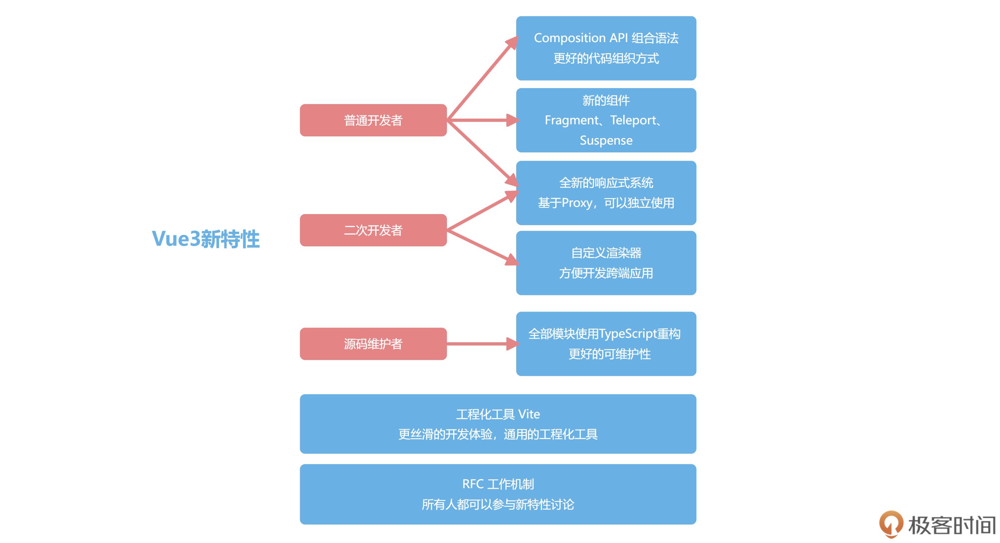
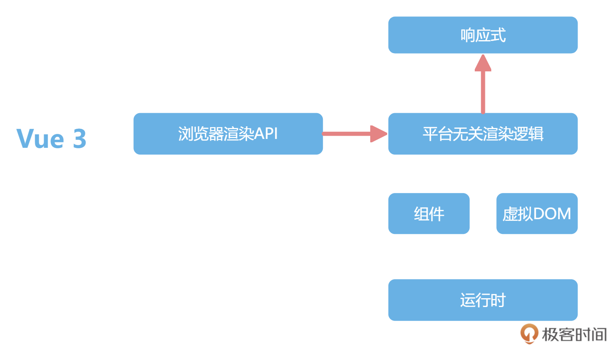
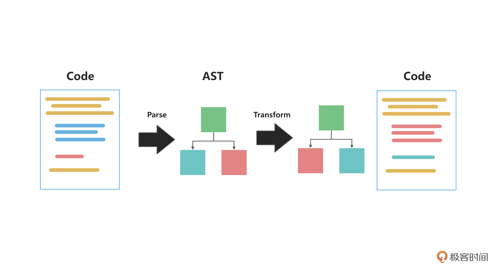

# Vue3

<!-- @import "[TOC]" {cmd="toc" depthFrom=1 depthTo=6 orderedList=false} -->

<!-- code_chunk_output -->

- [Vue3](#vue3)
  - [一. Vue2 To Vue3](#一-vue2-to-vue3)
    - [1.1 Vue 2 的历史遗留问题](#11-vue-2-的历史遗留问题)
    - [1.2 Vue3 新特性](#12-vue3-新特性)
    - [1.3 Vue2 升级到 Vue3](#13-vue2-升级到-vue3)
  - [二. Vue3 基础](#二-vue3-基础)
    - [2.1 项目启动](#21-项目启动)
    - [2.2 新的代码组织方式：Composition API + script setup](#22-新的代码组织方式composition-api-script-setup)

<!-- /code_chunk_output -->


## 一. Vue2 To Vue3

### 1.1 Vue 2 的历史遗留问题

- 从开发维护的角度看，Vue 2 是使用 Flow.js 来做类型校验。但现在 Flow.js 已经停止维护了，整个社区都在全面使用 TypeScript 来构建基础库，Vue 团队也不例外。

- 从社区的二次开发难度来说，Vue 2 内部运行时，是直接执行浏览器 API 的。但这样就会在 Vue 2 的跨端方案中带来问题，要么直接进入 Vue 源码中，和 Vue 一起维护，比如 Vue 2 中就能见到 Weex 的文件夹。要么是要直接改为复制一份全部 Vue 的代码，把浏览器 API 换成客户端或者小程序的。比如 mpvue 就是这么做的，但是 Vue 后续的更新就很难享受到。

- 从普通开发者的角度来说，**Vue 2 响应式并不是真正意义上的代理，而是基于 Object.defineProperty() 实现的**。这个 API 并不是代理，而是对某个属性进行拦截，所以有很多缺陷，比如：删除数据就无法监听，需要 $delete 等 API 辅助才能监听到。并且，Option API 在组织代码较多组件的时候不易维护。对于 Option API 来说，所有的 methods、computed 都在一个对象里配置，这对小应用来说还好。但代码超过 300 行的时候，新增或者修改一个功能，就需要不停地在 data，methods 里跳转写代码。

### 1.2 Vue3 新特性



1. **RFC 机制**

   Vue 3 的第一个新特性和代码无关，而是 Vue 团队开发的工作方式。关于 Vue 的新语法或者新功能的讨论，都会先在 [GitHub](https://github.com/vuejs/rfcs) 上公开征求意见，邀请社区所有的人一起讨论。这个改变让 Vue 社区更加有活力。

2. **响应式系统**

   Vue 2 的响应式机制是基于 Object.defineProperty() 这个 API 实现的，此外，Vue 还使用了 Proxy，这两者看起来都像是对数据的读写进行拦截，但是 defineProperty 是拦截具体某个属性，Proxy 才是真正的“代理”。首先看 defineProperty 这个 API，defineProperty 的使用，要明确地写在代码里，下面是示例代码：

   ```js
   Object.defineProperty(obj, 'title', {
     get() {},
     set() {}
   });
   ```

   当项目里 “读取 obj.title” 和 “修改 obj.title” 的时候被 defineProperty 拦截，但 defineProperty 对不存在的属性无法拦截，所以 Vue 2 中所有数据必须要在 data 里声明。而且，如果 title 是一个数组的时候，对数组的操作，并不会改变 obj.title 的指向，虽然可以通过拦截 .push 等操作实现部分功能，但是对数组的长度的修改等操作还是无法实现拦截，所以还需要额外的 $set 等 API。

   而 Proxy 这个 API 就是真正的代理了，先看它的用法：

   ```js
   new Proxy(obj, {
     get() {},
     set() {}
   });
   ```

   > **注意**：虽然 Proxy 拦截 obj 这个数据，但 obj 具体是什么属性，Proxy 则不关心，统一都拦截了。而且 Proxy 还可以监听更多的数据格式，比如 Set、Map，这是 Vue 2 做不到的。当然，Proxy 存在一些兼容性问题，这也是为什么 Vue 3 不兼容 IE11 以下的浏览器的原因。

   **Proxy 代表一种方向，就是框架会越来越多的拥抱浏览器的新特性**。前端框架利用浏览器的新特性来完善自己，才会让前端这个生态更繁荣，抛弃旧的浏览器是早晚的事。

3. **自定义渲染器**

   Vue 2 内部所有的模块都是揉在一起的，这样做会导致不好扩展的问题。Vue 3 使用拆包解决了这个问题，使用最近流行的 monorepo 管理方式，响应式、编译和运行时全部独立了，变成下图所示的模样：

   

   **在 Vue 3 的组织架构中，响应式独立了出来**。Vue 2 的响应式只服务于 Vue，Vue 3 的响应式就和 Vue 解耦了。渲染的逻辑也拆成了**平台无关渲染逻辑**和**浏览器渲染 API** 两部分。

   在这个架构下，Node 的一些库，甚至 React 都可以依赖响应式。在任何时候，如果希望数据被修改了之后能通知，都可以单独依赖 Vue 3 的响应式。那么，在想使用 Vue 3 开发小程序、开发 canvas 小游戏以及开发客户端的时候，就不用全部 fork Vue 的代码，只需要实现平台的渲染逻辑就可以。

4. **全部模块使用 TypeScript 重构**

   大部分开源的框架都会引入类型系统，来对 JS 进行限制。这样做的原因是：

   - 类型系统带来了更方便的提示
   - 类型系统让代码更健壮

   Vue 2 那个时代基本只有两个技术选型，Facebook 家的 Flow.js 和微软家的 TypeScript。Vue 2 选 Flow.js 没问题，但是现在 Flow.js 被抛弃了。Vue 3 选择了 TypeScript，TypeScript 官方也对使用 TypeScript 开发 Vue 3 项目的团队也更加友好。

5. **Composition API 组合语法**

   先举个 Vue 2 中的简单例子，一个累加器，并且还有一个计算属性显示累加器乘以 2 的结果：

   ```html
   <div id="app">
     <h1 @click="add">{{ count }} * 2 = {{ double }}</h1>
   </div>
   <script src="https://unpkg.com/vue@next"></script>
   <script>
     let App = {
       data() {
         return {
           count: 1
         };
       },
       methods: {
         add() {
           this.count++;
         }
       },
       computed: {
         double() {
           return this.count * 2;
         }
       }
     };
     Vue.createApp(App).mount('#app');
   </script>
   ```

   在 Vue 3 中，除了上面这种这个写法，还可以采用下方的写法，新增一个 setup 配置：

   ```html
   <div id="app">
     <h1 @click="add">{{state.count}} * 2 = {{double}}</h1>
   </div>
   <script src="https://unpkg.com/vue@next"></script>
   <script>
     const { reactive, computed } = Vue;
     let App = {
       setup() {
         const state = reactive({
           count: 1
         });
         function add() {
           state.count++;
         }
         const double = computed(() => state.count * 2);
         return { state, add, double };
       }
     };
     Vue.createApp(App).mount('#app');
   </script>
   ```

   使用 Composition API 后，代码看起来很烦琐，没有 Vue 2 中 Options API 的写法简单好懂，但 Options API 的写法也有几个很严重的问题：

   - 由于所有数据都挂载在 this 之上，因而 Options API 的写法对 TypeScript 的类型推导很不友好，并且这样也不好做 Tree-shaking 清理代码。
   - 新增功能基本都得修改 data、method 等配置，并且代码上 300 行之后，会经常上下反复横跳，开发很痛苦。
   - 代码不好复用，Vue 2 的组件很难抽离通用逻辑，只能使用 mixin，还会带来命名冲突的问题。

   使用 Composition API 后，虽然看起来烦琐了一些，但是带来了诸多好处：

   - 所有 API 都是 import 引入的。用到的功能都 import 进来，对 Tree-shaking 很友好，没用到的功能，打包的时候会被清理掉，减小包的大小。
   - 不再上下反复横跳，可以把一个功能模块的 methods、data 都放在一起书写，维护更轻松。
   - 代码方便复用，可以把一个功能所有的 methods、data 封装在一个独立的函数里，复用代码非常容易。
   - Composotion API 新增的 return 等语句，在实际项目中使用 `<script setup>` 特性可以清除。

   Composition API 对开发 Vue 项目起到了巨大的帮助。下面这个示例图很好地说明了问题：每一个功能模块的代码颜色一样，左边是 Options API，一个功能的代码零散的分布在 data，methods 等配置内，维护起来很麻烦，而右边的 Composition API 就不一样了，每个功能模块都在一起维护。

   

   还可以更进一步，对每个颜色块代码，都拆分出去一个函数，就会写出类似上面右侧风格的代码，每个数据来源都清晰可见，而且每个功能函数都可以在各个地方复用。

6. **新的组件**

   Vue 3 还内置了 Fragment、Teleport 和 Suspense 三个新组件：

   - Fragment：Vue 3 组件不再要求有一个唯一的根节点，清除了很多无用的占位 div。
   - Teleport：允许组件渲染在别的元素内，主要开发弹窗组件的时候特别有用。
   - Suspense：异步组件，更方便开发有异步请求的组件。

7. **新一代工程化工具 vite**

   Vite 不在 Vue 3 的代码包内，和 Vue 也不是强绑定，Vite 的竞品是 Webpack，而且按照现在的趋势看，使用率超过 Webpack 也是早晚的事。

   Vite 主要提升的是开发的体验，Webpack 等工程化工具的原理，就是根据 import 依赖逻辑，形成一个依赖图，然后调用对应的处理工具，把整个项目打包后，放在内存里再启动调试。由于要预打包，所以复杂项目的开发，启动调试环境需要 3 分钟都很常见，Vite 就是为了解决这个时间资源的消耗问题出现的。

   现代浏览器已经默认支持了 ES6 的 import 语法，Vite 就是基于这个原理来实 d 现的。具体来说，在调试环境下，不需要全部预打包，只是把首页依赖的文件，依次通过网络请求去获取，整个开发体验得到巨大提升，做到了复杂项目的秒级调试和热更新。

   下图展示了 Webpack 的工作原理，Webpack 要把所有路由的依赖打包后，才能开始调试：

   

   而下图所示的是 Vite 的工作原理，一开始就可以准备联调，然后根据首页的依赖模块，再去按需加载，这样启动调试所需要的资源会大大减少：

   

### 1.3 Vue2 升级到 Vue3

Vue 2.7 会移植 Vue 3 的一些新特性，让在 Vue 2 的生态中，也能享受 Vue 3 的部分新特性。在 Vue 3 发布之前，Vue 2 项目中就可以基于 @vue/composition-api 插件，使用 Composition API 语法，Vue 2 会直接内置这个插件，在 Vue 2 中默认也可以用 Composition 来组合代码。

**Vue 3 不兼容的那些写法**
在 Vue 2 中，使用 new Vue() 来新建应用，有一些全局的配置会直接挂在 Vue 上，比如通过 Vue.use 来使用插件，通过 Vue.component 来注册全局组件。

```js
Vue.component('el-counter', {
  data() {
    return { count: 1 };
  },
  template: '<button @click="count++">Clicked {{ count }} times.</button>'
});

let VueRouter = require('vue-router');
Vue.use(VueRouter);
```

在上面的代码里，注册了一个 el-counter 组件，这个组件是全局可用的，它直接渲染一个按钮，并且在点击按钮的时候，按钮内的数字会累加。然后需要注册路由插件，这也是 Vue 2 中使用 vue-router 的方式。这种形式虽然很直接，但是由于全局的 Vue 只有一个，所以当在一个页面的多个应用中独立使用 Vue 就会非常困难。

看下面这段代码，在 Vue 上先注册了一个组件 el-counter，然后创建了两个 Vue 的实例。这两个实例都自动都拥有了 el-counter 这个组件，但这样做很容易造成混淆。

```js
Vue.component('el-counter',...)

new Vue({el:'#app1'})
new Vue({el:'#app2'})
```

为了解决这个问题，Vue 3 引入一个新的 API `createApp`，来解决这个问题，也就是新增了 App 的概念。全局的组件、插件都独立地注册在这个 App 内部，很好的解决了上面的两个实例容易造成混淆的问题。下面的代码是使用 createApp 的简单示例：

```js
const { createApp } = Vue
const app = createApp({})
app.component(...)
app.use(...)
app.mount('#app1')

const app2 = createApp({})
app2.mount('#app2')
```

createApp 还移除了很多常见的写法，比如在 createApp 中，就不再支持 filter、$on、$off、$set、$delete 等 API。在 Vue 3 中，v-model 的用法也有更改。Vue 3 还有很多小细节的更新，比如 slot 和 slot-scope 两者实现了合并，而 directive 注册指令的 API 等也有变化。

**Vue 3 生态现状介绍**
vue-router 是复杂项目必不可少的路由库，它也包含一些写法上的变化，比如从 new Router 变成 createRouter；使用方式上，也全面拥抱 Composition API 风格，提供了 useRouter 和 useRoute 等方法。

Vuex 4.0 也支持 Vue 3，不过变化不大。有趣的是 Vue 官方成员还发布了一个 Pinia，Pinia 的 API 非常接近 Vuex5 的设计，并且对 Composition API 特别友好，更优雅一些。其他生态诸如 Nuxt、组件库 Ant-design-vue、Element 等等，都有 Vue 3 的版本发布。

**使用自动化升级工具进行 Vue 的升级**
首先是在 Vue 3 的项目里，有一个 @vue/compat 的库，这是一个 Vue 3 的构建版本，提供了兼容 Vue 2 的行为。这个版本默认运行在 Vue 2 下，它的大部分 API 和 Vue 2 保持了一致。当使用那些在 Vue 3 中发生变化或者废弃的特性时，这个版本会提出警告，从而避免兼容性问题的发生，帮助很好地迁移项目。并且通过升级的提示信息，@vue/compat 还可以很好地帮助学习版本之间的差异。

1. 首先把项目依赖的 Vue 版本换成 Vue 3，并且引入了 @vue/compat。

   ```json
   "dependencies": {
    "vue": "^2.6.12",
    "vue": "^3.2.19",
    "@vue/compat": "^3.2.19"
   },
   "devDependencies": {
    "vue-template-compiler": "^2.6.12",
    "@vue/compiler-sfc": "^3.2.19"
   }
   ```

2. 然后给 vue 设置别名 @vue/compat，也就是以 compat 作为入口，代码如下：

   ```js
    // vue.config.js
    module.exports = {
      chainWebpack: config => {
        config.resolve.alias.set('vue', '@vue/compat')
        ......
      }
    }
   ```

   这时就会在控制台看到很多警告，以及很多优化的建议。参照建议，挨个去做优化就可以了。在 @vue/compat 提供了很多建议后，还是要慢慢做修改。

社区还有能够做自动化替换的工具，比较好用的就是 [gogocode](https://gogocode.io/zh/docs/vue/vue2-to-vue3)。

**自动化替换工具的原理很简单，和 Vue 的 Compiler 优化的原理是一样的，也就是利用编译原理做代码替换**。如下图所示，利用 babel 分析左边 Vue 2 的源码，解析成 AST，然后根据 Vue 3 的写法对 AST 进行转换，最后生成新的 Vue 3 代码。



对于替换过程的中间编译成的 AST，可以理解为用 JS 的对象去描述这段代码，这和虚拟 DOM 的理念有一些相似，基于这个对象去做优化，最终映射生成新的 Vue 3 代码。

## 二. Vue3 基础

### 2.1 项目启动

Vue3 推荐使用 [Vite](https://vitejs.bootcss.com/guide/) 创建项目，因为 vite 能够提供更好更快的调试体验。在使用 Vite 之前，要先安装 Node.js。

1. 在命令行窗口里，执行下面的命令，可以创建一个 Vite 的初始化项目。

   ```sh
   npm init vite@latest
   # 使用 PNPM
   pnpm create vite
   ```

2. 然后按照提示操作。生成后的项目目录，如下所示：

   ```sh
   ├── README.md
   ├── index.html 入口文件
   ├── package.json
   ├── public 资源文件
   │ └── favicon.ico
   ├── src 源码
   │ ├── App.vue 单文件组件
   │ ├── assets
   │ │ └── logo.png
   │ ├── components
   │ │ └── HelloWorld.vue
   │ └── main.js 入口
   └── vite.config.js vite 工程化配置文件
   ```

3. 在这之后，在项目文件夹内执行 npm install 命令，进行依赖的安装，然后执行 npm run dev 命令来启动项目。

   **所有工程化体系都是基于 Node.js 生态；使用 VS Code+Volar 编辑器 + 语法提示工具作为上层开发工具；使用 Vite 作为工程化工具；使用 Chrome 进行调试**，这些都是 Vue 3 工程化体系的必备工具。

4. 使用下面这段代码安装 Vuex 和 vue-router。

   ```sh
   npm install vue-router@next vuex@next
   ```

**规范**
下面是 src 目录的组织结构：

```sh
├── src
│   ├── api            数据请求
│   ├── assets         静态资源
│   ├── components     组件
│   ├── pages          页面
│   ├── router         路由配置
│   ├── store          vuex数据
│   └── utils          工具函数
```


### 2.2 新的代码组织方式：Composition API + script setup

Composition API 可以更好地组织代码结构，而 `<script setup>` 本质上是以一种更精简的方式来书写 Composition API。
