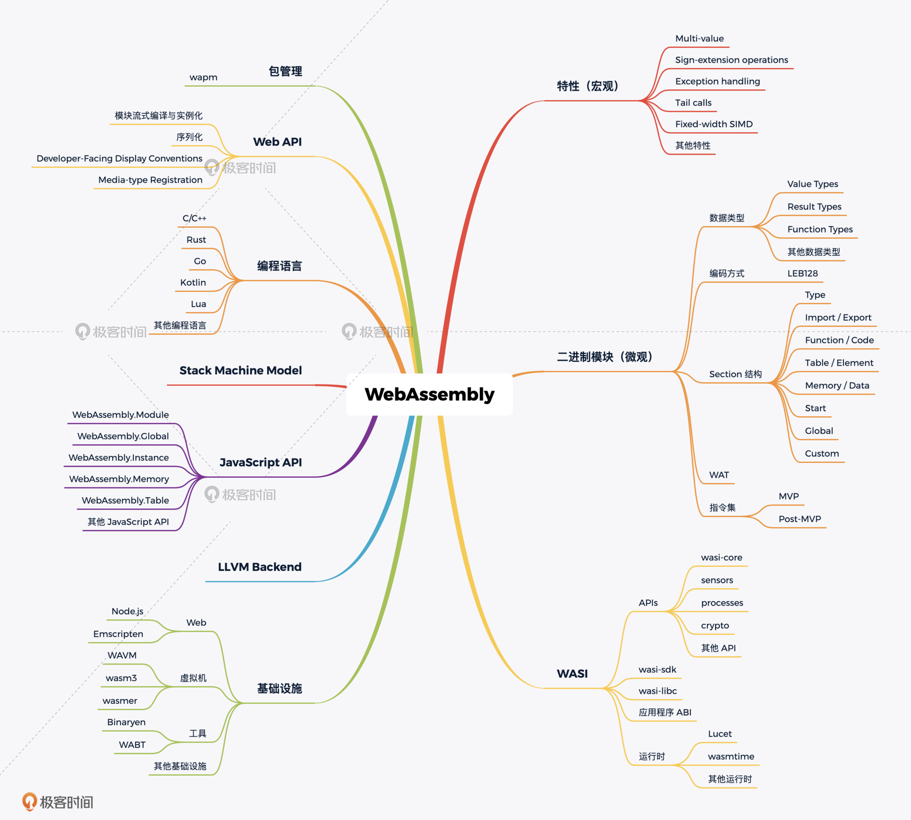

# WebAssembly

<!-- @import "[TOC]" {cmd="toc" depthFrom=1 depthTo=6 orderedList=false} -->

## 一. 基础

**WebAssembly 是基于栈式虚拟机的虚拟二进制指令集（V-ISA），它被设计为高级编程语言的可移植编译目标**。

Web 前端正变得越来越开放。如今，不仅能够直接使用 HTML、JS 来编写各类跨端应用程序，Wasm 的出现更能够直接在 Web 平台上，使用那些业界已存在许久的众多优秀的 C/C++ 代码库。除此之外，Wasm 还能让 Web 应用具有更高的性能，甚至让 Web 应用能够与原生应用展开竞争。不仅如此，走出 Web，WASI 的出现更是为 Wasm 提供了更大的舞台。

自 2015 年 Wasm 一路走来，这期间经历的重要的发展节点：

- 2015 年 4 月，WebAssembly Community Group 成立
- 2015 年 6 月，WebAssembly 第一次以 WCG 的官方名义向外界公布
- 2016 年 8 月，WebAssembly 开始进入了漫长的 “Browser Preview” 阶段
- 2017 年 2 月，WebAssembly 官方 LOGO 在 Github 上的众多讨论中被最终确定
- 同年同月，一个历史性的阶段，四大浏览器（FireFox、Chrome、Edge、WebKit）在 WebAssembly 的 MVP（最小可用版本）标准实现上达成共识，这意味着 WebAssembly 在其 MVP 标准上的 “Browser Preview” 阶段已经结束
- 2017 年 8 月，W3C WebAssembly Working Group 成立，意味着 WebAssembly 正式成为 W3C 众多技术标准中的一员
- 2019 年 12 月，W3C 正式宣布，Wasm 将成为除现有的 HTML、CSS 以及 JS 之外的第四种，W3C 官方推荐在 Web 平台上使用的 “语言”

### 1.1 相关知识
