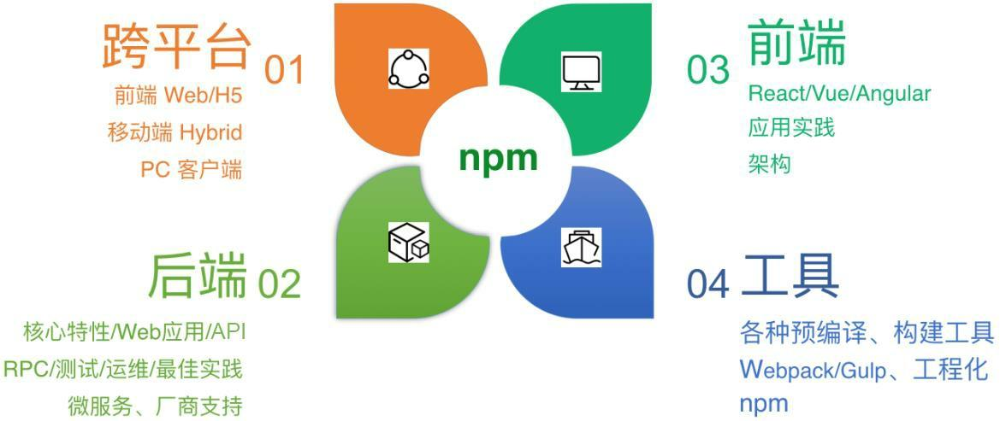

<!-- @import "[TOC]" {cmd="toc" depthFrom=1 depthTo=6 orderedList=false} -->

<!-- code_chunk_output -->

- [Node.js](#nodejs)
  - [一. Node.js 简介](#一-nodejs-简介)
    - [1.1 Node.js](#11-nodejs)
    - [1.2 JS 在 Node.js 和在 Chrome 的区别](#12-js-在-nodejs-和在-chrome-的区别)
    - [1.3 Node.js 特点](#13-nodejs-特点)
    - [1.4 Node.js 的应用场景](#14-nodejs-的应用场景)
    - [1.5 Node.js 作用](#15-nodejs-作用)
  - [二. Node.js 安装与入门](#二-nodejs-安装与入门)
    - [2.1 3m 安装法](#21-3m-安装法)
      - [2.1.1 nvm](#211-nvm)
        - [2.1.1.1 安装](#2111-安装)
        - [2.1.1.2 查看可安装版本](#2112-查看可安装版本)
        - [2.1.1.3 nvm 安装 Node.js](#2113-nvm-安装-nodejs)
        - [2.1.1.4 指定远端下载地址](#2114-指定远端下载地址)
      - [2.1.2 npm](#212-npm)
        - [2.1.2.1 使用 npm 安装模块](#2121-使用-npm-安装模块)
      - [2.1.3 nrm(不在维护)](#213-nrm不在维护)
    - [2.2 使用 Node.js](#22-使用-nodejs)
      - [2.2.1 CommonJS 规范](#221-commonjs-规范)
      - [2.2.2 创建一个最简单的 HTTP 服务](#222-创建一个最简单的-http-服务)

<!-- /code_chunk_output -->

# Node.js

---

## 一. Node.js 简介

### 1.1 Node.js

Node.js 是一个基于 **Chrome V8 引擎** 的 JavaScript 运行时环境，同时结合 libuv(事件循环处理库) 扩展了 JavaScript 库，使得 JS 能够支持浏览器 DOM 等操作，同时具有后端语言才有的 **I/O** 、文件读写与操作数据库等能力，是目前最简单的全栈式环境。

Node.js 使用 npm 作为包管理器。Node.js 应用程序运行于 **单个进程** 中，无需为每个请求创建新的线程。 Node.js 在其标准库中提供了一组 **异步的 I/O 原生功能**（用以防止 JavaScript 代码被阻塞），并且 Node.js 中的库通常是使用 **非阻塞的范式** 编写的（从而使阻塞行为成为例外而不是规范）。

当 Node.js 执行 **I/O** 操作时（例如从网络读取、访问数据库或文件系统），Node.js 会在响应返回时恢复操作，而不是阻塞线程并浪费 CPU 循环等待。

Node.js 的目标是让并发编程更简单，主要应用在以网络编程为主的 I/O 密集型应用中。轻量且高效，尤其在 I/O 处理方面。

### 1.2 JS 在 Node.js 和在 Chrome 的区别

在 Node.js 里运行 JS 和在 Chrome 里运行 JS 区别在于：

1. Node.js 没有浏览器 API,即 **document** 、**window** 等。
2. 加了许多 Node.js **API**


### 1.3 Node.js 特点

Node.js 是可扩展的适合用于构建高性能 Web 应用的最简单的解决方案。

- 适合构建 Web 应用
  1. 构建网站
     是指构建传统网站，不进行前后端分离，将视图渲染和数据库访问都放在同一项目中。用 Node.js 做入门开发，和传统的 Java、PHP 开发没什么区别。构建成功的应用是典型的单体式应用。
  2. 构建 API
     移动端包含 IOS、Android、HTML5 等多种客户端开，导致为这些客户端提供可以复用的 API 接口变得更加困难。
     移动端 API 与前端 Ajax 调用、API 调用一样，一般以返回 JSON 或 XML 结构数据为主。API 的写法很多，推荐的写法是对返回的数据加壳。
  3. 构建 RPC 服务
     数据库访问，将返回的数据进行包裹，以 TCP 形式传输给调用方。
  4. 前后端分离
     前后端分离的应用场景大致有以下四个
     - 前端页面静态化 (Page Static)
     - 前端页面服务化 (PaaS, Page as Service)
     - 服务端渲染 (SSR, Server Side Render)
     - 渐进式 Web 应用 (PWA, Progressive Web App)
  5. 适用于 Serverless
     有了 Serverless，前端就无须关心运维实现，写一个函数就能搞定 API、服务端渲染等，大幅优化了开发方式。无须关心运维(Serverless 平台自带运维功能，一般集成 Kubernetes 这种容器编排管理系统)，无须关心流量 (Serverless 平台自带服务网格功能)，无须关心高并发(API 层有缓存)。
- 高性能
  - **执行速度快** : Node.js 是构建在 Chrome V8 引擎之上的，执行速度可能是动态语言运行时环境里最快的。
  - **天生异步** : 事件驱动和非阻塞 I/O 特性决定了 Node.js 必须采用异步机制，每个 I/O 任务都是异步的，因此集成到 libuv 的事件循环里才能让开发者代码对并发操作无感知。
  - **适用于 I/O 密集的网络应用开发** : 网络应用开发 (包括 Web 应用开发) 的瓶颈在于 I/O 处理，而这恰恰是 Node.js 的强项。对于 CPU 密集型应用而言，能够使用其他语言开发最好使用其他语言，如果必须使用 Node.js，可以通过 C/C++扩展机制来实现。合理采用其他技术栈，利用其优势部分，除了能够加快开发迭代的速度，对系统稳定性也是非常有帮助的。
- 简单
  - 语法简单 : JS 语法简单易学。
  - 并发编程简单 : 有了事件驱动和非阻塞 I/O 机制，Node.js 可以使用非常少的资源处理非常多的连接和任务，处理低延时请求，完美应对实时及 I/O 密集型应用等高并发场景。
  - 部署运维简单 : 无需额外的服务器软件，不像 Java 需要用到 Tomcat 之类的 JavaEE 容器，在分布式集群中，负载均衡、多核系统方面都有完善的配套设施，现有的各种自动化运维工具 (如 Ansible、SaltStack 等) 都可以直接使用。
  - 开发简单 : 目前 Node.js 内置模块和 npm 上的模块都遵守 "小而美" 的设计哲学，相对比较简单，对开发、迭代、上线有明显帮助。
- 可扩展
  - 可以使用 npm 上的大量模块。
  - 可以通过编写 C/C++扩展实现 CPU 密集型任务
  - 可以轻松搭建 Java、Rust 等语言使用。
  - 架构互补 : 在架构上以业务边界来进行服务拆分，外加各种 "组合"，可以让合适的轮子出现在合适的位置上，比如 Java 在基础平台建设及大数据等领域有非常深厚的基础，那么直接使用即可。

### 1.4 Node.js 的应用场景

Node.js 的应用场景主要分为一下四大类



### 1.5 Node.js 作用

1. 搜索引擎优化 + 浏览器首屏速度优化 = 服务端渲染
2. 服务端渲染 + 前后端同构 = Node.js
3. 构建工作流 webpack
4. 开发工具 Visual Studio Code
5. 可扩展性
   - 使用 Node.js 做复杂本地应用,可以利用 JS 的灵活性提供外部扩展
6. 客户端应用
   在已有网站的情况下需要新开发客户端应用，用 Node.js 客户端技术（electron）实现，最大限度复用现有工程

## 二. Node.js 安装与入门

在实际生产环境中，推荐使用 Linux 服务器，常用的是 CentOS 或 Ubuntu，选用对应的 64 位 LTS (长期支持) 版本。

### 2.1 3m 安装法

Node.js 的版本更新非常快，开发机器上可能需要同时存在几个 Node.js 的大版本，每个 Node.js 内置的 npm 又有版本的差异，而国内网络访问 npmjs.org 镜像的速度非常慢。所以推荐使用 3m 安装法。

> 安装完 Node.js 后，node 命令会存在于环境变量中，可以在终端的任何位置使用。node 命令是用于解释并执行 Node.js 代码的，由于 JavaScript 是脚本语言，所以 node 命令实际上是 Node.js 代码的解释器。

- **nvm** (node version manager) : 用于开发阶段，解决多版本共存、切换、测试等问题。
- **npm** (node package manager) : 解决 Node.js 模块安装问题，其本身也是一个 Node.js 模块，每次安装都会内置某个版本的 npm。
- **nrm** (node registry manager) : 解决 npm 镜像访问慢的问题，提供测速、切换下载源 (registry) 功能。

#### 2.1.1 nvm

nvm 是一个开源的 **Node.js 版本管理器** ，通过简单的 shell 脚本来管理和切换多个 Node.js 版本。nvm 中有 nvmw(现不再维护)，可以支持 Window 系统，另外 nvs 默认支持 Windows 系统。

nvm 除了安装方便，可以随意切换需要安装的 Node.js 版本，还可以免除安装权限，通过 nvm 命令安装的 Node.js 位于用户目录下，而非系统目录下。在 npm 安装全局模块时，可以避免操作系统超级用户授权问题。

##### 2.1.1.1 安装

在安装 Node.js 之前，需要先安装 nvm，然后通过 nvm 命令去安装多个版本的 Node.js。nvm 本身是 shell 脚本，直接下载安装即可。首先在终端执行以下命令。

> `curl -o- https://raw.githubusercontent.com/creationix/nvm/v0.37.2/install.sh | bash`

安装完成后，脚本将 nvm 存储库克隆到 ~/.nvm，并尝试将下面代码段中的源代码行添加到正确的配置文件中（~/.bash_profile、~/.zshrc、~/.profile 或~/.bashrc）

> export NVM_DIR="$([ -z "${XDG_CONFIG_HOME-}" ] && printf %s "${HOME}/.nvm" || printf %s "${XDG_CONFIG_HOME}/nvm")"
> [ -s "$NVM_DIR/nvm.sh" ] && \. "$NVM_DIR/nvm.sh" # This loads nvm

查看是否存在以上源代码后，通过执行 source 命令，使系统环境变量生效

> source ~/.bashrc

在终端执行 `nvm --version` 后可以查看版本号。

##### 2.1.1.2 查看可安装版本

通过 `nvm ls-remote` 命令可列出当前 nvm 可安装的版本。

- **LTS 版本** : 长期支持(Long-Term Support) 版本，有官方支持，推荐给绝大多数用户使用，一般在生产环境中使用，对于 Bug 和 安全问题的修复相当及时。
- **Current 版本** : 当前正在开发的尝鲜版本。它通常较新，具有大的功能变动，需要经过一段时间的测试、开发、修复 Bug 才可能编程 LTS 版本，一般用于开发者学习，基本不会用在线上生产环境中。

> Node.js 的可用版本非常多，一般奇数版本(v7.x, v9.x)都是尝试性的，其中包含最新的特性，而偶数版本(v8.x, v10.x)都是 LTS 版本，稳定且适合在线上生产环境中使用。

##### 2.1.1.3 nvm 安装 Node.js

1. 确定安装位置
   通过 nvm 安装的 Node.js 位于用户目录下，而非系统目录下。在 npm 安装全局模块时，可以避免操作系统超级用户授权问题。
2. 指定默认版本
   如果想要默认使用 Node.js v6.11.2 来编译代码，需要手动指定一个 default 别名，使用命令 `nvm alias default node`
   此时，输入 `node -v` ，以后再终端的任何地方使用的默认版本都会是设置的默认版本。
3. 切换版本
   先使用 `nvm install 10` 安装 Node.js ，然后切换到 10.x 版本 `nvm use 10` ，注意 Node.js 内置的 npm 版本。
   此时，Node.js 代码就可以在 10.x 版本下执行了，可以使用任何 10.x 版本支持的特性。像上面这样使用 `nvm use` 命令实现的切换版本，只在当前终端会话内有效，是一次性切换，要和设置默认别名区分开。
4. 列出本机版本
   `nvm ls`
5. 重新安装全局模块
   nvm 提供了一键安装全局模块的 nvm reinstall-packages 命令。
   例 : `nvm reinstall-packages 6`

##### 2.1.1.4 指定远端下载地址

nvm 的默认远端下载地址是 `https://nodejs.org/dist` ，大部分开发场景使用的 Node.js 都可以从这个地址下载。如果想安装自定义的 Node.js 版本，可以指定 nvm 的远程下载地址，比如一些正在测试的尝鲜版本

> `NVM_NODEJS_ORG_MIRROR-https://nodejs.org/download/test`

查看远端可用版本的命令 `nvm ls-remote`，获取到版本信息后，直接根据版本号安装即可 `nvm install version`。

#### 2.1.2 npm

npm，通常称为 Node.js 包管理器，它的主要功能是管理 Node.js 包，包括安装、卸载、更新、查看、搜索、发布等。可以实现 JS、React、移动开发、Angular、浏览器、JQuery、Cordova、Bower、Gulp、Gunt、Browserify、Docpad 等包或模块管理，是目前开源世界里最大、生态最健全的包管理器。

npm 是随 Node.js 一起安装的包管理器，能解决 Node.js 在模块管理上的许多问题，常见的应用场景有以下几种。

- 从 npm 镜像服务器下载第三方模块。
- 从 npm 镜像服务器下载并执行安装命令行程序到本地。
- 发布模块到 npm 镜像服务器供他人使用。

##### 2.1.2.1 使用 npm 安装模块

npm 默认安装源为 `https://registry.npmjs.org/`。

命令行永久更改使用指定镜像（淘宝）

```js
npm config set registry https://registry.npm.taobao.org
```

npm 的包安装是最核心的功能，分为本地安装 (local) 、全局安装 (global) 两种。


本地安装，具体说明:

- 将包放在 node_modules (运行 npm 命令时所在的目录)下，如果没有 node_module 目录，则会在当前执行 npm 命令的目录下生成。
- 可以通过 require() 来引入本地的包
  例 : 先安装常用的 Node.js 调试模块 `npm install debug`，安装好后，debug 包存在于工程目录下的 node_modules 目录中，因此在代码中只执行 `const debug = require('debug')`即可，无需指定第三方包路径。

全局安装，具体说明:

- 如果不是使用 nvm 安装的，安装包将放在 /user/local 下，安装全局模块需要超级用户授权。
- 不能通过 require() 来引入本地的包

> **注意**: 为避免引用模块缺失保证依赖模块都出现在 package.json 里，可以使用 `npm i --save`

#### 2.1.3 nrm(不再维护)

Node.js 和其他语言一样都提供了模块管理工具，默认将模块托管在 npmjs.org 下，其他组织和个人可以自建下载源，同步时间一般在 10 分钟左右，npm 官方源是在国外托管的，所以国内用户访问会比较慢。

nrm 可以简单、快速地在不同的 npm 之间进行切换，它默认内置了很多常用的源，包括 npm、cnpm、taobao、nj 等，也可以通过 `nrm add` 命令来维护自己的源。nrm 是工程复杂到一定程度的必然产物，也是最佳实践。

1. 安装
   nrm 本身是 node.js 命令行模块，需要使用 -g 参数来进行全局安装 `npm install -g nrm`
2. 测速
   可以使用 `nrm test` 测速
3. 查看源使用 `nrm ls` 命令即可
4. 使用 `nrm use cnpm` 就可以快速切换源
5. 增加源

> 例 : `nrm add project https://registry.npm.taobao.org/`

### 2.2 使用 Node.js

> `node fileName.js` 可以直接运行 js 文件，在 JS 文件里，建议使用严格模式，如: [test.js](./sampleFolder/test.js)

#### 2.2.1 CommonJS 规范

Node.js 基于 CommonJS 规范的实现，即每个文件都是一个模块，每个模块内部代码都遵循 CommonJS 规范，**多文件调用的核心基于模块对外暴露接口和相互引用**。

- 使用 `module.exports` 定义模块 [commonjs_test1.js](./sampleFolder/CommonJS规范/commonjs_test1.js)
- 通过 `require` 关键字引入模块 [commonjs_test2.js](./sampleFolder/CommonJS规范/commonjs_test2.js)

#### 2.2.2 创建一个最简单的 HTTP 服务

> 例: [http_test.js](./sampleFolder/http_test.js)
