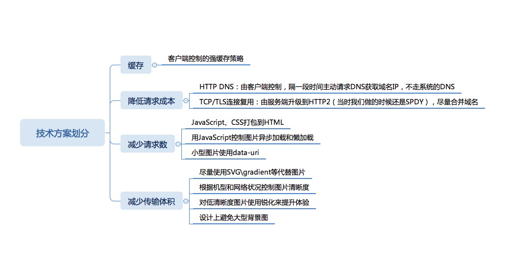

<!-- @import "[TOC]" {cmd="toc" depthFrom=1 depthTo=6 orderedList=false} -->

<!-- code_chunk_output -->

- [前端综合应用](#前端综合应用)
  - [一.性能](#一性能)
    - [1.1 现状评估和建立指标](#11-现状评估和建立指标)
    - [1.2 技术方案](#12-技术方案)
    - [1.3 执行](#13-执行)
    - [1.4 结果评估和性能](#14-结果评估和性能)
  - [二. 工具链](#二-工具链)
    - [2.1 工具链的目标](#21-工具链的目标)
    - [2.2 工具链的设计](#22-工具链的设计)
    - [2.3 工具体系的执行](#23-工具体系的执行)
    - [2.4 工具体系的监控](#24-工具体系的监控)
  - [三. 持续集成](#三-持续集成)
    - [3.1 概念](#31-概念)
    - [3.2 持续集成总论](#32-持续集成总论)
    - [3.3 前端持续集成的目标](#33-前端持续集成的目标)
    - [3.4 前端持续集成的方案](#34-前端持续集成的方案)
    - [3.5 持续集成的实施](#35-持续集成的实施)
    - [3.6 持续集成的结果](#36-持续集成的结果)
  - [四. 搭建系统](#四-搭建系统)
    - [4.1 搭建系统的设计](#41-搭建系统的设计)
    - [4.2 搭建系统的实体](#42-搭建系统的实体)
      - [4.2.1 数据](#421-数据)
      - [4.2.2 模板](#422-模板)
      - [4.2.3 模块](#423-模块)
      - [4.2.4 页面](#424-页面)
    - [4.3 搭建系统的监控](#43-搭建系统的监控)
  - [五. 前端架构](#五-前端架构)
    - [5.1 前端架构的核心问题](#51-前端架构的核心问题)
      - [5.1.1 组件化](#511-组件化)
      - [5.1.2 兼容性和适配性](#512-兼容性和适配性)
      - [5.1.3 单页应用](#513-单页应用)
    - [5.2 扩展前端新边界](#52-扩展前端新边界)

<!-- /code_chunk_output -->

# 前端综合应用

## 一.性能

性能优化不能只着眼于局部的代码，一切没有 profiling 的性能都是耍流氓。凡是真正有价值的性能优化，必定是从端到端的业务场景建立体系来考虑的。

性能体系的建立可以分成以下几部分：

- 现状评估和建立指标
- 技术方案
- 执行
- 结果评估和监控

### 1.1 现状评估和建立指标

要想做好性能优化，正确地评估现状和建立指标是最关键的一步。指标又要考虑两个因素:

- 对用户来说，什么样的性能指标能更好地评估它的体验？
- 对于公司来说，什么样的指标会影响业务价值？

性能问题可以分成很多方面，最重要的几个点是：

- 页面加载性能
- 动画与操作性能
- 内存、电量消耗

> 这里，仅仅是对"性能"两个字的分析和解读，在对大量用户数据进行分析后，可以发现，其实这三部分中，"页面加载性能"跟用户的流失率有非常强的关联性，而用户流失率，正是公司业务非常看重的指标。

因此，在开始阶段，性能优化的重点应该放在 **页面加载性能** 上。一开始，使用的是"用户平均加载时间"，但是这个指标有严重的问题：

- 当加载时间低于一定数字后，用户体感差别不大，这个时间大约是1秒
- 少数超长时间加载的用户，会极大影响这个指标，即指标不能反应大多数用户的体验

于是，基于以上分析，又有了一个新的指标———— **秒开率**，即一秒之内打开的用户占用户总量的百分比。

### 1.2 技术方案

以加载过程为例：

- 从域名到IP地址，需要用到DNS协议查询
- HTTP协议使用TCP传输的，所以会有TCP建立连接过程
- 如果使用HTTPS，还有HTTPS交换证书
- 每个网页还有图片等请求

从分析和实际实验的结果看，网页的加载时间，不仅跟体积有关系，还跟请求数有很大关系，最后的技术方案大约可以这样划分：

这是性能优化比较重要的部分，这里涉及了前端技术、服务端、客户端、设计，所以要想做好性能优化，绝对不能限制在局部的视角，必须整个业务一起考虑，才能有良好的效果。

### 1.3 执行

根据公司实际情况，工程实施有不同的程度，工程水平可以从低到高分成三个阶段：

- 纯管理：纯行政管理，是由经理用纯粹的管理手段来执行方案，比如说，作为前端团队的 Leader，可以组织会议，要求整个团队使用指定的技术方案。
  但是，纯行政管理有一些问题：
  - 需要的行政资源不一定有，比如没法强制让后端团队配合前端
  - 纯粹的管理方式，团队本身的体验并不好，也不利于团队成长，最重要的是，纯粹管理方式容易造成执行不到位。这样的执行方式多数出现在非技术岗位。

- 制度化：制度化执行方式是用规则代替人的命令，指定责任人，通过培训、checklist、定期 review 等具体措施来保证实施。
  制度化执行可以极大地减轻管理工作量，一般现代互联网公司都会采用类似的方式。
  但是制度化执行方式还有很大成分是依靠人的主动性的，对程序员来说，还有更好的方式：自动化。

- 自动化：自动化的方式是在一些重要的操作路径上设置规则，针对性能优化，有两个点适合做这件事：
  - 把开发好的页面发布上线
  - 开发好的页面 URL 投放到首页等处的链接

> 现在多数公司都会采用制度化和自动化结合的执行方案。

### 1.4 结果评估和性能

执行完还要有一定的结果总结，才是一个完整的工程实施，而且，凡是工程实施，肯定要有一定的长效机制，不能优化完了退化，这些都要求有线上监控机制。

要想做线上监控，需要分两个部分：

- 数据采集：需要发布平台或者开发工具来配合，对性能数据来说，Performance API 非常好用，它是浏览器记录的性能数据，一般来说，用统一的代码把它上传到服务器端就够用了。
- 数据展现：数据的展现部分就比较自由了，可以用不同的数据可视化方案来展现性能数据，没有一定之规。一般的数据监控平台，会提供报警机制，对性能来说，报警需求不是特别强烈，但是也可以设置一些条件，针对秒开率特别低的网页报警。

> 注意：
> 有了监控，再配合一定制度，就可以保障整个团队产出的性能了，但是，性能不是一个静态的事情，指标需要不断优化，技术方案还需要不断随着技术发展迭代，制度、自动化工具也需要不断改进，最终的监控平台产品也不能不做新需求，所以性能应该成为一个团队的日常工作的一部分，持续进行。

## 二. 工具链

跟性能不同，工具体系并非业务结果，所以没法用简单的数据指标来衡量工具，它的结果更多程度是一种开发体验：帮助技术团队内的成员提升效率和体验。
作为工程体系，考虑工具的时候同样要遵循基本规则：**现状与指标、方案、实施、结果 和 监控**。

### 2.1 工具链的目标

工具是为技术团队本身服务的工程体系，每一种工具的出现，必然都有一个非常具体的目标，比如 npm 帮助我们进行包管理，Yeoman 帮助我们初始化项目模板。但是这些目标是工具的目标，不是工具体系的目标。

考虑到工程行为都是团队合作，所以对工具有两个重要需求：

- **版本一致** : 只有整个团队的工具版本一致，至少要做到避免大版本差异，才能做到互相接手代码时，团队成员能够正确的使用工具开发。
- **避免冲突** : 一些工具可能互相没有干扰，比如 Yeoman 和 gulp，有一些工具则由社区设计了配合方案，比如 webpack 和 babel，有一些工具，则存在着根本性冲突，如 gulp 和 grunt。

这两个需求的解决方案，需要用到一个概念:

工具链
: 工具链是一系列互相配合的工具，能够协作完成开发任务（注：工具链这个词最早是由 C/C++ 程序员引入的概念，一般包含编译、链接、调试等工具）

### 2.2 工具链的设计

要想设计一个工具链，首先需要整理一下，前端开发大约要做哪些事：

- 初始化项目
- 运行和调试
- 测试（单元测试）
- 发布

那么，一个前端项目的工具链，大约就会包含这些功能。一个典型的社区项目工具链可能就类似下面这样：

- Yeoman
- webpack
- ava/nyc
- aws-cli

但是，这显然不够，还需要一种机制，保证团队使用的工具版本一致，有两种做法：

- 轻量级：在项目初始化模板中定义 npm script 并且在 npm dev-dependency 中规定它的版本号。

- 重量级：开发一个包装工具，在命令行中不直接使用命令，而使用包装过的命令。
  工具链的使用者只需指定工具链名称，就不需要知道项目具体使用了哪些工具，这样只需要专注自己的需求就够了。
  同时，统一的命令行入口，意味着整个团队不需要互相学习工具链，就可以接手别人的项目开发。

> 在稍微大一些的团队内部，往往会需要不止一种开发模式，如移动开发和桌面开发，这样，所需要的工具链也不一样，因此需要多条工具链。要想开发新的工具链，可以使用复制分支的方式来扩展原来的工具链。

### 2.3 工具体系的执行

因为工具体系服务的是团队内部成员，所以执行非常简单，同时，工具体系的入口是初始化项目，所以只要初始化工具在手，可以控制其它所有工具。
工程体系的执行分成三个层次：纯管理、制度化和自动化。

### 2.4 工具体系的监控

纯粹的社区方案比较难做到监控，但是如果使用了前面提到的统一命令行入口包装，那么就可以做一些简单的统计工作了。
一般来说，以下指标跟开发者体验较为相关：

- 调试 / 构建次数
- 构建平均时长
- 使用的工具版本
- 发布次数

> 工具的相关数据可以能够帮助发现一些问题，比如某个项目频繁发布，可能说明它风险很高；构建平均时长较长，可以对 webpack 做大量深度优化来改善开发体验。
> 工具的相关数据还能帮助发现老旧的工具，如果某个套件使用频率极低，则可以考虑把它下线。
> 总之，工具体系的监控不仅仅是衡量工具体系的好帮手，也是非常珍贵的研发数据，里面有很多可挖掘的价值。

## 三. 持续集成

### 3.1 概念

持续集成是指在软件开发过程中，以定期或者实时的方式，集成所有人的工作成果，做统一的构建和测试，它是近现代软件工程中的一个非常重要的概念。

- 优势：可以及早处理集成阶段的问题，使软件质量和开发进度可控。
- 升级版本：持续交付和持续部署，但这些需要更为完善的基础设施。
- 与持续集成相对的做法: 独立开发各个模块，在软件开发的最终阶段才做集成

传统的持续集成概念诞生于桌面客户端开发，但是，在 Web 前端领域，由于技术和产品形态的差别，需要构建的持续集成体系也有一些区别。

### 3.2 持续集成总论

传统软件的持续集成主要有以下措施：

- daily build：每日构建，开发者每天提交代码到代码仓库，构建一个可运行的版本。
- build verification test（BVT）：构建验证测试，每日构建版本出来后，运行一组自动化的测试用例，保证基本功能可用。

对于前端来说，有一些现实的区别：

- 前端代码按页面天然解耦，大部分页面都是单人开发
- 前端构建逻辑简单，一般开发阶段都能保证构建成功，不需要构建
- 前端代码一般用于开发界面，测试自动化成本极高
- 前端页面跳转，是基于 url，没有明确的产品边界

> 基于以上分析，传统的持续集成方案放在前端，要么不需要，要么不适用，要么实施成本高。因此不能套用传统的持续集成理论，而需要重新思考前端领域的持续集成体系。

### 3.3 前端持续集成的目标

- 是要及早集成代码形成可测试的版本
- 是通过一定的测试来验证提交的代码的有效性

### 3.4 前端持续集成的方案

前端持续集成的措施：

- 预览环境，代替每日构建，前端每次（或指定次）提交代码到仓库都同步到预览环境，保证预览环境总是可用。
  前端代码发布到线上生产环境需要有线上的机器和域名，而预览环境同样需要机器和域名，不过，只需要在公司内网即可。
  所以建立预览环境的第一步就是申请机器和域名，需要运维协助，在预览环境的机器上部署 Web 应用服务器。
  下一步就是建立预览环境发布机制，预览环境的机器发布流程应该跟线上发布保持一致，这样可以最大程度降低成本和降低心智负担。
  预览环境的部署和发布机制建立是最基本的需求，在实际应用中，情况要复杂的多，可能需要多个预览环境同时存在。

- 规则校验，代替构建验证测试，通过数据采集（如前面提到的性能数据）和代码扫描，保证提交的代码满足一定的质量要求
  规则校验可以分成三种措施：
  - 页面结构扫描: 可以使用无界面浏览器（如 phantomJS）配合一些 JS 代码编写的规则来完成。
  - 运行时数据采集: 可以通过在页面插入公共 js 文件的方式来完成，最基本的是用 Performance API 来采集性能数据，用 window.onerror 来采集 js 错误。
  - 代码扫描: 社区有一些现成的方案，比如 JSHint，可以根据实际需要，选择社区方案或者自研。

### 3.5 持续集成的实施

持续集成的实施，是必须严格做到自动化和制度化的。规则校验仅仅是搭建好了平台，而规则本身，需要先形成一个共识，然后在前端团队内部形成一定的更新机制。规则校验仅仅是搭建好了平台。

建议用 **issue** 的方式来管理规则的提案，可以在周会或者月会上讨论，充分保证整个团队对校验规则的一致意见。这里，必须警惕三种错误：

- 少数人拍脑袋决定校验规则
- 一成不变的校验规则
- 频繁无规律变化的校验规则

> 只有经过民主讨论、定期更新的校验规则，才能在团队中起到积极作用。校验规则决定了整个前端团队的开发体验，所以必须非常慎重。

### 3.6 持续集成的结果

持续集成机制的建立本身就可以视为一种结果，它能够让整个团队的代码质量有一个基本的保障，提前发现问题，统一代码风格，从而带来开发体验和效率的提升。
此外，持续集成的结果也能够以数据的方式呈现出整个开发团队的健康状态。

## 四. 搭建系统

搭建系统的目标是解决大量的简单页面生产问题。衡量这个目标的指标应该是生产页面的数量，这部分非常的明确，如果要做搭建系统，可以根据业务的体量和服务的范围来决定具体的指标要求。

### 4.1 搭建系统的设计

搭建系统有三种常见的设计：

**模板化搭建**
由前端工程师生产页面模板，再由运营提供数据来完成页面，可以用以下公式来理解：

> 模板 + 数据 = 页面

模板化搭建是一种简单的思路，它的优点是整个系统实现简单。

**模块化搭建**
由前端工程师生产模块，由运营把模块和数据组织成页面。

**数据驱动页面**
这是一种比较新的思路，即数据中包含了展现自身所需要的模块相关的信息，本身决定了界面。

> **但是不论何种流派，都可以认为是数据、模块、模板、页面几种实体的相互作用。**

### 4.2 搭建系统的实体

#### 4.2.1 数据

数据是用于展现界面所需要的信息。

按照数据用途，可以分成以下两种：

- 界面配置数据：决定了页面上颜色、尺寸、位置、图片、文字等展现形式的数据，通常是以页面为单位的配置。
- 内容数据：页面要展示的信息，如电商活动页面的商品信息、文章的文字信息等。

按照数据来源，又可以分成以下两种：

- 运营手工填写固定数据：运营人员依靠自己的专业技能决定的数据，可能包含线下招商信息、商品选品、文章等。
- 来自 API 的数据，分为两种：
  - 固定数据：由服务端逻辑到指定存储处获取的数据
  - 用户相关数据：由算法系统或者服务端逻辑，根据用户信息或者用户喜好推荐的数据。

搭建系统本身是个产品，针对数据这个实体，要设计增、删、改、查的能力，根据以上的分析，搭建系统的数据部分有两个难点：

**数据的手工编辑能力**
现在一般的数据都会采用 JSON 格式，JSON 格式中有数字、字符串、数组、对象、布尔等数据类型，需要根据数据的格式定义为每一种类型设计编辑器。
但是仅仅是基本类型还不够，在实际开发中，还需要跟实际业务结合来设计编辑器，下面是一些数据编辑器：

- 整数：整数编辑器，可用 HTML 原生输入框 `<input type=number min=1 max=100>` 实现。
- 数字：数字编辑器，可用 `<input type=number min=1.0 max=100.0>` 实现
- 字符串：字符串编辑器，可用 `<input type=text>` 实现。
- URL：URL 编辑器，可用 `<input type=text>` 配合格式校验。
- 图片：图片编辑器，需要自研图片上传功能。
- 固定字段对象：对象和字段编辑器，可用多个 `<input />` 和 `<label>` 实现。
- 布尔型：开关，可用 `<select>` 或自研组件实现。
- 自由字段对象：需要自研 KV 输入组件。
- 数组：需要自研列表组件实现。
- 对象数组：需要自研表格组件或者列表组件实现。
- 矩形区域：需要自研区域选择组件。

> 注意：JSON 是一个级联的格式，所以对象、数组中很可能需要插入各种不同的数据类型的编辑器，这部分技术上有一定挑战。此外，实践中，对象数组很多时候都来自 Excel 数据，所以，Excel 导入也是非常重要的。

**跟服务端 API 的对接**
对于服务端系统统一性较好的公司，这不是什么难事，对服务端系统比较奔放的公司，如果服务端 API 调用方式不统一，就非常麻烦了。

#### 4.2.2 模板

模板可以简单得理解成挖了许多坑的页面，它一般是由前端工程师来生产的一种实体。与数据之间的连接是数据的格式，对 JSON 格式来说，JSON Schema 是社区接受度较高的一个方案。

最简单的模板可以用字符串模板来设计，复杂一点的模板则可以由 JS 进行渲染，通过约定全局变量名称或者约定调用函数入口做到把数据传递给模板，可以根据实际需求复杂程度选择合适的方案。

> 注意：
> 在产品设计上，模板可不是"增、删、改、查"那么简单，考虑到实际工程需要，模板必须是版本化的，也就是说，前端每发布一个模板，都需要永久性存储一条记录，并且产品设计上必须保持可以回滚，这样，一旦线上发现问题，可以迅速回滚到一个可工作的版本，有效降低不可用时长。
> 此外，模板设计还有批量更新的需求，一些运营活动可能包含数百个页面，它们使用同一套模板，产品设计上必须要注意提供批量更新机制。

#### 4.2.3 模块

模块跟模板非常相似，但是从产品的角度，模块是可组合的。跟模板相似的部分如数据连接、版本化发布、批量更新等。

模块化搭建有额外的技术难点：

可拖拽的模块编辑器，移动端搭建布局相对简单，可以通过简单的自上而下布局和拖拽改变位置来实现。
桌面的模块拖拽比较复杂，一般都会采用一些变通的思路简化设计，如提供几种固定的布局模板，提供布局容器，或者采用纯绝对定位布局。

在一些产品设计中，会先用模块拼成模板，再指定数据源，这种模式中的"模块"，可以认为是一种开发模板的技术方案，跟此处的产品上的模块概念不同。因为在认知中，模板应该是由前端工程师产生的，具有复用性的一种实体。

#### 4.2.4 页面

不论是模板搭建还是模块搭建，最终生产的目标都是页面。页面同样需要版本化发布，便于回滚。

页面部分实现的难点是：

- 跟发布系统的结合，在前面的所有产品实体中，模板、模块、数据都是存储在搭建系统本身的，但是页面不一样，页面必须要提供线上服务，所以页面是要发布到线上生产环境的。

> 注意：页面也需要有校验规则。

### 4.3 搭建系统的监控

作为一个工具型技术产品，搭建系统同样会产生大量有价值的数据，搭建系统的用户访问和生产页面数量是衡量自身的重要指标。

## 五. 前端架构

### 5.1 前端架构的核心问题

一般来说，架构是为了分工而存在的。但是到了前端领域，这个问题是不存在的。前端是个天然按照页面解耦的技术。

前端架构的核心问题主要是以下几个方面：

- 组件化：前端不存在分工问题，但是在多人协同时，仍然要解决质量和效率的问题，这就需要组件化。
- 前端特有的兼容性问题。
- 单页面应用: 对于一些追求极致的团队来说，会挑战"单页面应用"，通过单页面应用来提升用户体验，单页面应用的升级版本是谷歌提出的 PWA，PWA 既是业务方案也是技术方案，在技术层面，它近乎苛刻地规定了网页的各方面的体验标准。

前端领域还有一个特有的生态：框架，第一代前端框架（如 jQuery, PrototypeJS）重点解决了兼容问题和 API 的易用性问题，在现代浏览器普及之后，这些问题逐渐变得不存在或者不重要，所以第二代前端框架（如 Vue，Angular，React）重点解决了组件化问题。选择合适的框架，可以节约架构的成本，还能够享受社区资源。

#### 5.1.1 组件化

前端主要的开发工作是 UI 开发，而把 UI 上的各种元素分解成组件，规定组件的标准，实现组件运行的环境就是 **组件化**。现行的组件化方案，目前有五种主流选择：

- Web Component: 这是 W3C 推行的规范，理论上是未来的选项。
  缺点：
  - 实际上这份标准的状态堪忧，Shadow DOM 的设计比较复杂，一般的前端掌握起来比较困难。
  - CSS 比较难以应用，需要依靠 CSS Houdini。

  优点：不需要任何额外的运行时支持，就能在现代浏览器环境运行，也可以跟 HTML 无缝结合。

- Vue: Vue 是目前最受欢迎的框架（从 github star 来看）。它有两个主要特点：
  - 比较符合原本的 JS/CSS/HTML 书写习惯。
  - 它绑定了 MVVM 模式，直接确定了 UI 架构，通过 DSL 的支持，数据交互非常简洁。

- React: Facebook 推行的新一代 Web 框架。它利用 JSX 模式，把 HTML、CSS 和 JS 都放进了 js 文件中，对于不喜欢 CSS 和 HTML 的前端工程师来说，是很理想的。它还可以迁移到 React Native，直接编写简单的客户端应用。

- Angular: Google 推出的 Web 框架，它是比较标准的 MVVM 模式。Angular 曾经因为大版本兼容性而饱受诟病，目前它的核心竞争力是与 TypeScript 结合得较好。

- 自研

> 实际上，做技术选型时的主要依据是团队的现状，开发移动端还是桌面端、是否跟 Native 结合、团队成员的技能分布都是需要考虑的因素，这些框架本身的特点，目前仅仅是一种偏好选项，而不是关键因素。

#### 5.1.2 兼容性和适配性

前端开发的特有问题就是兼容性，到了移动时代，需要面对不同的机型，又需要解决适配性问题。
兼容性问题到 2011 年左右都是前端的主旋律，但是在之后，随着现代浏览器的逐渐普及，兼容性问题逐渐减小。

适配问题主要适配的是屏幕的三个要素:

- 单位英寸像素数(Pixel Per Inch，PPI): 现实世界的一英寸内像素数，决定了屏幕的显示质量。
  解决方案：这个主要影响的是文字，可以采用 media 规则来适配。

- 设备像素比率(Device Pixel Ratio，DPR): 物理像素与逻辑像素（px）的对应关系。
  解决方案：需要用到 CSS 的 viewport 规则来控制缩放比例解决。

- 分辨率(Resolution): 屏幕区域的宽高所占像素数。
  解决方案：可以使用 vw/vh 单位解决。

#### 5.1.3 单页应用

前端架构的解耦问题不大，因为页面是天然解耦的，但是，浏览器加载 HTML 时是会有白屏过程的，对追求极致体验的团队来说，希望能够进一步提升体验，于是就有了"单页应用（SPA）"的概念。

单页应用
: 是把多个页面的内容实现在同一个实际页面内的技术，因为失去了页面的天然解耦，所以就要解决耦合问题。也就是说，要在一个"物理页面"内，通过架构设计来实现若干个"逻辑页面"。

逻辑页面应该做到独立开发和独立发布，一种思路是，每个逻辑页面一个 js，用一个 SPA 框架加载 js 文件。

**实际问题**:

- 需要保持前进后退历史，一般来说，前进后退历史使用 URL 的 Hash 部分来控制，但是 onhashchange 事件并没有提供前进或者后退信息，目前还没有完美的解决方案，只能牺牲一部分体验。
- 实现单页应用的逻辑页面发布需要改造发布系统，在工程上，这也是一个比较大的挑战。

### 5.2 扩展前端新边界

除了解决现实问题，前端架构的职责还包括扩展前端的边界，所以前端架构还包含了很多 Native 开发任务：

- 客户端和前端结合的方案 Weex 和 React Native。
- 前端和图形学结合的方案 GCanvas。
- 前端的 3D 框架 Three.js

> 这些都是试图用架构的手段赋予前端新的能力的尝试。
