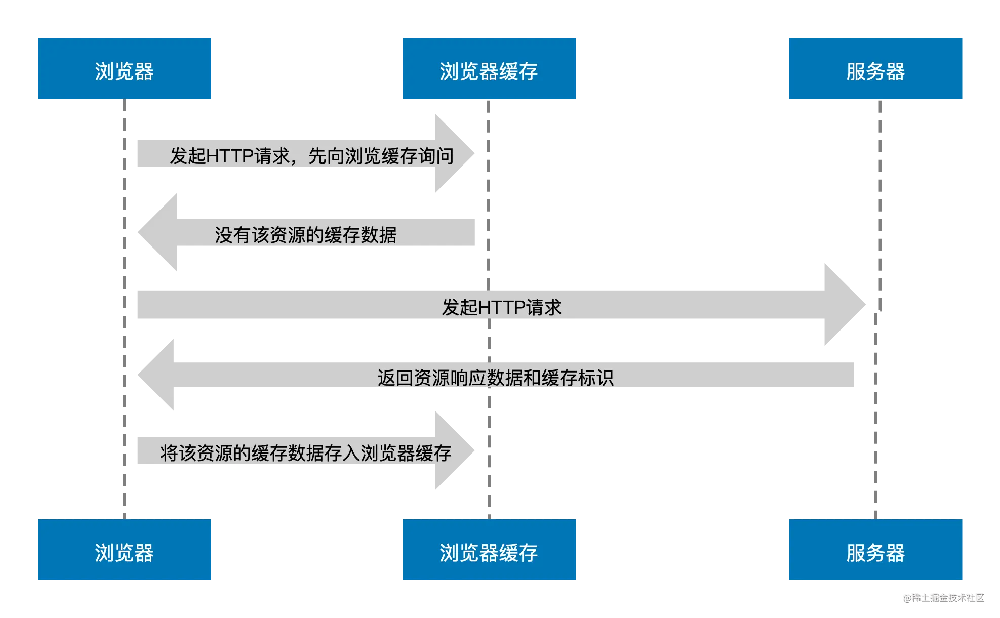
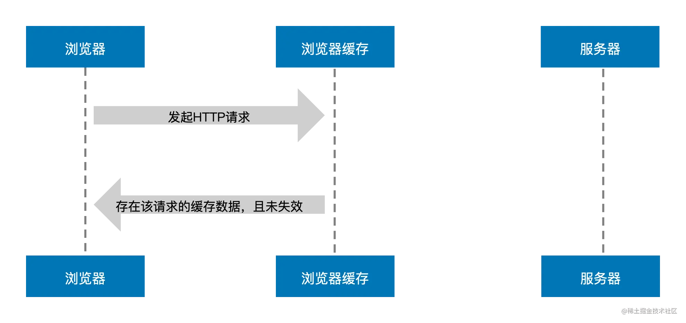
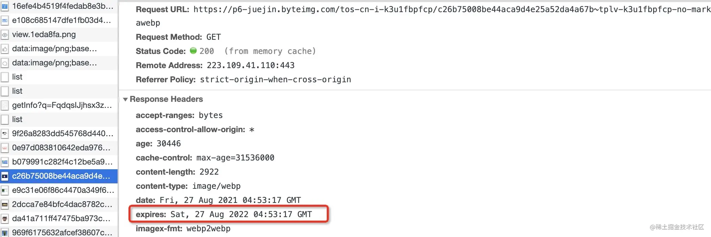
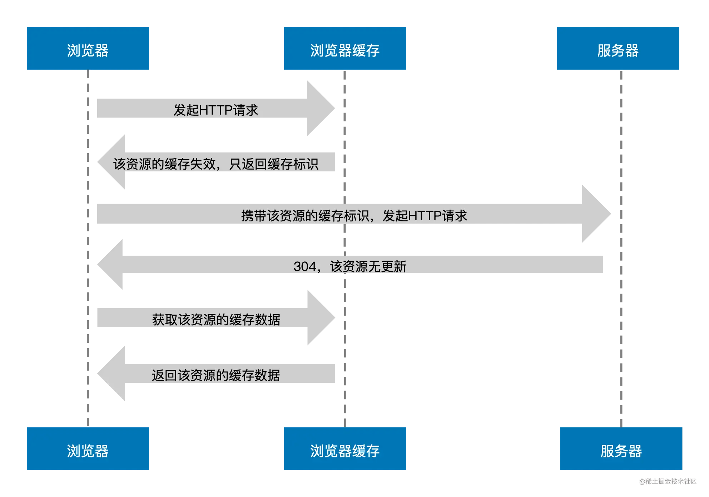

# 缓存

<!-- @import "[TOC]" {cmd="toc" depthFrom=1 depthTo=6 orderedList=false} -->

<!-- code_chunk_output -->

- [缓存](#缓存)
  - [一. 简介](#一-简介)

<!-- /code_chunk_output -->

## 一. 简介

前端缓存可以直接看作是 **HTTP 缓存**和**浏览器缓存**的结合，两者是相辅相成的关系。

- **HTTP 缓存**
  是产生于客户端与服务器之间通信的一种缓存，利用这一缓存可以提升服务器资源的重复利用率，在有效的时间内不必每次都向服务器请求相同的资源，大大减少服务器的压力，HTTP 缓存按照失效策略划分可以分为：

  - 强缓存
  - 协商缓存

- **浏览器缓存**
  是浏览器提供的一种缓存机制，可以将服务器资源和网页访问产生的临时数据缓存到内存或本地，提升客户端的加载速度，按照缓存位置划分可以分为：

  - Service Worker Cache
  - 内存缓存（Memory Cache）
  - 磁盘缓存（Disk Cache）
  - Push Cache

  还有存储型缓存 Cookie、Web Storage、IndexedDB 等。

## 二. HTTP 缓存

超文本传输协议（Hyper Text Transfer Protocol，HTTP）是一个简单的请求-响应协议，它通常运行在 TCP 之上。它指定了客户端可能发送给服务器什么样的消息以及得到什么样的响应。

### 2.1 请求相响应头

HTTP 请求部分，它主要发生在客户端，请求是由 “报文” 的形式发送的，请求报文由三部分组成：

- 请求行
- 请求报头
- 请求正文

同样 HTTP 响应部分的响应报文也由三部分组成：

- 状态行
- 响应报头
- 响应正文

这里拎出关键与缓存有关的**请求报头**和**响应报头**，也正是浏览器 Network 面板中常见的 Request Headers 和 Response Headers 部分，以 Chrome 为例：


可以看到报头是由一系列中间用冒号 `:` 分隔的键值对组成，它被称为首部字段，其由首部字段名和字段值构成。如：

```txt
Content-Type: text/javascript
```

以上首部字段名为 Content-Type，首部字段值为 text/javascript，表示报文主体的对象类型。首部字段又分为四种类型：

- 通用首部字段（请求报头和响应报头都会用到的首部）
- 请求首部字段（请求报头用到的首部）
- 响应首部字段（响应报头用到的首部）
- 实体首部字段（针对请求报头和响应报头实体部分使用的首部）

#### 2.1.1 与缓存有关的首部字段名


上图中和**强缓存有关的首部字段名**主要有两个：

- `Expires`
  Expires 首部字段是 HTTP/1.0 中定义缓存的字段，其给出了缓存过期的**绝对时间**，即在此时间之后，响应资源过期，属于**实体首部字段**。

  ```txt
  Expires: Wed, 11 May 2022 03:50:47 GMT
  ```

  上述示例表示该资源将在以上时间之后过期，而在该时间之前浏览器可以直接从浏览器缓中读取数据，无需再次请求服务器。但是因为 Expires 设置的缓存过期时间是一个绝对时间，所以会受客户端时间的影响而变得不精准。

  > **注意**：这里无需再次请求服务器便是命中了强缓存。

- `Cache-Control`

  Cache-Control 首部字段是 HTTP/1.1 中定义缓存的字段，其用于控制缓存的行为，可以组合使用多种指令，多个指令之间可以通过 `,` 分隔，属于通用首部字段。常用的指令有：max-age、s-maxage、public/private、no-cache/no-store 等。

  ```txt
  Cache-Control: max-age:3600, s-maxage=3600, public
  Cache-Control: no-cache
  ```

  - `max-age`

    这个指令给出了缓存过期的相对时间，单位为秒数。当其与 Expires 同时出现时，max-age 的优先级更高。但往往为了做向下兼容，两者都会经常出现在响应首部中。

    同时 max-age 还可在请求首部中被使用，告知服务器客户端希望接收一个存在时间（age）不大于多少秒的资源。

  - `s-maxage`

    `s-maxage` 与 max-age 不同之处在于，其只适用于公共缓存服务器，比如资源从源服务器发出后又被中间的代理服务器接收并缓存。**当使用 s-maxage 指令后，公共缓存服务器将直接忽略 Expires 和 max-age 指令的值**。

  - `public`/`private`

    `public` 指令表示该资源可以被任何节点缓存（包括客户端和代理服务器），与其行为相反的 private 指令表示该资源只提供给客户端缓存，代理服务器不会进行缓存。同时**当设置了 private 指令后 s-maxage 指令将被忽略**。

  - `no-cache`/`no-store`

    > **注意**：这两个指令在请求和响应中都可以使用，两者看上去都代表不缓存，但在响应首部中被使用时，no-store 才是真正的不进行任何缓存。

    当 no-cache 在请求首部中被使用时，表示告知（代理）服务器不直接使用缓存，要求向源服务器发起请求，而当在响应首部中被返回时，表示客户端可以缓存资源，但每次使用缓存资源前都必须先向服务器确认其有效性，这对每次访问都需要确认身份的应用来说很有用。

    当然，也可以在代码里加入 meta 标签的方式来修改资源的请求首部：

    ```html
    <meta http-equiv="Cache-Control" content="no-cache" />
    ```

至此，已经基本了解了强缓存下请求响应的两个主要首部字段，那么，接着再来看看协商缓存中涉及的主要首部字段名：

- `Last-Modified`/`If-Modified-Since`

  Last-Modified 首部字段顾名思义，代表资源的最后修改时间，其属于响应首部字段。当浏览器第一次接收到服务器返回资源的 Last-Modified 值后，其会把这个值存储起来，并再下次访问该资源时通过携带 If-Modified-Since 请求首部发送给服务器验证该资源有没有过期。

  ```txt
  Last-Modified: Fri , 14 May 2021 17:23:13 GMT
  If-Modified-Since: Fri , 14 May 2021 17:23:13 GMT
  ```

  如果在 If-Modified-Since 字段指定的时间之后资源发生了更新，那么服务器会将更新的资源发送给浏览器（状态码200）并返回最新的 Last-Modified 值，浏览器收到资源后会更新缓存的 If-Modified-Since 的值。

  如果在 If-Modified-Since 字段指定的时间之后资源都没有发生更新，那么服务器会返回状态码 304 Not Modified 的响应。

- `Etag`/`If-None-Match`

  Etag 首部字段用于代表资源的唯一性标识，服务器会按照指定的规则生成资源的标识，其属于响应首部字段。当资源发生变化时，Etag 的标识也会更新。同样的，当浏览器第一次接收到服务器返回资源的 Etag 值后，其会把这个值存储起来，并在下次访问该资源时通过携带 If-None-Match 请求首部发送给服务器验证该资源有没有过期。

  ```txt
  Etag: "29322-09SpAhH3nXWd8KIVqB10hSSz66"
  If-None-Match: "29322-09SpAhH3nXWd8KIVqB10hSSz66"
  ```

  如果服务器发现 If-None-Match 值与 Etag 不一致时，说明服务器上的文件已经被更新，那么服务器会发送更新后的资源给浏览器并返回最新的 Etag 值，浏览器收到资源后会更新缓存的 If-None-Match 的值。

### 2.2 强缓存

这里，模拟第一次打开某宝首页（浏览器未有缓存资源），打开开发者工具可以看到资源的加载情况。


重点关注 Size 和 Time 列的数据，Size 列表示浏览器从服务器获取资源的大小，Time 列表示资源加载耗时。因为几乎每一个资源都需要从服务器获取并加载，所以网页打开速度会受到影响，这里浏览器用了 1.76s 加载完了页面的所有资源（图片、脚本、样式等），1.1 MB 的数据被传输到了本地。

那么从强缓存的角度来看，其实第一次访问网页时浏览器已经开始在背后进行强缓存的判断和处理，可以通过下方流程图一探究竟。



图中，当浏览器发起 HTTP 请求时，会向浏览器缓存进行一次询问，若浏览器缓存没有该资源的缓存数据，那么浏览器便会向服务器发起请求，服务器接收请求后将资源返回给浏览器，浏览器会将资源的响应数据存储到浏览器缓存中，这便是强缓存的生成过程。

接下来第二次访问某宝，继续观察开发者工具中原来的几项指标。


发现 Size 一列大部分由原先的资源加载大小变成了 disk cache（磁盘缓存），而变成这一数据对应的 Time 列资源加载速度变快，加载总耗时由原来的 1.76s 变成了 1.10s，而传输到本地的数据降到了 44.3 KB，加载速度提升了 37.5%（受网速影响该数据每次都不一样，只用做对比参考）。这便是强缓存生效导致的现象。强缓存的生效流程如下图所示：



可以看到**浏览器并没有和服务器进行交互**，而是在发起请求时浏览器缓存告诉浏览器它有该资源的缓存数据并且还没有过期，于是浏览器直接加载了缓存中的数据资源。

开发者工具中的 Size 值变成了 disk cache 代表强缓存生效，也称为**命中强缓存**。除了 Disk cache，还有 Memory Cache（内存缓存）。这时候不关闭 Tab 页，重新刷新下某宝页面，再观察下 Network 面板中的变化。


此时，开发者工具中的 Size 列大部分变成了 memory Cache，其对应的 Time 列变成了 0ms。可见，memory Cache 比 disk cache 更快，快到不需要时间。加载总耗时缩短到了 766ms。

按照缓存位置的读取顺序，相比 disk cache，浏览器会优先读取 memory Cache。通过对以上开发者工具图例的对比不难得出，读取磁盘缓存会存在稍许的耗时，而读取内存缓存是及时性的，不存在耗时。

#### 2.3.1 max-age 与 s-maxage

响应报头中包含了两个与强缓存有关的首部字段：Expires 或 Cache-Control。有一个CDN资源，它的 Cache-Control 首部如下：

```txt
cache-control: max-age=2592000,s-maxage=3600
```

此资源将被浏览器缓存 2592000 秒（即 30 天），30 天之内再次访问，该资源都将从浏览器缓存中读取，这不难理解。但是需要注意图中首部值还包括了 s-maxage=3600：

- s-maxage 仅在代理服务器中生效
- 在代理服务器中 s-maxage 优先级高于 max-age，同时出现时 max-age 会被覆盖

CDN 资源，属于代理服务器资源，在其服务器中的缓存时间并不是 30 天，而是 3600 秒（1 个小时），所以当浏览器缓存 30 天之后重新向 CDN 服务器获取资源时，此时 CDN 缓存的资源也已经过期，会触发回源机制，即向源服务器发起请求更新缓存数据。


#### 2.3.2 expires 与 max-age

**Expires 设置的缓存过期时间是一个绝对时间，所以会受客户端时间的影响而变得不精准**，这句话可以以下图为例来理解：



该资源是一张图片，已经被浏览器缓存，其首部 expires 字段值表示浏览器可以将该资源缓存至 2022 年 8 月 27 日的上述时间点，那么在把图中 max-age 首部当做不存在的情况下（因为 max-age 会覆盖 expires 值），把电脑客户端时间修改为 2022 年 8 月 28 日，此时再次访问网页会发现浏览器重新向服务器获取了该资源，原来的缓存失效了。这便解释了 expires “不精准” 的概念。

expires “不精准” 是因为它的值是一个绝对时间，而 max-age 与其相反却是一个相对时间，还是拿上图举例，由于 max-age 优先级更高，表示浏览器可以将该资源缓存 3153600 秒（365天），起始时间是从浏览器获取并缓存该资源的时间开始算起。那么此时修改电脑客户端时间为 1 年后，缓存还是会失效。

#### 2.3.3 缓存新鲜度与使用期算法

下面是强缓存新鲜度公式：

```txt
强缓存是否新鲜 = 缓存新鲜度 > 缓存使用期
```

按如上公式所示，**强缓存是否新鲜取决于两个关键词：缓存新鲜度和缓存使用期**。

- **缓存新鲜度**

  单位是时间长度。强缓存时涉及时间单位的首部字段主要有两个：max-age 和 expires。而缓存的新鲜度公式如下：

  ```txt
  缓存新鲜度 = max-age || (expires - date)
  ```

  当 max-age 存在时缓存新鲜度等于 max-age 的秒数。当 max-age 不存在时，缓存新鲜度等于 expires - date 的值，expires 是一个绝对时间，表示缓存过期的时间。

  首部字段 Date 表示创建报文的日期时间，可以理解为服务器（包含源服务器和代理服务器）返回新资源的时间，和 expires 一样是一个绝对时间，比如

  ```txt
  date：Wed, 25 Aug 2021 13:52:55 GMT
  ```

  那么过期时间（expires）减去创建时间（date）就可以计算出浏览器真实可以缓存的时间（默认已经转化为秒数），即缓存的保质期限（缓存新鲜度）。

- **缓存使用期**

  相对于缓存新鲜度，缓存使用期的计算就比较复杂了，根据字面意思，**缓存使用期可以理解为浏览器已经使用该资源的时间**。**缓存使用期主要与响应使用期、传输延迟时间和停留缓存时间有关**，计算公式如下：

  ```txt
  缓存使用期 = 响应使用期 + 传输延迟时间 + 停留缓存时间
  ```

  - 响应使用期

    响应使用期可以通过以下两种方式进行计算：

    - `max(0, response_time - date_value)`

      response_time（浏览器缓存收到响应的本地时间）是电脑客户端缓存获取到响应的本地时间，而 date_value（响应首部 date 值） 是服务器创建报文的时间，两者相减与 0 取最大值。

    - `age_value`

      直接获取 age_value（响应首部 age 值），Age 表示推算资源创建经过时间，可以理解为源服务器在多久前创建了响应或在代理服务器中存贮的时长，单位为秒。如下所示：

      ```txt
      age: 600
      ```

      Age 的值通常接近于 0。表示此对象刚刚从原始服务器获取不久；其他的值则是表示代理服务器当前的系统时间与此应答中的通用头 Date 的值之差。最终可以将以上两种方式进行组合，组合后的计算公式为：

      ```txt
      apparent_age = max(0, response_time - date_value)
      响应使用期 = max(apparent_age, age_value)
      ```

  - 传输延迟时间

    因为 HTTP 的传输是耗时的，所以传输延迟时间是存在的，传输延迟时间可以理解为浏览器缓存发起请求到收到响应的时间差，其计算公式为：

    ```txt
    传输延迟时间 = response_time - request_time
    ```

    response_time 代表浏览器缓存收到响应的本地时间，request_time 代表浏览器缓存发起请求的本地时间，两者相减便得到了传输延迟时间。

  - 停留缓存时间

    停留缓存时间表示资源在浏览器上已经缓存的时间，其计算公式为：

    ```txt
    停留缓存时间 = now - response_time
    ```

    now 代表电脑客户端的当前时间，response_time 代表浏览器缓存收到响应的本地时间，两者相减便得到了停留缓存时间。

通过上述字段及公式的介绍，最终总结出影响强缓存使用期的因素有以下几个：

- age_value：响应首部 age 值
- date_value：响应首部 date 值
- request_time：浏览器缓存发起请求的本地时间
- response_time：浏览器缓存收到响应的本地时间
- now：客户端当前时间

> **注意**：request_time、response_time 和 now 取的都是客户端本地时间，而 now 则是修改客户端本地时间直接导致强缓存失效的 “罪魁祸首”。

**因此一旦修改了电脑客户端本地时间为未来时间，缓存使用期的计算便会受到影响，主要是停留缓存时间会变大，从而导致缓存使用期超出缓存新鲜度范围（强缓存失效）**。 这便是 max-age 仍然受到本地时间影响的原因所在。

### 2.3 协商缓存

协商缓存可以看作是强制缓存失效后，浏览器携带缓存标识向服务器发起请求，由服务器根据缓存标识决定是否使用缓存的过程。

由此可知，**浏览器启用协商缓存的前提是强缓存失效**，但是反过来强缓存失效并不一定导致浏览器启用协商缓存。下面来了解下协商缓存的生效流程：



图中，先经历了一段强缓存的失效流程：浏览器发起 HTTP 请求后浏览器缓存发现该请求的资源失效，便将其缓存标识返回给浏览器，于是浏览器携带该缓存标识向服务器发起 HTTP 请求，之后服务器根据该标识判断这个资源其实没有更新过，最终返回 304 给浏览器，浏览器收到无更新的响应后便转向浏览器缓存获取数据。

#### 2.3.1 缓存标识 Last-Modified 与 ETag

除了强缓存失效外，浏览器判断是否要走协商缓存还得借助两个缓存标识：`last-modified`、`eTag`，这两个首部字段，它们是服务器响应请求时返回的报头首部。

eTag 的优先级要高于 last-modified，当两者同时出现时，只有 eTag 会生效。只要有这两个缓存标识之一，在强缓存失效后浏览器便会携带它们向服务器发起请求，携带方式如下图请求头所示：

```txt
if-modified-since: Thu,11 May 2017 14:08:10 GMT
if-none-match: "7de917acd3966b80654d5bd3b9d2ab26"
```

其中 if-modified-since 对应 last-modified 的值，if-none-match 对应 eTag 的值。服务器根据优先级高的缓存标识的值进行判断。

若 eTag 对应的 if-none-match 不存在，那么服务器会将 last-modified 对应的 if-modified-since 的时间值与服务器该资源的最后修改时间进行对比，最后判断是否走协商缓存。

**Last-Modified 缺点**
last-modified 是一个时间，最小单位为秒，如果资源的修改时间非常快，快到毫秒级别，那么服务器会误认为该资源仍然是没有修改的，这便导致了资源无法在浏览器及时更新的现象。另外还有一种情况，比如服务器资源确实被编辑了，但是其实资源的实质内容并没有被修改，那么服务器还是会返回最新的 last-modified 时间值，但是并不希望浏览器认为这个资源被修改而重新加载。

为了避免以上现象的发生，在特殊的场景下，需要使用 eTag。

ETag 原理及实现
