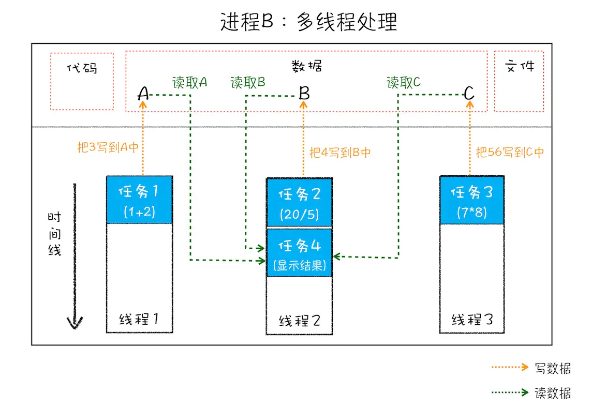
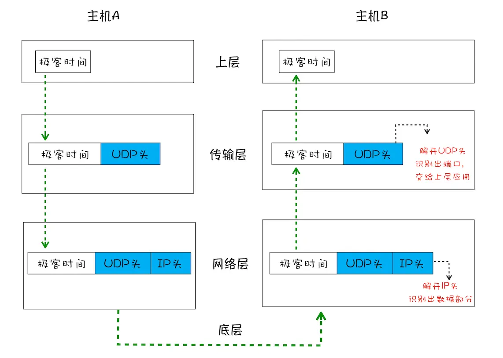
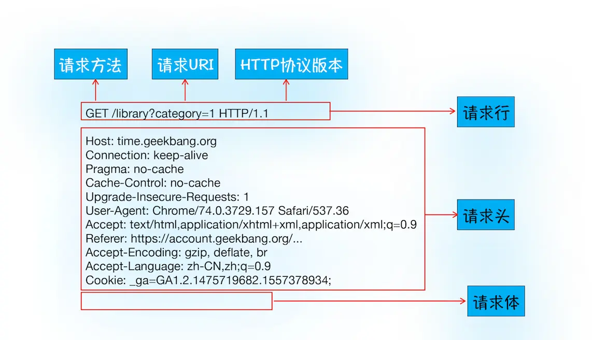
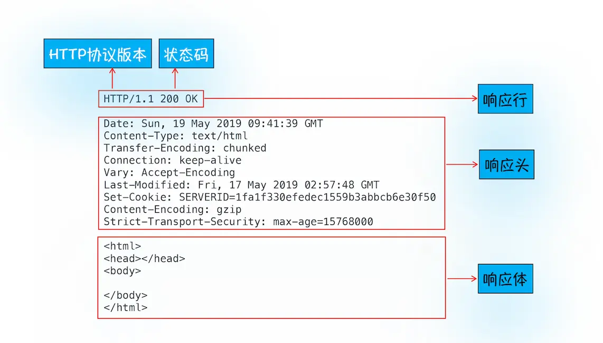
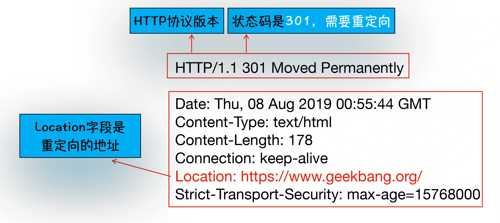

<!-- @import "[TOC]" {cmd="toc" depthFrom=1 depthTo=6 orderedList=false} -->

<!-- code_chunk_output -->

- [浏览器工作原理与实践](#浏览器工作原理与实践)
  - [一. 浏览器发展方向与演进](#一-浏览器发展方向与演进)
    - [1.1 浏览器发展方向](#11-浏览器发展方向)
    - [1.2 浏览器工作原理的作用](#12-浏览器工作原理的作用)
    - [1.3 前端技术针对核心诉求做的演进](#13-前端技术针对核心诉求做的演进)
  - [二. 宏观视角下的浏览器](#二-宏观视角下的浏览器)
    - [2.1 Chrome 架构](#21-chrome-架构)
      - [2.1.2 进程和线程](#212-进程和线程)
    - [2.2 TCP 协议](#22-tcp-协议)
    - [2.3 HTTP 请求流程](#23-http-请求流程)
      - [2.3.1 浏览器端发起 HTTP 请求流程](#231-浏览器端发起-http-请求流程)
      - [2.3.2 服务器端处理 HTTP 请求流程](#232-服务器端处理-http-请求流程)
      - [2.3.3 浏览器资源缓存](#233-浏览器资源缓存)
      - [2.3.4 总结](#234-总结)
    - [2.4 导航流程](#24-导航流程)
    - [2.5 渲染流程](#25-渲染流程)

<!-- /code_chunk_output -->

# 浏览器工作原理与实践

## 一. 浏览器发展方向与演进

### 1.1 浏览器发展方向

浏览器的发展历程中有了三个大的发展方向：

1. **应用程序 Web 化**
   随着云计算的普及和 HTML5 技术的快速发展，越来越多的应用转向了浏览器 / 服务器（B/S）架构，这种改变让浏览器的重要性与日俱增，视频、音频、游戏几大核心场景也都在往 Web 的使用场景切换。

2. **Web 应用移动化**
   对于移动设备应用，Web 天生具有开放的基因，虽然在技术层面还有问题尚待解决（比如，渲染流程过于复杂且性能不及原生应用、离线时用户无法使用、无法接收消息推送、移动端没有一级入口），但 Google 推出了 PWA 方案来整合 Web 和本地程序各自的优势。

3. **Web 操作系统化**
   Web 操作系统有两层含义：

   1. 利用 Web 技术构建一个纯粹的操作系统，如 ChromeOS
   2. 浏览器的底层结构往操作系统架构方向发展，在整个架构演化的大背景下会牵涉诸多改变，下面列举一些相对重要的改变：

      - Chrome 朝着 SOA 的方向演化，未来很多模块都会以服务的形式提供给上层应用使用
      - 在浏览器中引入多种编程语言的支持，比如新支持的 WebAssembly
      - 简化渲染流程，使得渲染过程更加直接高效
      - 加大对系统设备特性的支持
      - 提供对复杂 Web 项目开发的支持

   也就是说，浏览器已经逐步演化成了操作系统之上的 “操作系统”。

### 1.2 浏览器工作原理的作用

1. **准确评估 Web 开发项目的可行性**
   随着 Web 特性的极大丰富和浏览器性能的提升，越来越多的项目可以用 Web 来开发。所以，了解浏览器是如何工作的，能够更加准确地决策是否可以采用 Web 来开发项目。

2. **从更高维度审视页面**
   作为一名合格的开发者，还要具备一项重要的技能，那就是：要能站在用户体验角度来考虑页面性能。下面是几个常见的用户体验指标：

   - 当用户请求一个网站时，如果在 1 秒内看不到关键内容，用户会产生任务被中断的感觉。
   - 当用户点击某些按钮时，如果 100ms 内无法响应，用户会感受到延迟。
   - 如果 Web 中的动画没有达到 60fps，用户会感受到动画的卡顿。

   这里的页面加载时长、用户交互反馈时长、Web 动画中的帧数都决定了用户体验的流畅度，并最终决定了用户体验的效果。在用户体验尤其重要的今天，必须能够有效地解决这些体验问题，以免给产品造成不可挽回的伤害。

   但通常，这些指标是由一系列的复杂因素导致的。如果要开发流畅的页面，或者诊断 Web 页面中的性能问题，那就需要了解 URL 是怎么变成页面的，只有弄懂这些之后，才可以站在全局的角度定位问题或者写出高效的代码。

3. **在快节奏的技术迭代中把握本质**
   从 2011 年到现在，前端技术出现了大爆炸式增长，各种新技术层出不穷。**Node.js 是前端发展的一个核心推动力**。Node.js 是基于 Chrome 的 JS 引擎 V8 来实现的，它的特点是可以脱离浏览器环境来执行 JS。Node.js 的诞生时间不长，但其周边已经形成了一个庞大的生态系统。与此同时，各种新标准、新技术纷至沓来，前端生态空前繁荣。

   为什么 Node.js 能如此快速地发展？根本原因还是浏览器功能以及整个前端的开发环境，不足以支撑日益增长的需求，所以 “变化” 是这段时期的主旋律。这种变化直接扩大了前端工程师的知识半径，这也导致很多前端开发工程师变成了全栈工程师。

   随着脚本执行效率的提高、页面渲染性能的提升和开发工具链的完善，接下来的前端会进入一个相对平稳的阶段。通俗地理解就是：等到核心技术足以支撑核心需求，那么前端生态会进入一个相对稳定的状态。

### 1.3 前端技术针对核心诉求做的演进

了解了浏览器的工作机制，那么可以梳理出来前端技术的发展脉络，更加深刻地理解当前的技术，同时也会清楚其不足之处，以及演化方向。

1. **首先是脚本执行速度问题**
   比如针对 JS 设计缺陷和执行效率的问题，可以从以下两个途径去解决：

   - 不断修订和更新语言本身，这样就应该知道 ES6、ES7、ES8，或者 TypeScript 出现的必要性。这种修订对目前生态环境的改动是最小的，所以推行起来会比较容易。

   - 颠覆性地使用新的语言，这就是 WebAssembly 出现的原因。WebAssembly 需要经过编译器编译，所以体积小、执行速度快，使用它能大幅提升语言的执行效率，但是语言本身的完善，和生态的构建都是需要花很长时间来打造的。

2. **其次是前端模块化开发**
   比如，随着 Web 应用在各个领域的深入，Web 工程的复杂程度也越来越高，这就产生了模块化开发的需求，于是相应出现了 WebComponents 标准。React 和 Vue 都在渐进地适应 WebComponents 标准，同时各种前端框架的最佳实践也会反过来影响 WebComponents 标准的制定。理解了浏览器工作原理，会对 WebComponents 中涉及的 Shadow DOM、HTML Templates 等技术有更深刻的理解。

3. **最后是渲染效率问题**
   目前页面的渲染依然存在很大缺陷。与此同时，Chrome 团队也在着手改善这些缺陷，比如正在开发的下一代布局方案 LayoutNG，还有渲染瘦身方案 Slim Paint，其目的都是让渲染变得更加简单和高效。

综上可以看出，触发这些改变的背后因素是当前技术制约了现实的需求。

## 二. 宏观视角下的浏览器

### 2.1 Chrome 架构

#### 2.1.2 进程和线程

多线程可以并行处理任务，但是**线程是不能单独存在的，它是由进程来启动和管理的**。

**一个进程就是一个程序的运行实例**。详细解释就是，启动一个程序的时候，操作系统会为该程序创建一块内存，用来存放代码、运行中的数据和一个执行任务的主线程，把这样的一个运行环境叫进程。


从图中可以看到，**线程是依附于进程的，而进程中使用多线程并行处理能提升运算效率**。

总结来说，进程和线程之间的关系有以下 4 个特点：

- 进程中的任意一线程执行出错，都会导致整个进程的崩溃。

- 线程之间共享进程中的数据。
  

- 当一个进程关闭之后，操作系统会回收进程所占用的内存。

- 进程之间的内容相互隔离。
  进程隔离是为保护操作系统中进程互不干扰的技术，每一个进程只能访问自己占有的数据。正是因为进程之间的数据是严格隔离的，所以一个进程如果崩溃了，或者挂起了，是不会影响到其他进程的。如果进程之间需要进行数据的通信，这时候，就需要使用用于进程间通信（IPC）的机制了。

**单进程浏览器**
单进程浏览器是指浏览器的所有功能模块都是运行在同一个进程里。缺点：不稳定，不流畅，不安全。

**多进程浏览器**：

- 早期多进程架构
  

  Chrome 的页面是运行在单独的渲染进程中的，同时页面里的插件也是运行在单独的插件进程之中，而进程之间是通过 IPC 机制进行通信。

  - 解决不稳定：由于进程是相互隔离的，所以当一个页面或者插件崩溃时，影响到的仅仅是当前的页面进程或者插件进程。
  - 解决不流畅：JS 也是运行在渲染进程中的，所以即使 JS 阻塞了渲染进程，影响到的也只是当前的渲染页面，而并不会影响浏览器和其他页面
  - 解决不安全：采用多进程架构的额外好处是可以**使用安全沙箱**，可以把沙箱看成是操作系统给进程上了一把锁，沙箱里面的程序可以运行，但是不能在硬盘上写入任何数据，也不能在敏感位置读取任何数据。Chrome 把插件进程和渲染进程锁在沙箱里面。

- 目前多进程架构
  

  包括：1 个浏览器（Browser）主进程、1 个 GPU 进程、1 个网络（NetWork）进程、多个渲染进程和多个插件进程。下面来分析下这几个进程的功能：

  - 浏览器进程：主要负责界面显示、用户交互、子进程管理，同时提供存储等功能。

  - 渲染进程：核心任务是将 HTML、CSS 和 JS 转换为用户可以与之交互的网页，排版引擎 Blink 和 JS 引擎 V8 都是运行在该进程中，默认情况下，Chrome 会为每个 Tab 标签创建一个渲染进程。出于安全考虑，渲染进程都是运行在沙箱模式下。

  - GPU 进程：其实，Chrome 刚开始发布的时候是没有 GPU 进程的。而 GPU 的使用初衷是为了实现 3D CSS 的效果，只是随后网页、Chrome 的 UI 界面都选择采用 GPU 来绘制，这使得 GPU 成为浏览器普遍的需求。最后，Chrome 在其多进程架构上也引入了 GPU 进程。

  - 网络进程：主要负责页面的网络资源加载，之前是作为一个模块运行在浏览器进程里面的，直至最近才独立出来，成为一个单独的进程。

  - 插件进程：主要是负责插件的运行，因插件易崩溃，所以需要通过插件进程来隔离，以保证插件进程崩溃不会对浏览器和页面造成影响。

  问题：

  - 更高的资源占用：因为每个进程都会包含公共基础结构的副本，这就意味着浏览器会消耗更多的内存资源。

  - 更复杂的体系架构：浏览器各模块之间耦合性高、扩展性差等问题，会导致现在的架构已经很难适应新的需求了。

**未来面向服务的架构**
为了解决多进程架构的问题，在 2016 年，Chrome 官方团队使用 “**面向服务的架构**”（Services Oriented Architecture，简称 SOA）的思想设计了新的 Chrome 架构。也就是说 Chrome 整体架构会朝向现代操作系统所采用的 “面向服务的架构” 方向发展，原来的各种模块会被重构成独立的服务（Service），每个服务（Service）都可以在独立的进程中运行，访问服务（Service）必须使用定义好的接口，通过 IPC 来通信，从而**构建一个更内聚、松耦合、易于维护和扩展的系统**，更好实现 Chrome 简单、稳定、高速、安全的目标。

Chrome 最终要把 UI、数据库、文件、设备、网络等模块重构为基础服务，类似操作系统底层服务：


同时 Chrome 还提供灵活的弹性架构，在强大性能设备上会以多进程的方式运行基础服务，但是如果在资源受限的设备上，Chrome 会将很多服务整合到一个进程中，从而节省内存占用。


### 2.2 TCP 协议

在衡量 Web 页面性能的时候有一个重要的指标叫 **“FP（First Paint）”，是指从页面加载到首次开始绘制的时长**。这个指标直接影响了用户的跳出率，其中一个重要的因素是**网络加载速度**。

**互联网，实际上是一套理念和协议组成的体系架构**。其中，协议是一套众所周知的规则和标准，互联网中的数据是通过数据包来传输的。如果发送的数据很大，那么该数据就会被拆分为很多小数据包来传输：

1. **IP：把数据包送达目的主机**

   数据包要在互联网上进行传输，就要符合网际协议（Internet Protocol，简称 IP）标准。互联网上不同的在线设备都有唯一的地址。

   **计算机的地址就称为 IP 地址，访问任何网站实际上只是你的计算机向另外一台计算机请求信息**。

   如果要想把一个数据包从主机 A 发送给主机 B，那么在传输之前，数据包上会被附加上主机 B 的 IP 地址信息，这样在传输过程中才能正确寻址。额外地，数据包上还会附加上主机 A 本身的 IP 地址，有了这些信息主机 B 才可以回复信息给主机 A。这些附加的信息会被装进一个叫 IP 头的数据结构里。IP 头是 IP 数据包开头的信息，包含 IP 版本、源 IP 地址、目标 IP 地址、生存时间等信息。

   先把网络简单分为三层结构：

   

2. **UDP：把数据包送达应用程序**

   IP 是非常底层的协议，只负责把数据包传送到对方电脑，但是对方电脑并不知道把数据包交给哪个程序。因此，需要基于 IP 之上开发能和应用打交道的协议，最常见的是 **“用户数据包协议（User Datagram Protocol）”，简称 UDP**。

   **UDP 中一个最重要的信息是端口号**，端口号其实就是一个数字，每个想访问网络的程序都需要绑定一个端口号。通过端口号 UDP 就能把指定的数据包发送给指定的程序了，所以 **IP 通过 IP 地址信息把数据包发送给指定的电脑，而 UDP 通过端口号把数据包分发给正确的程序**。和 IP 头一样，端口号会被装进 UDP 头里面，UDP 头再和原始数据包合并组成新的 UDP 数据包。UDP 头中除了目的端口，还有源端口号等信息。

   为了支持 UDP 协议，把前面的三层结构扩充为四层结构，在网络层和上层之间增加了传输层：

   

   在使用 UDP 发送数据时，有各种因素会导致数据包出错，虽然 UDP 可以校验数据是否正确，但是对于错误的数据包，UDP 并不提供重发机制，只是丢弃当前的包，而且 UDP 在发送之后也无法知道是否能达到目的地。

   虽说 **UDP 不能保证数据可靠性，但是传输速度却非常快**，所以 UDP 会应用在一些关注速度、但不那么严格要求数据完整性的领域，如在线视频、互动游戏等。

3. **TCP：把数据完整地送达应用程序**

   对于浏览器请求，或者邮件这类要求数据传输可靠性（reliability）的应用，如果使用 UDP 来传输会存在两个问题：

   - 数据包在传输过程中容易丢失。
   - 大文件会被拆分成很多小的数据包来传输，这些小的数据包会经过不同的路由，并在不同的时间到达接收端，而 UDP 协议并不知道如何组装这些数据包，从而把这些数据包还原成完整的文件。

   基于这两个问题，引入了 TCP。**TCP（Transmission Control Protocol，传输控制协议）是一种面向连接的、可靠的、基于字节流的传输层通信协议**。相对于 UDP，TCP 有下面两个特点：

   - 对于数据包丢失的情况，TCP 提供重传机制。
   - TCP 引入了数据包排序机制，用来保证把乱序的数据包组合成一个完整的文件。

   和 UDP 头一样，TCP 头除了包含了目标端口和本机端口号外，还提供了用于排序的序列号，以便接收端通过序号来重排数据包。

   下面看看 TCP 下的单个数据包的传输流程：

   

   下面再看下完整的 TCP 连接过程，通过这个过程可以明白 TCP 是如何保证重传机制和数据包的排序功能的。从下图可以看出，一个完整的 TCP 连接的生命周期包括了 “**建立连接**” “**传输数据**” 和 “**断开连接**” 三个阶段。

   

   1. 首先，建立连接阶段。这个阶段是通过 “三次握手” 来建立客户端和服务器之间的连接。TCP 提供面向连接的通信传输。面向连接是指在数据通信开始之前先做好两端之间的准备工作。所谓**三次握手，是指在建立一个 TCP 连接时，客户端和服务器总共要发送三个数据包以确认连接的建立**。

   2. 其次，传输数据阶段。在该阶段，**接收端需要对每个数据包进行确认操作**，也就是接收端在接收到数据包之后，需要发送确认数据包给发送端。所以当发送端发送了一个数据包之后，在规定时间内没有接收到接收端反馈的确认消息，则判断为数据包丢失，并触发发送端的重发机制。同样，一个大的文件在传输过程中会被拆分成很多小的数据包，这些数据包到达接收端后，接收端会按照 TCP 头中的序号为其排序，从而保证组成完整的数据。

   3. 最后，断开连接阶段。数据传输完毕之后，就要终止连接了，涉及到最后一个阶段 “四次挥手” 来保证双方都能断开连接。

### 2.3 HTTP 请求流程

HTTP 协议，是建立在 TCP 连接基础之上的。**HTTP 是一种允许浏览器向服务器获取资源的协议，是 Web 的基础，通常由浏览器发起请求，用来获取不同类型的文件**。此外，HTTP 也是浏览器使用最广的协议.

#### 2.3.1 浏览器端发起 HTTP 请求流程

在浏览器地址栏中键入地址后：

1. 构建请求
   首先，浏览器构建请求行信息，构建好后，浏览器准备发起网络请求。

   ```sh
   GET /index.html HTTP1.1
   ```

2. 查找缓存

   在真正发起网络请求之前，浏览器会先在浏览器缓存中查询是否有要请求的文件。其中，**浏览器缓存是一种在本地保存资源副本，以供下次请求时直接使用的技术**。

   当浏览器发现请求的资源已经在浏览器缓存中存有副本，它会拦截请求，返回该资源的副本，并直接结束请求，而不会再去源服务器重新下载。这样做的好处有：

   - 缓解服务器端压力，提升性能（获取资源的耗时更短了）；
   - 对于网站来说，缓存是实现快速资源加载的重要组成部分。

   如果缓存查找失败，就会进入网络请求过程。

3. 准备 IP 地址和端口

   在了解网络请求之前，需要先看看 HTTP 和 TCP 的关系。因为浏览器使用 HTTP 协议作为应用层协议，用来封装请求的文本信息；并使用 TCP/IP 作传输层协议将它发到网络上，所以在 HTTP 工作开始之前，浏览器需要通过 TCP 与服务器建立连接。也就是说 HTTP 的内容是通过 TCP 的传输数据阶段来实现的，可以结合下图更好地理解这二者的关系。

   

   数据包都是通过 IP 地址传输给接收方的。由于 IP 地址是数字标识，比如极客时间网站的 IP 是 39.106.233.176, 难以记忆，但使用极客时间的域名（time.geekbang.org）就好记多了，所以基于这个需求又出现了一个服务，负责把域名和 IP 地址做一一映射关系。这套域名映射为 IP 的系统就叫做 “**域名系统”，简称 DNS**（Domain Name System）。

   一路推导下来，会发现**在第一步浏览器会请求 DNS 返回域名对应的 IP**。当然浏览器还提供了 DNS 数据缓存服务，如果某个域名已经解析过了，那么浏览器会缓存解析的结果，以供下次查询时直接使用，这样也会减少一次网络请求。

   拿到 IP 之后，接下来就需要获取端口号了。通常情况下，如果 URL 没有特别指明端口号，那么 HTTP 协议默认是 80 端口。

4. 等待 TCP 队列

   Chrome 有个机制，同一个域名同时最多只能建立 6 个 TCP 连接，如果当前请求数量少于 6，会直接进入下一步，建立 TCP 连接。

5. 建立 [TCP 连接](#22-tcp-协议)

6. 发送 HTTP 请求

   一旦建立了 TCP 连接，浏览器就可以和服务器进行通信了。而 HTTP 中的数据正是在这个通信过程中传输的。

   

   首先浏览器会向服务器发送**请求行，它包括了请求方法、请求 URI（Uniform Resource Identifier）和 HTTP 版本协议**。

   发送请求行，就是告诉服务器浏览器需要什么资源，最常用的请求方法是 Get。另外一个常用的请求方法是 POST，它用于发送一些数据给服务器，比如登录一个网站，就需要通过 POST 方法把用户信息发送给服务器。如果使用 POST 方法，那么浏览器还要准备数据给服务器，这里准备的数据是**通过请求体来发送**。

   在浏览器发送请求行命令之后，还要**以请求头形式发送其他一些信息**，把浏览器的一些基础信息告诉服务器。比如包含了浏览器所使用的操作系统、浏览器内核等信息，以及当前请求的域名信息、浏览器端的 Cookie 信息，等等。

#### 2.3.2 服务器端处理 HTTP 请求流程

1. 返回请求
   一旦服务器处理结束，便可以返回数据给浏览器了。可以通过 curl 工具来查看返回请求数据，使用方法是在命令行中输入以下命令：

   ```sh
   curl -i  https://time.geekbang.org/
   ```

   > **注意**：这里加上了 `-i` 是为了返回响应行、响应头和响应体的数据，返回的结果如下图所示，可以结合这些数据来理解服务器是如何响应浏览器的。

   

   首先服务器会返回**响应行**，包括协议版本和状态码。但并不是所有的请求都可以被服务器处理的，一些无法处理或者处理出错的信息，服务器会通过请求行的状态码来告诉浏览器它的处理结果。

   随后，正如浏览器会随同请求发送请求头一样，服务器也会随同响应向浏览器发送**响应头**。响应头包含了服务器自身的一些信息，比如服务器生成返回数据的时间、返回的数据类型（JSON、HTML、流媒体等类型），以及服务器要在客户端保存的 Cookie 等信息。

   发送完响应头后，服务器就可以继续发送响应体的数据，通常，响应体就包含了 HTML 的实际内容。

2. 断开连接
   通常情况下，一旦服务器向客户端返回了请求数据，它就要关闭 TCP 连接。不过如果浏览器或者服务器在其头信息中加入了：

   ```sh
   Connection:Keep-Alive
   ```

   那么 TCP 连接在发送后将仍然保持打开状态，这样浏览器就可以继续通过同一个 TCP 连接发送请求。**保持 TCP 连接可以省去下次请求时需要建立连接的时间，提升资源加载速度**。

3. 重定向

   在浏览器中打开 geekbang.org 后，会发现最终打开的页面地址是 `https://www.geekbang.org`。这两个 URL 之所以不一样，是因为涉及到了一个重定向操作。在控制台输入如下命令：

   ```js
   curl -I geekbang.org
   ```

   > **注意**：这里输入的参数是 `-I`，和 `-i` 不一样，`-I` 表示只需要获取响应头和响应行数据，而不需要获取响应体的数据。

   

   从图中可以看到，响应行返回的状态码是 301，状态 301 就是告诉浏览器，需要重定向到另外一个网址，而需要重定向的网址正是包含在响应头的 `Location` 字段中，接下来，浏览器获取 `Location` 字段中的地址，并使用该地址重新导航，这就是一个完整重定向的执行流程。

#### 2.3.3 浏览器资源缓存

下面是缓存处理的过程：


从上图的第一次请求可以看出，当服务器返回 HTTP 响应头给浏览器时，浏览器是**通过响应头中的 `Cache-Control` 字段来设置是否缓存该资源**。通常，还需要为这个资源设置一个缓存过期时长，而这个时长是通过 `Cache-Control` 中的 `Max-age` 参数来设置的，比如上图设置的缓存过期时间是 2000 秒。

这也就意味着，在该缓存资源还未过期的情况下, 如果再次请求该资源，会直接返回缓存中的资源给浏览器。但如果缓存过期了，浏览器则会继续发起网络请求，并且在 HTTP 请求头中带上：

```http
If-None-Match:"4f80f-13c-3a1xb12a"
```

服务器收到请求头后，会根据 `If-None-Match` 的值来判断请求的资源是否有更新。

- 如果没有更新，就返回 304 状态码，相当于服务器告诉浏览器：“这个缓存可以继续使用，这次就不重复发送数据。”
- 如果资源有更新，服务器就直接返回最新资源给浏览器。

关于缓存的细节内容特别多，具体细节可以参考这篇 [HTTP 缓存](https://developer.mozilla.org/zh-CN/docs/Web/HTTP/Caching)。

#### 2.3.4 总结

从图中可以看到，浏览器中的 HTTP 请求从发起到结束一共经历了如下八个阶段：构建请求、查找缓存、准备 IP 和端口、等待 TCP 队列、建立 TCP 连接、发起 HTTP 请求、服务器处理请求、服务器返回请求和断开连接。


### 2.4 导航流程

从输入 URL 到页面展示完整流程示意图：


**整个过程需要各个进程之间的配合**，这个过程可以大致描述为如下：

- 首先，浏览器进程接收到用户输入的 URL 请求，浏览器进程便将该 URL 转发给网络进程。

- 然后，在网络进程中发起真正的 URL 请求。

- 接着网络进程接收到了响应头数据，便解析响应头数据，并将数据转发给浏览器进程。

- 浏览器进程接收到网络进程的响应头数据之后，发送 “提交导航（CommitNavigation）” 消息到渲染进程。

- 渲染进程接收到 “提交导航” 的消息之后，便开始准备接收 HTML 数据，接收数据的方式是直接和网络进程建立数据管道。

- 最后渲染进程会向浏览器进程 “确认提交”，这是告诉浏览器进程：“已经准备好接受和解析页面数据了”。

- 浏览器进程接收到渲染进程 “提交文档” 的消息之后，便开始移除之前旧的文档，然后更新浏览器进程中的页面状态。

这其中，**用户发出 URL 请求到页面开始解析的这个过程，就叫做导航**。

**从输入 URL 到页面展示**：

1. 用户输入
   当用户在地址栏中输入一个查询关键字时，地址栏会判断输入的关键字是搜索内容，还是请求的 URL。

   - 如果是搜索内容，地址栏会使用浏览器默认的搜索引擎，来合成新的带搜索关键字的 URL。

   - 如果判断输入内容符合 URL 规则，比如输入的是 time.geekbang.org，那么地址栏会根据规则，把这段内容加上协议，合成为完整的 URL，如 `https://time.geekbang.org`。

   当用户输入关键字并键入回车之后，这意味着当前页面即将要被替换成新的页面，不过在这个流程继续之前，浏览器还给了当前页面一次执行 `beforeunload` 事件的机会，`beforeunload` 事件允许页面在退出之前执行一些数据清理操作，还可以询问用户是否要离开当前页面，比如当前页面可能有未提交完成的表单等情况，因此用户可以通过 `beforeunload` 事件来取消导航，让浏览器不再执行任何后续工作。

   当前页面没有监听 `beforeunload` 事件或者同意了继续后续流程，标签页上的图标便进入了加载状态。但此时图中页面显示的依然是之前打开的页面内容，并没立即替换为新页面。因为需要等待提交文档阶段，页面内容才会被替换。

2. URL 请求

   接下来，便进入了页面资源请求过程。这时，浏览器进程会通过进程间通信（IPC）把 URL 请求发送至网络进程，网络进程接收到 URL 请求后，会在这里发起真正的 URL 请求流程。

   首先，网络进程会查找本地缓存是否缓存了该资源。如果有缓存资源，那么直接返回资源给浏览器进程；如果在缓存中没有查找到资源，那么直接进入网络请求流程。这请求前的第一步是要进行 DNS 解析，以获取请求域名的服务器 IP 地址。如果请求协议是 HTTPS，那么还需要建立 TLS 连接。

   接下来就是利用 IP 地址和服务器建立 TCP 连接。连接建立之后，浏览器端会构建请求行、请求头等信息，并把和该域名相关的 Cookie 等数据附加到请求头中，然后向服务器发送构建的请求信息。

   服务器接收到请求信息后，会根据请求信息生成响应数据，并发给网络进程。等网络进程接收了响应行和响应头之后，就开始解析响应头的内容了。

   - 重定向

     在接收到服务器返回的响应头后，网络进程开始解析响应头，如果发现返回的状态码是 301 或者 302，那么说明服务器需要浏览器重定向到其他 URL。这时网络进程会从响应头的 `Location` 字段里面读取重定向的地址，然后再发起新的 HTTP 或者 HTTPS 请求，一切又重头开始了。

     **在导航过程中，如果服务器响应行的状态码包含了 301、302 一类的跳转信息，浏览器会跳转到新的地址继续导航；如果响应行是 2xx，那么表示浏览器可以继续处理该请求**。

   - 响应数据类型处理

     在处理了跳转信息之后。URL 请求的数据类型，有时候是一个下载类型，有时候是正常的 HTML 页面，浏览器通过 `Content-Type` 区分。**`Content-Type` 是 HTTP 头中一个非常重要的字段，它告诉浏览器服务器返回的响应体数据是什么类型**，然后浏览器会根据 `Content-Type` 的值来决定如何显示响应体的内容。

     不同 `Content-Type` 的后续处理流程也截然不同。**如果 `Content-Type` 字段的值被浏览器判断为下载类型，那么该请求会被提交给浏览器的下载管理器，同时该 URL 请求的导航流程就此结束。但如果是 HTML，那么浏览器则会继续进行导航流程**。由于 Chrome 的页面渲染是运行在渲染进程中的，所以接下来就需要准备渲染进程了。

3. 准备渲染进程

   默认情况下，Chrome 会为每个页面分配一个渲染进程，也就是说，每打开一个新页面就会配套创建一个新的渲染进程。但是，在某些情况下，浏览器会让多个页面直接运行在同一个渲染进程中。

   **例外情况**
   在同一站点（same-site）。“同一站点” 定义为根域名（例如，geekbang.org）加上协议（例如，https:// 或者 http://），还包含了该根域名下的所有子域名和不同的端口，比如下面这三个：

   ```txt
   https://time.geekbang.org
   https://www.geekbang.org
   https://www.geekbang.org:8080
   ```

   **Chrome 的默认策略是，每个标签对应一个渲染进程。但如果从一个页面打开了另一个新页面，而新页面和当前页面属于同一站点的话，那么新页面会复用父页面的渲染进程**。官方把这个默认策略叫 process-per-site-instance。

   打开一个新页面采用的渲染进程策略就是：

   - 通常情况下，打开新的页面都会使用单独的渲染进程。

   - 如果从 A 页面打开 B 页面，且 A 和 B 都属于同一站点的话，那么 B 页面复用 A 页面的渲染进程；如果是其他情况，浏览器进程则会为 B 创建一个新的渲染进程。

   渲染进程准备好之后，还不能立即进入文档解析状态，因为此时的文档数据还在网络进程中，并没有提交给渲染进程，所以下一步就进入了提交文档阶段。

4. 提交文档

   **提交文档，就是指浏览器进程将网络进程接收到的 HTML 数据提交给渲染进程**，具体流程：

   - 首先当浏览器进程接收到网络进程的响应头数据之后，便向渲染进程发起 “提交文档” 的消息。

   - 渲染进程接收到 “提交文档” 的消息后，会和网络进程建立传输数据的 “管道”。

   - 等文档数据传输完成之后，渲染进程会返回 “确认提交” 的消息给浏览器进程。

   - 浏览器进程在收到 “确认提交” 的消息后，会更新浏览器界面状态，包括了安全状态、地址栏的 URL、前进后退的历史状态，并更新 Web 页面。

   其中，当渲染进程确认提交之后，更新内容如下图：

   

   到这里，一个完整的导航流程就 “走” 完了，这之后就要进入渲染阶段了。

5. 渲染阶段

   一旦文档被提交，渲染进程便开始页面解析和子资源加载了。

### 2.5 渲染流程


从图中可以看出，左边输入的是 HTML、CSS、JS 数据，这些数据经过中间渲染模块的处理，最终输出为屏幕上的像素。

由于渲染机制过于复杂，所以渲染模块在执行过程中会被划分为很多子阶段，输入的数据经过这些子阶段，最后输出像素。把这样的一个处理流程叫做渲染流水线，其大致流程如下图所示：


按照渲染的时间顺序，流水线可分为如下几个子阶段：构建 DOM 树、样式计算、布局阶段、分层、绘制、分块、光栅化和合成。在每个阶段的过程中，应该重点关注以下三点内容：

- 开始每个子阶段都有其**输入的内容**。

- 然后每个子阶段有其**处理过程**。

- 最终每个子阶段会生成**输出内容**。

**构建 DOM 树**
为什么要构建 DOM 树呢？**这是因为浏览器无法直接理解和使用 HTML，所以需要将 HTML 转换为浏览器能够理解的结构——DOM 树**。


可以看到，DOM 和 HTML 内容几乎是一样的，但是和 HTML 不同的是，DOM 是保存在内存中树状结构，可以通过 JS 来查询或修改其内容。

**样式计算（Recalculate Style）**
样式计算的目的是为了计算出 DOM 节点中每个元素的具体样式，这个阶段大体可分为三步来完成。

1. 把 CSS 转换为浏览器能够理解的结构

   和 HTML 文件一样，浏览器也是无法直接理解这些纯文本的 CSS 样式，所以**当渲染引擎接收到 CSS 文本时，会执行一个转换操作，将 CSS 文本转换为浏览器可以理解的结构——styleSheets**。并且该结构同时具备了查询和修改功能。

2. 转换样式表中的属性值，使其标准化

   现在已经把现有的 CSS 文本转化为浏览器可以理解的结构了，那么接下来就要**对其进行属性值的标准化操作**。

   ```css
   body {
     font-size: 2em;
   }
   p {
     color: blue;
   }
   div {
     font-weight: bold;
   }
   ```

   可以看到上面的 CSS 文本中有很多属性值，如 2em、blue、bold，这些类型数值不容易被渲染引擎理解，所以**需要将所有值转换为渲染引擎容易理解的、标准化的计算值，这个过程就是属性值标准化**。

   

3. 计算出 DOM 树中每个节点的具体样式

   现在样式的属性已被标准化了，接下来就需要计算 DOM 树中每个节点的样式属性了，这就**涉及到 CSS 的继承规则和层叠规则**了。

   - 首先是 CSS 继承。**CSS 继承就是每个 DOM 节点都包含有父节点的样式**。

   - 样式计算过程中的第二个规则是样式层叠。**层叠是 CSS 的一个基本特征，它是一个定义了如何合并来自多个源的属性值的算法。它在 CSS 处于核心地位，CSS 的全称 “层叠样式表” 正是强调了这一点**。

   样式计算阶段的目的是为了计算出 DOM 节点中每个元素的具体样式，在计算过程中需要遵守 CSS 的继承和层叠两个规则。这个阶段最终输出的内容是每个 DOM 节点的样式，并被保存在 ComputedStyle 的结构内。

4. 布局阶段

   现在，有 DOM 树和 DOM 树中元素的样式，但这还不足以显示页面，因为还不知道 DOM 元素的几何位置信息。那么接下来就需要**计算出 DOM 树中可见元素的几何位置，这个计算过程叫做布局**。

   Chrome 在布局阶段需要完成两个任务：创建布局树和布局计算。

   1. 创建布局树

      DOM 树还含有很多不可见的元素，比如 head 标签，还有使用了 display:none 属性的元素。所以**在显示之前，还要额外地构建一棵只包含可见元素布局树**。

      

      从上图可以看出，DOM 树中所有不可见的节点都没有包含到布局树中。为了构建布局树，浏览器大体上完成了下面这些工作：

      - 遍历 DOM 树中的所有可见节点，并把这些节点加到布局树中。
      - 不可见的节点会被布局树忽略掉，如 head 标签下面的全部内容，再比如 body.p.span 这个元素，因为它的属性包含 dispaly:none，所以这个元素也没有被包进布局树。

   2. 布局计算

      在执行布局操作的时候，会把布局运算的结果重新写回布局树中，所以布局树既是输入内容也是输出内容，这是布局阶段一个不合理的地方，因为在布局阶段并没有清晰地将输入内容和输出内容区分开来。针对这个问题，Chrome 团队正在重构布局代码，下一代布局系统叫 LayoutNG，试图更清晰地分离输入和输出，从而让新设计的布局算法更加简单。
