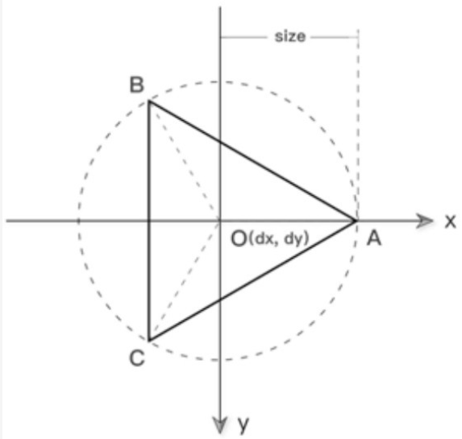

# Canvas

<!-- @import "[TOC]" {cmd="toc" depthFrom=1 depthTo=6 orderedList=false} -->

<!-- code_chunk_output -->

- [Canvas](#-canvas-)
  - [一. Canvas 概述](#-一-canvas-概述-)
    - [1.1 Canvas 与 SVG](#-11-canvas-与-svg-)
    - [1.2 Canvas 元素](#-12-canvas-元素-)
  - [二. Canvas 基础](#-二-canvas-基础-)
    - [2.1 直线图形](#-21-直线图形-)
      - [2.1.1 直线](#-211-直线-)
      - [2.1.2 矩形](#-212-矩形-)
        - [2.1.2.1 描边矩形](#-2121-描边矩形-)
        - [2.1.2.2 填充矩形](#-2122-填充矩形-)
        - [2.1.2.3 rect() 方法](#-2123-rect-方法-)
        - [2.1.2.4 清空矩形](#-2124-清空矩形-)
      - [2.1.3 多边形](#-213-多边形-)
    - [2.2 曲线图形](#-22-曲线图形-)

<!-- /code_chunk_output -->

## 一. Canvas 概述

在 HTML5 之前，为了让页面获得绚丽多彩的效果，在很多情况下都是借助 “图片” 来实现的。然而图片体积大、加载速度慢，使用图片的代价就是降低了页面的性能。为了应对日渐复杂的 Web 应用开发，W3C 在 HTML5 标准中引入了 Canvas 技术。

Canvas，又称 “画布”，是 HTML5 的核心技术之一。HTML5 中新增了一个 Canvas 元素，Canvas 技术，指的就是使用 Canvas 元素结合 JS 来绘制各种图形的技术。它可以用绘制图形、绘制图表、动画效果、游戏开发等。

### 1.1 Canvas 与 SVG

HTML5 有两个主要的 2D 图形技术：Canvas 和 SVG。这是两门完全不同的技术，两者具有以下区别：

- Canvas 是使用 JS 动态生成的，SVG 是使用 XML 静态描述的。

- Canvas 是基于 “位图” 的，适用于像素处理和动态渲染，放大图形会使图形失真。SVG 是基于 “矢量” 的，不适用于像素处理和适合静态描述，放大图形也不会使图形失真。

- 若发生修改，使用 Canvas 需要重绘，而使用 SVG 不需要重绘。

Canvas 与 SVG 的关系，简单来说，就像 “美术与几何” 的关系一样。

### 1.2 Canvas 元素

HTML5 Canvas，简单来说，就是一门使用 JS 来操作 Canvas 元素的技术。使用 Canvas 元素来绘制图形，需要以下 3 步：

1. 获取 canvas 对象。
2. 获取上下文环境对象 context。
3. 开始绘制图形。

```js
// 1. 获取canvas对象
let cnv = document.getElementById('canvas');
// 2. 获取上下文环境对象 context
let cxt = cnv.getContext('2d');
// 3. 开始绘制图形
cxt.moveTo(50, 100);
cxt.lineTo(150, 50);
cxt.stroke();
```

Canvas 是一个行内块元素，一般需要指定其 3 个属性：id、width 和 height。width 和 height 分别用于定义 Canvas 元素的宽度和高度。默认情况下，Canvas 元素的宽度为 300px，高度为 150px。

> **注意**：在实际开发中 Canvas 的宽度和高度，一定要在 HTML 属性中定义。

## 二. Canvas 基础

### 2.1 直线图形

在 Canvas 中，基本图形有两种：

- 直线图形：常见的直线图形有以下 3 种。

  - 直线
  - 矩形
  - 多边形

- 曲线图形

**Canvas 使用的坐标系是 W3C 坐标系**，它与经常见到的数学坐标系唯一的区别在于 y 轴正方向的不同：数学坐标系 y 轴正方向向上。W3C 坐标系，y 轴正方向向下。

#### 2.1.1 直线

在 Canvas 中，可以将 `moveTo()` 和 `lineTo()` 这两个方法配合使用来画直线。利用这两个方法，可以画一条直线，也可以同时画多条直线。

```js
// 一条直线
// cxt 表示上下文环境对象 context。
// (x1, y1) 表示直线 “起点” 的坐标。moveTo(x1, y1) 的含义是 “将画笔移到点 (x1, y1) 位置，然后开始绘图”。
cxt.moveTo(x1, y1);
// (x2, y2) 表示直线 “终点” 的坐标。lineTo(x2, y2) 的含义是 “使用画笔从起点 (x1,y1) 开始画直线，一直画到终点（×2,y2）”。
cxt.lineTo(x2, y2);
// 上面两句代码仅仅是确定直线的 “起点坐标” 和 “终点坐标”，但是实际上画笔还没 “动”。因此，还需要调用上下文环境对象的 stroke() 方法才有效。
cxt.stroke();
```

```js
// 多条直线
cxt.moveTo(x1, y1);
cxt.lineTo(x2, y2);
cxt.lineTo(x3, y3);
// ......
cxt.stroke();
```

lineTo() 方法是可以重复使用的：第 1 次使用 lineTo() 后，画笔将自动移到终点；第 2 次使用 lineTo() 后，Canvas 会以 “上一个终点的坐标” 作为第 2 次调用的起点，然后再开始画直线，依此类推。

#### 2.1.2 矩形

对于绘制矩形，Canvas 另外为提供了独立的方法来实现。在 Canvas 中，矩形分为两种：

- 描边矩形
- 填充矩形

##### 2.1.2.1 描边矩形

在 Canvas 中，我可以配合使用 `strokeStyle` 属性和 `strokeRect()` 方法，来画一个描边矩形。

```js
cxt.strokeStyle = '属性值';
cxt.strokeRect(x, y, width, height);
```

**strokeStyle 属性**
strokeStyle 属性取值有 3 种：颜色值、渐变色和图案。先来看一下 strokeStyle 属性取值为颜色值的几种情况：

```js
cxt.strokeStyle = '#FF0000'; // 十六进制颜色值
cxt.strokeStyle = 'red'; // 颜色关键字
cxt.strokeStyle = 'rgb(255, 0, 0)'; // rgb 颜色值
cxt.strokeStyle = 'rgba(255, 0, 0, 0.8)'; // rgba 颜色值
```

**strokeRect() 方法**
strokeRect() 方法用于确定矩形的坐标，其中 (x, y) 为矩形左上角点的坐标，width 表示矩形的宽度，height 表示矩形的高度，默认情况下 width 和 height 都是以 px 为单位。

> **注意**：strokeStyle 属性必须在使用 strokeRect() 方法之前定义，否则 strokeStyle 属性无效。

##### 2.1.2.2 填充矩形

在 Canvas 中，可以配合使用 `fillStyle` 属性和 `fillRect()` 方法来画一个填充矩形。

```js
cxt.fillStyle = '属性值';
cxt.fillRect(x, y, width, height);
```

fillStyle 属性跟 strokeStyle 属性一样，取值也有 3 种：颜色值、渐变色和图案。

fillRect() 方法跟 strokeRect() 方法一样，用于确定矩形的坐标，其中 (x, y) 为矩形左上角点的坐标，width 表示矩形的宽度，height 表示矩形的高度。

> **注意**：跟描边矩形一样，填充矩形的 fillStyle 属性也必须在使用 fillRect() 方法之前定义，否则 fillStyle 属性无效。

##### 2.1.2.3 rect() 方法

在 Canvas 中，如果想要绘制一个矩形，除了使用 strokeRect() 和 fillRect() 这两个方法之外，还可以使用 `rect()` 方法。

```js
// x 和 y 为矩形左上角点的坐标，width 表示矩形的宽度，height 表示矩形的高度。
rect(x, y, width, height);
```

使用 strokeRect()、fillRect() 和 rect() 这 3 种方法都可以画矩形。这 3 种方法的参数设置是相同的，不同之处在于实现效果。其中，strokeRect()和 fillRect()这两个方法在被调用之后，会立即把矩形绘制出来。而 rect() 方法在被调用之后，并不会立即把矩形绘制出来。只有在使用 rect() 方法之后再调用 `stroke()` 或 `fill()` 方法，才会把矩形绘制出来。

##### 2.1.2.4 清空矩形

在 Canvas 中，可以使用 `clearRect()` 方法来清空 “指定矩形区域”。

```js
// x、y 分别表示被清空矩形区域左上角点的横、纵坐标，width 表示矩形的宽度，height 表示矩形的高度。
cxt.clearRect(x, y, width, height);

// 用于清空整个 Canvas
cxt.clearRect(0, 0, cnv.width, cnv.height);
```

#### 2.1.3 多边形

在 Canvas 中，多边形也是使用 moveTo() 和 lineTo() 这两个方法画出来的。

- **箭头**
  对于绘制箭头，都是事先确定箭头的 7 个顶点坐标，然后使用 moveTo() 和 lineTo() 方法来绘制。

  ```js
  let cnv = document.getElementById('canvas');
  let cxt = cnv.getContext('2d');
  cxt.moveTo(40, 60);
  cxt.lineTo(100, 60);
  cxt.lineTo(100, 30);
  cxt.lineTo(150, 75);
  cxt.lineTo(100, 120);
  cxt.lineTo(100, 90);
  cxt.lineTo(40, 90);
  cxt.lineTo(40, 60);
  cxt.stroke();
  ```

- **正多边形**

  

  根据正三角形的特点，可以封装一个绘制正多边形的函数：createPolygon()。

  ```js
  /**
   * @param {Number} n n 边形
   * @param {Number} dx n 边形中心坐标 x 轴
   * @param {Number} dy n 边形中心坐标 y 轴
   * @param {Number} size n 边形的大小
   */
  function createPolygon(cxt, n, dx, dy, size) {
    cxt.beginPath();
    let degree = (2 * Math.PI) / n;
    for (let i = 0; i < n; i++) {
      let x = Math.cos(i * degree);
      let y = Math.sin(i * degree);
      cxt.lineTo(x * size + dx, y * size + dy);
      cxt.closePath();
    }
  }
  ```

- **五角星**

  

  同样，也是先获取各个顶点的坐标，然后使用 moveTo() 和 lineTo() 把五角星绘制出来的。根据上面的分析图，可以知道 ∠BOA=36°、∠AOX=18°、∠BOX=54°，然后结合三角函数，很容易得出五角星各个顶点的坐标。

  ```js
  var cnv = document.getElementById('canvas');
  var cxt = cnv.getContext('2d');
  cxt.beginPath();
  for (let i = 0; i < 5; i++) {
    cxt.lineTo(
      Math.cos(((18 + i * 72) * Math.PI) / 180) * 50 + 100,
      -Math.sin(((18 + i * 72) * Math.PI) / 180) * 50 + 100
    );
    cxt.lineTo(
      Math.cos(((54 + i * 72) * Math.PI) / 180) * 25 + 100,
      -Math.sin(((54 + i * 72) * Math.PI) / 180) * 25 + 100
    );
  }
  cxt.closePath();
  cxt.stroke();
  ```

### 2.2 曲线图形

曲线图形，一般涉及两种情况：

- 曲线
- 弧线

曲线和弧线是两个不同的概念。简单来说，弧线是圆的一部分，曲线则不一定。弧线上的每个点都具有相同的曲率，曲线则不一定。也可以这样说，曲线包含弧线。

有关 Canvas 曲线图形，有以下 4 个方面：

- 圆形
- 弧线
- 二次贝塞尔曲线
- 三次贝塞尔曲线
