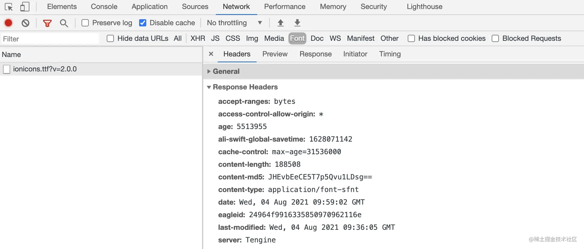
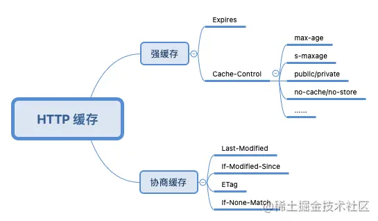
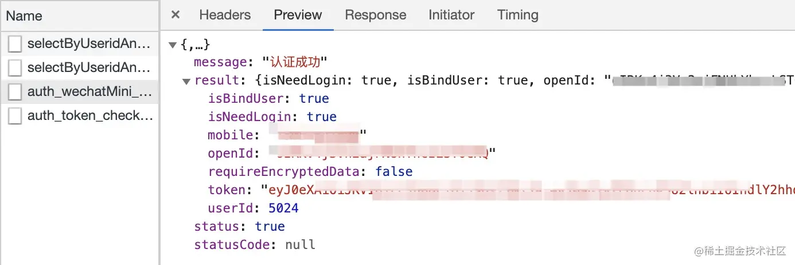
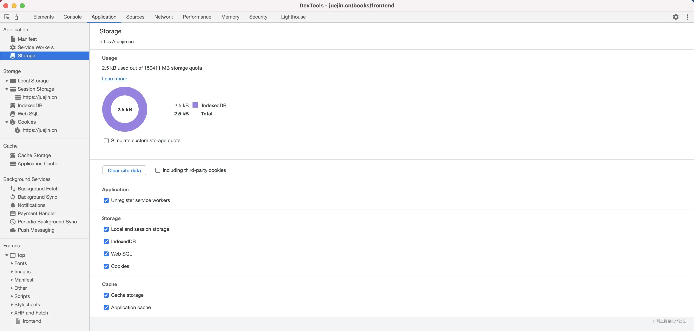
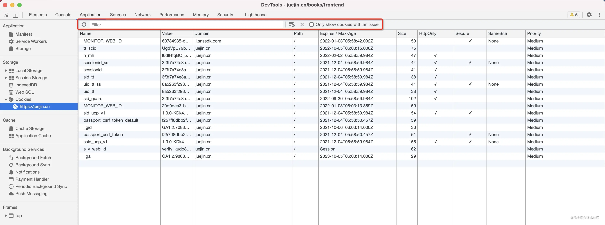
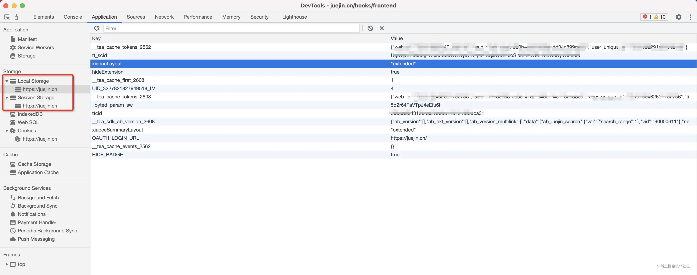
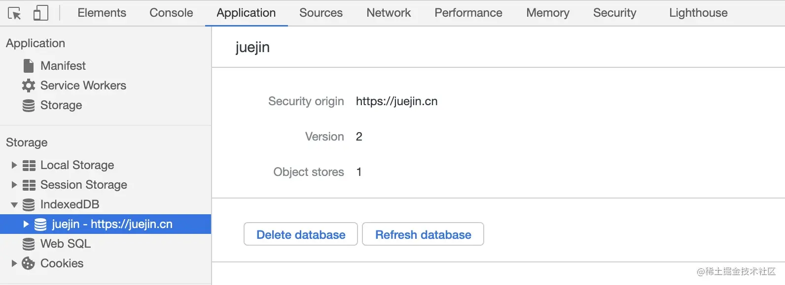
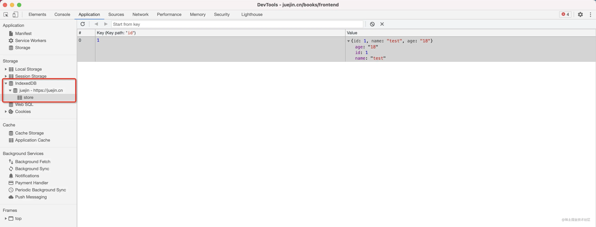
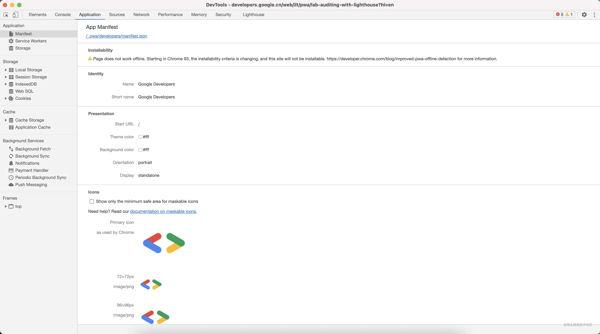
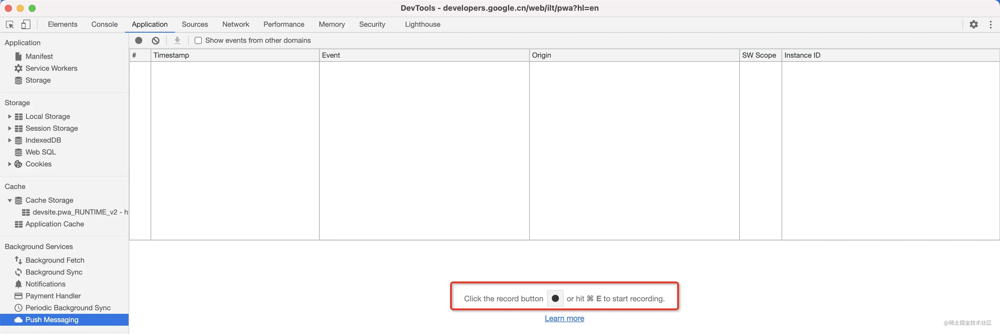

# 前端缓存

<!-- @import "[TOC]" {cmd="toc" depthFrom=1 depthTo=6 orderedList=false} -->

<!-- code_chunk_output -->

- [前端缓存](#前端缓存)
  - [一. 简介](#一-简介)
  - [二. HTTP 缓存](#二-http-缓存)
    - [2.1 请求相响应头](#21-请求相响应头)
      - [2.1.1 与缓存有关的首部字段名](#211-与缓存有关的首部字段名)
    - [2.2 强缓存](#22-强缓存)
      - [2.3.1 max-age 与 s-maxage](#231-max-age-与-s-maxage)
      - [2.3.2 expires 与 max-age](#232-expires-与-max-age)
      - [2.3.3 缓存新鲜度与使用期算法](#233-缓存新鲜度与使用期算法)
    - [2.3 协商缓存](#23-协商缓存)
      - [2.3.1 缓存标识 Last-Modified 与 ETag](#231-缓存标识-last-modified-与-etag)
    - [2.4 应用](#24-应用)
      - [2.4.1 Webpack 中的 Hash 模式](#241-webpack-中的-hash-模式)
    - [2.5 用户操作与 HTTP 缓存](#25-用户操作与-http-缓存)
    - [2.6 Nginx 与跨域问题](#26-nginx-与跨域问题)
      - [2.6.1 跨域问题](#261-跨域问题)
      - [2.6.2 使用 Nginx 配置响应报头](#262-使用-nginx-配置响应报头)
  - [三. 浏览器缓存](#三-浏览器缓存)
    - [3.1 浏览器缓存机制](#31-浏览器缓存机制)
      - [3.1.1 缓存获取顺序](#311-缓存获取顺序)
      - [3.1.2 缓存存储优先级](#312-缓存存储优先级)
      - [3.1.3 Preload 与 Prefetch](#313-preload-与-prefetch)
    - [3.2 Service Worker](#32-service-worker)
      - [3.2.1 概念](#321-概念)
      - [3.2.2 生命周期与缓存](#322-生命周期与缓存)
    - [3.3 存储型缓存](#33-存储型缓存)
      - [3.3.1 网站登录背后的存储逻辑](#331-网站登录背后的存储逻辑)
      - [3.3.2 浏览器存储型缓存方案](#332-浏览器存储型缓存方案)
        - [3.3.2.1 Cookie](#3321-cookie)
        - [3.3.2.2 Web Storage](#3322-web-storage)
        - [3.3.2.3 IndexedDB](#3323-indexeddb)
    - [3.4 Chrome 浏览器工具 Application 面板](#34-chrome-浏览器工具-application-面板)

<!-- /code_chunk_output -->

## 一. 简介

前端缓存可以直接看作是 **HTTP 缓存**和**浏览器缓存**的结合，两者是相辅相成的关系。

- **HTTP 缓存**
  是产生于客户端与服务器之间通信的一种缓存，利用这一缓存可以提升服务器资源的重复利用率，在有效的时间内不必每次都向服务器请求相同的资源，大大减少服务器的压力，HTTP 缓存按照失效策略划分可以分为：

  - 强缓存
  - 协商缓存

- **浏览器缓存**
  是浏览器提供的一种缓存机制，可以将服务器资源和网页访问产生的临时数据缓存到内存或本地，提升客户端的加载速度，按照缓存位置划分可以分为：

  - [Service Worker Cache](#322-生命周期与缓存)
  - 内存缓存（Memory Cache）
    顾名思义，它是存储在浏览器内存中的。其优点为获取速度快、优先级高，从内存中获取资源耗时为 0 ms，而其缺点也显而易见，比如生命周期短，当网页关闭后内存就会释放，同时虽然内存非常高效，但它也受限制于计算机内存的大小，是有限的。如果要存储大量的资源，这是还得用到磁盘缓存。

  - 磁盘缓存（Disk Cache）
    磁盘缓存是存储在计算机硬盘中的一种缓存，它的优缺点与 Memory Cache 正好相反，比如优点是生命周期长，不触发删除操作则一直存在，而缺点则是获取资源的速度相对内存缓存较慢。Disk Cache 会根据保存下来的资源的 HTTP 首部字段来判断它们是否需要重新请求，如果重新请求那便是强缓存的失效流程，否则便是生效流程。

    Memory Cache 与 Disk Cache 珠联璧合，优势互补，共同构成了浏览器本地缓存的左右手。

  - Push Cache

  还有[存储型缓存](#33-存储型缓存) Cookie、Web Storage、IndexedDB 等。

## 二. HTTP 缓存

超文本传输协议（Hyper Text Transfer Protocol，HTTP）是一个简单的请求-响应协议，它通常运行在 TCP 之上。它指定了客户端可能发送给服务器什么样的消息以及得到什么样的响应。

### 2.1 请求相响应头

HTTP 请求部分，它主要发生在客户端，请求是由 “报文” 的形式发送的，请求报文由三部分组成：

- 请求行
- 请求报头
- 请求正文

同样 HTTP 响应部分的响应报文也由三部分组成：

- 状态行
- 响应报头
- 响应正文

这里拎出关键与缓存有关的**请求报头**和**响应报头**，也正是浏览器 Network 面板中常见的 Request Headers 和 Response Headers 部分，以 Chrome 为例：



可以看到报头是由一系列中间用冒号 `:` 分隔的键值对组成，它被称为首部字段，其由首部字段名和字段值构成。如：

```txt
Content-Type: text/javascript
```

以上首部字段名为 Content-Type，首部字段值为 text/javascript，表示报文主体的对象类型。首部字段又分为四种类型：

- 通用首部字段（请求报头和响应报头都会用到的首部）
- 请求首部字段（请求报头用到的首部）
- 响应首部字段（响应报头用到的首部）
- 实体首部字段（针对请求报头和响应报头实体部分使用的首部）

#### 2.1.1 与缓存有关的首部字段名



上图中和**强缓存有关的首部字段名**主要有两个：

- `Expires`
  Expires 首部字段是 HTTP/1.0 中定义缓存的字段，其给出了缓存过期的**绝对时间**，即在此时间之后，响应资源过期，属于**实体首部字段**。

  ```txt
  Expires: Wed, 11 May 2022 03:50:47 GMT
  ```

  上述示例表示该资源将在以上时间之后过期，而在该时间之前浏览器可以直接从浏览器缓中读取数据，无需再次请求服务器。但是因为 Expires 设置的缓存过期时间是一个绝对时间，所以会受客户端时间的影响而变得不精准。

  > **注意**：这里无需再次请求服务器便是命中了强缓存。

- `Cache-Control`

  Cache-Control 首部字段是 HTTP/1.1 中定义缓存的字段，其用于控制缓存的行为，可以组合使用多种指令，多个指令之间可以通过 `,` 分隔，属于通用首部字段。常用的指令有：max-age、s-maxage、public/private、no-cache/no-store 等。

  ```txt
  Cache-Control: max-age:3600, s-maxage=3600, public
  Cache-Control: no-cache
  ```

  - `max-age`

    这个指令给出了缓存过期的相对时间，单位为秒数。当其与 Expires 同时出现时，max-age 的优先级更高。但往往为了做向下兼容，两者都会经常出现在响应首部中。

    同时 max-age 还可在请求首部中被使用，告知服务器客户端希望接收一个存在时间（age）不大于多少秒的资源。

  - `s-maxage`

    `s-maxage` 与 max-age 不同之处在于，其只适用于公共缓存服务器，比如资源从源服务器发出后又被中间的代理服务器接收并缓存。**当使用 s-maxage 指令后，公共缓存服务器将直接忽略 Expires 和 max-age 指令的值**。

  - `public`/`private`

    `public` 指令表示该资源可以被任何节点缓存（包括客户端和代理服务器），与其行为相反的 private 指令表示该资源只提供给客户端缓存，代理服务器不会进行缓存。同时**当设置了 private 指令后 s-maxage 指令将被忽略**。

  - `no-cache`/`no-store`

    > **注意**：这两个指令在请求和响应中都可以使用，两者看上去都代表不缓存，但在响应首部中被使用时，no-store 才是真正的不进行任何缓存。

    当 no-cache 在请求首部中被使用时，表示告知（代理）服务器不直接使用缓存，要求向源服务器发起请求，而当在响应首部中被返回时，表示客户端可以缓存资源，但每次使用缓存资源前都必须先向服务器确认其有效性，这对每次访问都需要确认身份的应用来说很有用。

    当然，也可以在代码里加入 meta 标签的方式来修改资源的请求首部：

    ```html
    <meta
      http-equiv="Cache-Control"
      content="no-cache"
    />
    ```

至此，已经基本了解了强缓存下请求响应的两个主要首部字段，那么，接着再来看看协商缓存中涉及的主要首部字段名：

- `Last-Modified`/`If-Modified-Since`

  Last-Modified 首部字段顾名思义，代表资源的最后修改时间，其属于响应首部字段。当浏览器第一次接收到服务器返回资源的 Last-Modified 值后，其会把这个值存储起来，并再下次访问该资源时通过携带 If-Modified-Since 请求首部发送给服务器验证该资源有没有过期。

  ```txt
  Last-Modified: Fri , 14 May 2021 17:23:13 GMT
  If-Modified-Since: Fri , 14 May 2021 17:23:13 GMT
  ```

  如果在 If-Modified-Since 字段指定的时间之后资源发生了更新，那么服务器会将更新的资源发送给浏览器（状态码 200）并返回最新的 Last-Modified 值，浏览器收到资源后会更新缓存的 If-Modified-Since 的值。

  如果在 If-Modified-Since 字段指定的时间之后资源都没有发生更新，那么服务器会返回状态码 304 Not Modified 的响应。

- `Etag`/`If-None-Match`

  Etag 首部字段用于代表资源的唯一性标识，服务器会按照指定的规则生成资源的标识，其属于响应首部字段。当资源发生变化时，Etag 的标识也会更新。同样的，当浏览器第一次接收到服务器返回资源的 Etag 值后，其会把这个值存储起来，并在下次访问该资源时通过携带 If-None-Match 请求首部发送给服务器验证该资源有没有过期。

  ```txt
  Etag: "29322-09SpAhH3nXWd8KIVqB10hSSz66"
  If-None-Match: "29322-09SpAhH3nXWd8KIVqB10hSSz66"
  ```

  如果服务器发现 If-None-Match 值与 Etag 不一致时，说明服务器上的文件已经被更新，那么服务器会发送更新后的资源给浏览器并返回最新的 Etag 值，浏览器收到资源后会更新缓存的 If-None-Match 的值。

### 2.2 强缓存

这里，模拟第一次打开某宝首页（浏览器未有缓存资源），打开开发者工具可以看到资源的加载情况。


重点关注 Size 和 Time 列的数据，Size 列表示浏览器从服务器获取资源的大小，Time 列表示资源加载耗时。因为几乎每一个资源都需要从服务器获取并加载，所以网页打开速度会受到影响，这里浏览器用了 1.76s 加载完了页面的所有资源（图片、脚本、样式等），1.1 MB 的数据被传输到了本地。

那么从强缓存的角度来看，其实第一次访问网页时浏览器已经开始在背后进行强缓存的判断和处理，可以通过下方流程图一探究竟。


图中，当浏览器发起 HTTP 请求时，会向浏览器缓存进行一次询问，若浏览器缓存没有该资源的缓存数据，那么浏览器便会向服务器发起请求，服务器接收请求后将资源返回给浏览器，浏览器会将资源的响应数据存储到浏览器缓存中，这便是强缓存的生成过程。

接下来第二次访问某宝，继续观察开发者工具中原来的几项指标。


发现 Size 一列大部分由原先的资源加载大小变成了 disk cache（磁盘缓存），而变成这一数据对应的 Time 列资源加载速度变快，加载总耗时由原来的 1.76s 变成了 1.10s，而传输到本地的数据降到了 44.3 KB，加载速度提升了 37.5%（受网速影响该数据每次都不一样，只用做对比参考）。这便是强缓存生效导致的现象。强缓存的生效流程如下图所示：


可以看到**浏览器并没有和服务器进行交互**，而是在发起请求时浏览器缓存告诉浏览器它有该资源的缓存数据并且还没有过期，于是浏览器直接加载了缓存中的数据资源。

开发者工具中的 Size 值变成了 disk cache 代表强缓存生效，也称为**命中强缓存**。除了 Disk cache，还有 Memory Cache（内存缓存）。这时候不关闭 Tab 页，重新刷新下某宝页面，再观察下 Network 面板中的变化。


此时，开发者工具中的 Size 列大部分变成了 memory Cache，其对应的 Time 列变成了 0ms。可见，memory Cache 比 disk cache 更快，快到不需要时间。加载总耗时缩短到了 766ms。

按照缓存位置的读取顺序，相比 disk cache，浏览器会优先读取 memory Cache。通过对以上开发者工具图例的对比不难得出，读取磁盘缓存会存在稍许的耗时，而读取内存缓存是及时性的，不存在耗时。

#### 2.3.1 max-age 与 s-maxage

响应报头中包含了两个与强缓存有关的首部字段：Expires 或 Cache-Control。有一个 CDN 资源，它的 Cache-Control 首部如下：

```txt
cache-control: max-age=2592000,s-maxage=3600
```

此资源将被浏览器缓存 2592000 秒（即 30 天），30 天之内再次访问，该资源都将从浏览器缓存中读取，这不难理解。但是需要注意图中首部值还包括了 s-maxage=3600：

- s-maxage 仅在代理服务器中生效
- 在代理服务器中 s-maxage 优先级高于 max-age，同时出现时 max-age 会被覆盖

CDN 资源，属于代理服务器资源，在其服务器中的缓存时间并不是 30 天，而是 3600 秒（1 个小时），所以当浏览器缓存 30 天之后重新向 CDN 服务器获取资源时，此时 CDN 缓存的资源也已经过期，会触发回源机制，即向源服务器发起请求更新缓存数据。


#### 2.3.2 expires 与 max-age

**Expires 设置的缓存过期时间是一个绝对时间，所以会受客户端时间的影响而变得不精准**，这句话可以以下图为例来理解：


该资源是一张图片，已经被浏览器缓存，其首部 expires 字段值表示浏览器可以将该资源缓存至 2022 年 8 月 27 日的上述时间点，那么在把图中 max-age 首部当做不存在的情况下（因为 max-age 会覆盖 expires 值），把电脑客户端时间修改为 2022 年 8 月 28 日，此时再次访问网页会发现浏览器重新向服务器获取了该资源，原来的缓存失效了。这便解释了 expires “不精准” 的概念。

expires “不精准” 是因为它的值是一个绝对时间，而 max-age 与其相反却是一个相对时间，还是拿上图举例，由于 max-age 优先级更高，表示浏览器可以将该资源缓存 3153600 秒（365 天），起始时间是从浏览器获取并缓存该资源的时间开始算起。那么此时修改电脑客户端时间为 1 年后，缓存还是会失效。

#### 2.3.3 缓存新鲜度与使用期算法

下面是强缓存新鲜度公式：

```txt
强缓存是否新鲜 = 缓存新鲜度 > 缓存使用期
```

按如上公式所示，**强缓存是否新鲜取决于两个关键词：缓存新鲜度和缓存使用期**。

- **缓存新鲜度**

  单位是时间长度。强缓存时涉及时间单位的首部字段主要有两个：max-age 和 expires。而缓存的新鲜度公式如下：

  ```txt
  缓存新鲜度 = max-age || (expires - date)
  ```

  当 max-age 存在时缓存新鲜度等于 max-age 的秒数。当 max-age 不存在时，缓存新鲜度等于 expires - date 的值，expires 是一个绝对时间，表示缓存过期的时间。

  首部字段 Date 表示创建报文的日期时间，可以理解为服务器（包含源服务器和代理服务器）返回新资源的时间，和 expires 一样是一个绝对时间，比如

  ```txt
  date：Wed, 25 Aug 2021 13:52:55 GMT
  ```

  那么过期时间（expires）减去创建时间（date）就可以计算出浏览器真实可以缓存的时间（默认已经转化为秒数），即缓存的保质期限（缓存新鲜度）。

- **缓存使用期**

  相对于缓存新鲜度，缓存使用期的计算就比较复杂了，根据字面意思，**缓存使用期可以理解为浏览器已经使用该资源的时间**。**缓存使用期主要与响应使用期、传输延迟时间和停留缓存时间有关**，计算公式如下：

  ```txt
  缓存使用期 = 响应使用期 + 传输延迟时间 + 停留缓存时间
  ```

  - 响应使用期

    响应使用期可以通过以下两种方式进行计算：

    - `max(0, response_time - date_value)`

      response_time（浏览器缓存收到响应的本地时间）是电脑客户端缓存获取到响应的本地时间，而 date_value（响应首部 date 值） 是服务器创建报文的时间，两者相减与 0 取最大值。

    - `age_value`

      直接获取 age_value（响应首部 age 值），Age 表示推算资源创建经过时间，可以理解为源服务器在多久前创建了响应或在代理服务器中存贮的时长，单位为秒。如下所示：

      ```txt
      age: 600
      ```

      Age 的值通常接近于 0。表示此对象刚刚从原始服务器获取不久；其他的值则是表示代理服务器当前的系统时间与此应答中的通用头 Date 的值之差。最终可以将以上两种方式进行组合，组合后的计算公式为：

      ```txt
      apparent_age = max(0, response_time - date_value)
      响应使用期 = max(apparent_age, age_value)
      ```

  - 传输延迟时间

    因为 HTTP 的传输是耗时的，所以传输延迟时间是存在的，传输延迟时间可以理解为浏览器缓存发起请求到收到响应的时间差，其计算公式为：

    ```txt
    传输延迟时间 = response_time - request_time
    ```

    response_time 代表浏览器缓存收到响应的本地时间，request_time 代表浏览器缓存发起请求的本地时间，两者相减便得到了传输延迟时间。

  - 停留缓存时间

    停留缓存时间表示资源在浏览器上已经缓存的时间，其计算公式为：

    ```txt
    停留缓存时间 = now - response_time
    ```

    now 代表电脑客户端的当前时间，response_time 代表浏览器缓存收到响应的本地时间，两者相减便得到了停留缓存时间。

通过上述字段及公式的介绍，最终总结出影响强缓存使用期的因素有以下几个：

- age_value：响应首部 age 值
- date_value：响应首部 date 值
- request_time：浏览器缓存发起请求的本地时间
- response_time：浏览器缓存收到响应的本地时间
- now：客户端当前时间

> **注意**：request_time、response_time 和 now 取的都是客户端本地时间，而 now 则是修改客户端本地时间直接导致强缓存失效的 “罪魁祸首”。

**因此一旦修改了电脑客户端本地时间为未来时间，缓存使用期的计算便会受到影响，主要是停留缓存时间会变大，从而导致缓存使用期超出缓存新鲜度范围（强缓存失效）**。 这便是 max-age 仍然受到本地时间影响的原因所在。

### 2.3 协商缓存

协商缓存可以看作是强制缓存失效后，浏览器携带缓存标识向服务器发起请求，由服务器根据缓存标识决定是否使用缓存的过程。

由此可知，**浏览器启用协商缓存的前提是强缓存失效**，但是反过来强缓存失效并不一定导致浏览器启用协商缓存。下面来了解下协商缓存的生效流程：


图中，先经历了一段强缓存的失效流程：浏览器发起 HTTP 请求后浏览器缓存发现该请求的资源失效，便将其缓存标识返回给浏览器，于是浏览器携带该缓存标识向服务器发起 HTTP 请求，之后服务器根据该标识判断这个资源其实没有更新过，最终返回 304 给浏览器，浏览器收到无更新的响应后便转向浏览器缓存获取数据。

#### 2.3.1 缓存标识 Last-Modified 与 ETag

除了强缓存失效外，浏览器判断是否要走协商缓存还得借助两个缓存标识：`last-modified`、`eTag`，这两个首部字段，它们是服务器响应请求时返回的报头首部。

eTag 的优先级要高于 last-modified，当两者同时出现时，只有 eTag 会生效。只要有这两个缓存标识之一，在强缓存失效后浏览器便会携带它们向服务器发起请求，携带方式如下图请求头所示：

```txt
if-modified-since: Thu,11 May 2017 14:08:10 GMT
if-none-match: "7de917acd3966b80654d5bd3b9d2ab26"
```

其中 if-modified-since 对应 last-modified 的值，if-none-match 对应 eTag 的值。服务器根据优先级高的缓存标识的值进行判断。

若 eTag 对应的 if-none-match 不存在，那么服务器会将 last-modified 对应的 if-modified-since 的时间值与服务器该资源的最后修改时间进行对比，最后判断是否走协商缓存。

**Last-Modified 缺点**
last-modified 是一个时间，最小单位为秒，如果资源的修改时间非常快，快到毫秒级别，那么服务器会误认为该资源仍然是没有修改的，这便导致了资源无法在浏览器及时更新的现象。另外还有一种情况，比如服务器资源确实被编辑了，但是其实资源的实质内容并没有被修改，那么服务器还是会返回最新的 last-modified 时间值，但是并不希望浏览器认为这个资源被修改而重新加载。

为了避免以上现象的发生，在特殊的场景下，需要使用 eTag。

**ETag 原理及实现**
不同的后端语言对 eTag 有着多种处理方式，这里将以 node 中下载量领先的 [etag](https://www.npmjs.com/package/etag) 包为例进行介绍。eTag 包的源码十分简洁明了，其生成 eTag 值的方式有两种：

- **使用文件大小和修改时间**

  ```js
  function stattag(stat) {
    var mtime = stat.mtime.getTime().toString(16);
    var size = stat.size.toString(16);
    return '"' + size + '-' + mtime + '"';
  }
  ```

  当判断所要处理的内容是文件 stats 对象时，将会采用上述方法生成 eTag 值，最后返回的值是由文件大小和文件最后一次修改时间组成的字符串。而当内容非文件 stats 对象时，将采用第二种方式。

- **使用文件内容的 hash 值和内容长度**

  ```js
  function entitytag(entity) {
    if (entity.length === 0) {
      // fast-path empty
      return '"0-2jmj715rSwoyVb/vLWAYKK/YBwk"';
    }
    // compute hash of entity
    var hash = crypto.createHash('sha1').update(entity, 'utf8').digest('base64').substring(0, 27);
    // compute length of entity
    var len = typeof entity === 'string' ? Buffer.byteLength(entity, 'utf8') : entity.length;
    return '"' + len.toString(16) + '-' + hash + '"';
  }
  ```

  通过对内容的 hash 转化和截取，最终返回内容长度与其 hash 值组合成的字符串。

通过上述方法生成的 eTag 也被称为**强 eTag 值**，其不论实体发生多么细微的变化都会改变它的值。那么与其对立的便是弱 eTag 值，在 eTag 包源码中可以发现通过传递第二个参数 weak 值为 true 时便可启用弱校验。

弱 ETag 值只适用于提示资源是否相同。只有资源发生了根本改变，产生差异时才会改变 ETag 值。这时会在字段值最开始处附加 W/。

```txt
ETag: W/"29322-09SpAhH3nXWd8KIVqB10hSSz66"
```

**优点**：
通过针对 eTag 原理及实现的分析，不难发现使用 eTag 服务器能够更加精准的分析资源的改变，同时浏览器也便能更加精准的控制缓存。

### 2.4 应用

目前最流行的前端框架比如 Vue、React 等都以单页应用（SPA）的开发模式著称，所谓单页应用指的是由一个 HTML 文件组成，页面之间的跳转通过异步加载 JS 等资源文件的形式进行渲染。

当访问首页时，浏览器率先加载的便是 HTML 文件，后续继续加载一些首页渲染需要以及公共的资源文件，当跳转页面时会异步加载下一个页面所需的资源，实现页面的组装及逻辑处理。

**刷新页面或再次访问时大部分资源都会命中了强缓存，但率先加载的 HTML 资源会走了协商缓存**，这是因为像 JS、CSS 等资源经过像 webpack 这样的打包工具打包后可以自动生成 hash 文件名，每次部署到服务器上后发生变化的资源 hash 名会更新，浏览器会当作一个新的资源去向服务器请求，没有更新的资源便会优先读取浏览器缓存。

而 HTML 不同，其文件名不会改变，一般会期望浏览器每次加载时都应该向服务器询问是否更新，否则会出现新版本发布后浏览器读取缓存 HTML 文件导致页面空白报错（旧资源被删除）或应用没有更新（读取了旧资源）的问题。

根据 HTTP 缓存的规则最终便可以总结出如下缓存方案：

- 频繁变动的资源，比如 HTML，采用协商缓存
- CSS、JS、图片资源等采用强缓存，使用 hash 命名

让 HTML 文件走协商缓存的前提是浏览器强缓存失效，可以设置如下服务器响应报头：

```txt
Cache-Control: max-age=0
Last-Modified: Sat, 04 Sep 2021 08:59:40 GMT
```

在资源 0 秒就失效的情况下存在协商缓存触发条件的 Last-Modified 标识，这样每次访问加载的 HTML 资源就会确保是最新的。

#### 2.4.1 Webpack 中的 Hash 模式

通过上述介绍的前端应用中 HTTP 缓存方案，从中了解了资源 hash 命名的重要性。然而这里所谓的 “hash” 其实是一个统称，在 webpack 中 hash 可以分为以下三种类型，每一种类型 hash 的生成规则和作用、使用也不同：

- **hash**
  hash 属于项目级别的 hash，意思就是整个项目中只要有文件改变该 hash 值就会变化，同时所有文件也都共用该 hash 值。webpack 的简单配置如下：

  ```js
  module.exports = {
    output: {
      path: config.build.assetsRoot,
      filename: utils.assetsPath('js/[name].[hash:8].js'),
      chunkFilename: utils.assetsPath('js/[name].[hash:8].min.js')
    },
    plugins: [
      // 将 js 中引入的 css 进行分离
      new ExtractTextPlugin({ filename: utils.assetsPath('css/[name].[hash:8].css'), allChunks: true })
    ]
  };
  ```

  最终打包输出的资源文件名 hash 值都一样，按照缓存策略进行分析，浏览器加载所有资源都将重新请求服务器，导致没有改动资源的加载浪费，因此不建议在项目中采用这种方式进行构建。

- **chunkhash**

  chunkhash 与 hash 不同，其属于入口文件级别的 hash，会根据入口文件（entry）的依赖进行打包，同时为了避免一些公共库、插件被打包至入口文件中，可以借助 CommonsChunkPlugin 插件进行公共模块的提取：

  ```js
  module.exports = {
    entry: utils.getEntries(),
    output: {
      path: config.build.assetsRoot,
      filename: utils.assetsPath('js/[name].[chunkhash:8].js'),
      chunkFilename: utils.assetsPath('js/[name].[chunkhash:8].min.js')
    },
    plugins: [
      // 将 js 中引入的 css 进行分离
      new ExtractTextPlugin({ filename: utils.assetsPath('css/[name].[chunkhash:8].css') }),
      // 分离公共 js 到 vendor 中
      new webpack.optimize.CommonsChunkPlugin({
        name: 'vendor', //文件名
        minChunks: function (module, count) {
          // 声明公共的模块来自 node_modules 文件夹，把 node_modules、common 文件夹以及使用了2次依赖的都抽出来
          return (
            module.resource &&
            (/\.js$/.test(module.resource) || /\.vue$/.test(module.resource)) &&
            (module.resource.indexOf(path.join(__dirname, '../node_modules')) === 0 ||
              module.resource.indexOf(path.join(__dirname, '../src/common')) === 0 ||
              count >= 2)
          );
        }
      }),
      // 将运行时代码提取到单独的 manifest 文件中，防止其影响 vendor.js
      new webpack.optimize.CommonsChunkPlugin({
        name: 'runtime',
        chunks: ['vendor']
      })
    ]
  };
  ```

  上述配置将需要抽离的公共模块提取到了 vendor.js 中，同时也将 webpack 运行文件提取到了 runtime.js 中，这些公共模块一般除了升级版本外永远不会改动，希望浏览器能够将其存入强缓存中，不受其他业务模块的修改导致文件 chunkhash 名称变动的影响。最终打包出的模块拥有不同的 chunkhash 名称，重新打包只会影响有变动的模块重新生成 chunkhash。

- **contenthash**

  contenthash 是属于文件内容级别的 hash，其会根据文件内容的变化而变化，一般用于解决以下问题：

  - 比如 home.js 中单独引入了 home.css 文件，那么当 js 文件被修改后，就算 css 文件并没有被修改，由于该模块发生了改变，同样会导致 css 文件也被重复构建。此时，针对 css 使用 contenthash 后，只要其内容不变就不会被重复构建。

    ```js
    module.exports = {
      output: {
        path: config.build.assetsRoot,
        filename: utils.assetsPath('js/[name].[chunkhash:8].js'),
        chunkFilename: utils.assetsPath('js/[name].[chunkhash:8].min.js')
      },
      plugins: [
        // 将 js 中引入的 css 进行分离，使用 contenthash 判断内容的改变
        new ExtractTextPlugin({ filename: utils.assetsPath('css/[name].[contenthash:8].css'), allChunks: true })
      ]
    };
    ```

  当在 module 中使用 loader 设置图片或者字体的文件名时，如包含 hash 或 chunkhash 都是不生效的，默认会使用 contenthash。

  ```js
  module.exports = {
    module: {
      rules: [
        {
          test: /\.(png|jpe?g|gif|svg)(\?.*)?$/,
          loader: 'url-loader',
          options: {
            limit: 5,
            name: utils.assetsPath('img/[name].[hash:8].[ext]') // 设置的 hash 值不会生效
          }
        },
        {
          test: /\.(woff2?|eot|ttf|otf)(\?.*)?$/,
          loader: 'url-loader',
          options: {
            limit: 2,
            name: utils.assetsPath('fonts/[name].[hash:8].[ext]') // 设置的 hash 值不会生效
          }
        }
      ]
    }
  };
  ```

将 chunkhash 和 contenthash 组合使用才能最大化的利用 HTTP 缓存中强缓存的优势，减少不必要的资源重复请求，提升网页的整体打开速度。

### 2.5 用户操作与 HTTP 缓存

**Chrome 的三种加载模式**
Chrome 具备三种加载模式，这三种模式只在开发者工具打开时才能够使用。打开开发者工具，在浏览器刷新按钮上右键鼠标便会展示。

- **正常重新加载**

  ```txt
  // 快捷键
  Mac: Command + R
  Windows: Ctrl + R（等同于直接按 F5）
  ```

  正常重新加载这种模式对于浏览器的用户来说都很熟悉，也是常说的 “刷新网页”，和直接点击浏览器上的刷新按钮效果一样，用户触发该模式在控制台可以看到大多数资源会命中强缓存，“正常重新加载” 模式会优先读取缓存。

- **硬性重新加载**

  ```txt
  // 快捷键
  Mac: Command + Shift + R
  Windows: Ctrl + Shift + R（等同于直接按 Ctrl + F5）
  ```

  硬性重新加载模式强调的是 “硬性”，可以理解为常说的 “强制刷新网页”，比如当代码部署到服务器上后仍然访问的是 “旧” 页面时，很多人会习惯性的强制刷新一下（Ctrl + F5）便好了，而使用 “正常重新加载” 却无法解决。于是会以为硬性重新加载会清空缓存重新向服务器请求，这是一个误区，来观察下硬性重新加载后的控制台：

  

  可以看到所有资源都重新向服务器获取，这个没有问题，但是检查下请求报头会发现，使用硬性重新加载后所有资源的请求首部都被加上了 `cache-control: no-cache` 和 `pragma: no-cache`，两者的作用都表示告知（代理）服务器不直接使用缓存，要求向源服务器发起请求，而 pragma 则是为了兼容 HTTP/1.0。

  因此**硬性重新加载并没有清空缓存，而是禁用缓存**，其效果类似于在开发者工具 Network 面板勾选了 Disable cache 选项。

- **清空缓存并硬性重新加载**

  该模式顾名思义，其比硬性重新加载多了清空缓存的操作，因此**触发该操作会将浏览器存储的本地缓存都清空掉后再重新向服务器发送请求**，同时其影响的并不是当前网站，所有访问过的网站缓存都将被清除。

**为什么 Ctrl + F5 还是有资源命中了缓存？**
上述介绍了硬性重新加载时资源请求报头会加上特定的两个首部来重新向服务器发起请求，从而绕过了读取浏览器缓存，那么换种思路，如果资源在硬性重新加载后还是命中缓存，是不是就说明请求报头上并没有加上特定的两个首部？

通过观察和分析后，发现那些命中缓存的资源都是随着页面渲染而加载的，而不走缓存的则是等待页面加载完通过脚本异步插入到 DOM 中去的。因为硬性重新加载并没有清空缓存，当异步资源在页面加载完后插入时，其加载时仍然优先读取缓存，如果使用清空缓存并硬性重新加载便不会出现这种现象。

> **注意**：如果采用开发者工具 Network 面板勾选 Disable cache 选项方式，那么异步资源也不会读取缓存，原因是缓存被提前禁用了，这与硬性重新加载不同。

还有一种资源比异步资源更加 “顽固”，几乎永远都是 from memory cache，不管是首次加载还是清空缓存都不奏效，它便是 base64 图片。

这一现象可以这样解释：从本质上看 base64 图片其实就是一堆字符串，其伴随着页面的渲染而加载，浏览器会对其进行解析，会损耗一定的性能。按照浏览器的 “节约原则”，可以得出以下结论：Base64 格式的图片被塞进 memory cache 可以视作浏览器为节省渲染开销的 “自保行为”。

### 2.6 Nginx 与跨域问题

#### 2.6.1 跨域问题


以上是常见的浏览器跨域问题，从响应报头可以看出服务端做了访问限制：


`Access-Control-Allow-Origin` 表示指定允许访问的域名（白名单），上述因为设置了 juejin.cn 的域名，所以除了该域名外的任何访问都将是不被允许的。因此如果前端访问后端跨域，首先要检查的便是服务端或者 Nginx 配置的 Access-Control-Allow-Origin 是否包含前端域名。

有些时候 Access-Control-Allow-Origin 被设置成 `*` 代表允许所有域名访问，但可能还会报如下跨域问题：


该问题产生的根源其实是在前端，比如前端使用 Axios 请求库时如果开启了以下配置：

```js
axios.defaults.withCredentials = true; // 允许携带 cookie
```

其代表允许请求头携带 cookie ，那么服务端配置 Access-Control-Allow-Origin 时就不能为 `*`，或者针对该类型的接口前端请求关闭该配置即可。同时当前端配置了 axios.defaults.withCredentials = true 时，服务端需配置 access-control-allow-credentials: true。

如果浏览器发起了**预检请求**（浏览器控制台经常会看到的 OPTIONS 请求），那么可能还需要配置 access-control-allow-methods 和 access-control-allow-headers 报头为允许的值。比如：

```txt
access-control-allow-headers: Content-Type,Content-Length,Authorization,Accept,X-Requested-With
access-control-allow-methods: PUT,POST,GET,DELETE,OPTIONS
```

关于什么时候会发起预检请求，与预检请求相反的称为“简单请求”，可以参考：[简单请求的触发条件](https://developer.mozilla.org/zh-CN/docs/Web/HTTP/CORS#%E7%AE%80%E5%8D%95%E8%AF%B7%E6%B1%82)。

#### 2.6.2 使用 Nginx 配置响应报头

**访问 Nginx 服务器及配置文件**
第一步需要访问应用所在的 Nginx 服务器，可以使用的是 finalshell 工具，该软件支持 Windows 和 Mac 系统。登录成功之后可以进入控制台使用 vim 命令针对 nginx 配置文件进行编辑（首先得知道 nginx 配置文件的目录地址，一般以 nginx.conf 命名）：

```txt
vim /etc/nginx/nginx.conf
```

打开 nginx.conf 文件后可以通过以下常用命令进行操作：

```txt
编辑：按 i 键，进入编辑模式
保存：按下 :w
保存并退出：按下 :wq
退出：按下 :q
返回命令模式：按 esc 键，返回命令模式
```

**修改跨域相关配置**
nginx.conf 文件中包含了很多参数项，如果要修改上述的跨域配置，那么首先找到对应的应用端口，修改 location / 中的参数：

```nginx
server {
    listen 80;
    location / {
        add_header Access-Control-Allow-Origin *;
        add_header Access-Control-Allow-Methods 'PUT,POST,GET,DELETE,OPTIONS';
        add_header Access-Control-Allow-Headers 'Content-Type,Content-Length, Authorization, Accept,X-Requested-With';

        if ($request_method = 'OPTIONS') {
            return 204;
        }
    }
}
```

修改完保存并退出后需要重启下 nginx 配置才会生效，运行 nginx -s reload 命令。最终刷新页面观察响应报头成功返回了配置字段。

**修改缓存相关配置**
nginx 作为一个代理服务器，当处理静态资源时资源的一些如 eTag、last-modified 等首部大都是由源服务器返回的，一般在 nginx 配置中不会对其进行修改，而主要修改的是缓存方式和过期时间的配置。比如不想 html 文件命中强缓存，希望其走协商缓存，可以添加如下响应报头配置：

```nginx
server {
    listen 80;
    location / {
        if ($request_filename ~* .*.(html|htm)$) {
            add_header Cache-Control 'no-cache';
        }
    }
}
```

而像 js、css 和图片这样的静态资源，我们希望浏览器命中强缓存，nginx 可以设置相应的过期时间：

```nginx
server {
    listen 80;
    location ~ .*.(gif|jpg|jpeg|png|bmp|swf|js|css)$ {
        expires 1d;
    }
}
```

上述配置以 1 天为例，最终浏览器将返回响应报头 Cache-Control: max-age=86400。

**add_header 的继承问题**
倘若在 html 的判断上层又添加了如下首部：

```nginx
server {
    listen 80;
    location / {
        add_header Test '掘金';

        if ($request_filename ~* .*.(html|htm)$) {
            add_header Cache-Control 'no-cache';
        }
    }
}
```

那么如果按照 JS 从上往下的执行顺序来猜想，最终 html 文件响应报头中将会被添加以上两个首部，而经过实际检验会发现只会添加 Cache-Control 首部，导致该结果的原因主要是 add_header 的继承问题。官方给出的解释是：**当且仅当当前层级上未定义任何 add_header 时，才可以从上层继承 add_header**。而上述的 if 模块便属于层级的概念，因此上层的 add_header 并不会起作用。

## 三. 浏览器缓存

### 3.1 浏览器缓存机制

浏览器缓存机制包含了 HTTP 缓存中强缓存、协商缓存的知识点，这里就不再进行赘述，下面主要介绍与 Memory Cache、 Disk Cache 相关的机制。

#### 3.1.1 缓存获取顺序

按照缓存顺序来讲，当一个资源准备加载时，浏览器会根据其三级缓存原理进行判断：

1. 浏览器会率先查找内存缓存，如果资源在内存中存在，那么直接从内存中加载
2. 如果内存中没找到，接下去会去磁盘中查找，找到便从磁盘中获取
3. 如果磁盘中也没有找到，那么就进行网络请求，并将请求后符合条件的资源存入内存和磁盘中

按照以上顺序，浏览器缓存与 HTTP 缓存才得以相辅相成，在有效的沟通和判断中尽可能的减少不必要的资源浪费。

#### 3.1.2 缓存存储优先级

在获取之前，浏览器又是按照什么优先级来存储资源的？这一问题也可以直接换成 “浏览器判断一个资源是存入内存缓存还是磁盘缓存的依据是什么？”。

当打开开发者工具并在浏览器输入 url 访问后，发现：

- base64 的图片永远从内存加载
- 大部分资源会从磁盘加载。磁盘缓存会将命中强缓存的 js、css、图片等资源都收入囊中
- 因为内存有限，所以内存缓存必须尽可能的去挑选合适的资源

再刷新下页面让内存缓存生效，先过滤下只看 JS 资源的加载情况：


发现有些被内存缓存了，有些则没有，可以看 Initiator 列表示资源加载发起的位置，点击从内存获取资源的该列值后可以发现资源是在 HTML 渲染阶段被加载的（外联），而被内存抛弃的资源可以发现其都是异步加载的资源。这是因为**浏览器内存缓存生效的前提下，JS 资源的执行加载时间会影响其是否被内存缓存**。

此外图片资源（非 base64）也有和 JS 资源同样的现象，而 CSS 资源比较与众不同，其被磁盘缓存的概率远大于被内存缓存。因为 CSS 文件加载一次就可渲染出来，不会频繁读取它，所以它不适合缓存到内存中，但是 JS 之类的脚本却随时可能会执行，如果脚本在磁盘当中，在执行脚本的时候需要从磁盘取到内存中来，这样 IO 开销就很大了，有可能导致浏览器失去响应。

#### 3.1.3 Preload 与 Prefetch

基于上述现象的前提下，还发现了与资源加载相关的两个功能（`Preload` 与 `Prefetch`）也会潜移默化的影响着浏览器缓存。

- `preload`

  被称为预加载，其用于 link 标签中，可以指明哪些资源是在页面加载完成后即刻需要的，浏览器会在主渲染机制介入前预先加载这些资源，并不阻塞页面的初步渲染。例如：

  ```html
  <link
    rel="preload"
    href="https://i.snssdk.com/slardar/sdk.js"
    as="script"
  />
  ```

  而当使用 preload 预加载资源后，发现该资源一直会从磁盘缓存中读取，JS、CSS 及图片资源都有同样的表现，这主要还是和资源的渲染时机有关，在渲染机制还没有介入前的资源加载不会被内存缓存。

  > `as` 属性仅在 link 元素上设置了 rel=“preload” 或 rel=“prefetch” 时使用。它指定由 link 加载的内容的类型，这对于内容优先级、请求匹配、应用正确的内容安全策略以及设置正确的接受请求头是必要的。

- `prefetch`

  则表示预提取，告诉浏览器加载下一页面可能会用到的资源，浏览器会利用空闲状态进行下载并将资源存储到缓存中。

  ```html
  <link
    rel="prefetch"
    href="https://i.snssdk.com/slardar/sdk.js"
  />
  ```

  使用 prefetch 加载的资源，刷新页面时大概率会从磁盘缓存中读取，如果跳转到使用它的页面，则直接会从磁盘中加载该资源。

用好 preload 和 prefetch 这 “两员大将”，可以优化浏览器资源加载的顺序和时机，在页面性能优化环节至关重要。

### 3.2 Service Worker

**从渐进式 Web 应用开始**
随着移动互联网的发展，为了满足用户在手机上操作页面的便捷性，诸多 PC 应用也纷纷推出了自己的移动版本，而移动原生应用不管在用户体验还是功能上都比传统的 web 应用强大得多，比如快速的页面加载、及时的信息推送和离线可用等，而这些功能当时在 web 应用中都存在着限制，于是成千上万个采用 iOS、Android 原生技术开发的应用如雨后春笋般出现，成功打下了该领域的一片 “江山”。

为了让 web 技术在移动时代的浪潮中能够分得一杯羹，各大浏览器厂商便纷纷开始支持及推进渐进式 Web 应用（Progressive Web Apps）的使用，即 PWA。

从本质上讲，渐进式 Web 应用程序仍然是 Web 应用程序，但其支持渐进式增强，在现代浏览器中可以使用新功能，如果新功能不可用，用户仍然可以获得核心的体验。其特性主要体现在：

- **功能强大**：在现代 API、WebAssembly 和新的即将推出的 API 之间，Web 应用程序比以往任何时候都更强大
- **可靠性**：无论网络如何，可靠的渐进式 Web 应用程序都会让用户感觉到快速
- **可安装**：已安装的渐进式 Web 应用程序在独立窗口中运行，而不是在浏览器 tab 页中运行

而实现以上特性的关键技术就是本文的主人公 Service Worker。

#### 3.2.1 概念

Service Worker 本质上是一种用 JS 编写的脚本，其作为一个独立的线程，它可以使应用程序能够控制网络请求，缓存这些请求以提高性能，并提供对缓存内容的离线访问。


Service Worker 依赖两个 API 使应用程序离线工作：

- [Cache](https://developer.mozilla.org/zh-CN/docs/Web/API/Cache)（应用程序数据的持久性内容存储）
- [Fetch](https://developer.mozilla.org/zh-CN/docs/Web/API/Fetch_API)（获取资源的接口）

**Service Worker 缓存是持久的，独立于浏览器缓存或网络状态**。

#### 3.2.2 生命周期与缓存

Service Worker 在其生命周期中会经历以下三个步骤：

1. **注册**
   通常会编写以下脚本进行 Service Worker 的注册：

   ```js
   if ('serviceWorker' in navigator) {
     navigator.serviceWorker
       .register('/sw.js')
       .then(function (registration) {
         console.log('Registration successful, scope is:', registration.scope);
       })
       .catch(function (error) {
         console.log('Service worker registration failed, error:', error);
       });
   }
   ```

   首先判断浏览器支不支持 serviceWorker API，支持后注册时会去读取对应的 sw.js 文件，默认情况下 Service Worker 的作用范围不能超出其脚本所在的路径，如果上述脚本放在根目录下，那么代表项目根目录下的所有请求都可以代理。当然也可以在注册时指定对应的作用域：

   ```js
   // 此时 Service Worker 只会代理 xxx 目录下的请求
   navigator.serviceWorker.register('/sw.js', {
     scope: '/xxx'
   });
   ```

2. **安装**

   一旦浏览器执行了注册流程后，在 sw.js 文件中，其便会尝试执行 Service Worker 的 install 安装事件，该事件只会触发一次，即在首次注册或者有新的 Service Worker 之后执行。在安装事件中可以下载并预缓存应用的部分内容，以便在用户下次访问时立即得到加载。以 Chrome 官网的例子为例：

   ```js
   // sw.js

   // 此版本的 Service Worker 中使用的两个缓存的名称，更新任意一个缓存名称，都将再次触发安装事件
   const PRECACHE = 'precache-v1';
   const RUNTIME = 'runtime';

   // 想被缓存的本地资源列表
   const PRECACHE_URLS = [
     'index.html',
     './', // index.html 的别名
     'styles.css',
     '../../styles/main.css',
     'demo.js'
   ];

   // 安装事件中缓存预先我们想要缓存的资源
   self.addEventListener('install', (event) => {
     event.waitUntil(
       // 调用浏览器 CacheStorage open 方法
       caches
         .open(PRECACHE)
         .then((cache) => cache.addAll(PRECACHE_URLS))
         .then(self.skipWaiting()) // self.skipWaiting 可以阻止等待，让新的 Service Worker 安装成功后立即激活
     );
   });
   ```

3. **激活**

   在安装事件中会缓存预先想要缓存的资源，成功安装 Service Worker 后，它会过渡到激活阶段。如果有前一个 Service Worker 控制的打开页面存在，则新的 Service Worker 会进入一个 waiting 状态。新的 Service Worker 仅在不再加载任何仍在使用旧 Service Worker 的页面时激活，这确保在任何给定时间只有一个版本的 Service Worker 正在运行。

   也可以调用 `skipWaiting()` 方法阻止 Service Worker 等待，让新的 Service Worker 安装成功后立即激活。

   当新的 Service Worker 激活时，其会触发 active 事件，可以使用 addEventListener 来监听 activate 事件。在此事件中通常会清理过期的缓存：

   ```js
   // sw.js

   // active 事件负责清理过期缓存
   self.addEventListener('activate', (event) => {
     const currentCaches = [PRECACHE, RUNTIME];

     event.waitUntil(
       caches
         .keys()
         .then((cacheNames) => {
           return cacheNames.filter((cacheName) => !currentCaches.includes(cacheName));
         })
         .then((cachesToDelete) => {
           return Promise.all(
             cachesToDelete.map((cacheToDelete) => {
               return caches.delete(cacheToDelete); // 删除不存在的过期缓存
             })
           );
         })
         .then(() => self.clients.claim()) // 启用新的 Service Worker
     );
   });
   ```

   上述在 active 生命周期中通过调用浏览器的 Cache API 的 delete 方法将过期的缓存进行了删除操作，防止过期缓存影响现有的功能。

   一旦激活，Service Worker 将控制在其范围内加载的所有页面，新的 Service Worker 只会在关闭并重新打开应用时启用，或者调用 `clients.claim()` 方法。

**优先从缓存中获取资源**
如果想让自己的网页离线可用，那么拦截网络请求并从缓存中获取资源是最主要的方法，当然前提是缓存中已经存在了所要访问的资源。

一般会采用**缓存回退网络**的方式进行代码的编写，即拦截请求时如果缓存中存在该资源则直接获取，否则再向服务端请求资源并进行缓存。示例代码如下：

```js
// sw.js

// fetch 处理事件会处理同源资源的响应，如果缓存中存在，则会直接返回缓存资源
self.addEventListener('fetch', (event) => {
  // 跳过跨域请求
  if (event.request.url.startsWith(self.location.origin)) {
    event.respondWith(
      // 从缓存中匹配请求的资源
      caches.match(event.request).then((cachedResponse) => {
        // 存在则直接返回
        if (cachedResponse) {
          return cachedResponse;
        }

        // 不存在则回退网络请求
        return caches.open(RUNTIME).then((cache) => {
          return fetch(event.request).then((response) => {
            // 拷贝响应资源存入 runtime 缓存.
            return cache.put(event.request, response.clone()).then(() => {
              return response;
            });
          });
        });
      })
    );
  }
});
```

上述代码通过监听 fetch 事件处理程序进行资源请求的拦截操作，实现了 Service Worker 基本的优先从缓存中获取资源的功能。

最终将代码组合起来便完成了一个简单的可离线访问功能。当浏览器命中 Service Worker 缓存时，资源在开发者工具中将被显示为从 ServiceWorker 获取。


当然除了上述介绍的 install、activate、fetch 事件，Service Worker 还有其他几个主要的事件，通过按需集成这些事件便可以开发强大而体验友好的渐进式 Web 应用程序。

> **注意**：出于安全考虑，Service worker 只能在 https 及 localhost 下被使用。

渐进增强和优雅降级是程序开发中常用的两种手段，而渐进增强是渐进式 Web 应用的核心所在，Service Worker 在传统网页中的使用也正是渐进增强手段的体现。当然并不是所有的网页都适合使用 Service Worker 技术，**一般当应用趋于稳定并且用户体验决定着用户存留的时候**，可以试试它。

### 3.3 存储型缓存

#### 3.3.1 网站登录背后的存储逻辑

网站登录功能在大多数应用中都普遍存在，其也是服务端搜集并存储用户信息的必要途径。用户登录也可以看作是前端与服务端的一次授权对话。

当用户从客户端界面输入账号密码点击登录后，前端会将数据发送给服务端进行验证，如果服务端判断用户存在且账号密码正确则向客户端返回响应并颁发有效的 token 信息，如果校验失败则会返回错误信息。一旦唯一并有效的 token 信息返回到客户端，后续的所有需登录访问的接口请求客户端都需要携带 token 给服务端判断用户登录的有效性，因此 token 信息在客户端的存储及传输是用户不必重复登录的关键。

常见的客户端存储 token 信息的方式有两种：

- **服务端自动植入**
  服务端登录接口可以在返回前端的响应报头中设置首部字段 set-cookie 来将 token 信息植入浏览器 cookie 中，如下图所示：

  

  set-cookie 指令值包含了必选项 `<cookie-name>=<cookie-value>` 值和名的形式，同时还包括了可选项 Path（路径）、Domain（域名）、Max-Age（有效时间）等，以分号分隔。

  服务端可以返回多个 set-cookie 指令来达到设置多个 cookie 的目的。最终可以在开发者工具 Application 面板中查看当前网页设置的 cookie 值。之后前端调用任何同域下的接口时，浏览器会自动将网站的 cookie 值附加在请求头中传给后端进行校验，前端则不需要关心 token 的存取问题。

- **前端手动存储**

  相比服务端自动植入，前端存储的方式不受限于浏览器环境，比如像 APP 或小程序等一些没有浏览器 cookie 的环境下也可以使用该种方式。服务端登录接口成功后直接将用户的 token 信息通过响应实体的方式返回给前端，比如像下面这样：

  

  前端获取到 token 信息后可以通过前端存储方法将数据持久化缓存起来，并在退出后手动清除。同时在调用后端接口时需要手动将 token 传递给服务端，以一个简单的 axios 调用为例：

  ```js
  import axios from 'axios';
  export const http = (params) => {
    let instance = axios.create({
      baseURL: 'https://xxx.cn'
    });

    let token = localStorage.getItem('token'); // 从缓存中获取对应 name 值

    return instance({
      url: '/xxx/xxx',
      method: 'post',
      data: params,
      headers: {
        'x-token': token // 前端手动设置自定义 token 响应头
      }
    });
  };
  ```

#### 3.3.2 浏览器存储型缓存方案

##### 3.3.2.1 Cookie

Cookie 作为最老牌的存储型缓存，其诞生之初其实并不是为了提供浏览器存储的功能，而是为了辨别用户身份，实现页面间状态的维持和传递，上述介绍的网站不用重复登录的现象便很好的阐述了这一设计初衷。

Cookie 的存储空间很小，不能超过 4KB，因此这一缺点也限制了它用于存储较大容量数据的能力。同时也不建议将非用户身份类的数据存储在 Cookie 中，因为 Cookie 在同域下会伴随着每一次资源请求的请求报头传递到服务端进行验证，如果大量非必要的数据存储在 Cookie 中，会伴随着请求响应造成许多的无效资源传输及性能浪费。

而利用 Cookie 无法跨域携带的特点可以在 CDN 域名上有所作为。假如 CDN 资源和主站采用了同样的域名，那么必然会造成因 Cookie 传输带来的巨大性能浪费，相反可以将 CDN 的域名与主站区分开来来规避这一问题。比如掘金的 CDN 域名为 `https://lf3-cdn-tos.bytescm.com`，而主站的域名为 `https://juejin.cn`。

在 Cookie 存储 API 方面，浏览器提供的原始 API 使用起来也不是特别方便，比如：

```js
// 存储 Cookie
document.cookie = 'name=juejin; domain=juejin.cn';

// 读取 Cookie
// 只能通过 document.cookie 读取所有 Cookie 并进行字符串截取，非常不便

// 删除 Cookie
let date = new Date();
date.setTime(date.getTime() - 10000); // 设置一个过期时间
document.cookie = `name=test; domain=juejin.cn; expires=${date.toGMTString()}`;
```

如此操作起来会编写大量重复糟心的代码，因此封装 Cookie 的增删改查操作十分必要。可以使用一款封装 Cookie 操作的库 [js-cookie](https://www.npmjs.com/package/js-cookie)。

##### 3.3.2.2 Web Storage

在验证用户身份及维持状态方面，Cookie 有明显的特点和优势，但其并不是存储网页数据的小能手，相反 Web Storage 在这方面却有显著的优势。Web Storage 作为 HTML5 推出的浏览器存储机制，其又可分为：

- **Session Storage**

  临时性的本地存储，其生命周期存在于网页会话期间，即使用 Session Storage 存储的缓存数据在网页关闭后会自动释放，并不是持久性的。

- **Local Storage**

  存储于浏览器本地，除非手动删除或过期，否则其一直存在，属于持久性缓存，两者相辅相成。

Web Storage 相关的操作 API（以 Local Storage 为例）:

```js
// 存储 Local Storage 数据
localStorage.setItem('name', 'juejin');

// 读取 Local Storage 数据
localStorage.getItem('name');

// 删除 Local Storage 数据
localStorage.removeItem('name');

// 移除所有
localStorage.clear();
```

**优点**
Web Storage 与 Cookie 相比存储大小得到了明显的提升，一般为 2.5-10M 之间（各家浏览器不同），这容量对于用于网页数据存储来说已经十分充足。

**缺点**
在存储简单的数据类型时，Web Storage 提供的原始 API 可以轻松完成任务，但是一旦数据类型变为 Object 类型时，其应付起来就变得捉襟见肘，主要原因在于**使用 Web Storage 存储的数据最终都会转化成字符串类型**。而存储对象时如果没有提前采用序列化方法 `JSON.stringify` 转化为字符串对象，那么最终获取的值会变成 `[object Object]`。因此 Web Storage 的原始存储方案会存在繁碎的序列化与反序列化的缺点。

此时唯一需要做的便还是进行二次封装，比如以封装 Local Storage 为例：

```js
let storage = {
  // 存储方法
  setStorage(key, value, duration) {
    let data = {
      value: value,
      expiryTime: !duration || isNaN(duration) ? 0 : this.getCurrentTimeStamp() + parseInt(duration)
    };

    localStorage[key] = JSON.stringify(data); // 进行序列化操作
  },
  // 获取方法
  getStorage(key) {
    let data = localStorage[key];

    if (!data || data === 'null') {
      return null;
    }

    let now = this.getCurrentTimeStamp();
    let obj;

    try {
      obj = JSON.parse(data); // 进行反序列化操作
    } catch (e) {
      return null;
    }

    if (obj.expiryTime === 0 || obj.expiryTime > now) {
      return obj.value;
    }

    return null;
  },
  // 删除方法
  removeStorage(key) {
    localStorage.removeItem(key);
  },
  // 获取当前时间戳
  getCurrentTimeStamp() {
    return Date.parse(new Date());
  }
};
```

这是十分常用的 Local Storage 封装方法，赋予了其过期时间和自动序列化反序列化的能力。

##### 3.3.2.3 IndexedDB

通过使用 Web Storage，实现了网页间数据的临时和持久化存储，但和大容量的数据库相比 Web Storage 存储的空间还是相对有限，此时最终的解决方案便是 —— IndexedDB。

IndexedDB 是一个大规模的 NoSQL 存储系统，它几乎可以存储浏览器中的任何数据内容，包括二进制数据（ArrayBuffer 对象和 Blob 对象），存储限制可以查看 [IndexedDB 浏览器存储限制](https://developer.mozilla.org/zh-CN/docs/Web/API/IndexedDB_API/Browser_storage_limits_and_eviction_criteria#%E5%82%A8%E5%AD%98%E9%99%90%E5%88%B6)。

在使用 IndexedDB 前，需要判断浏览器是否支持：

```js
if (!('indexedDB' in window)) {
  console.log('浏览器不支持 indexedDB');
  return;
}
```

在浏览器支持的前提下，便可以对其进行增删改查操作。首先先得打开或者创建数据库：

```js
let idb;

// 打开名为 juejin，版本号为 1 的数据库，如果不存在则自动创建
let request = window.indexedDB.open('juejin', 1);

// 错误回调
request.onerror = function (event) {
  console.log('打开数据库失败');
};

// 成功回调
request.onsuccess = function (event) {
  idb = request.result;
  console.log('打开数据库成功');
};
```

如果是新建数据库那么会触发版本变化的 onupgradeneeded 方法，因为此时版本是从有到无的：

```js
request.onupgradeneeded = function (e) {
  idb = e.target.result;
  console.log('running onupgradeneeded');

  // 新建对象表时，先判断该表是否存在
  if (!idb.objectStoreNames.contains('store')) {
    // 创建名为 store 的表，以 id 为主键
    let storeOS = idb.createObjectStore('store', { keyPath: 'id' });
  }
};
```

当创建完数据库表（仓库）后，就可以对其进行数据的新增操作：

```js
// 新增方法
function addItem(item) {
  // 新增时必须指定表名和操作模式
  let transaction = idb.transaction(['store'], 'readwrite');
  // 获取表对象
  let store = transaction.objectStore('store');
  // 调用 add 方法新增数据
  store.add(item);
}

let data = {
  id: 1, // 主键 id
  name: 'test',
  age: '18'
};

addItem(data); // 调用新增方法
```

通过主键 id 可以方便的获取到想要的数据：

```js
// 读取方法
function readItem(id) {
  // 创建事务，指定表名
  let transaction = idb.transaction(['store']);
  // 获取表对象
  let store = transaction.objectStore('store');
  // 调用 get 方法获取数据
  let requestStore = store.get(id);

  requestStore.onsuccess = function () {
    if (requestStore.result) {
      console.log(requestStore.result); // { id: 1, name: 'test', age: '18' }
    }
  };
}

readItem(1); // 获取主键 id 为 1 的数据
```

更多关于 IndexedDB 的 API 可以参考 MDN 的[文档](https://developer.mozilla.org/zh-CN/docs/Web/API/IndexedDB_API)。

也可以不使用原始的 API，目前 npm 市场上比较流行的封装 IndexedDB 的包 [idb](https://www.npmjs.com/package/idb) 可以简化原始 API 的操作流程。比如使用 idb 库后可以将上述创建数据库、新增和读取方法换成类似 localStorage 一样的同步方式：

```js
import { openDB } from 'idb';

const dbPromise = openDB('juejin', 1, {
  upgrade(db) {
    db.createObjectStore('store', { keyPath: 'id' });
  }
});

// 新增方法
export async function add(val) {
  return (await dbPromise).add('store', val);
}

// 读取方法
export async function get(key) {
  return (await dbPromise).get('store', key);
}
```

### 3.4 Chrome 浏览器工具 Application 面板

Chrome Application 面板集成了对浏览器存储数据的一系列操作功能，比如清空存储数据、操作查看 Cookie / Web Storage、查看删除 IndexedDB、调试 Service Worker 等。

**清空存储数据**
清空浏览器存储数据是对于开发者而言比较常用的功能，可以在面板中的 Storage 菜单中进行操作：



可以点击 Clear site data 按钮进行当前站点存储数据的清空操作，当然也可以选择性的勾选需要清除的存储类型，比如 Service workers、Local and session storage、IndexedDB 等。在该菜单中也可以在 Usage 栏下查看浏览器的总存储大小及目前已经被使用的容量。

**操作查看 Cookie / Web Storage**
操作查看 Cookie 也是常用的功能之一，在左侧 Cookies 菜单中选择当前站点的域名后便可以查看该站点所存储的 Cookie 数据。



顶部的功能区域从左往右依次为刷新、搜索、清空全部、删除选中和只展示有问题的 Cookies。而下方的列表区域可以查看、双击编辑和选择删除对应 Cookie 的数据值，同时在列表最后一行空白处双击后也可以进行 Cookie 的新增操作。

> **注意**：当 Cookie 数据中对应的 HttpOnly 字段显示被勾选时，表示该 Cookie 不可通过 JS 获取和修改。

Web Storage 的操作区域与 Cookie 类似，分别在 Local Storage 和 Session Storage 菜单下，同样具备查看、双击编辑、选择删除和新增功能。



**查看删除 IndexedDB**
如果当前网站存储了 IndexedDB 数据，那么可以在对应的 IndexedDB 菜单下选择对应的数据库进行查看删除操作（不可在 Application 面板中新增修改）。



当只选中数据库名称时，右侧区域将展示该库所在的站点域名、版本号和下属的表的数量。同时也可以点击下方操作按钮进行库的删除和刷新操作。



当点击数据库中对应的表后右侧会展示该表中的数据内容，顶部的功能区域从左往右依次为刷新、上一页下一页、按照主键 key 搜索、清空表和删除选中行。

**查看渐进式 Web 应用配置**
渐进式 Web 应用（PWA）的配置也可以在 Application 面板中查看，比如和其相关的 Manifest 菜单。该菜单中展示的是 PWA 所需的 manifest.json 文件内容，用于告知浏览器如何在桌面上安装此应用及安装后应展示的信息。



上图中指向展示信息项的对应 JSON 文件如下：

```json
{
  "name": "Google Developers",
  "short_name": "Google Developers",
  "start_url": "/",
  "display": "standalone",
  "orientation": "portrait",
  "background_color": "#fff",
  "theme_color": "#fff",
  "icons": [
    {
      "src": "icons/icon-72x72.png",
      "sizes": "72x72",
      "type": "image/png"
    },
    {
      "src": "icons/icon-96x96.png",
      "sizes": "96x96",
      "type": "image/png"
    },
    {
      "src": "icons/icon-128x128.png",
      "sizes": "128x128",
      "type": "image/png"
    },
    {
      "src": "icons/icon-144x144.png",
      "sizes": "144x144",
      "type": "image/png"
    },
    {
      "src": "icons/icon-152x152.png",
      "sizes": "152x152",
      "type": "image/png"
    },
    {
      "src": "icons/icon-192x192.png",
      "sizes": "192x192",
      "type": "image/png"
    },
    {
      "src": "icons/icon-384x384.png",
      "sizes": "384x384",
      "type": "image/png"
    },
    {
      "src": "icons/icon-512x512.png",
      "sizes": "512x512",
      "type": "image/png"
    }
  ],
  "splash_pages": null
}
```

这是一份标准的 manifest.json 文件，包含了应用名称、简写名称、背景色、主题色和应用各分辨率图标等的配置。

在访问支持 PWA 的网页时，浏览器地址栏右侧会出现一个安装图标，点击安装后可以将该站点以 APP 的方式安装到桌面上。

**调试 Service Worker**
Application 中的一大部分功能都和 Service Worker 有关，比如 Service Workers、Cache Storage 和 Background Services 菜单项和集合。

首先看一下 Service Workers 菜单中的内容：


顶部 3 个复选框分别代表离线、重载更新和绕过缓存从网络获取资源，我们可以勾选需要的功能进行测试。下方区域展示了 Service Worker 的脚本地址、最近接收时间和当前状态等信息，以及我们可以停用或启用当前的 Service Worker。

同时上图中还包括了调试 Service Worker 的 Push（推送）、Sync（同步） 和 Periodic Sync（定期同步） 操作，分别对应浏览器 Service Worker 的这 3 个事件 API。如以下监听示例：

```js
self.addEventListener('sync', (event) => {
  if (event.tag == 'sync-messages') {
    event.waitUntil(sendMessage());
  }
});
```

当当前网页的资源被 Service Worker 缓存后可以在 Cache Storage 菜单中查看被缓存的数据。


选中右侧对应的资源，在下方可以直接预览资源的头信息和数据信息。同时也可以删除选中的缓存资源或通过路径进行搜索。

最后再来看 Background Services 菜单集合，其包含了：

- Background Fetch
- Background Sync
- Notifications
- Payment Handler
- Periodic Background Sync
- Push Messaging

这些都归属于后台服务 API，即当触发 Service Worker 对应的事件后这些菜单中会保存相应的记录信息，前提是需要开启它：



可以点击黑色小圆点开启对应的后台服务记录，开启后即便 Chrome DevTools 没有打开也可以记录 3 天的后台服务事件。此时可以在 Service Workers 菜单下进行事件的触发测试，如下图所示：


3 个事件触发按钮分别对应 Background Services 的 3 个后台服务，每次触发都会在对应的服务中生成记录信息，可以去对应的菜单中进行查看。


右侧的列表区域可以看到每条记录的触发时间、事件类型、来源等信息，同时选择单独的数据可以在下方查看详细内容。
