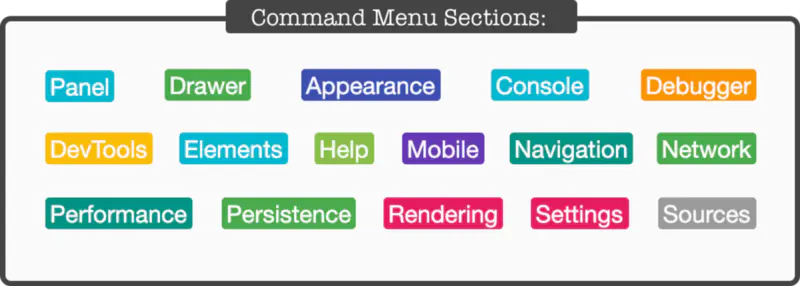
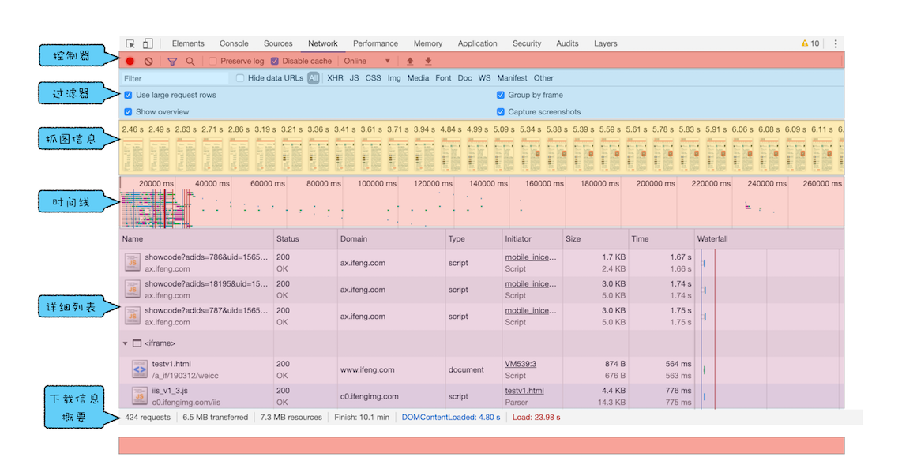
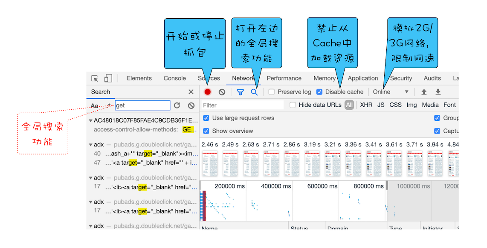
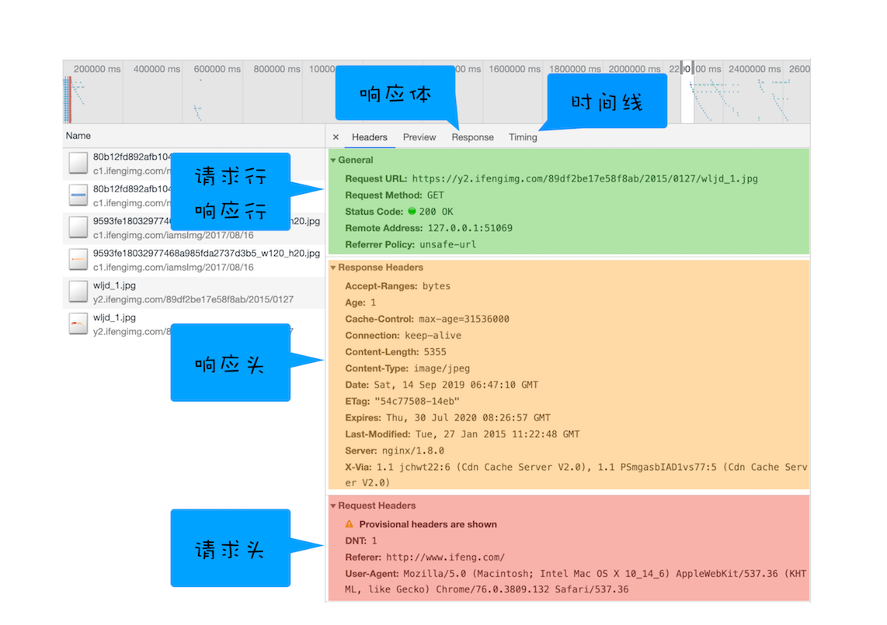
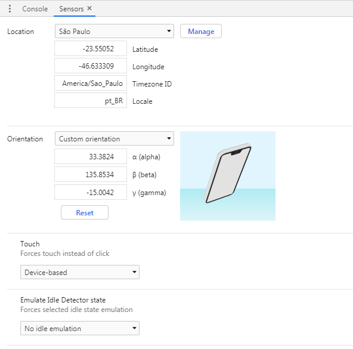
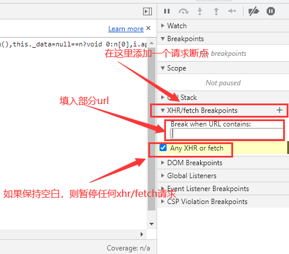
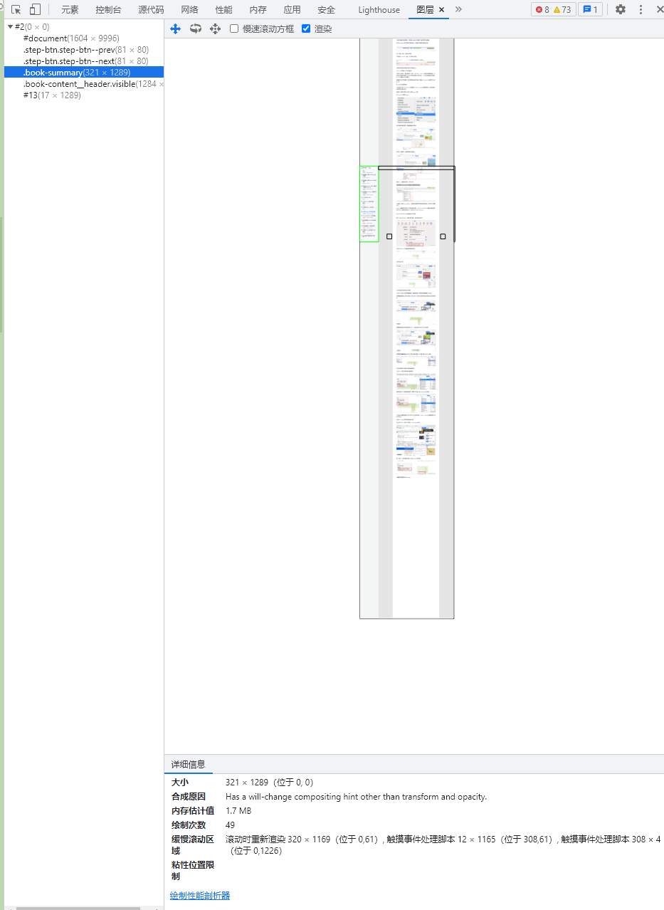

# Chrome DevTools

<!-- @import "[TOC]" {cmd="toc" depthFrom=1 depthTo=6 orderedList=false} -->

<!-- code_chunk_output -->

- [Chrome DevTools](#-chrome-devtools)
  - [一. 简介](#-一-简介)
    - [1.1 标签页](#-11-标签页)
    - [1.2 控制台抽屉栏](#-12-控制台抽屉栏)
  - [二. 通用操作](#-二-通用操作)
    - [2.1 copy(...)](#-21-copy)
    - [2.2 Store Object as global variable（存储为全局变量）](#-22-store-object-as-global-variable存储为全局变量)
    - [2.3. 保存堆栈信息（Save as...）](#-23-保存堆栈信息save-as)
    - [2.4 快捷键](#-24-快捷键)
      - [2.4.1 切换 `DevTools` 窗口的展示布局](#-241-切换-devtools-窗口的展示布局)
      - [2.4.2 切换 `DevTools` 的面板](#-242-切换-devtools-的面板)
      - [2.4.3 递增/递减](#-243-递增递减)
      - [2.4.4 Elements，Console，Sources 和 Network 中的查找](#-244-elementsconsolesources-和-network-中的查找)
      - [2.4.5 使用 Command](#-245-使用-command)
      - [2.4.6 截屏](#-246-截屏)
      - [2.4.7 切换面板布局](#-247-切换面板布局)
    - [2.5 关闭同源安全模式](#-25-关闭同源安全模式)
    - [2.6 log 和 network 保留日志](#-26-log-和-network-保留日志)
    - [2.7 重新发送 `XHR` 的请求](#-27-重新发送-xhr-的请求)
  - [三. Console](#-三-console)
    - [3.1 Console 中的 `$`](#-31-console-中的-)
    - [3.2 异步的 `Console`](#-32-异步的-console)
    - [3.3 Ninja console](#-33-ninja-console)
    - [3.4 自定义格式转换器](#-34-自定义格式转换器)
      - [3.4.1 自定义格式化转换器的应用实践](#-341-自定义格式化转换器的应用实践)
    - [3.5 对象 和 方法](#-35-对象-和-方法)
      - [3.5.1 queryObjects（对象查询）方法](#-351-queryobjects对象查询方法)
      - [3.5.2 monitor（监听函数）方法](#-352-monitor监听函数方法)
      - [3.5.3 monitorEvents（监听事件）方法](#-353-monitorevents监听事件方法)
    - [3.6 Console 类中的各种方法](#-36-console-类中的各种方法)
      - [3.6.1 console.assert](#-361-consoleassert)
      - [3.6.2 增强 log 的阅读体验](#-362-增强-log-的阅读体验)
      - [3.6.3 console.table](#-363-consoletable)
      - [3.6.4 console.dir](#-364-consoledir)
      - [3.6.5 给 logs 加上时间戳](#-365-给-logs-加上时间戳)
      - [3.6.6 检测执行时间](#-366-检测执行时间)
      - [3.6.7 让 `console.log` 基于调用堆栈自动缩进](#-367-让-consolelog-基于调用堆栈自动缩进)
      - [3.6.8 直接在回调中使用 `console.log`](#-368-直接在回调中使用-consolelog)
      - [3.6.9 给 `console.log` 加上 CSS 样式](#-369-给-consolelog-加上-css-样式)
      - [3.6.10 实时表达式](#-3610-实时表达式)
    - [3.7 在控制台快速发起请求](#-37-在控制台快速发起请求)
  - [四. NetWork](#-四-network)
    - [4.1 控制器](#-41-控制器)
    - [4.2 过滤器](#-42-过滤器)
    - [4.3 抓图信息](#-43-抓图信息)
    - [4.4 时间线](#-44-时间线)
    - [4.5 详细列表](#-45-详细列表)
      - [4.5.1 Headers](#-451-headers)
      - [4.5.2 Timing](#-452-timing)
        - [4.5.2.1 优化时间线上耗时项](#-4521-优化时间线上耗时项)
      - [4.5.3 Initiator](#-453-initiator)
    - [4.6 下载信息概要](#-46-下载信息概要)
  - [五. Elements](#-五-elements)
    - [5.1 技巧集合](#-51-技巧集合)
      - [5.1.1 通过 h 键来隐藏元素](#-511-通过-h-键来隐藏元素)
      - [5.1.2 拖动/放置元素](#-512-拖动放置元素)
      - [5.1.3 使用 控制按钮 来移动元素](#-513-使用-控制按钮-来移动元素)
      - [5.1.4 元素面板中类似于基础编辑器的操作](#-514-元素面板中类似于基础编辑器的操作)
      - [5.1.5 Shadow editor 阴影编辑器](#-515-shadow-editor-阴影编辑器)
      - [5.1.6 Timing function editor 定时函数编辑器](#-516-timing-function-editor-定时函数编辑器)
      - [5.1.7 在元素面板中展开所有的子节点](#-517-在元素面板中展开所有的子节点)
      - [5.1.8 添加 `force state`（强制状态）](#-518-添加-force-state强制状态)
      - [5.1.9 DOM 断点](#-519-dom-断点)
      - [5.1.10 元素定位到创建的源码](#-5110-元素定位到创建的源码)
    - [5.2 颜色选择器](#-52-颜色选择器)
      - [5.2.1 只选择正在用的颜色](#-521-只选择正在用的颜色)
      - [5.2.2 直观的选择字体颜色](#-522-直观的选择字体颜色)
  - [六. Drawer](#-六-drawer)
    - [6.1 常识](#-61-常识)
      - [6.1.1 如何打开 Drawer](#-611-如何打开-drawer)
      - [6.1.2 Drawer 设置选项列表](#-612-drawer-设置选项列表)
    - [6.2 Drawer 列表项](#-62-drawer-列表项)
      - [6.2.1 Sensors（控制传感器）](#-621-sensors控制传感器)
      - [6.2.2 模拟网络状态](#-622-模拟网络状态)
      - [6.2.3 快速 Source](#-623-快速-source)
      - [6.2.4 检查代码 coverage](#-624-检查代码-coverage)
      - [6.2.5 检查修改的 CSS 文件](#-625-检查修改的-css-文件)
  - [七. WorkSpaces](#-七-workspaces)
    - [7.1 workspace 技巧](#-71-workspace-技巧)
      - [7.1.1 在 `Chrome` 中修改文件](#-711-在-chrome-中修改文件)
      - [7.1.2 WorkSpace 支持即时样式同步](#-712-workspace-支持即时样式同步)
      - [7.1.3 为新选择器选择目标位置](#-713-为新选择器选择目标位置)
  - [八. Sources](#-八-sources)
    - [8.1 断点和监听列表](#-81-断点和监听列表)
    - [8.1.1 Event Listener 断点](#-811-event-listener-断点)
    - [8.1.2 XHR 提取断点](#-812-xhr-提取断点)
    - [8.2 Page](#-82-page)
      - [8.2.1 代码手动关联 sourcemap](#-821-代码手动关联-sourcemap)
    - [8.3 Snippet](#-83-snippet)
  - [九. Performance](#-九-performance)
    - [9.1 概览面板](#-91-概览面板)
    - [9.2 性能指标面板](#-92-性能指标面板)
      - [9.2.1 性能面板的各项指标](#-921-性能面板的各项指标)
      - [9.2.2 分析任务与过程](#-922-分析任务与过程)
      - [9.2.3 分析页面加载过程](#-923-分析页面加载过程)
      - [9.2.4 Web Vitals](#-924-web-vitals)
    - [9.3 详情面板](#-93-详情面板)
    - [9.4 内存时间轴](#-94-内存时间轴)
    - [9.5 使用 Performace 分析优化性能](#-95-使用-performace-分析优化性能)
  - [十. Layers](#-十-layers)

<!-- /code_chunk_output -->

---

## 一. 简介

**Chrome 开发者工具（简称 DevTools）是一组网页制作和调试的工具，内嵌于 Google Chrome 浏览器中**。如果想使用最新版本，可以使用 [Chrome Canary](https://www.google.com/intl/en/chrome/canary/)。

### 1.1 标签页

**Elements**
: 可以自由操作 DOM 和 CSS 来迭代布局和设计页面。

1. 检查和调整页面
2. 编辑样式
3. 编辑 DOM

**Console**
: 在开发期间，可以记录诊断信息，或者使用它作为 shell 在页面上与 JS 进行交互。

1. 使用控制台面板
2. 命令行交互

**Sources**
: 可以设置断点来调试 JS ，或者通过 Workspaces（工作区）连接本地文件来使用开发者工具的实时编辑器。

1. 断点调试
2. 调试混淆的代码
3. 使用开发者工具的 WorkSpaces 进行保存

**NetWork**
: 了解请求和下载的资源文件并优化网页加载性能。

1. 网络面板基础
2. 资源时间轴
3. 网络带宽限制

**Performance**
: 记录和查看网站生命周期内发生的各种事件和运行时间，了解并优化性能。

1. 记录和查看网站生命周期内发生的各种事件
2. 提高页面的运行时性能

**Memory**
: 用来查看运行过程中 JS 的占用堆内存情况，跟踪是否存在内存泄露情况。

1. 跟踪内存泄漏
2. JS CPU 分析器
3. 内存堆区分析器

**Application**
: 查看 Web 应用的数据存储情况。

1. 检查加载的所有资源
2. IndexedDB 与 Web SQL
3. 本地和会话存储，cookie
4. 应用程序缓存，图像，字体和样式表

**Security**
: 显示当前页面一些基础安全信息。

1. 证书问题
2. 安全相关问题

**Lighthouse**
: 对当前页面进行性能、SEO、PWA、最佳实践、可访问性（accessibility）等方面的分析，并给出优化建议。

**Layers**
: 展示一些渲染过程中分层的基础信息。

### 1.2 控制台抽屉栏

在除了 Console 面板以外的标签页使用 `Esc` 可以打开抽屉栏，固定有 Console 面板。使用左上角的菜单可以打开以下标签页：

- **developer resources**：开发者资源，可以用来看被 Network 过滤掉的 sourcemap 请求。

- **Performance Monitor**：性能监视器，用来实时查看 CPU 使用情况、JS 堆大小、DOM 节点数量等。

- **Network conditions**：用来设置网络状况，有以下四个设置：

  - 是否停用缓存
  - 网络节流模式设置
  - 设置用户代理
  - 接受的 Content-Encoding

## 二. 通用操作

### 2.1 copy(...)

可以通过全局的方法 `copy()` 在 `Console` 里 `copy` 任何能拿到的资源。

### 2.2 Store Object as global variable（存储为全局变量）

在 `console` 中打印了一组数据，然后想对这些数据做一些额外的操作。那就可以将它转换成一个全局变量，只需要 **右击** 它，并选择 “`Store as global variable`”（保存为全局变量） 选项。

第一次使用的话，它会创建一个名为 temp1 的变量，第二次创建 temp2，以此类推。通过使用这些变量来操作对应的数据，不用再担心影响到他们原来的值。

### 2.3. 保存堆栈信息（Save as...）

对于 `Console` 面板上的信息，可以使用**右击**，选择 `Save as...`，把堆栈跟踪的信息保存为一个 `.log` 文件。

### 2.4 快捷键

#### 2.4.1 切换 `DevTools` 窗口的展示布局

快捷键 `Ctrl + Shift + D` 切换 DevTools 的位置

#### 2.4.2 切换 `DevTools` 的面板

快捷键 `Ctrl + [ | ]`，可以从当前面板分别向左向右切换。

#### 2.4.3 递增/递减

使用带修饰符或不带修饰键的 `上/下` 箭头，可以实现递增/递减 `数值` 类型的值。

- `Ctrl`：100
- `Shift`：10
- `Alt`：0.1

#### 2.4.4 Elements，Console，Sources 和 Network 中的查找

`DevTools` 中的前 4 个主要的面板，都支持 `Ctrl + f` 快捷方式，可以使用对应的查询方式来查找信息：

- 在 `Element` 面板中，通过 `string` 和 `XPath` 来查找。

- 在 `Console`，`Network` 以及 `Source` 面板，通过 `区分大小写` 或 `正则表达式`，来查找。

#### 2.4.5 使用 Command

可以使用 `Ctrl + Shift + P` 快捷键启用 Run Command。这个功能可以快速查找所有命令，下图是可供选择的命令列表，分为几个部分：



#### 2.4.6 截屏

当只想对某个 `DOM节点` 截屏时，可以在 `Elements` 界面，选中节点并在右键菜单中选择 `Capture node screenshot`，也可以选中节点后，使用 `Command` 查找命令。

还可以在 `Command` 查找 `Capture full size screenshot` 命令，进行**全页面截屏**。

#### 2.4.7 切换面板布局

Elements 使用双面板模式 `DOM 面板` + `CSS 面板`，它根据屏幕可用的部分自动应用横向或者纵向的排列，以适合阅读的方式展示出来。

打开 `Commands` 菜单并且输入 `layout` ，会看到 2 个可供选择的项（不显示已经激活的选项）：

- Use horizontal panel layout（使用横向面板布局）
- Use vertical panel layout（使用纵向面板布局）
- Use automatic panel layout（使用自动面板布局）

### 2.5 关闭同源安全模式

跨域和同源策略是经常遇见的问题：`No 'Access-Control-Allow-Origin' header is present on the requested resource`。

跨域是仅仅存在浏览器端，为了安全策略而采用的一种方案。如果是仅仅是本地调试的话，完全可以把这个安全策略禁用掉，让所有的跨域限制都放开。

**window 步骤**：

1. 新建一个 chrome 快捷方式，右键 “属性”。
2. “快捷方式” 选项卡里选择 “目标”，添加 `--args --disable-web-security --user-data-dir`

**mac 步骤**：

```sh
open -n /Applications/Google\ Chrome.app/ --args --disable-web-security --ignore-certificate-errors --user-data-dir=/Users/${用户名}/MyChromeDevUserData/
```

### 2.6 log 和 network 保留日志

有一些页面需要去通过查看 log 或者 network 接口去调试需求的同时，代码逻辑中还存在刷新，导致日志被清空。可以利用 chrome 的 preserve log 将所有的日志一直保留下去。

**console 保留日志**：


**Network 保留日志**：


### 2.7 重新发送 `XHR` 的请求

- 使用 `Source` 面板左侧请求列表右键菜单中的 `Replay XHR`
- 使用 `Network` 详情面板右键菜单中的 `Replay XHR`

## 三. Console

### 3.1 Console 中的 `$`

- `$0` 在 Chrome 的 Elements 面板中，是对当前选中的 html 节点的引用。`$1` 是对上一次选择的节点的引用，`$2` 是对在那之前选择的节点的引用，等等。一直到 `$4`。

- 如果没有在页面中定义过 `$` 或 `$$` 变量的话，`$` 在 `Console` 中就是函数 `document.querySelector` 的别名，`$$` 是函数 `document.querySelectorAll` 的别名。

- `$_` 是对上次执行结果的引用

### 3.2 异步的 `Console`

在 `Console` 面板中 `console` 默认被 `async` 包裹

- `Storage` 系统的**占用数** 和**空闲数**

  ```js
  console.table(await navigator.storage.estimate());
  ```

- 媒体能力

  ```js
  let query = { type: 'file', audio: { contentType: 'audio/ogg' } };
  console.table(await navigator.mediaCapabilities.decodingInfo(query));
  ```

### 3.3 Ninja console

- `Conditional breakpoints` 条件断点

  1. 在 `Source` 的 JS 文件中右击行号，选择 `Add conditional breakpoint...（添加条件断点）` 或右击一个已经设置的断点并且选择 `Edit breakpoint（编辑断点）`。
  2. 然后输入一个执行结果为 `true` 或者 `false` 的表达式（它的值其实不需要完全为 true 或者 false）。在这个表达式中可以使用任何这段代码可以获取到的值（当前行的作用域）。
  3. 如果条件成立，这个断点就会暂停代码的执行。

- The Ninja `console`
  得益于条件断点，`console` 也有了新玩法：

  1. 每一个条件都必须经过判断，当应用执行到这一行的时候进行判断并且如果条件返回的是 falsy 的值，它并不会暂停。
  2. 可以直接使用条件判断来将 `console.log/console.table/console.time` 等 "连接" 到 `Source` 面板中。
  3. 它们会一直执行，并且当不再需要它们的时候，在 `断点部分` 会清晰的列出它们，可以轻松移除。

### 3.4 自定义格式转换器

大多数的情况下，习惯使用 `DevTools` 的 `console` 默认对 Object 的转换，但还可以自定义输出对象的函数，它通常被称为 `Custom Formatter`。

> **注意**：在写之前，需要在 `Settings`（或按下 `F1`）中把对应的设置打开。
> 

`formatters` 是一个对象，最多包含三个方法：

- `header`：处理展示在 `Console` 的日志中的头部分
  header 方法返回了一个 JsonML（注：JsonML：JSON Markup Language - JSON 标记语言）数组，由这些组成：

  - 标签名
  - 属性对象
  - 内容（文本值或者其他元素）

- `hasBody`：返回是否显示用来展开对象的 `▶` 箭头

- `body`：定义显示在展开部分的内容。

#### 3.4.1 自定义格式化转换器的应用实践

每当遇到结构不寻常的对象时，或大量的日志（最好避免这样的情况，但是有时候很有用）而想从中做区分时，可以采用 `custom formatter` 来处理。

直接将不关心，不需要区别对待的对象过滤出来，直接在 `header` 方法里面 `return null`。让 `DevTools` 使用默认的格式化方式来处理这些值。自定义格式化转换器的示例：

```js
window.devtoolsFormatters = [
  {
    header(obj) {
      if (!obj.__clown) {
        return null;
      }
      delete obj.__clown;
      const style = `
        color: red;
        border: 2px dotted #ccc;
        border-radius: 5px;
        padding: 5px;
      `;
      const content = `${JSON.stringify(obj, null, 2)}`;

      try {
        return ['div', { style }, content];
      } catch (err) {
        return null; // use the default formatter
      }
    },
    hasBody() {
      return false;
    }
  }
];

console.clown = function (obj) {
  console.log({ ...obj, __clown: true });
};

console.clown({ message: 'hello!' });
```

### 3.5 对象 和 方法

#### 3.5.1 queryObjects（对象查询）方法

`DevTools` 里的 `queryObjects` 函数，可以查询 `特定的时刻 + 特定的执行上下文` 有哪些对象：

```js
new String('example');
queryObjects(String);
```

#### 3.5.2 monitor（监听函数）方法

`monitor` 是 `DevTools` 的一个方法， 它能够 "监听" 到任何 `_function calls（方法的调用）` 中：每当一个 `被监听` 的方法运行的时候，`Console 控制台` 会把它的实例打印出来，包含 `函数名` 以及 `调用它的参数` 。取消监听函数的方法是 `unmonitor`。

在 `Source` 的 `Snippets` 中创建一个类，然后运行：

```js
class Person {
  constructor(name) {
    this.name = name;
  }

  greet() {
    return this.getMessage('greeting', 'tom');
  }

  getMessage(type, js) {
    if (type === 'greeting') {
      return `Hello, I'm ${this.name}!`;
    }
  }
}
```

控制台试验结果：


#### 3.5.3 monitorEvents（监听事件）方法

在上面是监听函数的方法，还可以使用 `monitorEvents` 方法，对 `events` 做同样的事，取消监听事件的方法是 `unmonitorEvents`。

### 3.6 Console 类中的各种方法

#### 3.6.1 console.assert

如果断言为 `false`，则将一个错误消息写入控制台。如果断言是 true，没有任何反应。通过它，可以摆脱累赘的 `if` 表达式，还可以获得堆栈信息。

参数：

- `assertion`：一个布尔表达式。如果 assertion 为假，消息就会被输出到控制台之中
- `obj1, ..., objN`：被用来输出的 JS 对象列表，最后输出的字符串是各个对象依次拼接的结果。
- `msg`：一个包含零个或多个子串的 JS 字符串。
- `subst1, ..., substN`：各个消息作为字串的 JS 对象。这个参数能够控制输出的格式。

```js
console.assert(assertion, obj1 [, obj2, ..., objN]);
console.assert(assertion, msg [, subst1, ..., substN]);
```

#### 3.6.2 增强 log 的阅读体验

`console.log` 可以通过 `{}` 将参数包装，可以将一组数据打印成一个对象，这是 `ECMAScript 2015` 引入的 `enhanced object literal（增强对象文字面量）`。

```js
const name = 'tom';
let date = new Date();
var age = 18;
let isHealthy = true;

console.log({ name, date, age, isHealthy });
```

#### 3.6.3 console.table

如果有一个**数组**（或者是**类数组**的对象，或者就是一个**对象**）需要打印，可以使用 `console.table` 方法将它以一个漂亮的表格的形式打印出来。它不仅会根据数组中包含的对象的所有属性，去计算出表中的列名，而且这些列都可以**缩放**和**排序**。

如果觉得展示的列太多了，还可以使用第二个参数，传入想要展示的列的名字。`console.table` 还可以和 `{}` 的配合。

#### 3.6.4 console.dir

使用 `console.log` 打印元素，会将元素渲染成像是从 `Elements` 中剪切出来的一样。使用 `console.dir` 会将元素打印为这个节点所关联到的 `js对象`。

#### 3.6.5 给 logs 加上时间戳

给打印出来的信息加上时间戳，有两种方法：

1. Settings -> Preferences -> Console 中开启 `Show timestamps`

2. Ctrl + Shift + P 打开 Command，搜索 `timestamps`

#### 3.6.6 检测执行时间

可以使用以下两个 `console` 方法，来检测某段代码的执行时间：

```js
console.time('a'); // 开启一个计时器
console.timeEnd('a'); // 结束计时并且将结果在 console 中打印出来
```

#### 3.6.7 让 `console.log` 基于调用堆栈自动缩进

配合 `Error` 对象的 `stack` 属性，可以让 `log` 可以根据堆栈的调用自动缩进：

```js
function log(message) {
  console.log(
    // 这句话是重点。使用 new 出来的 Error 对象的 stack 信息中的换行符，换行符出现的次数 等同于 它在堆栈调用时的深度。
    '  '.repeat(new Error().stack.match(/\n/g).length - 2) + message
  );
}

function foo() {
  log('foo');
  return bar() + bar();
}

function bar() {
  log('bar');
  return baz() + baz();
}

function baz() {
  log('baz');
  return 17;
}

foo();
```

#### 3.6.8 直接在回调中使用 `console.log`

在确定要将什么传递给回调函数的情况下，可以在回调函数里面添加一个 `console.log` 来检查。有两种方式来实现:

- 在回调方法的内部使用 console.log
- 直接使用 console.log 来作为回调方法。推荐使用这种，因为这不仅减少了输入，还可能在回调中接收多个参数。

```js
function getInput(options, callback) {
  if (typeof callback == 'function') {
    callback(options, 'add');
  }
}
// console.log 是一个函数，可以作为回调函数
getInput([1, 2], console.log); // [1, 2] 'add'
```

#### 3.6.9 给 `console.log` 加上 CSS 样式

如果给打印文本加上 `%c` ，那么 `console.log` 的第二个参数就变成了 CSS 规则：

```js
console.log('%c999', 'color:#f40;font-size:40px');
```

#### 3.6.10 实时表达式

在 `Console` 区域的上方，有一个 "眼睛" 的符号，点击眼睛符号，就可以在那里定义任何 JS 表达式。它会不断更新，所以表达的结果将永远是最新的。支持同时定义多个。

### 3.7 在控制台快速发起请求

联调或修 BUG 的场景，针对同样的请求，有时候需要修改入参重新发起：

1. 选中 Network
2. 点击 Fetch/XHR
3. 选择 Copy as fetch
4. 控制台粘贴代码
5. 修改参数，回车

## 四. NetWork

网络面板由控制器、过滤器、抓图信息、时间线、详细列表和下载信息概要这 6 个区域构成。



### 4.1 控制器



其中有 4 个比较重要的功能：

- 红色圆点的按钮，表示 “开始/暂停抓包”。
- “全局搜索” 按钮，这个功能非常重要，可以在所有下载资源中搜索相关内容，还可以快速定位到某几个想要的文件上。
- Disable cache，即 “禁止从 Cache 中加载资源” 的功能，它在调试 Web 应用的时候非常有用，因为开启了 Cache 会影响到网络性能测试的结果。
- Online 按钮，是 “模拟 2G/3G” 功能，它可以限制带宽，模拟弱网情况下页面的展现情况，然后就可以根据实际展示情况来动态调整策略，以便让 Web 应用更加适用于这些弱网。

### 4.2 过滤器

主要就是起过滤功能。通过过滤器模块来筛选想要的文件类型。过滤器输入框接受字符串或正则表达式，默认过滤 `name` 列。也可以使用它来过滤其他属性。例如：输入 `method:GET`，只保留 `method` 中的 `GET`，最前面加 `-` 表示反过滤。

如果想要显示所有可能的关键字，可以输入 `-` 来触发 intellisense。输入分类后，加个冒号或者按右方向键，会展示出所有的资源分类。

常用的过滤器主要有这些：

- `has-response-header`：过滤响应包含某个 header 的请求
- `method`：根据 GET、POST 等请求方式过滤请求
- `domain`: 根据域名过滤
- `status-code`：过滤响应码是 xxx 的请求，比如 404、500 等
- `larger-than`：过滤大小超过多少的请求，比如 100k，1M
- `mime-type`：过滤某种 mime 类型的请求，比如 png、mp4、json、html 等
- `is`：过滤某种状态的请求，比如 from cache 从缓存拿的，比如 running 还在运行的
- `resource-type`：根据请求分类来过滤，比如 document 文档请求，stylesheet 样式请求、fetch 请求，xhr 请求，preflight 预检请求
- `cookie-name`：过滤带有某个名字的 cookie 的请求

在多个过滤器中间加个空格可以将它们组合过滤。

### 4.3 抓图信息

抓图信息区域，可以用来分析用户等待页面加载时间内所看到的内容，分析用户实际的体验情况。（勾选网络设置面板上的 “Capture screenshots” 可启用屏幕截图）

### 4.4 时间线

时间线，主要用来展示 HTTP、HTTPS、WebSocket 加载的状态和时间的一个关系，用于直观感受页面的加载过程。如果是多条竖线堆叠在一起，那说明这些资源被同时被加载。

### 4.5 详细列表

这个区域是最重要的，它详细记录了每个资源从发起请求到完成请求这中间所有过程的状态，以及最终请求完成的数据信息。通过该列表，就能很容易地去诊断一些网络问题。

如果选中详细列表中的一项，右边就会出现该项的详细信息：

#### 4.5.1 Headers



#### 4.5.2 Timing


时间线面板是表示出下面流程的：


**第一个是 Queuing**，也就是排队的意思，当浏览器发起一个请求的时候，会有很多原因导致该请求不能被立即执行，而是需要排队等待。导致请求处于排队状态的原因有很多：

- 首先，页面中的资源是有优先级的，比如 CSS、HTML、JS 等都是页面中的核心文件，所以优先级最高；而图片、视频、音频这类资源就不是核心资源，优先级就比较低。通常当后者遇到前者时，就需要 “让路”，进入待排队状态。
- 其次，浏览器会为每个域名最多维护 6 个 TCP 连接，如果发起一个 HTTP 请求时，这 6 个 TCP 连接都处于忙碌状态，那么这个请求就会处于排队状态。
- 最后，网络进程在为数据分配磁盘空间时，新的 HTTP 请求也需要短暂地等待磁盘分配结束。

等待排队完成之后，就要进入发起连接的状态了。不过在发起连接之前，还有一些原因可能导致连接过程被推迟，这个推迟就表现在面板中的 **Stalled** 上，它表示停滞的意思。

这里需要额外说明的是，如果使用了代理服务器，还会增加一个 Proxy Negotiation 阶段，也就是代理协商阶段，它表示代理服务器连接协商所用的时间。

接下来，就到了 **Initial connection/SSL** 阶段了，也就是和服务器建立连接的阶段，这包括了建立 TCP 连接所花费的时间；不过如果使用了 HTTPS 协议，那么还需要一个额外的 SSL 握手时间，这个过程主要是用来协商一些加密信息的。

和服务器建立好连接之后，网络进程会准备请求数据，并将其发送给网络，这就是 **Request sent** 阶段。通常这个阶段非常快，因为只需要把浏览器缓冲区的数据发送出去就结束了，并不需要判断服务器是否接收到了，所以这个时间通常不到 1 毫秒。

数据发送出去了，接下来就是等待接收服务器第一个字节的数据，这个阶段称为 **Waiting (TTFB)**，通常也称为 “第一字节时间”。TTFB 是反映服务端响应速度的重要指标，对服务器来说，TTFB 时间越短，就说明服务器响应越快。

接收到第一个字节之后，进入陆续接收完整数据的阶段，也就是 **Content Download** 阶段，这意味着从第一字节时间到接收到全部响应数据所用的时间。

##### 4.5.2.1 优化时间线上耗时项

1. **排队（Queuing）时间过久**

   排队时间过久，大概率是由浏览器为每个域名最多维护 6 个连接导致的。那么基于这个原因，有两种解决方案：

   - **域名分片技术**：将 1 个站点下面的资源放在多个域名下面，比如放到 3 个域名下面，这样就可以同时支持 18 个连接了。
   - **站点升级到 HTTP2**：因为 HTTP2 已经没有每个域名最多维护 6 个 TCP 连接的限制了。

2. **第一字节时间（TTFB）时间过久**

   - **服务器生成页面数据的时间过久**。对于动态网页来说，服务器收到用户打开一个页面的请求时，首先要从数据库中读取该页面需要的数据，然后把这些数据传入到模板中，模板渲染后，再返回给用户。服务器在处理这个数据的过程中，可能某个环节会出问题。
   - **网络的原因**。比如使用了低带宽的服务器，或者用的是电信的服务器，联通的网络用户访问服务器，这样也会拖慢网速。
   - **发送请求头时带上了多余的用户信息**。比如一些不必要的 Cookie 信息，服务器接收到这些 Cookie 信息之后可能需要对每一项都做处理，这样就加大了服务器的处理时长。

   面对第一种服务器的问题，可以想办法去提高服务器的处理速度，比如通过增加各种缓存的技术；针对第二种网络问题，可以使用 CDN 来缓存一些静态文件；至于第三种，在发送请求时就去尽可能地减少一些不必要的 Cookie 数据信息。

3. **Content Download 时间过久**

   如果单个请求的 Content Download 花费了大量时间，有可能是字节数太多的原因导致的。这时候就需要减少文件大小，比如压缩、去掉源码中不必要的注释等方法。

#### 4.5.3 Initiator

在这里可以查看**请求调用堆栈**和**请求启动器链**。点击调用堆栈可以快速定位到对应代码。

### 4.6 下载信息概要

下载信息概要中，要重点关注以下两个事件，以及这两个事件的**完成时间**：

- **DOMContentLoaded**：这个事件发生后，说明页面已经构建好 DOM 了，这意味着构建 DOM 所需要的 HTML 文件、JS 文件、CSS 文件都已经下载完成了。
- **Load**：说明浏览器已经加载了所有的资源（图像、样式表等）。

## 五. Elements

### 5.1 技巧集合

#### 5.1.1 通过 h 键来隐藏元素

在元素面板中选择元素后，按一下 “h” 就可以隐藏，再次按下 “h” 可以使它出现。

#### 5.1.2 拖动/放置元素

当想看页面的某一部分在 `DOM` 树的不同位置的显示效果时，只需要拖动放置它（到指定的位置）。

#### 5.1.3 使用 控制按钮 来移动元素

如果只是想移动当前选中的元素，在 `DOM` 结构中往上挪一点或者往下挪一点，可以使用`[Ctrl]` + `[⬆]` / `[Ctrl]` + `[⬇]`。

#### 5.1.4 元素面板中类似于基础编辑器的操作

可以在元素面板中拖动，放置，编辑，复制、粘贴，使用 `[Ctrl]` + `[Z]` / `[Ctrl]` + `[Y]` 来撤销或恢复上一步操作。

#### 5.1.5 Shadow editor 阴影编辑器

可以在 `Styles` 面板中点击在 `box-shadow` 属性或者 `text-shadow` 属性左边的 `阴影方形符号` 来打开它。

#### 5.1.6 Timing function editor 定时函数编辑器

也称为 `Cubic bezier（贝塞尔）` 编辑器。贝塞尔曲线是一串用来定义 `CSS` 的动画速度在整个动画过程中如何变化的 `数值` 。将其定义为 `transition-timing-function` 或者 `animation-timing-function` CSS 属性。

可以直接点击这两个属性（或者他们的简写形式: `transition`，`animation`）边上的曲线符号。

> **注意**：如果 `timing` 函数的值没有设置在这个简写的形式中，这个符号不会显示出来，可以点击左边的小箭头来找到 `Cubic bezier（贝塞尔）` 编辑器。

#### 5.1.7 在元素面板中展开所有的子节点

可以使用右击节点后的 `expand recursively` 命令来展开所有的子节点。

#### 5.1.8 添加 `force state`（强制状态）

使用右击节点后使用 `force state`，可以对相应的节点强制添加状态：

> :hover :active :focus :visited :focus-within :focus-visible

#### 5.1.9 DOM 断点

有时脚本修改了 `DOM`，想知道修改的是哪部分，什么时候修改的？可以添加一个 `DOM` 断点，监听节点被添加或移除/属性被改变：

1. 点击 "..." 符号或者右击想添加监听的元素。

2. 在 `Break on` 中选择：

   - `subtree modifications`：监听任何它内部的节点被*移除*或者*添加*的事件。

   - `attribute modifications`：监听任何当前选中的节点被*添加*、*移除*或*被修改值*的事件。

   - `node removal`：监听被选中的元素被*移除*的事件。

页面重新加载时会记住断点。断点在 `Elements` 视图中有视觉提示，也在 `Elements` 右边的 `DOM Breakpoints` 有列表形式的显示。

#### 5.1.10 元素定位到创建的源码

这个功能是实验性的，需要手动开启下：在 settings 的 experiments 功能里，勾选 “Capture node creation stacks”。

开启后点击堆栈轨迹（Stack Trace），就会展示出元素创建流程的调用栈。这可以帮助理清前端框架的运行流程。

### 5.2 颜色选择器

#### 5.2.1 只选择正在用的颜色

点击颜色选择器中的颜色列表的右上角，可以切换以下四种调色盘：

1. 一个有色调变化的 `Material` 调色板
2. 自定义，可以添加和删除颜色
3. 从 `CSS Variables` 中选择一个当前页面使用的样式表中存在的颜色。
4. 页面 `CSS` 中使用的所有颜色

#### 5.2.2 直观的选择字体颜色

打开一个文本的调色选择器（是 `color` 属性， 而不是 `background-color`）会看到 `“Contrast ratio（对比度）”` 部分。它显示了**文本的颜色**与**开发者工具认为这段文本应该有的背景颜色**之间的对比度。如果这个数值很高，那么文本相对于背景来说，更显而易见，但如果这个值接近 `1` ，那么文本的颜色几乎不能从背景色中区分。

- 在数字边上的 “🚫” 意味着对比度太低了。
- 一个 “✅” 意味着这个颜色遵从 [Web Content Accessibility Guidelines (WCAG) 2.0](https://www.w3.org/TR/UNDERSTANDING-WCAG20/conformance.html) 的 **AA** 声明，这意味着对比值至少为 `3`。
- “✅ ✅” 意味着满足了 **AAA** 声明。

还可以在 `对比度` 部分用 `吸管` 选择一个不同的颜色作为背景颜色进行对比，对应的 `color spectrum（色谱）` 部分会显示一个对比的边界线：如果背景颜色比这条线上面的颜色更深，代表兼容 AA ，如果背景颜色比这条线上面的更亮，需要在这条线的下面选择一个颜色。

## 六. Drawer

### 6.1 常识

#### 6.1.1 如何打开 Drawer

在 `DevTools`（任何选项卡）中时，可以按 `[esc]` 来显隐它。默认情况下，会看到一个 `Console` 选项卡。与主面板的 `Console` 完全相同。

#### 6.1.2 Drawer 设置选项列表

`Drawer` 里隐藏着许多其他功能，大多数时候不需要用到它们。点击主页面在 `Drawer` 的 `Console` 面板前面的 `⋮` 图标来打开完整选项列表。还可以打开 `command Menu` ，然后输入 `Drawer` 来打开。

### 6.2 Drawer 列表项

#### 6.2.1 Sensors（控制传感器）

如果在应用中使用一些获取位置信息的 `API` 而且想要测试一下它。

`Drawer` 里的 `Sensors（传感器）` 面板可以模拟特定的位置：支持从预定义的位置中进行选择，添加位置，或者手动键入纬度/经度。选定的值将被 `navigator.geolocation.watchPosition`（或 `getCurrentPosition` ）报告。

```js
navigator.geolocation.watchPosition(console.log);
```

如果 `App` 有使用加速计，传感器面板也可以模拟设备在 3D 空间中的位置。



#### 6.2.2 模拟网络状态

就像伪造位置一样，可以使用 `Drawer` 里的 `Network conditions` 面板模拟特定的网络行为：模拟互联网为典型的 3G 网络甚至离线！这通常用来了解页面资源的大小。或者测试应用的离线功能。除此之外，`Network conditions` 面板还可以模拟特定的用户代理。

#### 6.2.3 快速 Source

`Quick Source` 可以 `快速查看代码` 和 `设置断点`，如果断点被触发，它不会显示在 `drawer` 的 `Quick sources` 中，而是显示在主 `Source` 中。是一个快速工具。

#### 6.2.4 检查代码 coverage

使用 `coverage` 面板可以跟踪当前加载的 `JS` 和 `CSS` 文件的 `哪些行正在被执行` ，并显示 `已使用与未使用字节的百分比`。它用 `灰蓝` 的线条标记 `运行` 和用 `红色` 的线条标记 `未运行`。

#### 6.2.5 检查修改的 CSS 文件

使用 `Drawer` 中的 `Changes` 可以将 `通过浏览器更改的CSS文件内容` 与 `最初加载的样式表` 进行比较。

> **注意**：只能比较 CSS 文件的内容，不能比较直接添加在节点上的 CSS 属性。

## 七. WorkSpaces

### 7.1 workspace 技巧

#### 7.1.1 在 `Chrome` 中修改文件

可以将项目的文件夹直接拖到 `Source` 面板，`DevTools` 会将做出的修改同步到系统的文件中。

#### 7.1.2 WorkSpace 支持即时样式同步

在设置好了 `DevTools workspace`，就可以在 `Sources` 面板中编辑 `HTML` 和 `JS`（或 `TS`，需要有 `sourcemaps`）文件，按 `ctrl` + `s` 后它将被保存在文件系统中。

在样式方面它提供了更好的支持。因为即使只是在元素面板的样式部分中编辑样式规则，它也会**立即同步**。在文件系统更改保存后也会直接显示到浏览器上。

#### 7.1.3 为新选择器选择目标位置

当使用工作区时，在 `Elements` 的 `Styles` 面板添加新样式规则的默认定位为 - `"inspector-stylesheet：1"`，如果不想规则在这个文件添加，只需按住 `New Style Rule` 按钮，就可以看到一个列出所有 `CSS` 文件的选项。选择目的地，新规则就会保存在那里。

## 八. Sources

### 8.1 断点和监听列表

### 8.1.1 Event Listener 断点

打开 sources 面板，就可以找到事件断点，有各种类型的事件：


### 8.1.2 XHR 提取断点

对网络请求进行捕获可以使用 `XHR/fetch breakpoint`：



### 8.2 Page

#### 8.2.1 代码手动关联 sourcemap

打开文件，选择右键菜单的添加来源映射（add source map），输入 sourcemap 的 url 就可以关联上 sourcemap，当调试线上代码的时候可以用这种方式关联源码。

```text
http://192.168.78.179:7878/dist/index.js.map
```

### 8.3 Snippet

`Sources` 中的 `Snippets`，可以创建保存 `代码段`，方便复用。


使用方式有三种：

- 在代码段内使用 `Ctrl + Enter` 快速使用
- 点击代码段右下角三角运行按钮
- 使用 `Ctrl + P` 打开命令菜单，输入 `!`，根据名称来筛选运行代码段。

## 九. Performance

Performance 用于记录和分析应用在运行时的所有活动。**它呈现的数据具有实时性、多维度的特点**，可以很好地定位性能问题。它非常强大，因为它提供了非常多的运行时数据，利用这些数据就可以分析出来 Web 应用的瓶颈。但是要完全学会其使用方式却是非常有难度的，其难点在于这些数据涉及到了特别多的概念，而这些概念又和浏览器的系统架构、消息循环机制、渲染流水线等知识紧密联系在了一起。

Performance 可以记录站点在运行过程中的性能数据，有了这些性能数据，就可以回放整个页面的执行过程，这样就方便来定位和诊断每个时间段内页面的运行情况，从而有效帮助找出页面的性能瓶颈。Performance 不会给出性能得分，也不会给出优化建议，它只是单纯地采集性能数据，并将采集到的数据按照时间线的方式来展现。


- 当选中图中所标示的实心圆按钮，Performance 会开始记录后续的交互操作。
- 当选中圆箭头按钮，Performance 会将页面重新加载，计算加载过程中的性能表现。

> 使用 Performance 工具时，为了规避其它 Chrome 插件对页面的性能影响，最好在无痕模式下打开页面。


从上到下，依次为**概览面板**、**性能指标面板**、**详情面板**。

要熟练掌握这三个面板，需要先明白时间线的概念，这是因为概览面板和性能指标面板都依赖于时间线。Performance 按照时间的顺序来记录每个时间节点的性能数据，然后再按照时间顺序来展示这些性能数据，那么展示的时候就必然要引入时间线了。比如上图中录制了 10000 毫秒，那么它的时间线长度也就是 10000 毫秒，体现在上图中就是概览面板最上面那条线。

### 9.1 概览面板

Performance 会将 CPU 资源消耗、网络请求流量、屏幕截图等，按照时间顺序做成图表的形式展现出来，这就是概览面板。

右边有两个指标：

- **CPU**

  表示 CPU 的使用情况，不同的颜色片段代表着消耗 CPU 资源的不同事件类型。这部分的图像和详情面板中的 Summary 内容有对应。如果 CPU 图形占用面积太大，CPU 使用率过高，那么就有可能因为某个 JS 占用太多的主线程时间，从而影响其他任务的执行。

- **网络**

  表示请求的时间，和 Network 有对应。

可以使用鼠标选择某个区域或滚轮放大缩小，来查看指定时间段内的性能指标。

### 9.2 性能指标面板

通常，通过概览面板来定位到可能存在问题的时间节点，接下来需要更进一步的数据，这就需要引入性能面板了。

在性能面板中，记录了非常多的性能指标项，比如 Main 指标记录渲染主线程的任务执行过程，Compositor 指标记录了合成线程的任务执行过程，GPU 指标记录了 GPU 进程主线程的任务执行过程。有了这些详细的性能数据，就可以帮助轻松地定位到页面的性能问题。


性能指标面板面板还展示加载过程中的几个关键时间节点，如 FP、FCP、LCP、DCL、Onload 等事件产生的时间点。这些关键时间点体现在了几条不同颜色的竖线上。

- `FCP`（First Contentful Paint）：它表示的是页面上呈现第一个 DOM 元素的时间。在此之前，页面都是白屏的状态。
- `TTI`（Time to interactive）：页面可以开始交互的时间。
- `LCP`（Largest Contentful Paint）：这是页面视口上最大的图片或者文本块渲染的时间，在这个时间，用户能看到渲染基本完成后的首页，这也是用户体验里非常重要的一个指标。

#### 9.2.1 性能面板的各项指标

性能面板，它主要用来展现特定时间段内的多种性能指标数据。那么要分析这些指标数据，就要明白这些指标数据的含义，不过理解它们，需要掌握渲染流水线、浏览器进程架构、导航流程等知识点。

因为浏览器的渲染机制过于复杂，所以渲染模块在执行渲染的过程中会被划分为很多子阶段，输入的 HTML 数据经过这些子阶段，最后输出屏幕上的像素，把这样的一个处理流程叫做**渲染流水线**。一条完整的渲染流水线包括了解析 HTML 文件生成 DOM、解析 CSS 生成 CSSOM、执行 JS、样式计算、构造布局树、准备绘制列表、光栅化、合成、显示等一系列操作。

渲染流水线主要是在渲染进程中执行的，在执行渲染流水线的过程中，渲染进程又需要网络进程、浏览器进程、GPU 等进程配合，才能完成如此复杂的任务。另外在渲染进程内部，又有很多线程来相互配合。具体的工作方式可以参考下图：


看下图的左边，可以看到它是由很多性能指标项组成的：


- `Main`

  Main 指标是**最重要**的，它记录了渲染进程的主线程的任务执行记录，在 Performace 录制期间，在渲染主线程上执行的所有记录都可以通过 Main 指标来查看：

  

  观察上图，一段段横条代表执行一个个任务，长度越长，花费的时间越多；竖向代表该任务的执行记录。主线程上跑了特别多的任务，诸如渲染流水线的大部分流程，JS 执行、V8 的垃圾回收、定时器设置的回调任务等等，因此 Main 指标的内容非常多，而且非常重要，所以在使用 Performance 的时候，大部分时间都是在分析 Main 的 Event Loop，每个 Task 的耗时、调用栈等信息。

  展示的信息中很多种颜色，这些颜色代表着不同的含义：**灰色**代表宏任务，**蓝色**的是 html 的 parse，**橙色**的是浏览器内部的 JS。**紫色**是样式的 reflow、repaint，**绿色**的部分就是渲染，其余的颜色都是用户 JS 的执行了，那些可以不用区分。

  在 Main 中超过 50ms 就被任务是会被标红成为长任务，是性能优化的主要目标。

- `Compositor`

  通过渲染流水线，知道了渲染主线程在生成层树（LayerTree）之后，然后根据层树生成每一层的绘制列表，把这个过程称为绘制（Paint）。在绘制阶段结束之后，渲染主线程会将这些绘列表制提交（commit）给合成线程，并由合成线程合成出来漂亮的页面。

  因此，监控合成线程的任务执行记录也相对比较重要，所以 Chrome 又在性能面板中引入了 Compositor 指标，也就是合成线程的任务执行记录。

- `Raster` 和 `GPU` 指标

  在合成线程执行任务的过程中，还需要 GPU 进程的配合来生成位图，把这个 GPU 生成位图的过程称为**光栅化**。如果合成线程直接和 GPU 进程进行通信，那么势必会阻塞后面的合成任务，因此合成线程又维护了一个光栅化线程池（Raster），用来让 GPU 执行光栅化的任务。

  因为光栅化线程池和 GPU 进程中的任务执行也会影响到页面的性能，所以性能面板也添加了这两个指标。因为 Raster 是线程池，所以点开 Raster 项，可以看到它维护了多个线程。

- `Chrome_ChildIOThread`

  渲染进程中除了有主线程、合成线程、光栅化线程池之外，还维护了一个 [IO 线程](/frontend/浏览器/浏览器工作原理与实践/浏览器工作原理与实践.md#51-消息队列和事件循环)。该 IO 线程主要用来接收用户输入事件、网络事件、设备相关等事件，如果事件需要渲染主线程来处理，那么 IO 线程还会将这些事件转发给渲染主线程。在性能面板上，Chrome_ChildIOThread 指标对应的就是 IO 线程的任务记录。

- `Network`：网络记录展示了页面中的每个网络请求所消耗的时长，并以瀑布流的形式展现。这块内容和网络面板的瀑布流类似，之所以放在性能面板中是为了方便和其他指标对照分析。

- `Timings`：用来记录一些关键的时间节点在何时产生的数据信息，诸如 FP、FCP、LCP 等。

- `Frames`：也就是浏览器生成每帧的记录，页面所展现出来的画面都是由渲染进程一帧一帧渲染出来的，帧记录就是用来记录渲染进程生成所有帧信息，包括了渲染出每帧的时长、每帧的图层构造等信息，可以点击对应的帧，然后在详细信息面板里面查看具体信息。

- `Interactions`：用来记录用户交互操作，比如点击鼠标、输入文字等交互信息。

#### 9.2.2 分析任务与过程

渲染进程中维护了消息队列，SetTimeout 设置的回调函数，鼠标点击的消息事件，都会以任务的形式添加消息队列中，然后任务调度器会按照一定规则从消息队列中取出合适的任务，并让其在渲染主线程上执行。而 Main 指标就记录渲染主线上所执行的全部任务，以及每个任务的详细执行过程。录制加载阶段任务执行记录，然后关注 Main 指标，如下图所示：


观察上图，图最上方有一段一段灰色横条，**每个灰色横条就对应了一个宏任务，灰色长条的长度对应了任务的执行时长**。通常，渲染主线程上的任务都是比较复杂的，如果只单纯记录任务执行的时长，那么依然很难定位问题，因此，还需要将任务执行过程中的一些关键的细节记录下来，这些细节就是任务的过程，灰线下面的横条就是一个个过程，同样这些横条的长度就代表这些过程执行的时长。

可以把宏任务看成是一个 Task 函数，在执行 Task 函数的过程中，它会调用一系列的子函数，这些子函数就是过程。来分析下面这个宏任务的图形：


观察上面这个任务记录的图形，可以把该图形看成是下面 Task 函数的执行过程：

```js
function A() {
  A1();
  A2();
}
function Task() {
  A();
  B();
}
Task();
```

结合代码和上面的图形，可以得出以下信息：

1. Task 任务会首先调用 A 过程
2. 随后 A 过程又依次调用了 A1 和 A2 过程，然后 A 过程执行完毕
3. 随后 Task 任务又执行了 B 过程
4. B 过程执行结束，Task 任务执行完成

从图中可以看出，A 过程执行时间最长，所以在 A1 过程时，拉长了整个任务的执行时长。

#### 9.2.3 分析页面加载过程

可以结合 Main 指标来分析页面的加载过程。先来分析一个简单的页面：

```html
<html>
  <head>
    <title>Main</title>
    <style>
      .area {
        border: 2px ridge;
      }

      .box {
        background-color: rgba(106, 24, 238, 0.26);
        height: 5em;
        margin: 1em;
        width: 5em;
      }
    </style>
  </head>

  <body>
    <div class="area">
      <div class="box rAF"></div>
    </div>
    <br />
    <script>
      function setNewArea() {
        let el = document.createElement('div');
        el.setAttribute('class', 'area');
        el.innerHTML = '<div class="box rAF"></div>';
        document.body.append(el);
      }
      setNewArea();
    </script>
  </body>
</html>
```

这段代码，它只是包含了一段 CSS 样式和一段 JS 内嵌代码，其中在 JS 中还执行了 DOM 操作了，结合这段代码来分析页面的加载流程。其中一些关键的任务和其执行过程，如下图所示：


通过上面的图形可以看出，加载过程主要分为三个阶段，分别是：

1. **导航阶段**

   该阶段主要是从网络进程接收 HTML 响应头和 HTML 响应体。大致流程如下：

   1. 当点击了 Performance 上的重新录制按钮之后，浏览器进程会通知网络进程去请求对应的 URL 资源。
   2. 一旦网络进程从服务器接收到 URL 的响应头，便立即判断该响应头中的 content-type 字段是否属于 text/html 类型。
   3. 如果是，那么浏览器进程会让当前的页面执行退出前的清理操作，比如执行 JS 中的 beforeunload 事件。
   4. 清理操作执行结束之后就准备显示新页面了，这包括了解析、布局、合成、显示等一系列操作。因此，在导航阶段，这些任务实际上是在老页面的渲染主线程上执行的。

   接着来分析第一个阶段的任务图形，最终效果如下图所示：

   

   当点击重新加载按钮后，当前的页面会执行上图中的这个任务：

   1. 该任务的第一个子过程就是 Send request，该过程表示网络请求已被发送。然后该任务进入了等待状态。
   2. 接着由网络进程负责下载资源，当接收到响应头的时候，该任务便执行 Receive Respone 过程，该过程表示接收到 HTTP 的响应头了。
   3. 接着执行 DOM 事件：pagehide、visibilitychange 和 unload 等事件，如果注册了这些事件的回调函数，那么这些回调函数会依次在该任务中被调用。
   4. 这些事件被处理完成之后，那么接下来就接收 HTML 数据了，这体现在了 Receive Data 过程，Receive Data 过程表示请求的数据已被接收，如果 HTML 数据过多，会存在多个 Receive Data 过程。
   5. 等到所有的数据都接收完成之后，渲染进程会触发另外一个任务，该任务主要执行 Finish load 过程，该过程表示网络请求已经完成。

2. **解析 HTML 数据阶段**

   这个阶段的主要任务就是通过解析接收到的 HTML、CSS 数据，然后执行 JS 来生成 DOM 和 CSSOM。那么下面继续来分析这个阶段的图形：

   

   观察上图这个图形，可以看出，其中一个主要的过程是 HTMLParser，顾名思义，这个过程是用来解析 HTML 文件，解析的就是上个阶段接收到的 HTML 数据：

   1. 在 ParserHTML 的过程中，如果解析到了 script 标签，那么便进入了脚本执行过程，也就是图中的 Evalute Script。
   2. 要执行一段脚本需要首先编译该脚本，于是在 Evalute Script 过程中，先进入了脚本编译过程，也就是图中的 Complie Script。脚本编译好之后，就进入程序执行过程，执行全局代码时，V8 会先构造一个 anonymous 过程，在执行 anonymous 过程中，会调用 setNewArea 过程，setNewArea 过程中又调用了 createElement，由于之后调用了 document.append 方法，该方法会触发 DOM 内容的修改，所以又强制执行了 ParserHTML 过程生成的新的 DOM。
   3. DOM 生成完成之后，会触发相关的 DOM 事件，比如典型的 DOMContentLoaded，还有 readyStateChanged。
   4. DOM 生成之后，ParserHTML 过程继续计算样式表，也就是 Recalculate Style，这就是生成 CSSOM 的过程，关于 Recalculate Style 过程，可以参考[渲染流程](/frontend/浏览器/浏览器工作原理与实践/浏览器工作原理与实践.md#25-渲染流程)，到了这里一个完整的 ParserHTML 任务就执行结束了。

3. **生成可显示的位图阶段**

   该阶段主要是利用 DOM 和 CSSOM，经过计算布局、生成层树（LayerTree）、生成绘制列表（Paint）、完成合成等操作，生成最终的图片。

   

   结合上图，可以发现，在生成完了 DOM 和 CSSOM 之后，渲染主线程首先执行了一些 DOM 事件，诸如 readyStateChange、load、pageshow。具体地讲，如果使用 JS 监听了这些事件，那么这些监听的函数会被渲染主线程依次调用。接下来就正式进入显示流程了，大致过程如下所示。

   1. 首先执行布局，这个过程对应图中的 Layout。
   2. 然后更新层树（LayerTree），这个过程对应图中的 Update LayerTree。
   3. 有了层树之后，就需要为层树中的每一层准备绘制列表了，这个过程就称为 Paint。
   4. 准备每层的绘制列表之后，就需要利用绘制列表来生成相应图层的位图了，这个过程对应图中的 Composite Layers。

   走到了 Composite Layers 这步，主线程的任务就完成了，接下来主线程会将合成的任务完全交给合成线程来执行，下面是具体的过程，也可以对照着 Composite、Raster 和 GPU 这三个指标来分析，参考下图：

   

   结合渲染流水线和上图，再来梳理下最终图像是怎么显示出来的：

   1. 首先主线程执行到 Composite Layers 过程之后，便会将绘制列表等信息提交给合成线程，合成线程的执行记录可以通过 Compositor 指标来查看。
   2. 合成线程维护了一个 Raster 线程池，线程池中的每个线程称为 Rasterize，用来执行光栅化操作，对应的任务就是 Rasterize Paint。
   3. 当然光栅化操作并不是在 Rasterize 线程中直接执行的，而是在 GPU 进程中执行的，因此 Rasterize 线程需要和 GPU 线程保持通信。
   4. 然后 GPU 生成图像，最终这些图层会被提交给浏览器进程，浏览器进程将其合成并最终显示在页面上。

#### 9.2.4 Web Vitals

### 9.3 详情面板

通过性能面板只能得到一个大致的信息，如果想要查看这些记录的详细信息，就需要引入详情面板了。可以通过在性能面板中选中性能指标中的任何历史数据，然后选中记录的细节信息就会展现在详情面板中了。

可以去 Google 的官方网站查看 Performance 的一些[基础使用信息](https://developer.chrome.com/docs/devtools/evaluate-performance/reference/)。

### 9.4 内存时间轴

在顶部可以启用内存时间轴，可以查看 JS 堆内存使用情况、文档数量、节点数量、监听器数量、GPU 使用情况。


### 9.5 使用 Performace 分析优化性能

```html
<!doctype html>
<html lang="en">
  <head>
    <meta charset="UTF-8" />
    <title>worker performance optimization</title>
  </head>
  <body>
    <script>
      function a() {
        b();
      }
      function b() {
        let total = 0;
        for (let i = 0; i < 10 * 10000 * 10000; i++) {
          total += i;
        }
        console.log('b:', total);
      }

      a();
    </script>
    <script>
      function c() {
        d();
      }
      function d() {
        let total = 0;
        for (let i = 0; i < 1 * 10000 * 10000; i++) {
          total += i;
        }
        console.log('c:', total);
      }
      c();
    </script>
  </body>
</html>
```

**分析**
两个 script 标签是两个宏任务，第一个宏任务的调用栈是 a、b，第二个宏任务的调用栈是 c、d。

首先用无痕模式打开 chrome，无痕模式下没有插件，分析性能不会受插件影响。打开 Performance，点击 reload 按钮，会重新加载页面并开始记录耗时，过几秒点击结束：


主线程是不断执行 Event Loop 的，可以看到有两个 Task（宏任务），调用栈分别是 a、b 和 c、d。点击某个宏任务，在详情面板会显示调用栈的详情（选择 bottom-up 是列表展示， call tree 是树形展示）：


每个函数的耗时都显示在左侧，右侧有源码地址，点击就可以跳到 Sources 对应的代码。


分析下代码哪里有性能问题：很明显， b 和 d 两个函数的循环累加耗时太高了。

在 Performance 中也可以看到 Task 被标红了，下面的 summary 面板也显示了 long task 的警告。

> **因为渲染和 JS 执行都在主线程，在一个 Event Loop 中，会相互阻塞，如果 JS 有长时间执行的 Task，就会阻塞渲染，导致页面卡顿。所以，性能分析主要的目的是找到 long task，之后消除它**。

**优化**
像上面这种耗时计算可以用 web worker 进行优化。

封装一个函数，传入 url 和数字，函数会创建一个 worker 线程，通过 postMessage 传递 num 过去，并且监听 message 事件来接收返回的数据。

```js
function runWorker(url, num) {
  return new Promise((resolve, reject) => {
    const worker = new Worker(url);
    worker.postMessage(num);
    worker.addEventListener('message', function (evt) {
      resolve(evt.data);
    });
    worker.onerror = reject;
  });
}
```

然后 b 和 c 函数就可以改成这样了：

```js
function b() {
  runWorker('./worker.js', 10 * 10000 * 10000).then((res) => {
    console.log('b:', res);
  });
}
```

耗时逻辑移到了 worker 线程：

```js
addEventListener('message', function (evt) {
  let total = 0;
  let num = evt.data;
  for (let i = 0; i < num; i++) {
    total += i;
  }
  postMessage(total);
});
```


long task 都没有了，然后还会发现 Main 线程下面多了两个 Worker 线程：


这样，通过把计算量拆分到 worker 线程，充分利用了多核 cpu 的能力，解决了主线程的 long task 问题，界面交互会很流畅。

## 十. Layers

可以在 more tool 里打开 Layers。在这里可以看到所有的图层。选中某一个图层后，会展示图层的详细信息：



选中左侧的图层，可以在下方的详细信息看到具体的图层大小、合成原因、内存估计、绘制次数等。

点击下面的绘制图层剖析器（Paint Profiler）可以看到这个图层绘制的过程：


会看到一些类似 canvas 的 api，这就是浏览器实现网页渲染的底层流程。

Layers 工具最有用的是可以分析图层创建的原因，不过 Chrome DevTools 里图层创建的原因做的不大好，可以使用 Safari DevTools 的 Layers。
