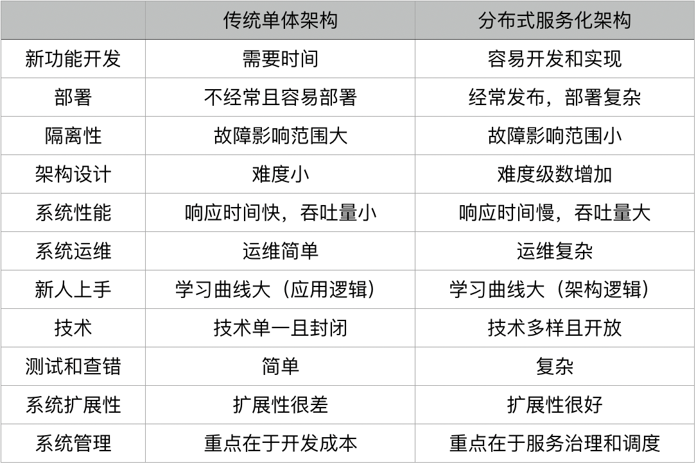
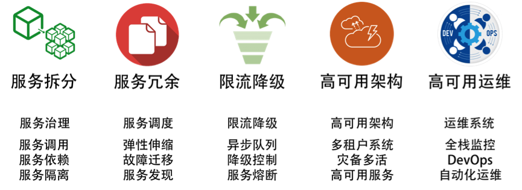
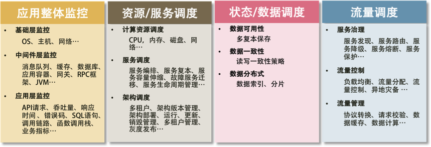
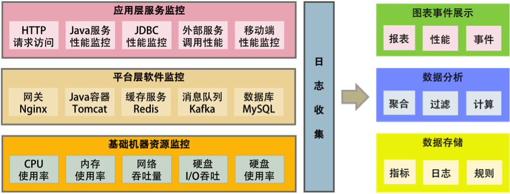
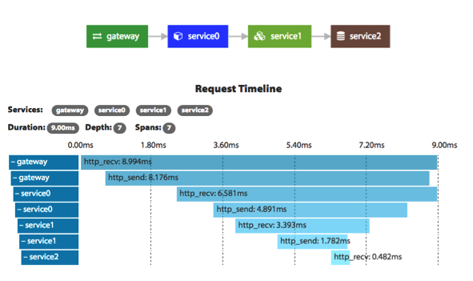
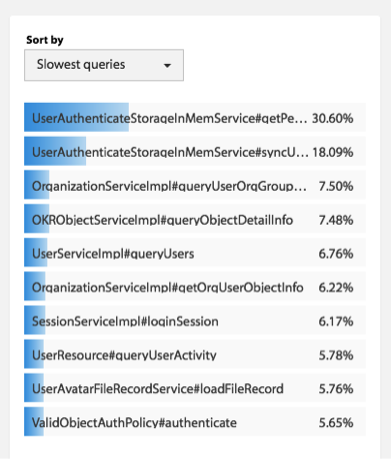
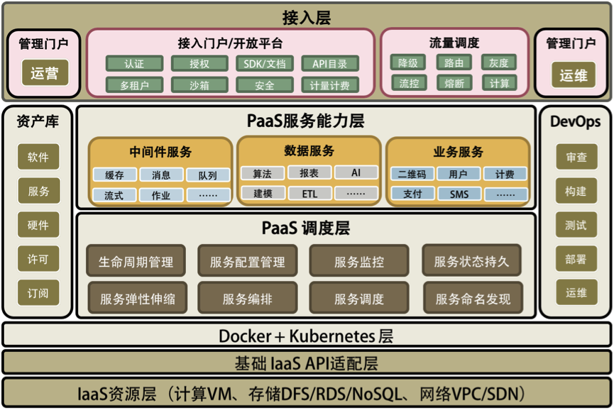
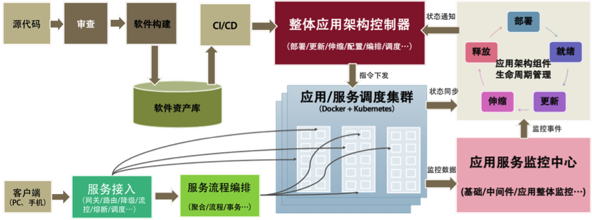

# 工作学习要点

<!-- @import "[TOC]" {cmd="toc" depthFrom=1 depthTo=6 orderedList=false} -->

<!-- code_chunk_output -->

- [工作学习要点](#工作学习要点)
  - [一. 工作](#一-工作)
    - [1.1 技术变现](#11-技术变现)
    - [1.2 时间管理](#12-时间管理)
      - [1.2.1 主动管理](#121-主动管理)
      - [1.2.2 学会说不](#122-学会说不)
      - [1.2.3 利用好自己的时间](#123-利用好自己的时间)
    - [1.3 团队协同工作](#13-团队协同工作)
  - [二. 学习](#二-学习)
    - [2.1 要点](#21-要点)
      - [2.1.1 必读书籍](#211-必读书籍)
    - [2.2 技术领导力](#22-技术领导力)
      - [2.2.1 扎实的基础技术](#221-扎实的基础技术)
      - [2.2.2 提高学习能力](#222-提高学习能力)
      - [2.2.3 坚持做正确的事](#223-坚持做正确的事)
      - [2.2.4 不断提高对自己的要求标准](#224-不断提高对自己的要求标准)
  - [三. 技术](#三-技术)
    - [3.1 编程语言](#31-编程语言)
      - [3.1.1 Go](#311-go)
      - [3.1.2 技术发展要素](#312-技术发展要素)
      - [3.1.3 异常捕捉处理](#313-异常捕捉处理)
        - [3.1.3.1 JS 异步编程的错误处理](#3131-js-异步编程的错误处理)
        - [3.1.3.2 Java 异步编程的 Promise 模式](#3132-java-异步编程的-promise-模式)
        - [3.1.3.3 错误处理的最佳实践](#3133-错误处理的最佳实践)
        - [3.1.3.4 故障处理最佳实践](#3134-故障处理最佳实践)
    - [3.2 分布式系统架构](#32-分布式系统架构)
      - [3.2.1 优缺难点](#321-优缺难点)
      - [3.2.2 分布式系统的发展](#322-分布式系统的发展)
      - [3.2.3 分布式系统难点](#323-分布式系统难点)
      - [3.2.4 分布式系统中需要注意的问题](#324-分布式系统中需要注意的问题)
      - [3.2.5 分布式系统技术栈](#325-分布式系统技术栈)
        - [3.2.5.1 提高架构性能](#3251-提高架构性能)
        - [3.2.5.2 提高架构稳定性](#3252-提高架构稳定性)
        - [3.2.5.3 分布式系统的关键技术](#3253-分布式系统的关键技术)
          - [3.2.5.3.1 全栈监控](#32531-全栈监控)
          - [3.2.5.3.2 服务治理](#32532-服务治理)
          - [3.2.5.3.3 流量与数据调度](#32533-流量与数据调度)
          - [3.2.5.3.4 Pass 平台](#32534-pass-平台)
    - [3.3 编程范式](#33-编程范式)
      - [3.3.1 起源](#331-起源)

<!-- /code_chunk_output -->

## 一. 工作

### 1.1 技术变现

- **关注有价值的东西**
  价值是受供需关系影响的，供大于求，就没什么价值，供不应求，就有价值。不仅要看到市场，还要看到技术的趋势，能够分辨出什么是主流技术，什么是过渡式的技术。

- **市场需求**
  要看清市场，就需要看看各个公司都在做什么，他们的难题是什么。

- **技术趋势**
  了解技术发展轨迹是一件很重要的事。要看一个新的技术是否顺应技术发展趋势，需要将一些老技术的本质吃得很透。另外，还有一个简单的判断方法，如果一个新的技术顺应技术发展趋势，那么在这个新的技术出现时，后面一定会有大型的商业公司支持，这类公司支持得越多，就说明越需要关注。

- **动手能力很重要**
  因为在解决任何一个具体问题的时候，有没有动手能力就成为了关键。代码里全是细节，细节是魔鬼，只有了解了细节，才能提出更好或是更靠谱、可以落地的解决方案。而不是一些笼统和模糊的东西。这太重要了。

- **找到能体现价值的地方**
  在一家高速发展的公司中，技术人员的价值可以达到最大化。

- **关注技术付费点**
  技术付费点基本体现在两个地方，一个是，能帮别人"挣钱"的地方；另一个是，能帮别人"省钱"的地方。

- **找到有价值的信息源**
  信息社会，如果比别人有更好的信息源，那么就可以比别人成长得更快。用 google 搜索，而用好这个更好的信息源需要英文能力，因此不断提升英文能力很关键。

### 1.2 时间管理

只有将使用时间的主动权掌握在自己手上，才能更好地利用时间，才能更为高效率的工作，这是时间管理的关键点。

#### 1.2.1 主动管理

1. 告诉大家，什么时间段在做什么事，请大家不要打扰。

2. 要求同事，重要的事，不要发微信，而是要发邮件，邮件可以通过邮件标题聚合，还可以设置很多规则来自动化分类邮件，还可以设置自动化回复。

3. 做好信息管理，将信息做好分类，才方便检索，方便通过优先级来处理信息

4. 开会，不是讨论问题，而是讨论方案，开会不是要有议题，而是要有议案。

#### 1.2.2 学会说不

1. 当面对做不到的需求时

   不要说这个需求做不到，而是在思考后给出另一个可以做到的方案，而不是把对方的方案直接回绝掉。

2. 当面对过于复杂的需求时

   我不说我不能完全满足你，但我说我可以部分满足你。

3. 当面对时间完全不够的需求时，可以给回三个选择：

   - 可以加班加点完成，但是不保证好的质量，有 bug 你得认，而且事后你要给我 1 个月的时间还债。
   - 可以加班加点，还能保证质量，但没办法完成这么多需求，能不能减少一些？
   - 可以保质保量地完成所有的需求，但是，能不能多给 2 周时间？

我不能说不，但是我要有条件地说是。而且，我要把你给我的压力再反过来还给你，看似我给了需求方选择，实际上，我掌握了主动。学会在"积极主动的态度下对于不合理的事讨价还价"。只有学会了说"不"，才能够控制好的时间。

#### 1.2.3 利用好自己的时间

要学会规划行动计划，不是短期的，而是一个中长期的。建议是按季度来规划，这个季度做什么，达到什么目标，一年往前走四步，而不是只考虑眼下。

1. 投资时间

   - 花时间学习基础知识，花时间读文档：系统地学习一门技术是非常关键的，所以这个时间是值得投资的。
   - 花时间在解放自己生产力的事上：在自动化、可配置、可重用、可扩展上要多花时间。
   - 花时间在让自己成长的事上: 能让自己有更强的竞争力，能让自己有更大的视野，能让自己有更多可能性的事情上。这样的时间投资才是有价值的。
   - 花时间在建立高效的环境上

2. 规划时间

   - 定义好优先级：要有自己的待办事项列表，要知道什么事是重要的，什么事是紧急的，什么事重要但不紧急，什么事又重要又紧急。这有利于你划分优先级。
   - 最短作业优先：对于相同优先级的事，"最短作业优先"。
   - 想清楚再做
   - 关注长期利益规划

3. 用好时间

   - 专心做一件事
   - 形成习惯
   - 反思和举一反三

### 1.3 团队协同工作

- 不同的团队能够尽可能地并行开发。
- 不同软件版本和代码的一致性。
- 不同环境和代码的一致性。
- 代码总是会在稳定和不稳定间交替。希望生产线上的代码总是能对应到稳定的代码上来。

## 二. 学习

### 2.1 要点

- 在学习技术的过程一定要多问自己两个问题
  - 这个技术解决什么问题？为什么别的同类技术做不到？
  - 为什么是这样解决的？有没有更好的方式？

[What every computer science major should know](http://matt.might.net/articles/what-cs-majors-should-know/)，每个搞计算机专业的学生应有的知识

**内容摘要**:
首先，对于每个人来说，作品集（Portfolio）会比简历（Resume）更有参考意义。所以，在自己的简历中应该放上自己的一些项目经历，或是一些开源软件的贡献，或是完成的软件的网址等。最好有一个自己的个人网址，上面有一些你做的事、自己的技能、经历，以及你的一些文章和思考会比简历更好。

其次，计算机专业工作者也要学会与人交流的技巧，包括如何写演示文稿，以及面对质疑时如何与人辩论的能力。

最后，他就各个方面展开计算机专业人士所需要的硬技能：**工程类数学、Unix 哲学和实践、系统管理、程序设计语言、离散数学、数据结构与算法、计算机体系结构、操作系统、网络、安全、密码学、软件测试、用户体验、可视化、并行计算、软件工程、形式化方法、图形学、机器人、人工智能、机器学习、数据库等等。详读本文可以了解计算机专业知识的全貌。**

#### 2.1.1 必读书籍

《算法导论》《设计模式》《代码整洁之道》《Effective C++》/《More Effective C++》《Unix 编程艺术》、《Unix 高级环境编程》
《计算机的构造和解释》《重构》

### 2.2 技术领导力

**技术领导力是**:

- 尊重技术，追求核心基础技术。
- 追逐自动化的高效率的工具和技术，同时避免无效率的组织架构和管理。
- 解放生产力，追逐人效的提高。
- 开发抽象和高质量的可以重用的技术组件。
- 坚持高于社会主流的技术标准和要求

**技术领导力的特点**:

- 发现问题: 能够发现现有方案的问题。
- 能够提供解决问题的思路和方案，并能比较这些方案的优缺点: 能够做出正确的技术决定。用什么样的技术、什么解决方案、怎样实现来完成一个项目。
- 能够用更优雅，更简单，更容易的方式来解决问题。
- 能够提高代码或软件的扩展性、重用性和可维护性。
- 能够用正确的方式管理团队:
  - 让正确的人做正确的事，并发挥每个人的潜力
  - 可以提高团队的生产力和人效，找到最有价值的需求，用最少的成本实现之。并且，可以不断地提高自身和团队的标准。
- 创新能力: 能够使用新的方法新的方式解决问题，追逐新的工具和技术。

**如何有技术领导力**:

- 扎实的基础技术
- 非同一般的学习能力
- 坚持做正确的事
- 不断提高对自己的要求标准

#### 2.2.1 扎实的基础技术

基础技术是各种上层技术共同的基础。吃透基础技术是为了更好地理解程序的运行原理，并基于这些基础技术做出更优化的产品。

**优点**:

1. 对于技术人员来说，基础知识越扎实，走得就会越远。
2. 计算机技术太多了，但是仔细分析会发现，只是表现形式很多，而基础技术并不多。学好基础技术，能够一通百通，更快地使用各种新技术，从而可以更轻松地与时代同行。
3. 很多分布式系统架构，以及高可用、高性能、高并发的解决方案基本都可以在基础技术上找到它们的身影。所以，学习基础技术能更好地掌握更高维度的技术。

**基础技术，具体可以分成两个部分**:

- **编程部分**

  - C 语言
    C 语言更接近底层。在具备跨平台能力的前提下，它可以比较容易地被人工翻译成相应的汇编代码。它的内存管理更为直接，可以直接和内存地址打交道。

    > 好处: 能掌握程序的运行情况，并能进行应用程序和操作系统编程（操作系统一般是汇编和 C 语言）

  - 编程范式
    各种编程语言都有它们各自的编程范式，用于解决各种问题。

    > 好处: 学好编程范式，有助于培养抽象思维，同时也可以提高编程效率，提高程序的结构合理性、可读性和可维护性，降低代码的冗余度，进而提高代码的运行效率。还可以多了解各种程序设计语言的功能特性。

  - 算法和数据结构
    算法（及其相应的数据结构）是程序设计的有力支撑。适当地应用算法，可以有效地抽象问题，提高程序的合理性和执行效率。**算法是编程中最最重要的东西，也是计算机科学中最重要的基础**。
    > 好处：学习算法不仅是为了写出运转更为高效的代码，而且更是为了能够写出可以覆盖更多场景的正确代码。

- **系统部分**

  - 计算机系统原理
    CPU 的体系结构（指令集 [CISC/RISC]、分支预测、缓存结构、总线、DMA、中断、陷阱、多任务、虚拟内存、虚拟化等），内存的原理与性能特点（SRAM、DRAM、DDR-SDRAM 等），磁盘的原理（机械硬盘 [盘面、磁头臂、磁头、启停区、寻道等]、固态硬盘 [页映射、块的合并与回收算法、TRIM 指令等]），GPU 的原理等。_推荐书籍《深入理解计算机系统》（Randal E. Bryant）。_

    > 好处: 能够了解计算机的原理之外，还能举一反三地反推出高维度的分布式架构和高并发高可用的架构设计。

  - 操作系统原理和基础
    进程、进程管理、线程、线程调度、多核的缓存一致性、信号量、物理内存管理、虚拟内存管理、内存分配、文件系统、磁盘管理等。
    学习操作系统知识

    - 仔细观察和探索当前使用的操作系统
    - 阅读操作系统原理相关的图书，推荐三本书《UNIX 环境高级编程》、《UNIX 网络编程》和《Windows 核心编程》。
    - 阅读 API 文档（如 man pages 和 MSDN Library），并编写调用操作系统功能的程序。
      > 好处: 理解程序是怎样被管理的，操作系统对应用程序提供了怎样的支持，抽象出怎样的编程接口（比如 POSIX/Win32 API），性能特性如何（比如控制合理的上下文切换次数），怎样进行进程间通信（如管道、套接字、内存映射等），以便让不同的软件配合一起运行等。
      > 了解操作系统的原理，可以更能从本质理解各种语言或是技术的底层原理。一眼看透本质可以更容易地掌握和使用高阶技术。

  - 网络基础
    计算机网络是现代计算机不可或缺的一部分。需要了解基本的网络层次结构（ISO/OSI 模型、TCP/IP 协议栈），包括物理层、数据链路层（包含错误重发机制）、网络层（包含路由机制）、传输层（包含连接保持机制）、会话层、表示层、应用层（在 TCP/IP 协议栈里，这三层可以并为一层）。

    > 好处: 可以为高维分布式架构中的一些技术问题提供很多的技术方案。比如 TCP 的滑动窗口限流，完全可以用于分布式服务中的限流方案。

  - 数据库原理
    数据库管理系统是管理数据库的利器。通常操作系统提供文件系统来管理文件数据，而文件比较适合保存连续的信息，如一篇文章、一个图片等。但有时需要保存一个名字等较短的信息。如果单个文件只保存名字这样的几个字节的信息的话，就会浪费大量的磁盘空间，而且无法方便地查询（除非使用索引服务）。
    但数据库则更适合保存这种短的数据，而且可以方便地按字段进行查询。现代流行的数据库管理系统有两大类：SQL（基于 B+ 树，强一致性）和 NoSQL（较弱的一致性，较高的存取效率，基于哈希表或其他技术）。

    > 好处: 了解数据库访问性能调优的要点，以及保证并发情况下数据操作原子性的方法。

  - 分布式技术架构
    包括负载均衡、DNS 解析、多子域名、无状态应用层、缓存层、数据库分片、容错和恢复机制、Paxos、Map/Reduce 操作、分布式 SQL 数据库一致性（以 Google Cloud Spanner 为代表）等知识点。
    > 好处: 数据库和应用程序服务器在应对互联网上数以亿计的访问量的时候，需要能进行横向扩展，这样才能提供足够高的性能。

#### 2.2.2 提高学习能力

所谓学习能力，就是能够很快地学习新技术，又能在关键技术上深入的能力。

- **学习的信息源**
  信息源很重要，有好的信息源就可以更快速地获取有价值的信息，并提升学习效率。常见的信息源有 Google 等搜索引擎，Stack Overflow、Quora 等社区，图书，API 文档，论文和博客等。

- **与高手交流**
  程序员可以通过技术社区以及参加技术会议与高手交流，也可以通过参加开源项目来和高手切磋。与高手交流对程序员的学习和成长很有益处，不仅有助于了解热门的技术方向及关键的技术点，更可以通过观察和学习高手的技术思维及解决问题的方式，提高自己的技术前瞻性和技术决策力。

- **举一反三的思考**
  比如，了解了操作系统的缓存和网页缓存以后，要思考其相同点和不同点。了解了 C++ 语言的面向对象特性以后，思考 Java 面向对象的相同点和不同点。遇到故障的时候，举一反三，把同类问题一次性地处理掉。

- **不怕困难的态度**

- **开放的心态**
  实现一个目的通常有多种办法。带有开放的心态，不拘泥于一个平台、一种语言，往往能带来更多思考，也能得到更好的结果。而且，能在不同的方法和方案间做比较，比较它们的优缺点，也会知道在什么样的场景下用什么样的方案，就会比一般人能够有更全面和更完整的思路。

#### 2.2.3 坚持做正确的事

- 提高效率的事
  要学习和掌握良好的时间管理方式，管理好自己的时间，能显著提高效率。

- 自动化的事
  程序员要充分利用自己的职业特质，当看见有可以自动化的步骤时，编写程序来自动化操作，可以显著提高效率。

- 掌握前沿技术的事
  掌握前沿的技术，有利于拓展自己的眼界，也有利于找到更好的工作。

  > 注意: 有些技术虽然当下很火，但未必前沿，而是因为它比较易学易用，或者性价比高。由于学习一门技术需要花费不少时间，应该选择自己最感兴趣的，有的放矢地去学习。

- 知识密集型的事

- 技术驱动的事
  不仅是指用程序驱动的事，而且还包括一切技术改变生活的事。

#### 2.2.4 不断提高对自己的要求标准

- 敏锐的技术嗅觉
  这是一个相对综合的能力，需要充分利用信息源，GET 到新的技术动态，并通过参与技术社区的讨论，丰富自己了解技术的角度。思考一下是否是自己感兴趣的，能解决哪些实际问题，以及其背后的原因。
- 强调实践，学以致用
- Lead by Example
  永远在编程。不写代码，就对技术细节不敏感，无法做出可以实践的技术决策和方案。

## 三. 技术

### 3.1 编程语言

#### 3.1.1 Go

**优点**:

- 语言简单，上手快。
- 并行和异步编程几乎无痛点。Go 语言的 Goroutine 和 Channel 这两个神器简直就是并发和异步编程的巨大福音。
- 常用库齐全: Go 语言的 lib 库中基本上有绝大多数常用的库。
- C 语言的理念和 Python 的姿态
  C 语言的理念是信任程序员，保持语言的小巧，不屏蔽底层且对底层友好，关注语言的执行效率和性能。而 Python 的姿态是用尽量少的代码完成尽量多的事。而 Go 语言是想要把 C 和 Python 统一起来。

#### 3.1.2 技术发展要素

**重要**:

- 有没有一个比较好的社区。
- 有没有一个工业化的标准。
- 有没有一个或多个杀手级应用。

**次要**:

- 学习难度是否低，上手是否快。
- 有没有一个不错的提高开发效率的开发框架。
- 是否有一个或多个巨型的技术公司作为后盾。
- 有没有解决软件开发中的痛点。

一项有价值的技术，并不在于这项技术是否有技术含量，而是在于:

- 能否低成本高效率地解决实际问题: 低成本高效率地解决实际问题的技术，一定是自动化的技术。软件天生就是用来完成重复劳动的，天生就是用来做自动化的。而未来的 AI 和 IoT 也是在拼命数字化和自动化还没有自动化的领域
- 是不是众多产品的基础技术: 基础技术总是枯燥和有价值的。数学、算法、网络、存储等基础技术吃得越透，就越容易服务上层的各种衍生技术或产品。
- 是不是可以支持规模化的技术: 支持规模化的技术也是很有价值的。在软件行业中，也就是 PaaS 的相关技术。

#### 3.1.3 异常捕捉处理

try-catch-finally 的异常处理方式有以下好处:

- 函数接口在 input（参数）和 output（返回值）以及错误处理的语义是比较清楚的。
- 正常逻辑的代码可以与错误处理和资源清理的代码分开，提高了代码的可读性。
- 异常不能被忽略（如果要忽略也需要 catch 住，这是显式忽略）。
- 在面向对象的语言中（如 Java），异常是个对象，所以，可以实现多态式的 catch。
- 与状态返回码相比，异常捕捉有一个显著的好处是，函数可以嵌套调用，或是链式调用。比如：int x = add(a, div(b,c)); 或 Pizza p = PizzaBuilder().SetSize(sz) .SetPrice(p)...

**性能影响**:

- 异常捕捉的确是对性能有影响的，那是因为一旦异常被抛出，函数也就跟着 return 了。而程序在执行时需要处理函数栈的上下文，这会导致性能变得很慢，尤其是函数栈比较深的时候。
- 但从另一方面来说，异常的抛出基本上表明程序的错误。程序在绝大多数情况下，应该是在没有异常的情况下运行的，所以，有异常的情况应该是少数的情况，不会影响正常处理的性能问题。

> try - catch - finally 有个致命的问题，那就是在异步运行的世界里的问题。try 语句块里的函数运行在另外一个线程中，其中抛出的异常无法在调用者的这个线程中被捕捉。

**错误返回码 vs 异常捕捉**
应该从场景上来讨论这个事才是正确的姿势。要讨论场景，需要先把要处理的错误分好类别，这样有利于简化问题。
因为，错误其实是很多的，不同的错误需要有不同的处理方式。但错误处理是有一些通用规则的。为了讲清楚这个事，需要把错误来分个类。错误可以分为三个大类。

1. 资源的错误
   当代码去请求一些资源时导致的错误，比如打开一个没有权限的文件，写文件时出现的写错误，发送文件到网络端发现网络故障的错误，等等。这一类错误属于程序运行环境的问题。对于这类错误，有的可以处理，有的则无法处理。比如，内存耗尽、栈溢出或是一些程序运行时关键性资源不能满足等等这些情况，只能停止运行，甚至退出整个程序。

2. 程序的错误。比如：空指针、非法参数等。这类是程序的错误，要记录下来，写入日志，最好触发监控系统报警。

3. 用户的错误。比如：Bad Request、Bad Format 等这类由用户不合法输入带来的错误。这类错误基本上是在用户的 API 层上出现的问题。比如，解析一个 XML 或 JSON 文件，或是用户输入的字段不合法之类的。
   对于这类问题，需要向用户端报错，让用户自己处理修正他们的输入或操作。然后，正常执行，但是需要做统计，统计相应的错误率，这样有利于改善软件或是侦测是否有恶意的用户请求。

> 使用错误码还是异常捕捉主要还是看错误处理流程以及代码组织怎么写会更清楚。

**异步编程错误处理问题**:

- 无法使用返回码
  因为函数在"被"异步运行中，所谓的返回只是把处理权交给下一条指令，而不是把函数运行完的结果返回。所以，函数返回的语义完全变了，返回码也没有用了。

- 无法使用抛异常的方式
  因为除了上述的函数立马返回的原因之外，抛出的异常也在另外一个线程中，不同线程中的栈是完全不一样的，所以主线程的 catch 完全看不到另外一个线程中的异常。

> 对此，在异步编程里，也会有好几种处理错误的方法，最常用的就是 `callback` 方式。在做异步请求的时候，注册几个 `OnSuccess()`、 `OnFailure()` 这样的函数，让在另一个线程中运行的异步代码来回调过来。

##### 3.1.3.1 JS 异步编程的错误处理

```js
// 通过注册错误处理的回调函数，让异步执行的函数在出错的时候，调用被注册进来的错误处理函数，这样的方式比较好地解决了程序的错误处理。
// 而出错的语义从返回码、异常捕捉到了直接耦合错误出处函数的样子
function successCallback(result) {
  console.log('It succeeded with ' + result);
}

function failureCallback(error) {
  console.log('It failed with ' + error);
}

doSomething(successCallback, failureCallback);
```

但是， 如果需要把几个异步函数顺序执行的话（异步程序中，程序执行的顺序是不可预测的、也是不确定的，而有时候，函数被调用的上下文是有相互依赖的，所以，希望它们能按一定的顺序处理），就会出现了所谓的 Callback Hell 的问题。

```js
// 而这样层层嵌套中需要注册的错误处理函数也有可能是完全不一样的，而且会导致代码非常混乱，难以阅读和维护
doSomething(function (result) {
  doSomethingElse(
    result,
    function (newResult) {
      doThirdThing(
        newResult,
        function (finalResult) {
          console.log('Got the final result: ' + finalResult);
        },
        failureCallback
      );
    },
    failureCallback
  );
}, failureCallback);
```

所以，一般来说，在异步编程的实践里，会用 `Promise` 模式来处理错误

```js
// then() 和 catch() 方法就是 Promise 对象的方法，then()方法可以把各个异步的函数给串联起来，而catch() 方法则是出错的处理。
doSomething()
  .then(result => doSomethingElse(result))
  .then(newResult => doThirdThing(newResult))
  .then(finalResult => {
    console.log(`Got the final result: ${finalResult}`);
  })
  .catch(failureCallback);
```

看到上面的那个级联式的调用方式，这就要 `doSomething()` 函数返回 `Promise` 对象

```js
// 如果成功了，要调用 Promise.resolve() 方法，这样 Promise 对象会继续调用下一个 then()。
// 如果出错了就调用 Promise.reject() 方法，这样就会忽略后面的 then() 直到 catch() 方法
function doSomething() {
  let promise = new Promise();
  let xhr = new XMLHttpRequest();
  xhr.open('GET', 'http://coolshell.cn/....', true);
  xhr.onload = function (e) {
    if (this.status === 200) {
      results = JSON.parse(this.responseText);
      promise.resolve(results); //成功时，调用resolve()方法
    }
  };

  xhr.onerror = function (e) {
    promise.reject(e); //失败时，调用reject()方法
  };

  xhr.send();
  return promise;
}
```

Promise 还可以同时等待两个不同的异步方法

```js
let promise1 = doSomething();
let promise2 = doSomethingElse();
Promise.when(promise1, promise2).then( function (result1, result2) {
  ... //处理 result1 和 result2 的代码
}, handleError);
```

在 ECMAScript 2017 的标准中，可以使用 `async/await` 这两个关键字来取代 Promise 对象，这样可以让代码更易读。

```js
// 如果在函数定义之前使用了 async 关键字，就可以在函数内使用 await。 当在 await 某个 Promise 时，函数暂停执行，直至该 Promise 产生结果，并且暂停不会阻塞主线程。
// 如果 Promise resolve，则会返回值。 如果 Promise reject，则会抛出拒绝的值。
async function foo() {
  try {
    let result = await doSomething();
    let newResult = await doSomethingElse(result);
    let finalResult = await doThirdThing(newResult);
    console.log(`Got the final result: ${finalResult}`);
  } catch (error) {
    failureCallback(error);
  }
}
```

还可以简单使用 pipeline 的代码。所谓 pipeline 就是把一串函数给编排起来，从而形成更为强大的功能。这个玩法是函数式编程中经常用到的方法。

```js
// [func1, func2].reduce((p, f) => p.then(f), Promise.resolve()); 等同于
for (let f of [func1, func2]) {
  await f();
}
```

##### 3.1.3.2 Java 异步编程的 Promise 模式

在 Java 中，在 JDK 1.8 里也引入了类似 JS 的玩法 —— `CompletableFuture`。这个类提供了大量的异步编程中 Promise 的各种方式。

```java
// 这个链式处理和 JS 中的then()方法很像，其中的supplyAsync() 表示执行一个异步方法
// 而 thenApply() 表示执行成功后再串联另外一个异步方法，最后是 thenAccept() 来处理最终结果。
CompletableFuture.supplyAsync(this::findReceiver)
                 .thenApply(this::sendMsg)
                 .thenAccept(this::notify);
```

```java
// 合并两个异步函数的结果
String result = CompletableFuture.supplyAsync(() -> {
         return "hello";
     }).thenCombine(CompletableFuture.supplyAsync(() -> {
         return "world";
     }), (s1, s2) -> s1 + " " + s2).join());
System.out.println(result);
```

##### 3.1.3.3 错误处理的最佳实践

- 统一分类的错误字典: 无论是使用错误码还是异常捕捉，都需要认真并统一地做好错误的分类。最好是在一个地方定义相关的错误。

- 同类错误的定义最好是可以扩展的: 这一点非常重要，而对于这一点，通过面向对象的继承或是像 Go 语言那样的接口多态可以很好地做到。这样可以方便地重用已有的代码。

- 定义错误的严重程度: 比如，Fatal 表示重大错误，Error 表示资源或需求得不到满足，Warning 表示并不一定是个错误但还是需要引起注意，Info 表示不是错误只是一个信息，Debug 表示这是给内部开发人员用于调试程序的。

- 错误日志的输出最好使用错误码，而不是错误信息: 打印错误日志的时候，应该使用统一的格式。但最好不要用错误信息，而应使用相应的错误码，错误码不一定是数字，也可以是一个能从错误字典里找到的一个唯一的可以让人读懂的关键字。这样，会非常有利于日志分析软件进行自动化监控，而不是要从错误信息中做语义分析。

- 忽略错误最好有日志。不然会给维护带来很大的麻烦。

- 于同一个地方不停的报错，最好不要都打到日志里: 不然这样会导致其它日志被淹没了，也会导致日志文件太大。最好的实践是，打出一个错误以及出现的次数。

- 不要用错误处理逻辑来处理业务逻辑。也就是说，不要使用异常捕捉这样的方式来处理业务逻辑，而是应该用条件判断。

- 对于同类的错误处理，用一样的模式。比如，对于 null 对象的错误，要么都用返回 null，加上条件检查的模式，要么都用抛 NullPointerException 的方式处理。不要混用，这样有助于代码规范。

- 尽可能在错误发生的地方处理错误: 因为这样会让调用者变得更简单。

- 向上尽可能地返回原始的错误。
- 处理错误时，总是要清理已分配的资源。
- 不推荐在循环体里处理错误。
- 不要把大量的代码都放在一个 try 语句块内。
- 为你的错误定义提供清楚的文档以及每种错误的代码示例。
- 对于异步的方式，推荐使用 Promise 模式处理错误。
- 对于分布式的系统，推荐使用 APM 相关的软件。

##### 3.1.3.4 故障处理最佳实践

**故障发生时**
最重要的是快速恢复故障。而快速恢复故障的前提是快速定位故障源。因为在很多分布式系统中，一旦发生故障就会出现"多米诺骨牌效应"。也就是说，系统会随着一个故障开始一点一点地波及到其它系统，而且这个过程可能会很快。一旦很多系统都在报警，要想快速定位到故障源就不是一件简单的事了。
通常会有以下几种手段来恢复系统

- **重启和限流** : 重启和限流主要解决的是可用性的问题，不是功能性的问题。重启还好说，但是限流这个事就需要相关的流控中间件了。
- **回滚操作** : 回滚操作一般来说是解决新代码的 bug，把代码回滚到之前的版本是快速的方式。
- **降级操作** : 并不是所有的代码变更都是能够回滚的，如果无法回滚，就需要降级功能了。也就是说，需要挂一个停止服务的故障公告，主要是不要把事态扩大。
- **紧急更新** : 紧急更新是常用的手段，这个需要强大的自动化系统，尤其是自动化测试和自动化发布系统。假如你要紧急更新 1000 多台服务器，没有一个强大的自动化发布系统是很难做到的。

> 最重要的不是 debug 故障，而是尽可能地减少故障的影响范围，并尽可能快地修复问题。

**故障前的准备工作**
为了能够在面临故障时做得有条不紊，需要做一些前期的准备工作:

- **以用户功能为索引的服务和资源的全视图** : 首先，需要一个系统来记录前端用户操作界面和后端服务，以及服务使用到的硬件资源之间的关联关系。这个系统有点像 CMDB（配置管理数据库），但是比 CMDB 要大得多，是以用户端的功能来做索引的。然后，把后端的服务、服务的调用关系，以及服务使用到的资源都关联起来做成一个视图。

- **为地图中的各个服务制定关键指标，以及一套运维流程和工具，包括应急方案** : 以用户功能为索引，为每个用户功能的服务都制定一个服务故障的检测、处理和恢复手册，以及相关的检测、查错或是恢复的运维工具。对于基础层和一些通用的中间件，也需要有相应的最佳实践的方法。

- **设定故障的等级** : 制定故障等级，主要是为了确定该故障要牵扯进多大规模的人员来处理。故障级别越高，牵扯进来的人就越多，参与进来的管理层级别也就越高。
- 故障演练
- 灰度发布系统

**故障复盘过程**
对于故障，复盘是一件非常重要的事情，因为成长基本上就是从故障中总结各种经验教训，从而可以获得最大的提升。

故障复盘过程基本上是以下几方面:

- 故障处理的整个过程: 就像一个 log 一样，需要详细地记录几点几分干了什么事，把故障从发生到解决的所有细节过程都记录下来。
- 故障原因分析: 需要说明故障的原因和分析报告
- Ask 5 Whys: 需要反思并反问至少 5 个为什么，并为这些"为什么"找到答案
- 故障后续整改计划: 需要针对上述的"Ask 5 Whys"说明后续如何举一反三地从根本上解决所有的问题

**故障整改原则**:

- 举一反三解决当下的故障。
- 简化复杂、不合理的技术架构、流程和组织。不可能在一个复杂的环境下根本地解决问题。
- 全面改善和优化整个系统，包括组织。解决问题的根本方法是改善和调整整体结构。而只有简单优雅的东西才有被改善和优化的可能。

### 3.2 分布式系统架构

#### 3.2.1 优缺难点

**优点**:

- 系统容量大: 业务量越来越大，而要能应对越来越大的业务量，一台机器的性能已经无法满足了，需要多台机器才能应对大规模的应用场景。所以，需要垂直或是水平拆分业务系统，让其变成一个分布式的架构。
- 系统可用性强: 业务越来越关键，需要提高整个系统架构的可用性，这就意味着架构中不能存在单点故障。这样，整个系统不会因为一台机器出故障而导致整体不可用。所以，需要通过分布式架构来冗余系统以消除单点故障，从而提高系统的可用性。
- 因为模块化，所以系统模块重用度更高
- 因为软件服务模块被拆分，开发和发布速度可以并行而变得更快
- 系统扩展性更高
- 团队协作流程也会得到改善



**缺点**:

- 架构设计变得复杂（尤其是其中的分布式事务）。
- 部署单个服务会比较快，但是如果一次部署需要多个服务，流程会变得复杂。
- 系统的吞吐量会变大，但是响应时间会变长。
- 运维复杂度会因为服务变多而变得很复杂。
- 架构复杂导致学习曲线变大。
- 测试和查错的复杂度增大。
- 技术多元化，这会带来维护和运维的复杂度。
- 管理分布式系统中的服务和调度变得困难和复杂。

**难点**:
分布式系统架构的难点在于系统设计，以及管理和运维。所以，分布式架构解决了"单点"和"性能容量"的问题，但却新增了一堆问题。而对于这些新增的问题，还会衍生出更多的子问题，这就需要不断地用各式各样的技术和手段来解决这些问题。

#### 3.2.2 分布式系统的发展

从 20 世纪 70 年代的模块化编程，80 年代的面向事件设计，90 年代的基于接口 / 构件设计，这个世界很自然地演化出了 **SOA——基于服务的架构**。
SOA 架构是构造分布式计算应用程序的方法。它将应用程序功能作为服务发送给最终用户或者其他服务。它采用开放标准与软件资源进行交互，并采用标准的表示方式。
开发、维护和使用 SOA 要遵循以下几条基本原则。

- 可重用，粒度合适，模块化，可组合，构件化以及有互操作性。
- 符合开放标准（通用的或行业的）。
- 服务的识别和分类，提供和发布，监控和跟踪。

SOA 架构演化图


可以看到，面向服务的架构有以下三个阶段:

1. 20 世纪 90 年代前，是单体架构，软件模块高度耦合。
   当然，这张图同样也说明了有的 SOA 架构其实和单体架构没什么两样，因为都是高度耦合在一起的。就像图中的齿轮一样，当调用一个服务时，这个服务会调用另一个服务，然后又调用另外的服务……于是整个系统就转起来了。但是这本质是比较耦合的做法。
2. 而 2000 年左右出现了比较松耦合的 SOA 架构，这个架构需要一个标准的协议或是中间件来联动其它相关联的服务（如 ESB）。
   这样一来，服务间并不直接依赖，而是通过中间件的标准协议或是通讯框架相互依赖。这其实就是 IoC（控制反转）和 DIP（依赖倒置原则）设计思想在架构中的实践。它们都依赖于一个标准的协议或是一个标准统一的交互方式，而不是直接调用。
3. 而 2010 年后，出现了微服务架构，这个架构更为松耦合。每一个微服务都能独立完整地运行（所谓的自包含），后端单体的数据库也被微服务这样的架构分散到不同的服务中。而它和传统 SOA 的差别在于，服务间的整合需要一个服务编排或是服务整合的引擎。
   一般来说，这个编排和组织引擎可以是工作流引擎，也可以是网关。当然，还需要辅助于像容器化调度这样的技术方式，如 Kubernetes。

微服务的出现使得开发速度变得更快，部署快，隔离性高，系统的扩展度也很好，但是在集成测试、运维和服务管理等方面就比较麻烦了。
所以，需要一套比较好的微服务 PaaS 平台。就像 Spring Cloud 一样需要提供各种配置服务、服务发现、智能路由、控制总线……还有像 Kubernetes 提供的各式各样的部署和调度方式。
没有这些 PaaS 层的支撑，微服务也是很难被管理和运维的。好在今天的世界已经有具备了这些方面的基础设施，所以，采用微服务架构，只是一个时间问题了。

#### 3.2.3 分布式系统难点

**难点**:

- 一个线上故障的工单会在不同的服务和不同的团队中转过来转过去。
- 每个团队都可能成为一个潜在的 DDoS 攻击者，除非每个服务都要做好配额和限流。
- 监控和查错变得更为复杂。除非有非常强大的监控手段。
- 服务发现和服务治理也变得非常复杂。

**解决方式**:

- **分布式服务的架构需要分布式的团队架构**: 一个服务由一个小团队负责，从前端到数据，从需求分析到上线运维。这是良性的分工策略——按职责分工，而不是按技能分工。
- 分布式服务查错不容易: 一旦出现比较严重的故障，需要整体查错。出现一个 S2 的故障，就可以看到每个团队的人都会上线。在工单系统里能看到，在故障发生的一开始，大家都在签到并自查自己的系统。如果没问题，也要在线待命（standby），等问题解决。
- 没有专职的测试人员，也没有专职的运维人员，开发人员做所有的事情: 自己写的代码自己维护自己养，会让开发人员明白，写代码容易维护代码复杂。这样，开发人员在接需求、做设计、写代码、做工具时都会考虑到软件的长期维护性。
- 运维优先，崇尚简化和自动化
- 内部服务和外部服务一致: 无论是从安全方面，还是接口设计方面，无论是从运维方面，还是故障处理的流程方面，内部系统都和外部系统一样对待。这样做的好处是，内部系统的服务随时都可以开放出来。而且，从第一天开始，服务提供方就有对外服务的能力。

#### 3.2.4 分布式系统中需要注意的问题

**异构系统的不标准问题**:

- 软件和应用不标准
- 通讯协议不标准
- 数据格式不标准
- 开发和运维的过程和方法不标准

不同的软件，不同的语言会出现不同的兼容性和不同的开发、测试、运维标准。不同的标准会用不同的方式来开发和运维，引起架构复杂度的提升。比如：有的软件修改配置要改它的.conf 文件，而有的则是调用管理 API 接口。
在通讯方面，不同的软件用不同的协议，就算是相同的网络协议里也会出现不同的数据格式。还有，不同的团队因为使用不同的技术，也会有不同的开发和运维方式。这些不同的东西，会让整个分布式系统架构变得异常复杂。所以，**分布式系统架构需要有相应的规范**。

一个好的配置管理，应该分成三层：底层和操作系统相关，中间层和中间件相关，最上面和业务应用相关。于是底层和中间层是不能让用户灵活修改的，而是只让用户选择。比如：操作系统的相关配置应该形成模板来让人选择，而不是让人乱配置的。只有配置系统形成了规范，才 hold 得住众多的系统。

**系统架构中的服务依赖性问题**:

分布式架构下，服务是会有依赖的，一个服务依赖链上的某个服务挂掉了，可能会导致出现“多米诺骨牌”效应。所以，在分布式系统中，服务的依赖也会带来一些问题。

- 服务依赖链中，出现"木桶短板效应"——整个 SLA 由最差的那个服务所决定。
- 如果非关键业务被关键业务所依赖，会导致非关键业务变成一个关键业务。

这是服务治理的内容了。服务治理不但需要定义出服务的关键程度，还需要定义或是描述出关键业务或服务调用的主要路径。没有这个事情，将无法运维或是管理整个系统。

> 注意 : 很多分布式架构在应用层上做到了业务隔离，然而，在数据库结点上并没有。如果一个非关键业务把数据库拖死，那么会导致全站不可用。所以，数据库方面也需要做相应的隔离。也就是说，最好一个业务线用一套自己的数据库。这也是微服务的要求。不但要拆分服务，还要为每个服务拆分相应的数据库。

**故障发生的概率更大**
在分布式系统中，因为使用的机器和服务会非常多，所以，故障发生的频率会比传统的单体应用更大。只不过，单体应用的故障影响面很大，而分布式系统中，虽然故障的影响面可以被隔离，但是因为机器和服务多，出故障的频率也会多。另一方面，因为管理复杂，而且没人知道整个架构中有什么，所以非常容易犯错误。

- 出现故障不可怕，故障恢复时间过长才可怕。
- 出现故障不可怕，故障影响面过大才可怕。

**解决方法**:

- 定义关键指标。
- 在设计时就要考虑如何减轻故障。如果无法避免，也要使用自动化的方式恢复故障，减少故障影响面。

**多层架构的运维复杂度更大**
通常来说，可以把系统分成四层：基础层、平台层、应用层和接入层。

- 基础层就是机器、网络和存储设备等。
- 平台层就是中间件层，Tomcat、MySQL、Redis、Kafka 之类的软件。
- 应用层就是业务软件，比如，各种功能的服务。接入层就是接入用户请求的网关、负载均衡或是 CDN、DNS 这样的东西。

对于这四层，需要知道：

- 任何一层的问题都会导致整体的问题。
- 没有统一的视图和管理，导致运维被割裂开来，造成更大的复杂度。

**解决方法**
要有一个统一的运维视图，知道一个服务调用是如何经过每一个服务和资源。

> **分工不是问题，问题是分工后的协作是否统一和规范**

#### 3.2.5 分布式系统技术栈

构建分布式系统的目的是增加系统容量，提高系统的可用性，转换成技术方面，也就是完成下面两件事。

- **大流量处理** : 通过集群技术把大规模并发请求的负载分散到不同的机器上，提高整体架构的吞吐量，服务更多的并发和流量。
- **关键业务保护** : 提高系统的稳定性，让系统的可用性更高，把故障隔离起来阻止多米诺骨牌效应（雪崩效应）。如果流量过大，需要对业务降级，以保护关键业务流转。

##### 3.2.5.1 提高架构性能

提高系统性能的常用技术:


- 缓存系统: 加入缓存系统，可以有效地提高系统的访问能力。从前端的浏览器，到网络，再到后端的服务，底层的数据库、文件系统、硬盘和 CPU，全都有缓存，这是提高快速访问能力最有效的手段。对于分布式系统下的缓存系统，需要的是一个缓存集群。这其中需要一个 Proxy 来做缓存的分片和路由。

- 负载均衡系统: 负载均衡系统是水平扩展的关键技术，它可以使用多台机器来共同分担一部分流量请求

- 异步调用: 异步系统主要通过消息队列来对请求做排队处理
  优点: 可以把前端的请求的峰值给"削平"了，而后端通过自己能够处理的速度来处理请求。这样可以增加系统的吞吐量。
  缺点: 实时性就差很多了。同时，还会引入消息丢失的问题，所以要对消息做持久化，这会造成"有状态"的结点，从而增加了服务调度的难度。

- 数据分区: 数据分区是把数据按一定的方式分成多个区（比如通过地理位置），不同的数据区来分担不同区的流量。这需要一个数据路由的中间件，会导致跨库的 Join 和跨库的事务非常复杂。
- 数据镜像: 数据镜像是把一个数据库镜像成多份一样的数据，这样就不需要数据路由的中间件了。你可以在任意结点上进行读写，内部会自行同步数据。然而，数据镜像中最大的问题就是数据的一致性问题。

##### 3.2.5.2 提高架构稳定性

提高系统系统稳定性的一些常用技术


- 服务拆分: 主要有两个目的，但服务拆分完之后，会引入服务调用间的依赖问题。

  - 隔离故障
  - 重用服务模块

- 服务冗余: 为了去除单点故障，并可以支持服务的弹性伸缩，以及故障迁移。然而，对于一些有状态的服务来说，冗余这些有状态的服务带来了更高的复杂性。其中一个是弹性伸缩时，需要考虑数据的复制或是重新分片，迁移的时候还要迁移数据到其它机器上。

- 限流降级: 当系统实在扛不住压力时，只能通过限流或者功能降级的方式来停掉一部分服务，或是拒绝一部分用户，以确保整个架构不会挂掉。这些技术属于保护措施。

- 高可用架构: 通常来说高可用架构是从冗余架构的角度来保障可用性。比如，多租户隔离，灾备多活，或是数据可以在其中复制保持一致性的集群。总之，就是为了不出单点故障。

- 高可用运维: 高可用运维指的是 DevOps 中的 CI/CD（持续集成 / 持续部署）。一个良好的运维应该是一条很流畅的软件发布管线，其中做了足够的自动化测试，还可以做相应的灰度发布，以及对线上系统的自动化控制。这样，可以做到"计划内"或是"非计划内"的宕机事件的时长最短。

##### 3.2.5.3 分布式系统的关键技术

- 服务治理: 服务拆分、服务调用、服务发现、服务依赖、服务的关键度定义……服务治理的最大意义是需要把服务间的依赖关系、服务调用链，以及关键的服务给梳理出来，并对这些服务进行性能和可用性方面的管理。

- 架构软件管理: 服务之间有依赖，而且有兼容性问题，所以，整体服务所形成的架构需要有架构版本管理、整体架构的生命周期管理，以及对服务的编排、聚合、事务处理等服务调度功能。

- DevOps: 分布式系统可以更为快速地更新服务，但是对于服务的测试和部署都会是挑战。所以，还需要 DevOps 的全流程，其中包括环境构建、持续集成、持续部署等。自动化运维。有了 DevOps 后，就可以对服务进行自动伸缩、故障迁移、配置管理、状态管理等一系列的自动化运维技术了。

- 资源调度管理: 应用层的自动化运维需要基础层的调度支持，也就是云计算 IaaS 层的计算、存储、网络等资源调度、隔离和管理。整体架构监控。如果没有一个好的监控系统，那么自动化运维和资源调度管理只可能成为一个泡影，因为监控系统是眼睛。没有眼睛，没有数据，就无法进行高效的运维。所以说，监控是非常重要的部分。这里的监控需要对三层系统（应用层、中间件层、基础层）进行监控。

- 流量控制: 流量控制，负载均衡、服务路由、熔断、降级、限流等和流量相关的调度都会在这里，包括灰度发布之类的功能也在这里。

**解决方法**
通过 Docker 以及其衍生出来的 Kubernetes 之类的软件或解决方案，大大地降低了做上面很多事情的门槛。Docker 把软件和其运行的环境打成一个包，然后比较轻量级地启动和运行。在运行过程中，因为软件变成了服务可能会改变现有的环境。但是没关系，当重新启动一个 Docker 的时候，环境又会变成初始化状态。
这样一来，就可以利用 Docker 的这个特性来把软件在不同的机器上进行部署、调度和管理。

**总结一下上面的内容**，不难发现，分布式系统有五个关键技术，它们是：

- 全栈系统监控
- 服务 / 资源调度
- 流量调度
- 状态 / 数据调度
- 开发和运维的自动化

> 最后一项——开发和运维的自动化，是需要把前四项都做到了，才有可能实现的



###### 3.2.5.3.1 全栈监控

这个监控系统需要完成的功能为：

- 全栈监控
- 关联分析
- 跨系统调用的串联
- 实时报警和自动处置
- 系统性能分析

**多层体系的监控**
所谓全栈监控，其实就是三层监控。

- 基础层：监控主机和底层资源。比如：CPU、内存、网络吞吐、硬盘 I/O、硬盘使用等。
- 中间层：就是中间件层的监控。比如：Nginx、Redis、ActiveMQ、Kafka、MySQL、Tomcat 等。
- 应用层：监控应用层的使用。比如：HTTP 访问的吞吐量、响应时间、返回码、调用链路分析、性能瓶颈，还包括用户端的监控。



这还需要一些监控的标准化

- 日志数据结构化
- 监控数据格式标准化
- 统一的监控平台
- 统一的日志分析。

**什么是好的监控系统**:

- 关注于整体应用的 SLA: 主要从为用户服务的 API 来监控整个系统。

- 关联指标聚合: 把有关联的系统及其指标聚合展示。主要是三层系统数据：基础层、平台中间件层和应用层。其中，最重要的是把服务和相关的中间件以及主机关联在一起，服务有可能运行在 Docker 中，也有可能运行在微服务平台上的多个 JVM 中，也有可能运行在 Tomcat 中。总之，无论运行在哪里，都需要把服务的具体实例和主机关联在一起，否则，对于一个分布式系统来说，定位问题犹如大海捞针。

- 快速故障定位: 对于现有的系统来说，故障总是会发生的，而且还会频繁发生。故障发生不可怕，可怕的是故障的恢复时间过长。所以，快速地定位故障就相当关键。快速定位问题需要对整个分布式系统做一个用户请求跟踪的 trace 监控，需要监控到所有的请求在分布式系统中的调用链，这个事最好是做成没有侵入性的。

**一个好的监控系统主要是为以下两个场景所设计的**:

- 体检
  - 容量管理: 提供一个全局的系统运行时数据的展示，可以让工程师团队知道是否需要增加机器或者其它资源。
  - 性能管理。可以通过查看大盘，找到系统瓶颈，并有针对性地优化系统和相应代码。
- 急诊
  - 定位问题: 可以快速地暴露并找到问题的发生点，帮助技术人员诊断问题。
  - 性能分析: 当出现非预期的流量提升时，可以快速地找到系统的瓶颈，并帮助开发人员深入代码。

**如何做好一个监控系统**:

- 服务调用链跟踪: 这个监控系统应该从对外的 API 开始，然后将后台的实际服务给关联起来，然后再进一步将这个服务的依赖服务关联起来，直到最后一个服务（如 MySQL 或 Redis），这样就可以把整个系统的服务全部都串连起来了。这个事情的最佳实践是 Google Dapper 系统，其对应于开源的实现是 Zipkin。对于 Java 类的服务，可以使用字节码技术进行字节码注入，做到代码无侵入式。
  

- 服务调用时长分布: 使用 Zipkin，可以看到一个服务调用链上的时间分布，这样有助于知道最耗时的服务是什么。
  

- 服务的 TOP N 视图: 所谓 TOP N 视图就是一个系统请求的排名情况。一般来说，这个排名会有三种排名的方法：a）按调用量排名，b) 按请求最耗时排名，c）按热点排名（一个时间段内的请求次数的响应时间和）。
  

- 数据库操作关联: 对于 Java 应用，可以很方便地通过 JavaAgent 字节码注入技术拿到 JDBC 执行数据库操作的执行时间。对此，可以和相关的请求对应起来。
  

- 服务资源跟踪: 服务可能运行在物理机上，也可能运行在虚拟机里，还可能运行在一个 Docker 的容器里，Docker 容器又运行在物理机或是虚拟机上。需要把服务运行的机器节点上的数据（如 CPU、MEM、I/O、DISK、NETWORK）关联起来。

有了这些数据上的关联，就可以**达到如下的目标**:

- 当一台机器挂掉是因为 CPU 或 I/O 过高的时候，马上可以知道其会影响到哪些对外服务的 API。
- 当一个服务响应过慢的时候，马上能关联出来是否在做 Java GC，或是其所在的计算结点上是否有资源不足的情况，或是依赖的服务是否出现了问题。
- 当发现一个 SQL 操作过慢的时候，能马上知道其会影响哪个对外服务的 API。
- 当发现一个消息队列拥塞的时候，能马上知道其会影响哪些对外服务的 API。

> 总结: 一个分布式系统，或是一个自动化运维系统，或是一个 Cloud Native 的云化系统，最重要的事就是把监控系统做好。在把数据收集好的同时，更重要的是把数据关联好。这样，才可能很快地定位故障，进而才能进行自动化调度。

###### 3.2.5.3.2 服务治理

服务治理上的一些关键技术，主要有以下几点:

- 服务关键程度
- 服务依赖关系
- 服务发现整个架构的版本管理
- 服务应用生命周期全管理

**服务关键程度和服务的依赖关系**
关于服务关键程度，主要是要梳理和定义服务的重要程度。这不是使用技术可以完成的，它需要细致地管理对业务的理解，才能定义出架构中各个服务的重要程度。
还要梳理出服务间的依赖关系，这点也非常重要。服务间的依赖是一件很易碎的事。依赖越多，依赖越复杂，系统就越易碎。
因为依赖关系就像“铁锁连环”一样，一个服务的问题很容易出现一条链上的问题。因此，传统的 SOA 希望通过 ESB 来解决服务间的依赖关系，这也是为什么微服务中希望服务间是没有依赖的，而让上层或是前端业务来整合这些个后台服务。
但是要真正做到服务无依赖，还是比较有困难的，总是会有一些公有服务会被依赖。只能是降低服务依赖的深度和广度，从而让管理更为简单和简洁。在这一点上，以 Spring Boot 为首的微服务开发框架就开了一个好头。
**微服务是服务依赖最优解的上限，而服务依赖的下限是千万不要有依赖环。**

> 解决服务依赖环的方案:
> 依赖倒置的设计模式。在分布式架构上，可以使用一个第三方的服务来解决这个事。比如，通过订阅或发布消息到一个消息中间件，或是把其中的依赖关系抽到一个第三方的服务中，然后由这个第三方的服务来调用这些原本循环依赖的服务。
> 服务的依赖关系是可以通过技术的手段来发现的，这其中，Zipkin 是一个很不错的服务调用跟踪系统。
> 在梳理完服务的重要程度和服务依赖关系之后，就相当于知道了整个架构的全局。

**服务状态和生命周期的管理**
有了上面这张地图后，还需要有一个服务发现的中间件，这个中间件是非常非常关键的。因为这个“架构城市”是非常动态的，有的服务会新加进来，有的会离开，有的会增加更多的实例，有的会减少，有的服务在维护过程中（发布、伸缩等），所以需要有一个服务注册中心，来知道这么几个事。

- 整个架构中有多少种服务？
- 这些服务的版本是什么样的？
- 每个服务的实例数有多少个，它们的状态是什么样的?
- 每个服务的状态是什么样的？是在部署中，运行中，故障中，升级中，还是在回滚中，伸缩中，或者是在下线中……

有了这些服务的状态和运行情况之后，就需要对这些服务的生命周期进行管理了。服务的生命周期通常会有以下几个状态：

- Provision，代表在供应一个新的服务
- Ready，表示启动成功了
- Run，表示通过了服务健康检查
- Update，表示在升级中
- Rollback，表示在回滚中
- Scale，表示正在伸缩中（可以有 Scale-in 和 Scale-out 两种）
- Destroy，表示在销毁中
- Failed，表示失败状态。

**整个架构的版本管理**
由一堆服务的版本集所形成的整个架构的版本控制。
要做到这个事，需要一个架构的 manifest，一个服务清单，这个服务清单定义了所有服务的版本运行环境，其中包括但不限于：

- 服务的软件版本
- 服务的运行环境——环境变量、CPU、内存、可以运行的结点、文件系统等
- 服务运行的最大最小实例数。

每一次对这个清单的变更都需要被记录下来，算是一个架构的版本管理。上面所说的那个集群控制系统需要能够解读并执行这个清单中的变更，以操作和管理整个集群中的相关变更。

**资源 / 服务调度**
服务和资源的调度有点像操作系统。操作系统一方面把用户进程在硬件资源上进行调度，另一方面提供进程间的通信方式，可以让不同的进程在一起协同工作。服务和资源调度的过程，与操作系统调度进程的方式很相似，主要有以下一些关键技术。

- 服务状态的维持和拟合
- 服务的弹性伸缩和故障迁移
- 作业和应用调度
- 作业工作流编排
- 服务编排

**服务状态的维持和拟合**
所谓服务状态不是服务中的数据状态，而是服务的运行状态，换句话说就是服务的 Status，而不是 State。也就是上述服务运行时生命周期中的状态——Provision，Ready，Run，Scale，Rollback，Update，Destroy，Failed……

服务运行时的状态是非常关键的。服务运行过程中，状态也是会有变化的，这样的变化有两种:

- 一种是不预期的变化: 比如，服务运行因为故障导致一些服务挂掉，或是别的什么原因出现了服务不健康的状态。而一个好的集群管理控制器应该能够强行维护服务的状态。在健康的实例数变少时，控制器会把不健康的服务给摘除，而又启动几个新的，强行维护健康的服务实例数。
- 另外一种是预期的变化 : 比如，需要发布新版本，需要伸缩，需要回滚。这时，集群管理控制器就应该把集群从现有状态迁移到另一个新的状态。这个过程并不是一蹴而就的，集群控制器需要一步一步地向集群发送若干控制命令。这个过程叫“拟合”——从一个状态拟合到另一个状态，而且要穷尽所有的可能，玩命地不断地拟合，直到达到目的。

对于分布式系统的服务管理来说，当需要把一个状态变成另一个状态时，需要对集群进行一系列的操作。比如，当需要对集群进行 Scale 的时候，需要：

- 先扩展出几个结点
- 再往上部署服务
- 然后启动服务
- 再检查服务的健康情况
- 最后把新扩展出来的服务实例加入服务发现中提供服务。

可以看到，这是一个比较稳健和严谨的 Scale 过程，这需要集群控制器往生产集群中进行若干次操作。
这个操作的过程一定是比较“慢”的。一方面，需要对其它操作排它；另一方面，在整个过程中，控制系统需要努力地逼近最终状态，直到完全达到。此外，正在运行的服务可能也会出现问题，离开了想要的状态，而控制系统检测到后，会强行地维持服务的状态。
**这个过程就叫做“拟合”**。基本上来说，集群控制系统都是要干这个事的。没有这种设计的控制系统都不能算做设计精良的控制系统，而且在运行时一定会有很多的坑和 bug。

**服务的弹性伸缩和故障迁移**
有了上述的服务状态拟合的基础工作之后，就能很容易地管理服务的生命周期了，甚至可以通过底层的支持进行便利的服务弹性伸缩和故障迁移。
对于弹性伸缩，在上面已经给出了一个服务伸缩所需要的操作步骤。还是比较复杂的，其中涉及到了：

- 底层资源的伸缩
- 服务的自动化部署
- 服务的健康检查
- 服务发现的注册
- 服务流量的调度

而对于故障迁移，也就是服务的某个实例出现问题时，需要自动地恢复它。对于服务来说，有两种模式:

- 宠物模式 : 就是一定要救活，主要是对于 stateful 的服务
- 奶牛模式 : 就是不救活了，重新生成一个实例。

对于这两种模式，在运行中也是比较复杂的，其中涉及到了：

- 服务的健康监控（这可能需要一个 APM 的监控）。
- 如果是宠物模式，需要：服务的重新启动和服务的监控报警（如果重试恢复不成功，需要人工介入）。
- 如果是奶牛模式，需要：服务的资源申请，服务的自动化部署，服务发现的注册，以及服务的流量调度。

> 有 Docker 和 Kubernetes 这样的技术，可以非常容易地做这个工作。但是，需要把传统的服务迁移到 Docker 和 Kubernetes 上来，再加上更上层的对服务生命周期的控制系统的调度，就可以做到一个完全自动化的运维架构了。

**服务工作流和编排**
一个好的操作系统需要能够通过一定的机制把一堆独立工作的进程给协同起来。在分布式的服务调度中，这个工作叫做 Orchestration，国内把这个词翻译成“编排”。
传统的 SOA 是通过 ESB（Enterprise Service Bus）——企业服务总线来完成的。ESB 的主要功能是服务通信路由、协议转换、服务编制和业务规则应用等。

> **注意**：ESB 的服务编制叫 Choreography，与 Orchestration 是不一样的。Orchestration 的意思是，一个服务像大脑一样来告诉大家应该怎么交互，就跟乐队的指挥一样。Choreography 的意思是，在各自完成专属自己的工作的基础上，怎样互相协作，就跟芭蕾舞团的舞者一样。

而在微服务中，希望使用更为轻量的中间件来取代 ESB 的服务编排功能。
简单来说，这需要一个 API Gateway 或一个简单的消息队列来做相应的编排工作。在 Spring Cloud 中，所有的请求都统一通过 API Gateway（Zuul）来访问内部的服务。这个和 Kubernetes 中的 Ingress 相似。

###### 3.2.5.3.3 流量与数据调度

流量调度是内部的，更是外部接入层的事。流量调度要做得好，应该是数据中心之外的事，也就是常说的边缘计算，是应该在类似于 CDN 上完成的事。

**主要功能**:

- 依据系统运行的情况，自动地进行流量调度，在无需人工干预的情况下，提升整个系统的稳定性
- 让系统应对爆品等突发事件时，在弹性计算扩缩容的较长时间窗口内或底层资源消耗殆尽的情况下，保护系统平稳运行。

这还是为了提高系统架构的稳定性和高可用性。
流量调度系统还可以完成以下几方面的事情:

- **服务流控** : 服务发现、服务路由、服务降级、服务熔断、服务保护等。
- **流量控制** : 负载均衡、流量分配、流量控制、异地灾备（多活）等。
- **流量管理** : 协议转换、请求校验、数据缓存、数据计算等。

所有的这些都应该是一个 API Gateway 应该做的事。

**关键技术**
作为一个 API Gateway 来说，因为要调度流量，首先需要扛住流量，而且还需要有一些比较轻量的业务逻辑，所以一个好的 API Gateway 需要具备以下的关键技术:

- **高性能** : API Gateway 必须使用高性能的技术，所以，也就需要使用高性能的语言。
- **扛流量** : 要能扛流量，就需要使用集群技术。集群技术的关键点是在集群内的各个结点中共享数据。这就需要使用像 Paxos、Raft、Gossip 这样的通讯协议。因为 Gateway 需要部署在广域网上，所以还需要集群的分组技术。
- **业务逻辑** : API Gateway 需要有简单的业务逻辑，所以，最好是像 AWS 的 Lambda 服务一样，可以让人注入不同语言的简单业务逻辑。
- **服务化** : 一个好的 API Gateway 需要能够通过 Admin API 来不停机地管理配置变更，而不是通过一个.conf 文件来人肉地修改配置。

**状态数据调度**
难点
: 对于服务调度来说，最难办的就是有状态的服务了。这里的状态是 State，也就是说，有些服务会保存一些数据，而这些数据是不能丢失的，所以，这些数据是需要随服务一起调度的。
解决方法
: 一般来说，会通过"转移问题"的方法来让服务变成"无状态的服务"。也就是说，会把这些有状态的东西存储到第三方服务上，比如 Redis、MySQL、ZooKeeper，或是 NFS、Ceph 的文件系统中。因为数据存储结点在 Scale 上比较困难，所以成了一个单点的瓶颈。

**分布式事务一致性的问题**
解决数据结点的 Scale 问题，也就是让数据服务可以像无状态的服务一样在不同的机器上进行调度，这就会涉及数据的 replication 问题。而数据 replication 则会带来数据一致性的问题，进而对性能带来严重的影响。
要解决数据不丢失的问题，只能通过数据冗余的方法，就算是数据分区，每个区也需要进行数据冗余处理。这就是数据副本。当出现某个节点的数据丢失时，可以从副本读到。数据副本是分布式系统解决数据丢失异常的唯一手段。简单来说：

- 要想让数据有高可用性，就得写多份数据
- 写多份会引起数据一致性的问题
- 数据一致性的问题又会引发性能问题

在解决数据副本间的一致性问题时，有一些技术方案:

- Master-Slave 方案。
- Master-Master 方案。
- 两阶段和三阶段提交方案。
- Paxos 方案。

> 在应用层上解决事务问题，只有"两阶段提交"这样的方式，而在数据层解决事务问题，Paxos 算法则是不二之选。

**数据结点的分布式方案**
真正完整解决数据 Scale 问题的应该还是数据结点自身。只有数据结点自身解决了这个问题，才能做到对上层业务层的透明，业务层可以像操作单机数据库一样来操作分布式数据库，这样才能做到整个分布式服务架构的调度。
也就是说，这个问题应该解决在数据存储方。但是因为数据存储结果有太多不同的 Scheme，所以现在的数据存储也是多种多样的，有文件系统，有对象型的，有 Key-Value 式，有时序的，有搜索型的，有关系型的……

> 解决方法
> 需要一个底层是分布式的文件系统，这样新的结点只需要做一个简单的远程文件系统的 mount 就可以把数据调度到另外一台机器上了。
> 所以，真正解决数据结点调度的方案应该是底层的数据结点。在它们上面做这个事才是真正有效和优雅的。

###### 3.2.5.3.4 Pass 平台

一家商业公司的软件工程能力主要体现在三个地方：

- 提高服务的 SLA
  所谓服务的 SLA，也就是能提供多少个 9 的系统可用性，而每提高一个 9 的可用性都是对整个系统架构的重新洗礼。提高系统的 SLA 主要表现在两个方面：

  - 高可用的系统
  - 自动化的运维

- 能力和资源重用或复用
  软件工程还有一个重要的能力就是让能力和资源可以重用。其主要表现在如下两个方面：

  - 软件模块的重用；
  - 软件运行环境和资源的重用。
    为此，需要有两个重要的能力：
  - 软件抽象的能力: 找出通用的软件模块或服务
  - 软件标准化的能力: 使用统一的软件通讯协议、统一的开发和运维管理方法……
    这样能让整体软件开发运维的能力和资源得到最大程度的复用，从而增加效率。

- 过程的自动化
  编程本来就是把一个重复工作自动化的过程，所以，软件工程的第三个本质就是把软件生产和运维的过程自动化起来。也就是下面这两个方面：
  - 软件生产流水线
  - 软件运维自动化
    为此，除了需要 CI/CD 的 DevOps 式的自动化之外，也需要能够对正在运行的生产环境中的软件进行自动化运维。
    通过了解软件工程的这三个本质，就会发现，上面所说的那些分布式的技术点是高度一致的，也就是下面这三个方面的能力:
  - 分布式多层的系统架构。
  - 服务化的能力供应。
  - 自动化的运维能力。
    只有做到了这些，才能够真正拥有云计算的威力。这就是所谓的 Cloud Native。而这些目标都完美地体现在 PaaS 平台上。前面的分布式系统关键技术和软件工程的本质，都可以在 PaaS 平台上得到完全体现。

**Pass 平台的本质**
一个好的 PaaS 平台应该具有分布式、服务化、自动化部署、高可用、敏捷以及分层开放的特征，并可与 IaaS 实现良好的联动。


下面这三件事是 PaaS 跟传统中间件最大的差别:

- **服务化是 PaaS 的本质** : 软件模块重用，服务治理，对外提供能力是 PaaS 的本质。
- **分布式是 PaaS 的根本特性** : 多租户隔离、高可用、服务编排是 PaaS 的基本特性。
- **自动化是 PaaS 的灵魂** : 自动化部署安装运维，自动化伸缩调度是 PaaS 的关键。

**PaaS 平台的总体架构**
从下面的图中可以看到，Docker+Kubernetes 层来做了一个“技术缓冲层”。也就是说，如果没有 Docker 和 Kubernetes，构建 PaaS 将会复杂很多。



在 Docker+Kubernetes 层之上，看到了两个相关的 PaaS 层。一个是 PaaS 调度层，很多人将其称为 iPaaS；另一个是 PaaS 能力层，通常被称为 aPaaS。没有 PaaS 调度层，PaaS 能力层很难被管理和运维，而没有 PaaS 能力层，PaaS 就失去了提供实际能力的业务价值。

在两个相关的 PaaS 层之上，有一个流量调度的接入模块，这也是 PaaS 中非常关键的东西。流控、路由、降级、灰度、聚合、串联等等都在这里，包括最新的 AWS Lambda Service 的小函数等也可以放在这里。这个模块应该是像 CDN 那样来部署的。

然后，在这个图的两边分别是与运营和运维相关的。运营这边主要是管理一些软件资源方面的东西（类似 Docker Hub 和 CMDB），以及外部接入和开放平台上的东西，这主要是对外提供能力的相关组件；而运维这边主要是对内的相关东西，主要就是 DevOps。

总结，一个完整的 PaaS 平台会包括以下几部分:

- PaaS 调度层 : 主要是 PaaS 的自动化和分布式对于高可用高性能的管理。
- PaaS 能力服务层 : 主要是 PaaS 真正提供给用户的服务和能力。
- PaaS 的流量调度 : 主要是与流量调度相关的东西，包括对高并发的管理。
- PaaS 的运营管理 : 软件资源库、软件接入、认证和开放平台门户。
- PaaS 的运维管理 : 主要是 DevOps 相关的东西。

**PaaS 平台的生产和运维**
一个大概的软件生产、运维和服务接入的流程



从左上开始软件构建，进入软件资产库（Docker Registry+ 一些软件的定义），然后走 DevOps 的流程，通过整体架构控制器进入生产环境，生产环境通过控制器操作 Docker+Kubernetes 集群进行软件部署和生产变更。

其中，同步服务的运行状态，并通过生命周期管理来拟合状态，如图右侧部分所示。服务运行时的数据会进入到相关应用监控，应用监控中的一些监控事件会同步到生命周期管理中，再由生命周期管理器来做出决定，通过控制器来调度服务运行。当应用监控中心发现流量变化，要进行强制性伸缩时，它通过生命周期管理来通知控制系统进行伸缩。

左下是服务接入的相关组件，主要是网关服务，以及 API 聚合编排和流程处理。这对应于之前说过的流量调度和 API Gateway 的相关功能。

### 3.3 编程范式

#### 3.3.1 起源

编程范式的英语是 Programming Paradigm，范即模范之意，范式即模式、方法，是一类典型的编程风格，是指从事软件工程的一类典型的风格

**先从 C 语言开始**
C 语言历史悠久，而几乎现在看到的所有编程语言都是以 C 语言为基础来拓展的，不管是 C++、Java、C#、Go、Python、PHP、Perl、JavaScript、Lua，还是 Shell。
自 C 语言问世 40 多年以来，其影响了太多太多的编程语言，到现在还一直被广泛使用。但是，也要清楚地知道，大多数 C Like 编程语言其实都是在改善 C 语言带来的问题。那 C 语言有哪些特性呢？简单总结下：

- C 语言是一个静态弱类型语言，在使用变量时需要声明变量类型，但是类型间可以有隐式转换
- 不同的变量类型可以用结构体（struct）组合在一起，以此来声明新的数据类型
- C 语言可以用 typedef 关键字来定义类型的别名，以此来达到变量类型的抽象
- C 语言是一个有结构化程序设计、具有变量作用域以及递归功能的过程式语言
- C 语言传递参数一般是以值传递，也可以传递指针
- 通过指针，C 语言可以容易地对内存进行低级控制，然而这加大了编程复杂度
- 编译预处理让 C 语言的编译更具有弹性，比如跨平台

C 语言的这些特性，可以让程序员在微观层面写出非常精细和精确的编程操作，让程序员可以在底层和系统细节上非常自由、灵活和精准地控制代码。然而，在代码组织和功能编程上，C 语言的上述特性，却不那么美妙了。

**从 C 语言的一个简单例子说起**
从 C 语言最简单的交换两个变量的 swap 函数说起

```c
void swap(int* x, int* y)
{
  int tmp = *x;
  *x = *y;
  *y = tmp;
}
```

这里为什么要传指针？这里是 C 语言指针，因为如果不用指针的话，那么参数变成传值，即函数的形参是调用实参的一个拷贝，函数里面对形参的修改无法影响实参的结果。为了要达到调用完函数后，实参内容的交换，必须要把实参的地址传递进来，也就是传指针。这样在函数里面做交换，实际变量的值也被交换了。
然而，这个函数最大的问题就是它只能给 int 值用，这个世界上还有很多类型包括 double、float，**这就是静态语言最糟糕的一个问题**。

**数据类型与现实世界的类比**
与现实世界类比一下，数据类型就好像螺帽一样，有多种接口方式：平口的、十字的、六角的等，而螺丝刀就像是函数，或是用来操作这些螺丝的算法或代码。这些不同类型的螺帽（数据类型），需要为之适配一堆不同的螺丝刀，而且它们还有不同的尺寸。
无论是传统世界，还是编程世界，都在做一件事，**那就是通过使用一种更为通用的方式，用另外的话说就是抽象和隔离，让复杂的“世界”变得简单一些。**
然而，要做到抽象，对于 C 语言这样的类型语言来说，首先要拿出来讲的就是抽象类型，这就是所谓的泛型编程。

另外，还要注意到，在编程世界里，对于 C 语言来说，类型还可以转换。编译器会使用一切方式来做类型转换，因为类型转换有时候可以让编程更方便一些，也让相近的类型可以做到一点点的泛型。

然而，对于 C 语言的类型转换，是会出很多问题的。比如说，传给一个数组，这个数组本来是 double 型的，或者是 long 型 64 位的，但是如果把数组类型强转成 int，那么就会出现很多问题，因为这会导致程序遍历数组的步长不一样了。

> 比如：
> 一个 double a[10] 的数组，a[2] 意味着 `a + sizeof(double) * 2`。如果把 a 强转成 int，那么 a[2] 就意味着 `a + sizeof(int) * 2`。
> 知道 sizeof(double) 是 8，而 sizeof(int) 是 4。于是访问到了不同的地址和内存空间，这就导致程序出现严重的问题。

**C 语言的泛型**
一个泛型的示例 - swap 函数
