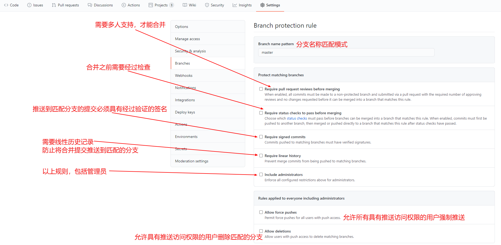
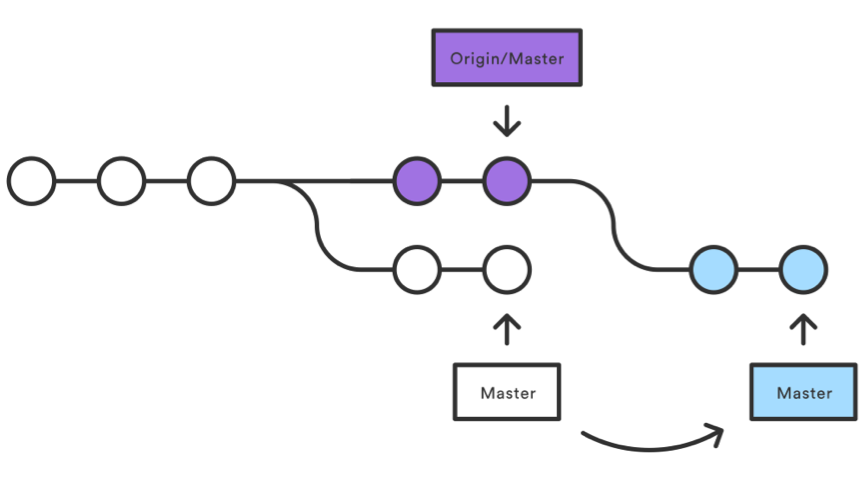
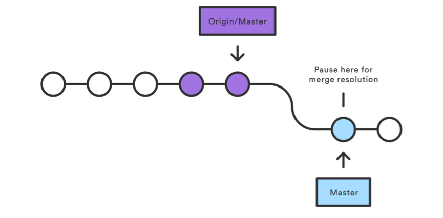
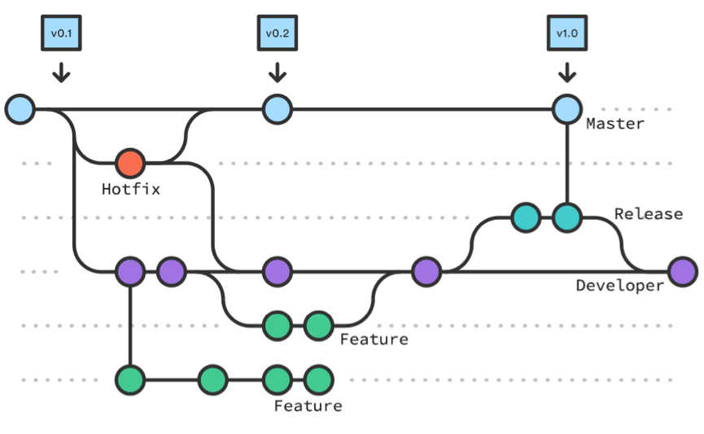
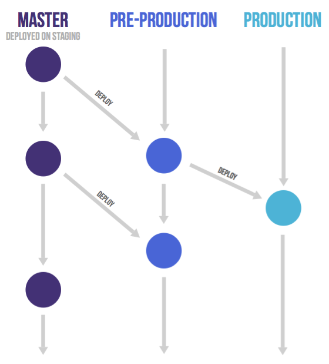
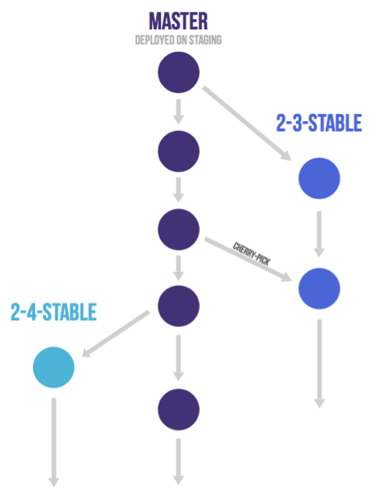

<!-- @import "[TOC]" {cmd="toc" depthFrom=1 depthTo=6 orderedList=false} -->

<!-- code_chunk_output -->

- [Git(分布式版本控制器)](#git分布式版本控制器)
  - [一. Git](#一-git)
    - [1.1 特点](#11-特点)
    - [1.2 Git 命令](#12-git-命令)
      - [1.2.1 创建仓库命令](#121-创建仓库命令)
        - [1.2.1.1 git clone <网址> <本地文件夹名>](#1211-git-clone-网址-本地文件夹名)
        - [1.2.1.2 git init](#1212-git-init)
      - [1.2.2 Git 查看](#122-git-查看)
        - [1.2.2.1 git status](#1221-git-status)
        - [1.2.2.2 git diff <file>](#1222-git-diff-file)
        - [1.2.2.3 git log <-number> <分支名>](#1223-git-log-number-分支名)
        - [1.2.2.4 git reflog](#1224-git-reflog)
        - [1.2.2.5 git blame <file>](#1225-git-blame-file)
        - [1.2.2.6 git cat-file -[t|s|p] 哈希值](#1226-git-cat-file-tsp-哈希值)
        - [1.2.2.7 git config](#1227-git-config)
      - [1.2.3 文件操作](#123-文件操作)
        - [1.2.3.1 git add ./文件名/文件夹名](#1231-git-add-文件名文件夹名)
        - [1.2.3.2 git rm <file>](#1232-git-rm-file)
        - [1.2.3.3 git mv [file] [newFile]](#1233-git-mv-file-newfile)
        - [1.2.3.4 git restore](#1234-git-restore)
      - [1.2.4 远程操作](#124-远程操作)
        - [1.2.4.1 `git remote`](#1241-git-remote)
        - [1.2.4.2 `git fetch [alias]`](#1242-git-fetch-alias)
        - [1.2.4.3 `git pull` [<远程主机名> <远程分支名>:<本地分支名>]](#1243-git-pull-远程主机名-远程分支名本地分支名)
        - [1.2.4.4 `git push <远程主机名> <本地分支名>:<远程分支名>`](#1244-git-push-远程主机名-本地分支名远程分支名)
      - [1.2.5 分支操作](#125-分支操作)
        - [1.2.5.1 `git branch` [branchName]](#1251-git-branch-branchname)
        - [1.2.5.2 `git checkout` [分支名]](#1252-git-checkout-分支名)
        - [1.2.5.3 `git merge <branchName>`](#1253-git-merge-branchname)
      - [1.2.6 版本操作](#126-版本操作)
        - [1.2.6.1 `git commit` -m "message"](#1261-git-commit-m-message)
        - [1.2.6.2 `git reset` [--soft | --mixed | --hard] [HEAD] [-- file]](#1262-git-reset-soft-mixed-hard-head-file)
        - [1.2.6.3 `git rebase`](#1263-git-rebase)
      - [1.2.7 其他](#127-其他)
        - [1.2.7.1 gitk](#1271-gitk)
        - [1.2.7.1 `git stash`](#1271-git-stash)
        - [1.2.7.2 `git rerere`](#1272-git-rerere)
    - [1.3 基础知识](#13-基础知识)
      - [1.3.1 Git 基本工作流程](#131-git-基本工作流程)
      - [1.3.2 .git 文件夹下的文件](#132-git-文件夹下的文件)
      - [1.3.3 git 中 commit、tree 和 blob 三个对象的关系](#133-git-中-commit-tree-和-blob-三个对象的关系)
      - [1.3.4 git 的底层运行流程](#134-git-的底层运行流程)
      - [1.3.5 分离头指针情况下的注意事项](#135-分离头指针情况下的注意事项)
      - [1.3. 6 HEAD 与 branch](#13-6-head-与-branch)
      - [1.3.7 在 .gitignore 文件里指定不需要 Git 管理的文件](#137-在-gitignore-文件里指定不需要-git-管理的文件)
      - [1.3.8 常用的传输协议](#138-常用的传输协议)
      - [1.3.9 Git 解决的问题](#139-git-解决的问题)
      - [1.3.10 将 Git 的默认编辑器设置为 VSCode](#1310-将-git-的默认编辑器设置为-vscode)
    - [1.4 Git 集成使用禁忌](#14-git-集成使用禁忌)
      - [1.4.1 `git push -f`](#141-git-push-f)
      - [1.4.2 禁止向集成分支执行变更历史的操作](#142-禁止向集成分支执行变更历史的操作)
  - [二. GitHub](#二-github)
    - [2.1 GitHub 基础](#21-github-基础)
      - [2.1.1 配置公私钥](#211-配置公私钥)
      - [2.1.2 GitHub 优点](#212-github-优点)
      - [2.1.3 GitHub 核心功能](#213-github-核心功能)
      - [2.1.4 快速搜索到感兴趣的开源项目](#214-快速搜索到感兴趣的开源项目)
      - [2.1.5 组织类型的仓库](#215-组织类型的仓库)
      - [2.1.6 指导文档](#216-指导文档)
      - [2.1.7 发布产品包](#217-发布产品包)
    - [2.2 使用 GitHub 进行团队协作](#22-使用-github-进行团队协作)
      - [2.2.1 选择适合团队的工作流](#221-选择适合团队的工作流)
      - [2.2.2 挑选合适的分支集成策略](#222-挑选合适的分支集成策略)
      - [2.2.3 GitHub 中的 Projects](#223-github-中的-projects)
      - [2.2.3 项目内部实施代码检查(code review)](#223-项目内部实施代码检查code-review)
  - [三. 常见场景](#三-常见场景)
    - [3.1 不同人修改了不同文件](#31-不同人修改了不同文件)
    - [3.2 不同人修改了相同文件的不同区域](#32-不同人修改了相同文件的不同区域)
    - [3.3 不同人修改相同文件的相同区域](#33-不同人修改相同文件的相同区域)
    - [3.4 同时变更了文件名和文件内容](#34-同时变更了文件名和文件内容)
    - [3.5 同一文件改成不同的文件名](#35-同一文件改成不同的文件名)
    - [3.6 提交 commit 后，想再忽略一些已经提交的文件](#36-提交-commit-后想再忽略一些已经提交的文件)
  - [四. GitLab](#四-gitlab)
    - [4.1 核心功能](#41-核心功能)
    - [4.2 项目管理](#42-项目管理)
  - [五. 协同工作流](#五-协同工作流)
    - [5.1 中心式协同工作流](#51-中心式协同工作流)
    - [5.2 功能分支协同工作流](#52-功能分支协同工作流)
    - [5.3 GitFlow 协同工作流](#53-gitflow-协同工作流)
    - [5.4 GitHub/GitLab 协同工作流](#54-githubgitlab-协同工作流)
      - [5.4.1 GitHub Flow](#541-github-flow)
      - [5.4.2 GitLab Flow](#542-gitlab-flow)
    - [5.5 协同工作流的本质](#55-协同工作流的本质)

<!-- /code_chunk_output -->

---

# Git(分布式版本控制器)

## 一. Git

### 1.1 特点

- 最优的存储能力
- 高性能
- 开源
- 容易备份
- 支持离线操作
- 容易定制工作流程

### 1.2 Git 命令

#### 1.2.1 创建仓库命令

##### 1.2.1.1 git clone <网址> <本地文件夹名>

克隆 Git 仓库到本地

- `--bare`: 新建一个裸仓库，不是将代码放到 `<directory>/.git` 中，而是将 `<directory>` 本身设置为仓库，无法签出工作树，此外，远程的分支头直接复制到相应的本地分支头，而不将它们映射到 `refs/remotes/origin/`。使用此选项时，既不会创建远程跟踪分支，也不会创建相关的配置变量。

##### 1.2.1.2 git init

初始化 Git 仓库，把已有的项目代码纳入 Git 管理：

1. cd <项目代码所在的文件夹>
2. git init

> **注意**：会在当前路径下创建和项目名称同名的文件夹。

新建的项目直接用 Git 管理：

1. cd <文件夹>
2. git init <项目名称>

#### 1.2.2 Git 查看

##### 1.2.2.1 git status

查看仓库当前的状态，显示有变更的文件。

- `-s`：简短的输出

##### 1.2.2.2 git diff <file>

显示暂存区与工作区的差异：

```sh
# 显示工作区和暂存区与最后一次 commit 之间的差异
git diff HEAD
```

- `[--cached|--staged] [file]`：显示暂存区和最后一次提交（commit）的差异

- `[first-branch]...[second-branch] [-- file]`：显示两次提交或两个分支之间的差异，如果最后有 `-- 文件名`，就是对比两次提交指定文件的差异

```sh
git diff 003e2f133adc5a53f21a72ca5b62eb08566121d1

git diff 003e2f133adc5a53f21a72ca5b62eb08566121d1...e77f6c3cc85fd535c36df30813ed23e9fb8255d3

git diff temp master --Git.md
```

##### 1.2.2.3 git log <-number> <分支名>

查看历史提交记录：

```sh
# 查看最近的两次提交记录
git log -2
```

- `-p SHA [filename]`：按补丁格式显示每个更新之间的差异
- `--oneline`：查看简要历史记录
- `--graph`：显示 ASCII 图形表示的分支合并历史
- `--reverse`：逆向显示日志
- `--author`：查找指定用户的提交日志

##### 1.2.2.4 git reflog

查看本地所有分支的所有操作记录（包括已经被删除的 commit 和 reset 的操作）

- `delete`：删除指定的记录

  ```sh
  git reflog delete HEAD@{270}
  ```

##### 1.2.2.5 git blame <file>

以**列表形式**查看指定文件的修改记录

##### 1.2.2.6 git cat-file -[t|s|p] 哈希值

查看 Git 对象的属性：

- `t`：查看 git 对象的类型
- `s`：查看 git 对象的大小
- `p`：查看 git 对象的内容

```sh
git cat-file -p 003e2f133adc5a53f21a72ca5b62eb08566121d1
```

##### 1.2.2.7 git config

查看、设置或清除配置：

- `[--local|--global|--system] [config 'message']`：设置配置

  ```sh
  git config [--local|--global|--system] user.name 'You name'

  git config [--local|--global|--system] user.email 'You email'
  ```

- `git config --list [--local|--global|--system]`：查看配置

  ```sh
  git config --list --local
  ```

- `git config --unset [--local|--global|--system]`：清除配置

  ```sh
   git config --unset --local user.name
  ```

**区别**：

- local：当前仓库
- global：当前用户的所有仓库
- system：本系统的所有用户

**优先级**：

local > global > system

#### 1.2.3 文件操作

##### 1.2.3.1 git add ./文件名/文件夹名

将文件添加到暂存区，`.` 表示所有文件

- `-u`：仅添加已被跟踪的文件

##### 1.2.3.2 git rm <file>

将文件从暂存区和工作区中删除：

```sh
git rm hello.txt
```

- `-f`：强制删除选项，用于删除之前修改过并且**已经放到暂存区域**的文件

  ```sh
  git rm -f hello.txt
  ```

- `--cached`：把文件从暂存区域移除，但仍然保留在当前工作目录中，换句话说，仅是从跟踪清单中删除

  ```sh
  git rm --cached hello.txt
  ```

- `-r`：递归删除，即如果后面跟的是一个目录做为参数，则会递归删除整个目录中的所有子目录和文件

  ```sh
  # 删除当前目录下的所有文件和子目录
  git rm –r *
  ```

##### 1.2.3.3 git mv [file] [newFile]

用于移动或重命名一个文件、目录或软连接：

- `-f`：重命名

  ```sh
  git mv -f hello.txt hello.css
  ```

##### 1.2.3.4 git restore

把未 add 到暂存区的文件修改撤销

```sh
git restore public_knowledge\Git\Git.md
```

- `--staged`：把文件从暂存区撤回到工作区，保留文件最后一次修改的内容

- `-s SHA file`：表示将当前工作区或文件切换到指定 commit 版本

  ```sh
  git restore -s 703025cf public_knowledge\Git\Git.md
  ```

#### 1.2.4 远程操作

##### 1.2.4.1 `git remote`

用于在远程仓库的操作

- `-v`: 显示所有远程仓库

  ```sh
  git remote -v
  ```

- `show [remote]`: 显示某个远程仓库的信息

  ```sh
  git remote show https://github.com/1758231591/Learning-notes-and-materials.git
  ```

- `remove name`: 删除远程仓库

- `rename old_name new_name`: 修改仓库名

- `add <name> <new url>`: :在本地仓库添加一个远程仓库

##### 1.2.4.2 `git fetch [alias]`

用于从远程获取代码库：

```sh
git fetch origin main
```

取回更新后，会返回一个 `FETCH_HEAD` ，指的是某个 branch 在远程仓库上的最新状态，可以在本地使用 `git log -p FETCH_HEAD` 来查看这个分支的更新信息，可以看到返回的信息包括更新的文件名，更新的作者和时间，以及更新的代码。

通过这些信息来判断是否产生冲突，以确定是否将更新 `merge` 到当前分支。

##### 1.2.4.3 `git pull` [<远程主机名> <远程分支名>:<本地分支名>]

从远程获取代码并合并本地的版本，其实就是 `git fetch` 和 `git merge FETCH_HEAD` 的简写

> **例 1**: `git pull origin master` // 如果远程分支是与当前分支合并，则冒号后面的部分可以省略
> **例 2**: `git pull origin master:main` // 将远程主机 origin 的 master 分支拉取过来，与本地的 main 分支合并

- `--rebase`: push 失败，需要先把服务器上的代码给 pull 下来，为了避免有 merge 动作，可以使用
  > 相当于 git fetch + git rebase FETCH_HEAD

##### 1.2.4.4 `git push <远程主机名> <本地分支名>:<远程分支名>`

用于从将本地的分支版本上传到远程并合并

```sh
git push origin master
# 相当于
git push origin master:master
```

- `-f`: 本地版本与远程版本有差异时，可以使用这个参数强制推送，多人合作禁用，如果要用可以使用 `git push --force-with-lease`，相对安全
- `-d`: 删除远程主机的分支
- `--all`: 推送全部分支
- `-u` : 如果当前分支与多个主机存在追踪关系，则可以使用 `-u` 参数指定一个默认主机，这样后面就可以不加任何参数使用 git push，不带任何参数的 git push，默认只推送当前分支。如果想更改设置，可以使用 git config 命令。`git config --global push.default matching` 或 `git config --global push.default simple`
- 使用`ssh`协议推送: `gitHub: git push git@github.com:DuSenYao/Learning-notes-and-materials.git`

> **注意**: 需要 [配置公私钥](#211-配置公私钥)

#### 1.2.5 分支操作

##### 1.2.5.1 `git branch` [branchName]

不加 name 是列出本地分支，加 name 是创建分支

- `-r`: 查看远程分支

  ```sh
  git branch -r
  ```

- `-a`: 查看所有分支
- `-d/D <branchName>`: 删除分支，`-D` 是强制删除
- `-v`: 查看分支版本

##### 1.2.5.2 `git checkout` [分支名]

切换分支

- `-b`: 创建并直接切换到新分支

  ```sh
  git checkout -b test
  ```

- `-- [file]`: 将工作区文件恢复为和暂存区一样

  ```sh
  git checkout -- index.html
  ```

- `-b name origin/branchName`: 基于远程的分支创建一个本地的分支，并切换到新分支

  ```sh
  git checkout -b dev origin/dev
  ```

##### 1.2.5.3 `git merge <branchName>`

合并分支

```sh
git merge dev
```

- `[alias]/[brach]`: 将远程的分支合并到当前分支

  ```sh
  git merge origin/master
  ```

- `--allow-unrelated-histories`: 用于合并后两个没有共同祖先的历史记录

- `--continue`: 合并由于冲突停止后，可以使用这个参数继续合并

#### 1.2.6 版本操作

##### 1.2.6.1 `git commit` -m "message"

主要是将暂存区里的改动给提交到本地的版本库，message 填写摘要

- `-a`: 跳过暂存区，从工作区直接提交到本地版本库
- `--amend`: 追加提交，在**不增加**一个新的 commit 的情况下，将新修改的代码追加到**前一次**的 commit 中

##### 1.2.6.2 `git reset` [--soft | --mixed | --hard] [HEAD] [-- file]

用于回退版本，可以指定暂存区退回某一次提交的版本

- `--mixed`: 默认参数，可以不用带该参数，清空暂存区，工作区文件内容保持不变。

  ```sh
  # 回退所有内容到上一个版本
  git reset HEAD^

  # 回退 hello.css 文件的版本到上一个版本
  git reset HEAD^ hello.css

  # 回退到指定版本
  git reset 052e
  ```

- `--soft`: 保留工作区的更改内容，并把重置版本带来的差异放入暂存区

  ```sh
  # 回退到当前版本
  git reset --soft HEAD
  ```

- `--hard`: 将指定版本的内容放入暂存区和工作区，也就是所有没有 commit 的修改都会丢失，**慎用**！

  ```sh
  # 回退上上上一个版本
  git reset –hard HEAD~3

  # 回退到某个版本回退点之前的所有信息
  git reset –hard bae128

  # 将本地的状态回退到和远程的某个分支一样
  git reset --hard origin/master
  ```

- `edition -- file`: 取消部分文件的更改

  ```sh
  git reset HEAD -- index.html
  ```

##### 1.2.6.3 `git rebase`

合并提交记录

**使用场景**：

本地开发分支灵活管理

1. 在本地 `git checkout -b local` 创建一个本地开发分支
2. 在本地的开发分支上开发和测试，阶段性开发完成后（包含功能代码和单元测试），准备提交代码
3. 首先切换到 master 分支，`git pull` 拉取最新的分支状态
4. 然后切回 local 分支
5. 通过 `git rebase local -i` 将本地 local 分支的多次提交合并为一个，以简化提交历史。本地有多个提交时,如果不进行这一步,在 `git rebase master` 时会多次解决冲突
6. `git rebase master` 将 master 最新的分支同步到 local 分支，这个过程可能需要手动解决冲突（如果进行了上一步的话，只用解决一次冲突）
7. 然后切换到 master 分支，`git merge local` 将本地的 local 分支内容合并到 master 分支
8. `git push` 将 master 分支的提交上传

- `-i`: 打开 vim 编辑模式，执行会自动打开 vim 编辑模式，合并的记录前面都有默认指令 pick，下面有 commands tips，根据指令提示可以选择需要的指令进行灵活修改，修改后 `ESC -> :wq!` 保存并退出，就会进入概括界面，编辑好后退出即可。

  > 在后面加 `HEAD~2` 表示合并几个提交

  ```sh
  git rebase master HEAD~2 -i
  ```

- `--continue`：合并冲突，结合 `git add 文件` 命令一起用与修复冲突，提示开发者，有没有解决冲突。
- `--abort`：放弃合并，回到 rebase 操作之前的状态，之前的提交的不会丢弃
- `--skip`：则会将引起冲突的 commits 丢弃掉（**慎用**）

#### 1.2.7 其他

##### 1.2.7.1 gitk

打开 git 自带的图形界面工具

##### 1.2.7.1 `git stash`

临时保存和恢复修改，可跨分支，在**未 add**之前才能执行

- `[save message]`: 保存修改到临时目录，并把工作区的文件还原到上一次 commit
- `list`: 显示所有保存的记录列表
- `pop stash@{num}`: 恢复，num 是可选值，通过 `git stash list` 查看具体值，只能恢复一次
- `apply stash@{num}`: 恢复，num 是可选值，通过 `git stash list` 查看具体值，可恢复多次

  ```sh
  git stash apply stash@{0}
  ```

- `drop stash@{num}`: 删除指定保存
- `clear`: 删除所有保存

##### 1.2.7.2 `git rerere`

重用记录的解决方案，它允许 Git 记住解决一个块冲突的方法，这样在下一次看到 **相同的冲突** 时，Git 可以自动地解决它。

```sh
# 启用 rerere
git config --global rerere.enabled true
```

> 实际应用不常用，[查看 Git 文档](https://git-scm.com/book/zh/v2/Git-%E5%B7%A5%E5%85%B7-Rerere)

### 1.3 基础知识

#### 1.3.1 Git 基本工作流程

```sequence
participant 工作目录 as A
participant 暂存区 as B
participant 本地仓库 as C
participant 远程仓库 as D
A -> B: git add [file|.]
B -> C: git commit -m "message"
C -> D: git push
B -->A: git reset
C --> B: git reset --soft HEAD~1
D --> A: git pull
D --> C: git fetch
C --> A: git merge FETCH_HEAD
```

#### 1.3.2 .git 文件夹下的文件

- `HEAD`: 指向当前所在的分支
- `config`: 当前 **git** 的配置文件，这是个引用指向 **refs 文件夹** 下的 **heads 文件夹** 里的分支
- `refs文件夹`:

  - **heads 文件夹** : 存放当前项目的所有分支文件，每个分支文件存放的是当前分支对应的是哪个 commit(提交)
  - **remotes 文件夹** : 存放远程分支
  - **tags 文件夹** : 存放当前项目的所有标签

- `objects文件夹`: 存放所有的**git 对象**，**对象哈希值前 `2` 位作为文件夹名称，后 `38` 位作为对象文件名**, 可通过 `git cat-file -p` 命令，拼接文件夹名称 + 文件名查看

#### 1.3.3 git 中 commit、tree 和 blob 三个对象的关系

`commit`是一个提交，它里面有一个`tree`对象**对应唯一的 tree**，这个 tree 里面又有包含了 **多个 tree 和 blob 对象** ，每个 tree 对象又包含了多个 tree 和 blob，文件的的最终形式是 **blob**。对于 blob，git 会认为文件内容相同时，就使用同一个 blob，这样就极大的避免了频繁提交时，git 的存储空间大幅上升。


#### 1.3.4 git 的底层运行流程

添加或者修改了文件并且 add 到 Stage Area 之后，首先会根据文件内容创建不同的 blob，当进行提交之后马上创建一个 tree 组件把需要的 blob 组件添加进去，之后再封装到一个 commit 组件中完成本次提交。

在将来进行 reset 的时候可以直接使用 `git reset --hard xxxxx` 可以恢复到某个特定的版本，在 reset 之后，git 会根据这个 commit 组件的 id 快速的找到 tree 组件，然后根据 tree 找到 blob 组件，之后对仓库进行还原，整个过程都是以 hash 和二进制进行操作，所以 git 执行效率非常之高。

> 注意 : 没有文件也就是没有 blob 对象的目录是不会被 git 管理的，因为 git 是对文件进行版本管理，所以没有必要对空目录生成对象。

#### 1.3.5 分离头指针情况下的注意事项

**分离头指针**是指在没有任何分支的情况下做 commit。

> **优缺点** : 用于实验性的更改与提交，随时可以放弃，而不影响任何分支的状态。缺点也是没有分支，意味着一旦切换分支，这些 commit 都会被当做垃圾丢弃。

#### 1.3. 6 HEAD 与 branch

`HEAD` 在 brach 时，指代**最新的 commit**，而在分离头状态时指代具体的 commit。

**含义与用法** :

- 一个节点，可以包含多个子节点(checkout 出多个分支)
- 一个节点可以有多个父节点(多个分支合并)
- `^` 是 `~` 都是父节点
  区别是跟随数字时候，^2 是第二个父节点，而~2 是父节点的父节点
- `^` 和 `~` 可以组合使用

```sh
# 最新 commit 的父节点的父节点的第二个父节点
HEAD~2^2
```

#### 1.3.7 在 .gitignore 文件里指定不需要 Git 管理的文件

- **文件夹** : filename/
- **具体的文件** : filename.后缀名
- **特定后缀名的文件** : \*.后缀名

#### 1.3.8 常用的传输协议

- 哑协议: `path/to/repo.git`
- 智能协议: `file://path/to/repo.git`
- http/https 协议: `http://git-server.com/path/to/repo.git`
- ssh 协议: `user@git-server.com:path/to/repo.git` 是工作中最常用的智能协议

**哑协议与与智能协议的区别**:

- 哑协议传输进度不可见，智能协议传输可见
- 智能协议比哑协议传输速度快

#### 1.3.9 Git 解决的问题

**解决的问题**：

1. 程序员之间进行协作编程的方式很少
2. 即使有 SVN，与开源团队合作通常也需要获得项目管理员的许可才能 fork 项目的一个分支，否则便无法编辑代码，批准时间过长
3. 许多开源项目都受到权限问题以及一些低效率事情的困扰
4. 无法帮助开发人员寻找开源项目
5. 开发出的优秀开源项目，很难让他人知道

#### 1.3.10 将 Git 的默认编辑器设置为 VSCode

```sh
git config --global core.editor "code -w"
```

### 1.4 Git 集成使用禁忌

#### 1.4.1 `git push -f`

强制推送，即使不是 `fast-forward` [^1]
[^1]: 当前分支合并到另一分支时，如果没有分歧，就会直接移动文件指针。这个过程叫做`fast-forward`。fast-forward 能够保证不会强制覆盖别人的代码，确保了多人协同开发。尽量不要使用 non fast forward 方法提交代码。

**危害**
: 会使 commit 消失

**恢复**
: 使用 `git reflog` 查找历史，然后使用 `git reset --hard HEAD@{n}` 恢复。

#### 1.4.2 禁止向集成分支执行变更历史的操作

比如，公共分支 pull 到本地做**变基**操作，会**导致历史消失**。

## 二. GitHub

### 2.1 GitHub 基础

#### 2.1.1 配置公私钥

在本地创建 `SSH` 秘钥

1. 打开 Git Bash，在本地使用 `ssh-keygen -t ed25519 -C "1758231591@qq.com"` 生成 SSH 秘钥
2. 确保 ssh-agent 正在运行。可以手动启动它：

   ```sh
   # 在后台启动 ssh-agent
   $ eval `ssh-agent -s`

   > Agent pid 59566
   ```

3. 将 SSH 私钥添加到 ssh-agent。 如果创建了不同名称的密钥，或者要添加不同名称的现有密钥，将命令中的 id_ed25519 替换为私钥文件的名称。

   ```sh
   ssh-add ~/.ssh/id_ed25519
   ```

4. 在 `C:\Users\用户名\.ssh\id_ed25519.pub` 文件里，就有创建出来的`公钥`，把公钥复制出来，粘贴到 GitHub 上。

> ssh 协议需要这个，使用 ssh 传输协议，不需要账户密码就可以连接 gitHub。

#### 2.1.2 GitHub 优点

- 让 Git 更容易使用，使协作和编写代码更容易
- 不断解决用户痛点: 不仅致力于解决疑难问题，而且还致力于解决所有开发人员遇到的问题。
- 更好、更直观的版本控制系统，具有成为 轻松、安全和远程协作项目 的潜力。

#### 2.1.3 GitHub 核心功能

- code review: 代码评审，人人都可以看见项目，都可以发表自己对代码的看法与改进意见
- Project management: 项目管理
- integrations: 集成
- Team management: 团队管理，对不同的仓库授予不同的权限
- social coding: 开源代码
- Documentation: 可以在 GIthub 上做个人网页、文档
- code hosting: 代码托管

#### 2.1.4 快速搜索到感兴趣的开源项目

在搜索页，语言栏左下方有高级搜索(Advanced search)

#### 2.1.5 组织类型的仓库

组织里可以管理多个仓库，加成员，设置团队，设置团队成员管理权限。成员可以看见每个团队管理的仓库和权限，可以发起请求加入团队。

#### 2.1.6 指导文档

可以在 Wiki 中添加指导文档。能够添加 首页、工具栏 和 各种指导文档页面。文档使用 markdown 格式。

#### 2.1.7 发布产品包

<!--TODO-->

### 2.2 使用 GitHub 进行团队协作

先在 GitHub 上，创建团队类型的仓库。需要基于一个组织创建。

#### 2.2.1 选择适合团队的工作流

**需要考虑的因素** :

- 团队人员的组成
- 研发设计能力
- 输出产品的特征
- 项目难易程度

**主干开发适用于** :

- 开发团队系统设计和开发能力强。有一套有效的特性切换的实施机制，保证上线后无需修改代码就能够修改系统行为。需要快速迭代，想获得 CI/CD 所有好处。
- 组件开发的团队，成员能力强，人员少，沟通顺畅。用户升级组件成本低的环境。

**Git Flow 适用于** :

- 不具备主干开发能力，有预定的发布周期。需要执行严格的发布流程。

**GitHub FLow 适用于** :

- 不具备主干开发能力。随时集成随时发布；分支集成时经过代码评审和自动化测试，就可以立即发布的应用。

**GitLab Flow (带生产分支) 适用于**:

- 不具备主干开发能力。无法控制准确的发布时间，但又要求不停的集成。

**GitLab FLow (带环境分支) 适用于**:

- 不具备主干开发能力，需要逐个通过各个测试环境的验证才能发布。

**GitLab Flow (带发布分支) 适用于**:

- 不具备主干开发能力。需要对外发布和维护不同版本。

#### 2.2.2 挑选合适的分支集成策略

仓库 -> Settings -> options -> Merge button


1. `git merge` : `git merge` 带 `squash` 参数则合并后特性分支上的多个 commit 会合并成一个 commit 放到主分支上，不带 `squash` 参数则特性分支上的多个 commit 在合并后会原样体现出来。

2. `git rebase` : 将特性分支上的多个 commit 放到主分支上，如果有冲突先将特性分支和主分支解决冲突 merge。 可以再使用 merge 将特性分支和主分支合并。

#### 2.2.3 GitHub 中的 Projects

Projects 可以有序的管理 **issue** 和 **Pull request**

在 issue 和 Pull request 中可以选择分到哪个 project 中，项目可以设置自动化管理。


#### 2.2.3 项目内部实施代码检查(code review)

在 仓库 -> Settings -> Branches -> Branch protection rules 中可以添加分支保护规则



## 三. 常见场景

### 3.1 不同人修改了不同文件

**有两种方法**:

- 如果在进行 `git push` 之前发现远程又有了更新，可以将本地的提交回退掉，避免掉无用的远程 merge 本地分支的提交记录，使用如下命令:

  > `git reset HEAD~` > `git pull`

  然后重新进行新的提交，这样就可以避免远程与本地分支的 `merge` 提交记录，让 git 的提交历史更加干净。

- 把本地的提交基于远端分支做 `rebase` ，在本地解决掉冲突并完成自测。

  ```sh
  git pull --rebase
  ```

### 3.2 不同人修改了相同文件的不同区域

使用 `git merge 远程分支名` 合并分支，然后 `git push`。

### 3.3 不同人修改相同文件的相同区域

使用 `git pull`，然后手动解决冲突(与另一个提交者交流后)

### 3.4 同时变更了文件名和文件内容

**分两种情况**:

- 没有修改相同位置，没有修改的冲突，变更文件名和变更文件内容的操作能够自动被 git 处理。

- 如果一个人既变更了文件名又修改了文件，同时另一个人也修改了该文件的同一位置的内容，就会被 git 识别为冲突，而不能自动进行处理了。

  > **原因**: git 存放 blob 文件时是以`文件内容`来区分的，并不以文件名来区分。

### 3.5 同一文件改成不同的文件名

`git pull` 到本地分支，git 会保留两个文件，手动来处理冲突，可以用 `git rm` 删除不要的文件，最后提交。

### 3.6 提交 commit 后，想再忽略一些已经提交的文件

1. 把想忽略的文件添加到 **.gitignore**
2. 然后通过 `git rm --cached name_of_file` 的方式删除掉 git 仓库里面无需跟踪的文件。

## 四. GitLab

[GitLab](https://about.gitlab.com/)

### 4.1 核心功能

1. 数据统计
2. 跟踪管理所有的需求和问题
3. 源代码管理
4. 各种校验
5. 支持容器，容器保护
6. 安全管理
7. 持续交付
8. 监控

### 4.2 项目管理

统一在 **issues** 下

## 五. 协同工作流

### 5.1 中心式协同工作流

Git 是可以像 SVN 这样的中心工作流一样工作的。

1. 从服务器上做 `git pull origin master` 把代码同步下来。
2. 改完后，`git commit` 到本地仓库中。
3. 然后 `git push origin master` 到远程仓库中。

如果在第 3 步发现 push 失败，因为别人已经提交了，那么需要先把服务器上的代码给 pull 下来，为了避免有 merge 动作，可以使用 `git pull --rebase` 。这样就可以把服务器上的提交直接合并到代码中，对此，Git 的操作是这样的。

1. 先把本地提交的代码放到一边。
2. 然后把服务器上的改动下载下来。
3. 然后在本地把之前的改动再重新一个一个地做 commit，直到全部成功。

如下图所示。Git 会把 Origin/Master 的远程分支下载下来（紫色的），然后把本地的 Master 分支上的改动一个一个地提交上去（蓝色的）。



如果有冲突，那么要先解决冲突，然后做 `git rebase --continue` 。如下图所示，git 在做 `pull --rebase` 时，会一个一个地应用（apply）本地提交的代码，如果有冲突就会停下来，等待解决冲突。



> **问题**
> 小团队或是小项目可以这么干，但是对比较大的项目或是人比较多的团队，这么干就会有很多问题。
> 最大的问题就是代码可能干扰太严重。

### 5.2 功能分支协同工作流

需要同时开发一个功能的开发人员可以分享各自的代码，但是不会把代码分享给开发其他功能的开发人员，直到整个功能开发完毕后，才会分享给其他的开发人员（也就是进入主干分支）。因此，引入了 "功能分支"。

协同工作流的开发过程如下：

1. 首先使用 `git checkout -b new-feature` 创建并切换到 "new-feature"分支。
2. 然后共同开发这个功能的程序员就在这个分支上工作，进行 add、commit 等操作。
3. 然后通过 `git push -u origin new-feature` 把分支代码 push 到服务器上。
4. 其他程序员可以通过 `git pull --rebase` 来拿到最新的这个分支的代码。最后通过 Pull Request 的方式做完 Code Review 后合并到 Master 分支上。


就像上面这个图显示的一样，紫色的分支就是功能分支，合并后就会像上面这个样子。

这种开发是以服务器为中心的开发，还不是 Git 分布式开发，它只不过是用分支来完成代码改动的隔离。

为什么会叫"功能分支"，而不是"项目分支"？因为 Git 的最佳实践希望在开发的过程中，快速提交，快速合并，快速完成。这样可以少很多冲突的事，所以叫功能分支。

传统的项目分支开得太久，时间越长就越合不回去。这种玩法其实就是把一个大项目切分成若干个小项目来执行（最好是一个小功能一个项目）。这样才是互联网式的快速迭代式的开发流程。

### 5.3 GitFlow 协同工作流

生产过程是比较复杂的，软件生产中会有各式各样的问题，并要面对不同的环境。要在不停地开发新代码的同时，维护线上的代码，于是，就有了下面这些需求。

1. 希望有一个分支是非常干净的，上面是可以发布的代码，上面的改动永远都是可以发布到生产环境中的。这个分支上不能有中间开发过程中不可以上生产线的代码提交。
2. 希望当代码达到可以上线的状态时，也就是在 alpha/beta release 时，在测试和交付的过程中，依然可以开发下一个版本的代码。
3. 最后，对于已经发布的代码，也会有一些 Bug-fix 的改动，不会将正在开发的代码提交到生产线上去。

面对这些需求，不仅是要在整个团队中共享代码，要的更是管理好不同环境下的代码不互相干扰。要管理好代码与环境的一致性。

GitFlow 协同工作流是由 Vincent Driessen 于 2010 年在 A successful Git branching model 这篇文章介绍给世人的。

这个协同工作流的核心思想如下图所示。



整个代码库中一共有五种分支:

- **Master 分支** : 也就是主干分支，用作发布环境，上面的每一次提交都是可以发布的。

- **Feature 分支** : 也就是功能分支，用于开发功能，其对应的是开发环境。

- **Developer 分支** : 是开发分支，一旦功能开发完成，就向 Developer 分支合并，合并完成后，删除功能分支。这个分支对应的是集成测试环境。

- **Release 分支** : 当 Developer 分支测试达到可以发布状态时，开出一个 Release 分支来，然后做发布前的准备工作。这个分支对应的是预发环境。之所以需要这个 Release 分支，是因为开发需要继续向前，不会因为要发布而被 block 住而不能提交。
  一旦 Release 分支上的代码达到可以上线的状态，那么需要把 Release 分支向 Master 分支和 Developer 分支同时合并，以保证代码的一致性。然后再把 Release 分支删除掉。

- **Hotfix 分支** : 是用于处理生产线上代码的 Bug-fix，每个线上代码的 Bug-fix 都需要开一个 Hotfix 分支，完成后，向 Developer 分支和 Master 分支上合并。合并完成后，删除 Hotfix 分支。

这就是整个 GitFlow 协同工作流的工作过程。可以看到：

- 需要长期维护 Master 和 Developer 两个分支。

- 这其中的方式还是有一定复杂度的，尤其是 Release 和 Hotfix 分支需要同时向两个分支作合并。所以，如果没有一个好的工具来支撑的话，可能会忘了做一些操作而导致代码不一致。

- GitFlow 协同虽然工作流比较重。但是它几乎可以应对所有公司的各种开发流程，包括瀑布模型，或是快速迭代模型。

**GitFlow 的问题**:

- 分支太多，所以会出现 git log 混乱的局面。具体来说，主要是 git-flow 使用 `git merge --no-ff` 来合并分支，在 git-flow 这样多个分支的环境下会让分支管理的 log 变得很难看。
  所谓 --no-ff 参数的意思是 no fast forward 的意思。也就是说，合并的方法不要把这个分支的提交以前置合并的方式，而是留下一个 merge 的提交。
  对此的建议是：只有 feature 合并到 developer 分支时，使用 --no-ff 参数，其他的合并都不使用 --no-ff 参数来做合并。

- 管理复杂。需要来来回回地切换工作的分支，有时候一不小心没有切换，就提交到了不正确的分支上，还要回滚和重新提交。

### 5.4 GitHub/GitLab 协同工作流

#### 5.4.1 GitHub Flow

GitHub 的工作流程：

1. 每个开发人员都把"官方库"的代码 fork 到自己的代码仓库中。
2. 然后，开发人员在自己的代码仓库中做开发。
3. 因此，开发人员的代码库中，需要配两个远程仓库，一个是自己的库，一个是官方库（用户的库用于提交代码改动，官方库用于同步代码）。
4. 然后在本地建"功能分支"，在这个分支上做代码开发。
5. 这个功能分支被 push 到开发人员自己的代码仓库中。
6. 然后，向"官方库"发起 pull request，并做 Code Review。
7. 一旦通过，就向官方库进行合并。

如果有"官方库"的权限，那么就可以直接在"官方库"中建功能分支开发，然后提交 pull request。通过 Code Review 后，合并进 Master 分支，而 Master 一旦有代码被合并就可以马上 release。

这需要一个自动化的 CI/CD 工具做辅助。CI/CD 应该是开发中的标配了。

#### 5.4.2 GitLab Flow

GitHub Flow 这种玩法依然会有好多问题，因为其虽然变得很简单，但是没有把代码和运行环境给联系在一起。

所以，GitLab 提出了几个优化点。其中一个是引入环境分支，如下图所示，其包含了预发布（Pre-Production）和生产（Production）分支。



而有些时候，还会有不同版本的发布，所以，还需要有各种 release 的分支。如下图所示。Master 分支是一个 roadmap 分支，然后，一旦稳定了就建稳定版的分支，如 2.3.stable 分支和 2.4.stable 分支，其中可以 cherry-pick master 分支上的一些改动过去。



这样解决了两个问题：

- 环境和代码分支对应的问题
- 版本和代码分支对应的问题。

### 5.5 协同工作流的本质

1. 不同的团队能够尽可能地并行开发。
2. 不同软件版本和代码的一致性。
3. 不同环境和代码的一致性。
4. 代码总是会在稳定和不稳定间交替。希望生产线上的代码总是能对应到稳定的代码上来。

**软件开发的趋势**:

- **以微服务或是 SOA 为架构的方式**
  一个大型软件会被拆分成若干个服务，那么，代码应该也会跟着服务拆解成若干个代码仓库。这样一来，每个代码仓库都会变小，于是协同工作流程就会变简单。
  对于每个服务的代码仓库，开发和迭代速度也会变得很快，开发团队也会跟服务一样被拆分成多个小团队。
  这样一来， GitFlow 这种协同工作流程就非常重了，而 GitHub 这种方式或是功能分支这种方式会更适合开发。

- **以 DevOps 为主的开发流程**
  DevOps 关注于 CI/CD，需要有自动化的集成测试和持续部署的工具。这样一来，代码发布速度就会大大加快，每一次提交都能很快地被完整地集成测试，并很快地发布到生产线上。

协同工作流的本质，并不是怎么玩好代码仓库的分支策略，而是**玩好软件架构和软件开发流程**。

与其花时间在 Git 协同工作流上，还不如把时间花在调整软件架构和自动化软件生产和运维流程上来，这才是真正简化协同工作流程的根本。
