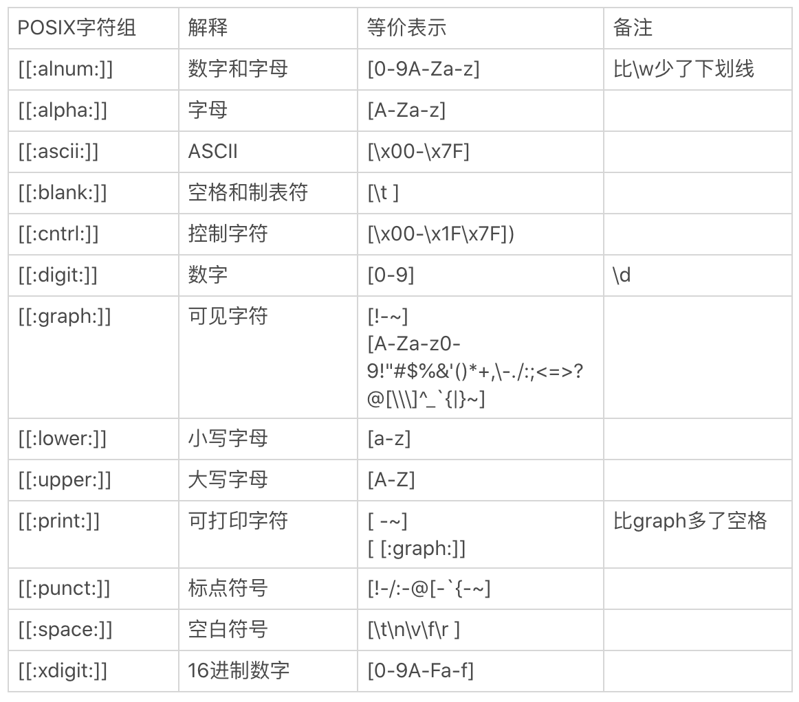
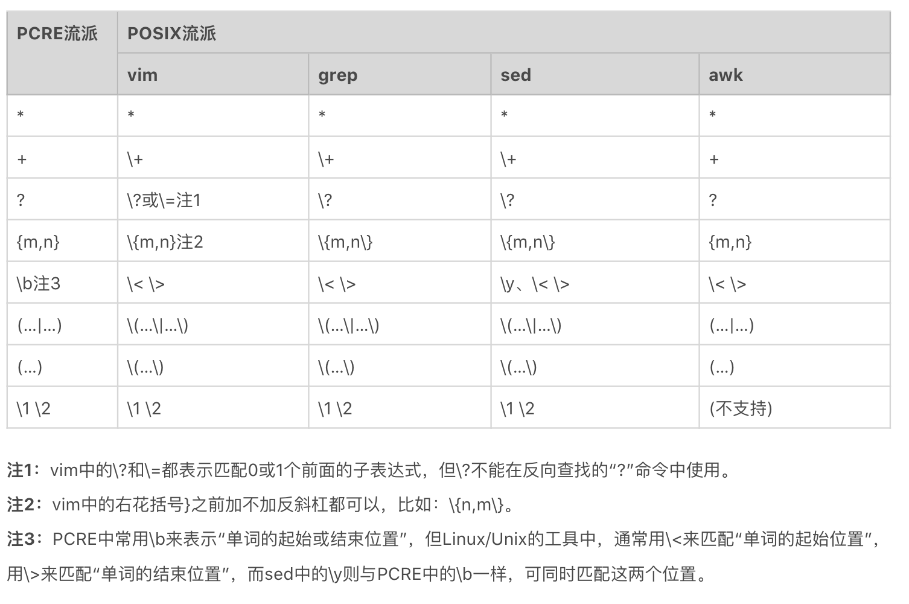
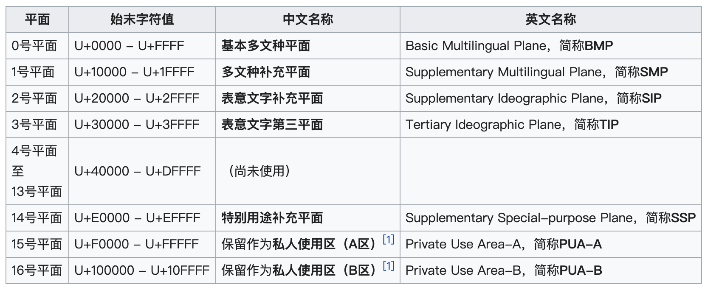
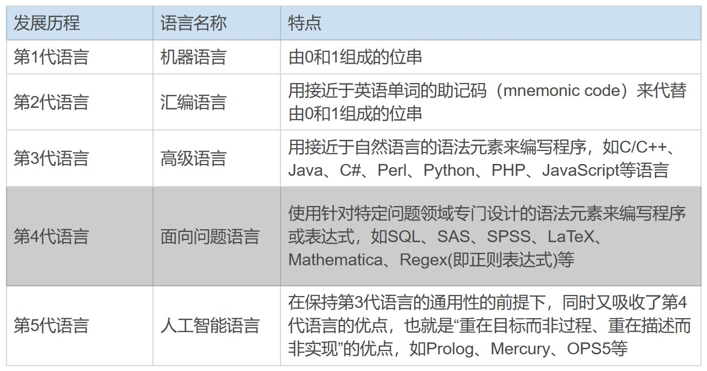

<!-- @import "[TOC]" {cmd="toc" depthFrom=1 depthTo=6 orderedList=false} -->

<!-- code_chunk_output -->

- [正则表达式 Regular Expression](#正则表达式-regular-expression)
  - [一.总论](#一总论)
    - [1.1 概述](#11-概述)
    - [1.2 主要内容](#12-主要内容)
    - [1.3 解决问题步骤](#13-解决问题步骤)
    - [1.4 流派及其特性](#14-流派及其特性)
      - [1.4.1 正则表达式简史](#141-正则表达式简史)
      - [1.4.2 流派](#142-流派)
      - [1.4.3 在Linux中使用正则](#143-在linux中使用正则)
    - [1.5 使用注意事项](#15-使用注意事项)
  - [二. 基础](#二-基础)
    - [2.1 元字符](#21-元字符)
    - [2.2 贪婪匹配、懒惰匹配和独占模式](#22-贪婪匹配-懒惰匹配和独占模式)
    - [2.3 回溯](#23-回溯)
    - [2.4 分组与编号](#24-分组与编号)
    - [2.5 匹配模式](#25-匹配模式)
  - [三. 正则高级内容](#三-正则高级内容)
    - [3.1 断言](#31-断言)
    - [3.2 转义](#32-转义)
      - [3.2.1 转义字符](#321-转义字符)
      - [3.2.2 字符串转义和正则转义](#322-字符串转义和正则转义)
      - [3.2.3 其他转义](#323-其他转义)
  - [四. 实际应用](#四-实际应用)
    - [4.1 正则处理 Unicode 编码文本](#41-正则处理-unicode-编码文本)
      - [4.1.1 Unicode 基础知识](#411-unicode-基础知识)
      - [4.1.2 Unicode中的正则可能遇到的问题](#412-unicode中的正则可能遇到的问题)
      - [4.1.3 Unicode 属性](#413-unicode-属性)
      - [4.1.4 表情符号](#414-表情符号)
    - [4.2 文本处理](#42-文本处理)
    - [4.3 正则的匹配原理-有穷状态自动机](#43-正则的匹配原理-有穷状态自动机)
      - [4.3.1 概念](#431-概念)
      - [4.3.2 正则的匹配过程](#432-正则的匹配过程)
      - [4.3.3 DFA 和 NFA 工作机制](#433-dfa-和-nfa-工作机制)
      - [4.3.4 POSIX NFA 与 传统 NFA 区别](#434-posix-nfa-与-传统-nfa-区别)
      - [4.3.5 回溯](#435-回溯)
    - [4.4 优化建议](#44-优化建议)
    - [4.5 正则常见问题与解决方案](#45-正则常见问题与解决方案)
  - [五. 从编程语言的角度理解正则表达式](#五-从编程语言的角度理解正则表达式)
    - [5.1 从编程语言发展史角度理解](#51-从编程语言发展史角度理解)
    - [5.2 从编程范式角度来理解](#52-从编程范式角度来理解)
    - [5.3 正则表达式的语法元素本质上就是程序逻辑和算法](#53-正则表达式的语法元素本质上就是程序逻辑和算法)

<!-- /code_chunk_output -->

# 正则表达式 Regular Expression

---

## 一.总论

### 1.1 概述

正则表达式是一种描述文本内容组成规律的表示方式。在编程语言中，正则经常被用来简化文本处理的逻辑。
正则是一个非常强大的文本处理工具，它的应用极其广泛，主要有以下三个方面：

- **校验数据的有效性** : 校验手机号、邮箱等
- **查找符合要求的文本内容** : 查找符合某种规则的号码
- **对文本进行切割、替换等操作** : 对敏感词进行屏蔽

### 1.2 主要内容

- **基本知识** : 一些重要的概念和功能
- 在常见编辑器中使用正则的方法
- **高阶正则内容** :
  - 正则中的 **断言** (包括单词边界、行开始和结束、环视)
  - **三种主要流派的区别以及对应的软件实现**
  - 正则的工作机制和常见的优化方式等
掌握这些内容可以更好地理解正则，也可以避过很多坑。比如，为什么在编程语言中能工作的正则，在 Linux 命令 **grep** 中就不能工作了呢？正则匹配的原理又是什么？如何写出性能更好的正则呢？

### 1.3 解决问题步骤

使用正则解决问题，大致可以分为四步:

1. 做分解
  拿到一个问题，先思考：这个问题可以分成几个子问题？每个子问题是否独立？
    例：电子邮件地址匹配，从文本结构来看，它可以分为"username + @ + domain name"这三个独立的部分
2. 分析各个子问题
  某个位置上可能有多个字符？那就用字符组。某个位置上可能有多个字符串？那就用多选结构。出现的次数不确定？那就用量词。对出现的位置有要求？那就用锚点锁定位置…… ，每个问题都有对应的解法。最后，搭建起完整的概念模型。
3. 套皮
  正则真正重要的是字符组、多选结构、量词等等这些概念。概念模型一定要清楚。把之前得到的概念模型按照对应语言或工具的约定写下来。
4. 调试
  把正则表达式分解来看，明白典型标志限定的是正则表达式中的哪一部分，正则每一部分对应要匹配文本中的哪一部分。

### 1.4 流派及其特性

#### 1.4.1 正则表达式简史

正则表达式的起源，可以追溯到，早期神经系统如何工作的研究。在 20 世纪 40 年代，有两位神经生理学家(Warren McCulloch 和 Walter Pitts)，研究出了一种用数学方式来描述神经网络的方法。
1956 年，一位数学家(Stephen Kleene)发表了一篇标题为《神经网络事件表示法和有穷自动机》的论文。这篇论文描述了一种叫做"正则集合(Regular Sets)"的符号。
随后，大名鼎鼎的 Unix 之父 Ken Thompson 于 1968 年发表了文章《正则表达式搜索算法》，并且将正则引入了自己开发的编辑器 qed，以及之后的编辑器 ed 中，然后又移植到了大名鼎鼎的文本搜索工具 grep 中。自此，正则表达式被广泛应用到 Unix 系统或类 Unix 系统 (如 macOS、Linux) 的各种工具中。
由于正则功能强大，非常实用，越来越多的语言和工具都开始支持正则。不过由于没有尽早确立标准，导致各种语言和工具中的正则虽然功能大致类似，但仍然有不少细微差别。

#### 1.4.2 流派

正则表达式目前最主要的两大流派是：

1. POSIX流派:
    1. 诞生
      诞生于 1986 年的 POSIX 开始进行标准化的尝试。POSIX作为一系列规范，定义了 Unix 操作系统应当支持的功能，其中也包括正则表达式的规范。因此，Unix 系统或类 Unix 系统上的大部分工具，如 grep、sed、awk 等，均遵循该标准。这些遵循 POSIX 正则表达式规范的正则表达式，被称为 POSIX 流派的正则表达式。
    2. 标准
      POSIX 规范定义了正则表达式的两种标准:
        - BRE 标准(Basic Regular Expression 基本正则表达式):
        - ERE 标准(Extended Regular Expression 扩展正则表达式):
    3. 早期 BRE 与 ERE 标准的区别主要在于:
        - BRE 标准不支持量词问号和加号，也不支持多选分支结构管道符。BRE 标准在使用花括号，圆括号时要转义才能表示特殊含义。
        - ERE 标准，在使用花括号，圆括号时不需要转义了，还支持了问号、加号 和 多选分支。
    4. Linux 的 GNU 扩展
      现在使用的 Linux 发行版，大多都集成了 GNU 套件。GNU 在实现 POSIX 标准时，做了一定的扩展，主要有以下三点扩展:
        - GNU BRE 支持了 +、?，但转义了才表示特殊含义，即需要用 `\+` 、`\?` 表示。
        - GNU BRE 支持管道符多选分支结构，同样需要转义，即用 `\|` 表示。
        - GNU ERE 也支持使用反引用，和 BRE 一样，使用 \1、\2…\9 表示
    5. POSIX字符组
      POSIX 流派还有一个特殊的地方，就是有自己的字符组，叫 POSIX 字符组。这个类似于 **\d** 表示数字，**\s** 表示空白符等，POSIX 中也定义了一系列的字符组。
      

2. PCRE流派:
  目前大部分常用编程语言都是源于 PCRE 标准，这个流派显著特征是有 **\d** 、**\w** 、**\s** 这类字符组简记方式。
    1. 诞生
      在 1987 年 12 月，Larry Wall 发布了 Perl 语言第一版，因其功能强大一票走红，所引入的正则表达式功能大放异彩。之后 Perl 语言中的正则表达式不断改进，影响越来越大。于是在此基础上，1997 年又诞生了PCRE——Perl 兼容正则表达式(Perl Compatible Regular Expressions)。
      PCRE 是一个兼容 Perl 语言正则表达式的解析引擎，是由 Philip Hazel 开发的，为很多现代语言和工具所普遍使用。除了 Unix 上的工具遵循 POSIX 标准，PCRE 现已成为其他大部分语言和工具隐然遵循的标准。
    2. 兼容问题
      虽然 PCRE 流派是与 Perl 正则表达式相兼容的流派，但这种兼容在各种语言和工具中还存在程度上的差别，这包括了直接兼容与间接兼容两种情况。
        - **直接兼容** : PCRE 流派中与 Perl 正则表达式直接兼容的语言或工具。比如 Perl、PHP preg、PCRE 库等，一般称之为 Perl 系。
        - **间接兼容** : 比如 Java 系(包括 Java、Groovy、Scala 等)、Python 系(包括 Python2 和 Python3)、JavaScript 系(包括原生 JavaScript 和扩展库 XRegExp)、.Net 系(包括 C#、VB.Net 等)等。

#### 1.4.3 在Linux中使用正则

在遵循 POSIX 规范的 UNIX/LINUX 系统上，按照 BRE 标准 实现的有 grep、sed 和 vi/vim 等，而按照 ERE 标准 实现的有 egrep、awk 等。
在 Linux 系统中有个 `man` 命令可以帮助我们。比如，macOS 上执行 `man grep` ，可以看到选项 -G 是指定使用 BRE 标准(默认)，-E 是 ERE 标准，-P 是 PCRE 标准。

### 1.5 使用注意事项

正则表达式一定不要乱用，有以下注意事项：

- **能用普通字符串处理的，一定要用普通字符串处理** : 字符串处理的速度不见得差，可读性却好上很多。如果要在大段文本中定位所有的 today 或者 tomorrow，用最简单的字符串查找，直接找两遍，明显比 to(day|morrow) 看起来更清楚。
- **能写注释的正则表达式，一定要写注释** : 正则表达式的语法非常古老，不够直观，为了便于阅读和维护，如今大部分语言里都可以通过 x 打开注释模式。有了注释，复杂正则表达式的结构也能一目了然。
- **能用多个简单正则表达式解决的，不要苛求用一个复杂的正则表达式** : 多个简单正则表达式的可维护性远远强于单个正则表达式，比如输入条件的验证。

## 二. 基础

### 2.1 元字符

元字符是指在正则表达式中具有特殊意义的 **专用字符** ，元字符是构成正则表达式的基本元件。

元字符可以大致分为以下几类：

1. **特殊单字符**
    - `.` : 任意字符(换行除外)
    - `\d` : 任意数字
    - `\D` : 任意非数字
    - `\w` : 任意字母数字下划线
    - `\W` : 任意非字母数字下划线
    - `\s` : 任意空白字符
    - `\S` : 任意非空白字符
2. **空白符**
    - `\s` : 任意空白符
    - `\r` : 回车符
    - `\n` : 换行符
    - `\f` : 换页符
    - `\t` : 制表符
    - `\v` : 垂直制表符
    平时使用正则，大部分场景使用\s就可以满足需求。
3. **量词**
    - `*` : 0到多次
    - `+` : 1到多次
    - `?` : 0到1次，例：color?u
    - `{m}` : 出现m次
    - `{m,}` : 出现至少m次
    - `{m,n}` : m到n次
4. 范围:
    - `|` : 用来隔开多个正则，表示满足其中任意一个即可。
      例：ab|cd 既能匹配到ab也能匹配到cd
    - `[]` : 代表多选一，可以表示里面的任意单字符，中括号中还可以用中划线表示范围，如[a-z]可以表示所有小写字母。如果中括号中第一个是脱字符(^)，那么就表示非，表达的是不能是里面的任何单个元素。

### 2.2 贪婪匹配、懒惰匹配和独占模式

正则中有三种模式，这些模式会改变正则中量词的匹配行为:

- **贪婪匹配** (Greedy) : 表示次数的量词 **默认** 是贪婪模式，会尽可能多的去匹配。
- **懒惰匹配** (Lazy) : 在量词的后面加上 `?` 会变成懒惰模式，找出长度最小且满足要求的。
- **独占模式** : 独占模式和贪婪模式很像，独占模式会尽可能多地去匹配，如果匹配失败就结束，不会进行回溯，因此，独占模式性能比较好。具体的方法就是在量词后面加上加号 `+`。JS目前不支持。

### 2.3 回溯

贪婪模式和懒惰模式，都需要发生 **回溯** 才能完成相应的功能，回溯在贪婪和懒惰模式下的规则有所不同：

- 贪婪模式下的回溯:

> `regex = "ap{1,3}ly"; text = "apply";`
> 在匹配时，p{1,3}会尽可能长地去匹配，当匹配完 app 后，由于 p 要尽可能匹配最长，即三个，但字符串中后面是个 l 就会导致匹配不上，这时候正则就会向前回溯，吐出当前字符 l，接着用正则中的 l 去匹配。

- 懒惰模式下的回溯:

> `regex = "ap{1,3}ly"; text = "apply";`
> 由于 p{1,3}? 代表匹配 1 到 3 个 p，尽可能少地匹配。匹配上一个 y 之后，也就是在匹配上 text 中的 ap 后，正则会使用 l 和 text 中的 ap 后面的 p 比较，发现正则 l 和 p 不匹配，这时正则就会向前回溯，重新查看 p 匹配两个的情况，匹配上正则中的 app，然后再用 l 去匹配 text 中的 l，匹配成功。

### 2.4 分组与编号

分组就是把由多个元字符组成的某个部分，应该被看成一个整体时，用括号 `()` 括起来表示一个整体。括号起来来还有另一个作用——"复用"。

- **子组**
  括号在正则中被用于分组，被括号括起来的部分 **"子表达式"** 会被保存成一个子组。第几个括号就是第几个子组。

- **不保存子组** : 可以在括号首位使用 `?:` 表示不保存子组
  优点 : 可以提高正则性能，在子组计算时更不容易出错。
  例：`(?:正则) \d{12}(?:\d{3})`

- **括号嵌套** : 数左括号(开括号)是第几个，就可以确定是第几个子组。
  

- **命名分组** : 与数字相比更容易辨别，后续改动正则更容易
  各个语言提供的命名分组格式不同，使用前查对应文档，JS的格式为 `(?<分组名>)`
    例：(<?<num>\d+)

- **分组引用** : JS在替换时使用 `$编号` 的方式引用，在正则中复用时使用 `\编号`，分组引用是不能把断言带过去的。
  例：string.replace("^(\d+)\.(\s)"}, "$1")
      /(a)\1/.test("aa") // true

### 2.5 匹配模式

匹配模式指的是，正则中一些 **改变元字符匹配行为** 的方式，JS的匹配模式有六种:

1. **不区分大小写模式** (Case-Insensitive)
  例: /regex/i
2. **点号通配模式** (Dot All)
  让 `.` 可以匹配包括换行的任意字符
    例: /\d./s
3. **多行匹配模式** (MultiLine)
  通常情况下，`^` 匹配整个字符串的开头，`$` 匹配整个字符串的结尾。多行匹配模式改变的就是 `^` 和 `$` 的匹配行为，使 `^` 和 `$` 能匹配每行的开头和结尾，JS使用修饰符 `m` 来使用。
    例: /^\w$/m
4. **全局搜索**
  例: /\d?/g
5. **使用unicode码的模式进行匹配**
  例: /\u{61}/u.test("a")  /\w/iu.test('\u017F')
6. **粘性搜索** (Sticky)
  执行"粘性搜索"，匹配从源字符串的 **RegExp.prototype.lastIndex** 位置开始匹配。
  例 : [正则表达式示例 粘性搜索](./示例文件/正则表达式示例.html)

## 三. 正则高级内容

### 3.1 断言

在有些情况下，对要匹配的文本位置也有一定的要求。为了解决这个问题，正则中提供了一些结构，只用于匹配位置，而不是文本本身，这种结构就是断言。

常见的断言有三种：

- **单词边界** (Word Boundary)
  正则中使用 `\b` 来表示单词的边界，`\w` 范围以外的字符。`\B` 是匹配非单词边界。
  例 : [./示例文件/正则表达式示例 wordBoundary()](./示例文件/正则表达式示例.html)

- 行的开始或结束
  如果要求匹配的内容要出现在一行文本的开头或结尾，可以使用 `^` 和 `$` 来进行位置界定。可以在以下方面使用：
  1. **日志起始行判断** : 收集日志的时候，通常可以指定日志行的开始规则，比如以时间开头，那些不是以时间开头的可能就是打印的堆栈信息
  2. **输入数据校验** : 如 /^\d{6}$/，还可以在使用正则校验前，先判断一下字符串的长度，如果不满足长度要求，那就不需要再用正则去判断了。用正则解决主要的问题，而不是所有问题，使用正则要克制。

- **环视**(Look Around)
  环视就是要求匹配部分的前面或后面要满足(或不满足)某种规则，有以下四种:
  1. 向后断言 (?<=y)x : 左边是y
    例: /(?<=a)s/.test("as") // true
  2. 向后否定断言 (?<!y)x : 左边不是y
    例: /(?<!a)s/.test("as") // false
  3. 向前断言 x(?=y) : 右边是y
    例: /t(?=om)/.test("tom") // true
  4. 向前否定断言 x(?!y) : 右边不是y
    例: /t(?!om)/.test("tom") // false
  

> **注** : 环视中虽然有括号，但不会保存成子组。保存成子组的一般是匹配到的文本内容，后续用于替换等操作，而环视是表示对文本左右环境的要求，即环视只匹配位置，不匹配文本内容。

### 3.2 转义

#### 3.2.1 转义字符

在计算机科学和远程通信中，当转义字符放在字符序列中，它将对它后续的几个字符进行代替并解释。通常，判定某字符是否为转义字符由上下文确定。转义字符即标志着转义序列开始的那个字符。

转义序列通常有两种功能：

- 编码无法用字母表直接表示的特殊数据，用于表示无法直接键盘录入的字符(如回车符)
- 转义字符自身和后面的字符看成一个整体，用于表示某种含义
  例: "tom is \"cat\"."

#### 3.2.2 字符串转义和正则转义

正则中也是使用反斜杠进行转义，一般来说，正则中 `\d` 代表的是单个数字，但如果我们想表示成 反斜杠和字母 `d`，这时候就需要进行转义，写成 `\\d`，这个就表示 反斜杠后面紧跟着一个字母 d。

#### 3.2.3 其他转义

1. **元字符的转义**
  直接在前面加上反斜杠即可
2. **括号的转义**
  在正则中方括号 **[]** 和花括号 **{}** 只需转义开括号，但圆括号 **()** 两个都需要转义。
  因为，在正则中，圆括号通常用于分组，或者将某个部分看成一个整体如果只转义开括号或闭括号，正则会认为少了另外一半，所以会报错。
3. **字符组中的转义**
    - 脱字符在中括号中，且在第一个位置需要转义: `[\^ab]`
    - 中划线在中括号中，且不在首尾位置: `[a\-b]`
    - 右中括号在中括号中，且不在首位: `[a\]b]`
4. **字符组中的其他元字符**
  要想将元字符 **(.*+?() 之类)** 表示成它字面上本来的意思，是需要对其进行转义的，但如果它们出现在字符组 **中括号** 里，可以不转义。但如果在中括号中出现 `\d` 或 `\w` 等符号时，他们还是元字符本身的含义。

## 四. 实际应用

### 4.1 正则处理 Unicode 编码文本

#### 4.1.1 Unicode 基础知识

Unicode(中文：万国码、国际码、统一码、单一码)是计算机科学领域里的一项业界标准。它对世界上大部分的文字进行了整理、编码。Unicode 使计算机呈现和处理文字变得简单。
Unicode 至今仍在不断增修，每个新版本都加入更多新的字符。目前 Unicode 最新的版本为 2020 年 3 月 10 日公布的 13.0.0，已经收录超过 14 万个字符。
现在的 Unicode 字符分为 17 组编排，每组为一个平面(Plane)，而每个平面拥有 65536(即 2 的 16 次方)个码值(Code Point)。然而，目前 Unicode 只用了少数平面，平常用到的绝大多数字符都属于 **第 0 号平面**，即 `BMP 平面`。除了 BMP 平面之外，其它的平面都被称为 **补充平面**。

Unicode 相当于规定了字符对应的码值，这个码值可以编码成字节的形式去传输和存储。最常见的编码方式是 **UTF-8** ，另外还有 UTF-16，UTF-32 等。UTF-8 之所以能够流行起来，是因为其编码比较巧妙，采用的是变长的方法。也就是一个 Unicode 字符，在使用 UTF-8 编码表示时占用 1 到 4 个字节不等。
最重要的是 Unicode 兼容 ASCII 编码，在表示纯英文时，并不会占用更多存储空间。而汉字，在 UTF-8 中，通常是用三个字节来表示。

#### 4.1.2 Unicode中的正则可能遇到的问题

1. **点号匹配** : 点号可以匹配除了换行符以外的任何字符，但在 Unicode 中，点号匹配上 Unicode 字符情况比较复杂，不同语言支持的也不太一样，具体的可以通过测试来得到答案。
2. **字符组匹配** : 需要通过测试来验证支持情况。

#### 4.1.3 Unicode 属性

在正则中使用 Unicode，还可能会用到 Unicode 的一些属性。这些属性把 Unicode 字符集划分成不同的字符小集合。在正则中常用的有三种:

- **按功能划分**的 Unicode Categories(有的也叫 Unicode Property): 比如标点符号，数字符号，JS目前支持这个，\p{P}标点符号，\p{N}数字字符
  例: /\p{P}/u.test("-+.")  /\p{N}/u.test("123")
- **按连续区间划分** 的 Unicode Blocks: 比如只是中日韩字符，在不同的语言中记法有差异，比如 Java 需要加上 In 前缀，类似于 \p{InBopomofo} 表示注音字符。
- **按书写系统划分** 的 Unicode Scripts: 比如汉语中文字符。

#### 4.1.4 表情符号

表情符号其实是"图片字符"，在 2020 年 3 月 10 日公布的 Unicode 标准 13.0.0 中，新增了 55 个新的 emoji 表情。[完整的表情列表](http://www.unicode.org/emoji/charts/full-emoji-list.html)

这些表情符号有以下特点：

- 许多表情不在 BMP 内，码值超过了 FFFF。使用 UTF-8 编码时，普通的 ASCII 是 1 个字节，中文是 3 个字节，而有一些表情需要 4 个字节来编码。
- 这些表情分散在 BMP 和各个补充平面中，要想用一个正则来表示所有的表情符号非常麻烦，即便使用编程语言处理也同样很麻烦。
- 一些表情现在支持使用颜色修饰(Fitzpatrick modifiers)，可以在 5 种色调之间进行选择。这样一个表情其实就是 8 个字节了。

> **注意** : 在处理表情符号时，不建议使用正则来处理。可以使用专门的库，这样做一方面代码可读性更好，另一方面是表情在不断增加，使用正则的话不好维护，而使用专门的库可以通过升级版本来解决这个问题。

### 4.2 文本处理

在进行文本处理时，正则解决的问题大概分成四类:

1. **校验文本内容**
  通常在网页上输入的手机号、邮箱、日期等，都需要校验。校验的特点在于，整个文本的内容要符合正则。
    例: /\d{4}-\d{2}-\d{2}/.test("2020-12-01")
2. **提取文本内容**
  内容提取，就是从大段的文本中抽取出我们关心的内容。比较常见的例子是网页爬虫，或者说从页面上提取邮箱、抓取需要的内容等。
  在 JavaScript 中，想要提取文本中所有符合要求的内容，正则必须使用 `g 模式`，否则找到第一个结果后，正则就不会继续向后查找了。
    例: "2020-06 2020-07".match(/\d{4}-\d{2}/g)
3. **替换文本内容**
  文本内容替换，替换通常用于对原来的文本内容进行一些调整。
  在 JavaScript 中替换和查找类似，需要指定 `g 模式`，否则只会替换第一个。
    例: "02-20-2020 05-21-2020".replace(/(\d{2})-(\d{2})-(\d{4})/g, "$3年$1月$2日") // 2020年02月20日 2020年05月21日
4. **切割文本内容**
  文本内容切割，通常切割用于变长的空白符号，多变的标点符号等。
  在 JavaScript 中，正则的切割 split 当第二个参数是 2 的时候，表示切割成 2 个部分，而不是切2刀，且是全部切割后的前两个。
    例: "apple, pear! orange; tea".split(/\W+/)  "apple, pear! orange; tea".split(/\W+/, 2)

### 4.3 正则的匹配原理-有穷状态自动机

#### 4.3.1 概念

正则之所以能够处理复杂文本，就是因为采用了 **有穷状态自动机** (finite automaton)。有穷自动机的具体实现称为 **正则引擎** ，主要有 `DFA` 和 `NFA` 两种，其中 NFA 又分为传统的 NFA 和 POSIX NFA。NFA 和 DFA 是可以相互转化的。
**有穷状态** 是指一个系统具有有穷个状态，不同的状态代表不同的意义。**自动机** 是指系统可以根据相应的条件，在不同的状态下进行转移。从一个初始状态，根据对应的操作(比如录入的字符集)执行状态转移，最终达到终止状态(可能有一到多个终止状态)。

#### 4.3.2 正则的匹配过程

在编程语言中，正则表达式通常会先 "编译" 一下，来提升效率，这个编译过程，其实就是生成自动机的过程，正则引擎会拿着这个自动机去和字符串进行匹配。

#### 4.3.3 DFA 和 NFA 工作机制

文本: we study on jikeshijian app
regex: jike(zhushou|shijian|shixi)

1. DFA
    - **工作方式**
      先看文本，再看正则，以文本为主导。
    - **具体示例**
      在具体匹配过程中，DFA 会从 we 中的 w 开始依次查找 j，定位到 j ，这个字符后面是 i。所以接着看正则部分是否有 i ，如果正则后面是个 i ，那就以同样的方式，匹配到后面的 ke。
      继续进行匹配，文本 e 后面是字符 s ，DFA 接着看正则表达式部分，此时 zhushou 分支被淘汰，开头是 s 的分支 shijian 和 shixi 符合要求。
      然后 DFA 依次检查字符串，检测到 shijian 中的 j 时，只有 shijian 分支符合，淘汰 shixi，接着看分别文本后面的 ian，和正则比较，匹配成功。
    - **优点**
      DFA 引擎会更快一些，因为整个匹配过程中，字符串只看一遍，不会发生回溯，相同的字符不会被测试两次。也就是说 DFA 引擎执行的时间一般是线性的。DFA 引擎可以确保匹配到可能的最长字符串
    - **缺点**
      由于 DFA 引擎只包含有限的状态，所以它没有反向引用功能；并且因为它不构造显示扩展，它也不支持捕获子组。

2. NFA
    - 工作方式
      先看正则，再看文本，以正则为主导，反复测试字符串，字符串中同一部分，有可能被反复测试很多次。
    - 具体示例
      正则中的第一个字符是 j，NFA 引擎在字符串中查找 j，接着匹配其后是否为 i ，如果是 i 则继续，这样一直找到 jike。
      再根据正则看文本后面是不是 z，发现不是，此时 zhushou 分支淘汰。
      接着看其它的分支，看文本部分是不是 s，直到 shijian 整个匹配上。shijian 在匹配过程中如果不失败，就不会看后面的 shixi 分支。当匹配上了 shijian 后，整个文本匹配完毕，也不会再看 shixi 分支。
      假设这里文本改一下，把 jikeshijian 变成 jikeshixi，正则 shijian 的 j 匹配不上时 shixi 的 x，会接着使用正则 shixi 来进行匹配，重新从 s 开始(NFA 引擎会记住这里)。
    - 优点
      NFA 以表达式为主导，它的引擎是使用 **贪心匹配回溯算法** 实现。NFA 通过构造特定扩展，支持子组和反向引用。
    - 缺点
      NFA 引擎会发生回溯，即它会对字符串中的同一部分，进行很多次对比。因此，在最坏情况下，它的执行速度可能非常慢。

#### 4.3.4 POSIX NFA 与 传统 NFA 区别

传统的 NFA 引擎"急于"报告匹配结果，找到第一个匹配上的就返回了，所以可能会导致还有更长的匹配未被发现。
POSIX NFA 的应用很少，主要是 Unix/Linux 中的某些工具。POSIX NFA 引擎与传统的 NFA 引擎类似，但不同之处在于，POSIX NFA 在找到可能的最长匹配之前会继续回溯，也就是说它会尽可能找最长的，如果分支一样长，以最左边的为准("The Longest-Leftmost")。因此，POSIX NFA 引擎的速度要慢于传统的 NFA 引擎。

#### 4.3.5 回溯

回溯是 NFA 引擎才有的，并且只有在正则中出现量词或多选分支结构时，才可能发生回溯。

示例
> 使用正则 **a+ab** 来匹配 文本 **aab** 的时候，过程是这样的，a+ 是贪婪匹配，会占用掉文本中的两个 a，但正则接着又是 a，文本部分只剩下 b，只能通过回溯，让 a+ 吐出一个 a，再次尝试。

### 4.4 优化建议

- **提前编译好正则**
  编程语言中一般都有"编译"方法，可以使用这个方法提前将正则处理好，这样不用在每次使用的时候去反复构造自动机，从而可以提高正则匹配的性能。
    例: new RegExp("[ab]?", "ig")

- **尽量准确表示匹配范围**

- **提取出公共部分**
  NFA 以正则为主导，会导致字符串中的某些部分重复匹配多次，影响效率。
    例: (this|that) => th(?:is|at)
  但需要权衡可读性和性能，也可以添加代码注释让代码更容易理解

- 出现可能性大的放左边: 正则是从左到右看的

- **只在必要时使用子组**
  在正则中，括号可以用于归组，但如果某部分后续不会再用到，就不需要保存成子组。
  通常的做法是，在写好正则后，把不需要保存子组的括号中加上 `?:` 来表示只用于归组。
  如果保存成子组，正则引擎必须做一些额外工作来保存匹配到的内容，因为后面可能会用到，这会降低正则的匹配性能。

- **警惕嵌套的子组重复**
  如果一个组里面包含重复，接着这个组整体也可以重复

- **避免不同分支重复匹配**
  在多选分支选择中，要避免不同分支出现相同范围的情况

### 4.5 正则常见问题与解决方案

1. **问题处理思路**
  复杂问题拆解变成多个小问题，某个位置上可能有多个字符的话，就用字符组。某个位置上有多个字符串的话，就用多选结构，短的放后面。出现的次数不确定的话，就用量词。对出现的位置有要求的话，就用断言锁定位置。
2. **常见问题与解决方案**
    1. **匹配正数、负数和小数**
      如果希望正则能匹配到比如 3，3.14，-3.3，+2.7 等数字，需要注意的是，开头的正负符号可能有，也可能没有，所以可以使用 [-+]? 来表示，小数点和后面的内容也不一定会有，所以可以使用 (?:\.\d+)? 来表示，因此匹配正数、负数和小数的正则可以写成 [-+]?\d+(?:\.\d+)?。
      非负整数，包含 0 和 正整数，可以表示成 [1-9]\d*|0。
      非正整数，包含 0 和 负整数，可以表示成 -[1-9]\d*|0。
    2. **浮点数**
      负号的时候整数部分不能没有，而正数的时候，整数部分可以没有，所以正则你可以将正负两种情况拆开，使用多选结构写成
        `-\d+(?:\.\d+)?|\+?(?:\d+(?:\.\d+)?|\.\d+)`
      这个是拆分成两个问题:
        - 负数浮点数表示：-\d+(?:\.\d+)?
        - 正数浮点数表示：\+?(?:\d+(?:\.\d+)?|\.\d+)
    3. **十六进制数**
      十六进制的数字除了有 0-9 之外，还会有 a-f(或 A-F) 代表 10 到 15 这 6 个数字，所以正则可以写成:
        例: `[0-9A-Fa-f]+`
    4. **身份证号码**
      中国的身份证号码是分两代的，第一代是 15 位，第二代是 18 位。如果是 18 位，最后一位可以是 X(或 x)，两代开头都不能是 0
        例: [1-9]\d{14}(\d\d[0-9Xx])?
    5. 邮政编码
      邮编一般为 6 位数字，如果是数据提取，一般需要添加断言。
        例: (?<!\d)\d{6}(?!\d)
    6. QQ号
      目前 QQ 号不能以 0 开头，最长的有 10 位，最短 5 位。
        例: [1-9][\d]{4,9}
    7. 中文字符
      中文属于多字节 Unicode 字符，比如通过 Unicode 属性，但有一些语言是不支持这种属性的，可以通过另外一个办法，就是码值的范围，中文的范围是 4E00 - 9FFF 之间，这样可以覆盖日常使用大多数情况。
        例: `[\u4E00-\u9FFF]`
    8. IPv4地址
      IPv4 地址通常表示成 27.86.1.226 的样式，4 个数字用点隔开，每一位范围是 0-255
        - 简单: `/\d{1,3}(\.\d{1,3}){3}/`
        - 精准: `(?:1\d\d|2[0-4]\d|25[0-5]|0?[1-9]\d|0{0,2}\d)(?:\.(?:1\d\d|2[0-4]\d|25[0-5]|0?[1-9]\d|0{0,2}\d)){3}`
    9. 日期与时间
      日期格式是 yyyy-mm-dd
        例: `\d{4}-(?:1[0-2]|0?[1-9])-(?:[12]\d|3[01]|0?[1-9])`
      时间格式比如是 23:34，如果是 24 小时制，小时是 0-23，分钟是 0-59
        - 24小时制 `(?:2[0-3]|1\d|0?\d):(?:[1-5]\d|0?\d)`
        - 12小时制 `(?:1[0-2]|0?\d):(?:[1-5]\d|0?\d)`
    10. 网页标签
      配对出现的标签，比如 title，一般网页标签不区分大小写
        例: `/<title>.*?</title>/i`

## 五. 从编程语言的角度理解正则表达式

程序代码是对现实事物处理逻辑的抽象，而正则表达式，则是对复杂的字符匹配程序代码的进一步抽象；也就是说，高度简洁的正则表达式，可以认为其背后所对应的，是字符匹配程序代码，而字符匹配程序代码，背后对应的是字符匹配处理逻辑。
正则表达式从编程语言发展史的角度上来看，是属于第 4 代的面向问题语言。
正则从编程范式的角度上来看，其实是属于声明式编程范式，并且是专用于处理文本查找匹配这个特定领域的专门语言。

### 5.1 从编程语言发展史角度理解

编程语言的发展历程，大致上分为了 5 代：

正则表达式也是一种编程语言，是属于第 4 代语言——面向问题语言中的一种。第 4 代语言相对于第 3 代语言，更 **专注于某个特定、专门的业务逻辑和问题领域** 。
程序员主要负责分析问题，以及使用第 4 代语言来描述问题，而无需花费大量时间，去考虑具体的处理逻辑和算法实现，处理逻辑和算法实现是由编译器(Compiler)或解释器(Interpreter)这样的语言解析引擎来负责的。

### 5.2 从编程范式角度来理解

编程范式(Programming Paradigm)，指的是 **计算机编程中的基本风格和典范模式** ，是程序员在其所创造的程序虚拟世界中自觉不自觉地所采用的世界观和方法论。正则属于 **声明式编程**。

声明式编程: 主要是模拟人脑思维的过程。
特点:

1. 重目标、轻过程，专注问题的分析和表达，而不是算法实现。
2. 以声明式语句直接描述要解决的目标任务，专注于任务的分析和表达。
3. 声明式没有专注于处理逻辑和算法实现的过程，它具体的处理逻辑和算法实现是由语言解析引擎来负责的。

### 5.3 正则表达式的语法元素本质上就是程序逻辑和算法

正则表达式中的语法元素—— **元字符、元转义序列与特殊结构**，可理解为某种具体的程序逻辑和算法的体现。注意，这里提到的元转义序列，指的是相对于将元字符转义为字符本义的普通转义序列来说的。

1. **从元字符的角度看** :
    - `*` 量词元字符 : 是高级语言的处理逻辑 **"循环结构"** 的体现。具体来说，星号量词 `*` 代表的是不定次数循环结构，而前后多个星号量词的嵌套就是多层不定次数循环结构的嵌套。
    - `|` 或运算符元字符 : 是高级语言的处理逻辑 **"分支结构"** 的体现。
    - `()` 分组圆括号 : 相当于高级语言的作用域。
    - 而当或运算符 `|` 出现在由星号量词 `*` 所限定的分组圆括号 `()` 中时
      其实就是在 "循环结构" 中嵌套了 "分支结构" ，而如果进一步地，"循环结构" 所嵌套的 "分支结构" 中的某个分支，又被某个星号量词 `*` 所限定，那么则相当于 "循环结构" 所嵌套的 "分支结构" 又嵌套了 "循环结构"。

2. 从语法结构的角度看，正则表达式的基本语法结构与一般高级编程语言差不多，主要是以下几种:
    - 顺序结构(也称为连接结构)
    - 分支结构(也称为选择结构)
    - 循环结构(也称为重复结构)
    - 其他都是以上三种基本语法结构的组合，再加上一些语法糖。

3. 从声明式编程范式的领域特定语言 DSL 的角度来看:
    - 特点
      正则表达式的顺序结构、分支结构、循环结构这三种基本语法结构是非常简洁、紧凑的。这几乎是作为声明式编程范式的领域特定语言的基本特点，而正则表达式将这一点体现得尤为淋漓尽致。
    - 主要结构
      - **顺序结构** : 由于顺序结构最为普遍和常见，因此不通过元字符来表示，而是直接以前后顺序来表示。
      - **分支结构** : 通过竖线元字符 `|` 这个或运算符来表示。
      - **循环结构** : 通过量词元字符 `*`、`+` 或 `{n,m}` 等来表示。
    - 优点
      正则在使用时，只需要简单直接地进行声明式描述，不需要通过复杂的命令式程序语句来进行匹配逻辑和匹配算法的设计，从而大大简化了文本查找匹配功能的实现。
